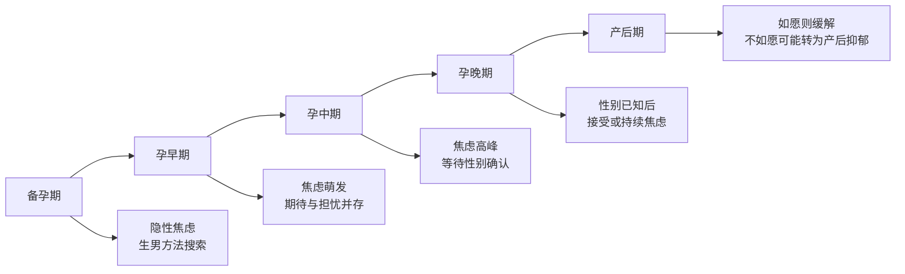
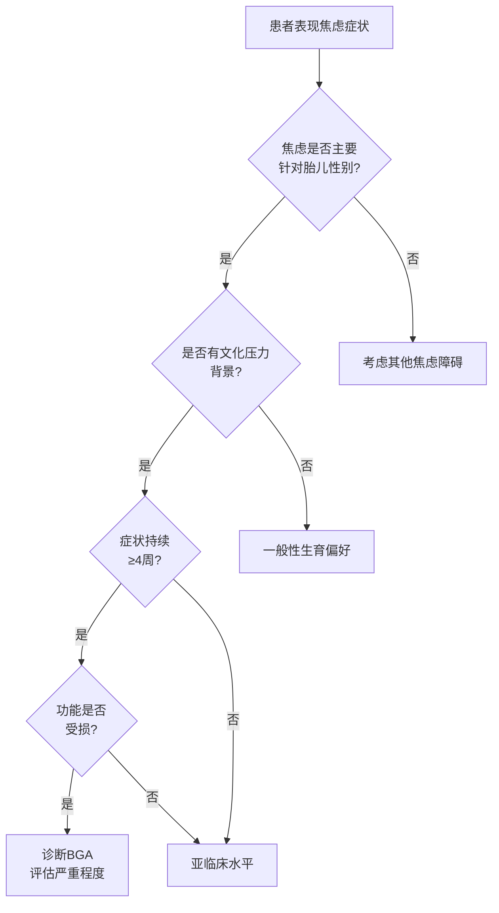
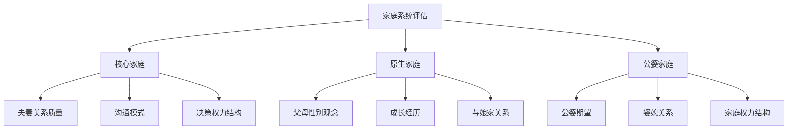

# Birth Gender Anxiety: Clinical Manifestations and Diagnosis (生育性别焦虑的临床表现与诊断)

## 临床表现谱系 (Clinical Manifestation Spectrum)

### 核心症状群 (Core Symptom Clusters)

| 症状维度 | 轻度表现 | 中度表现 | 重度表现 |
| :--- | :--- | :--- | :--- |
| **认知症状** | 偶尔担心胎儿性别 | 频繁思考性别问题 | 持续性侵入性思维 |
| **情绪症状** | 轻微不安、担心 | 明显焦虑、易激惹 | 恐慌、抑郁、绝望 |
| **躯体症状** | 轻微睡眠问题 | 失眠、食欲改变 | 严重躯体化症状 |
| **行为症状** | 关注性别信息 | 反复检查、寻求保证 | 功能性障碍、社交隔离 |

### 按时间阶段的症状表现 (Symptoms by Temporal Phase)

### 各阶段详细症状描述 (Detailed Symptoms by Phase)

#### 备孕期 (Preconception Phase)

| 症状类型 | 具体表现 | 频率/强度 | 功能影响 |
| :--- | :--- | :--- | :--- |
| 信息搜索 | 大量阅读"生男秘诀" | 每日数小时 | 影响工作效率 |
| 饮食控制 | 严格遵循碱性饮食 | 每餐必须 | 营养可能失衡 |
| 同房安排 | 按黄历/排卵期精确计划 | 完全按计划 | 影响性生活质量 |
| 人际回避 | 避免有孩子的场合 | 经常 | 社交圈缩小 |

#### 孕早期 (First Trimester)

| 症状类型 | 具体表现 | 频率/强度 | 功能影响 |
| :--- | :--- | :--- | :--- |
| 侵入性思维 | "会是男孩还是女孩" | 每日多次 | 注意力分散 |
| 躯体化 | 恶心加重、失眠 | 影响日常 | 孕吐可能加剧 |
| 解读行为 | 通过症状猜测性别 | 持续 | 焦虑自我强化 |
| 情绪波动 | 易哭、易怒 | 频繁 | 家庭关系紧张 |

#### 孕中期 (Second Trimester)

| 症状类型 | 具体表现 | 频率/强度 | 功能影响 |
| :--- | :--- | :--- | :--- |
| 高度警觉 | 紧张等待B超结果 | 持续性 | 无法放松 |
| 恐慌发作 | 检查前恐慌 | 检查前后 | 严重困扰 |
| 寻求保证 | 反复询问医生 | 每次产检 | 医患关系紧张 |
| 回避行为 | 不敢知道性别 | 矛盾心理 | 决策困难 |

#### 孕晚期 (Third Trimester)

| 性别结果 | 如愿(生男) | 不如愿(生女) |
| :--- | :--- | :--- |
| **情绪状态** | 焦虑缓解，期待 | 持续焦虑，悲伤 |
| **认知内容** | 规划未来 | 担心受歧视 |
| **行为表现** | 积极准备 | 消极应对 |
| **人际关系** | 愿意分享 | 隐瞒或被动 |

#### 产后期 (Postpartum Phase)

| 产后情况 | 男婴 | 女婴 |
| :--- | :--- | :--- |
| **母婴关系** | 积极投入 | 可能情感淡漠 |
| **家庭关系** | 和谐改善 | 可能冲突 |
| **情绪走向** | 正常产后调适 | 产后抑郁风险高 |
| **再孕焦虑** | 可能无再孕压力 | 高再孕压力 |

---

## 诊断标准框架 (Diagnostic Criteria Framework)

### 建议诊断标准 (Proposed Diagnostic Criteria)

**生育性别焦虑 (Birth Gender Anxiety, BGA)** 诊断标准建议：

**A. 核心特征**（需满足以下至少3项）：
1. 对胎儿/预期胎儿性别的持续性、过度性担忧
2. 担忧内容与文化性"重男轻女"期望相关
3. 担忧持续时间≥4周
4. 担忧程度与实际情况不成比例

**B. 症状表现**（需满足以下至少4项）：
1. 认知症状：侵入性性别相关思维、灾难化思维
2. 情绪症状：焦虑、恐惧、羞耻、内疚
3. 躯体症状：失眠、食欲改变、疲劳、心悸
4. 行为症状：过度检查、寻求保证、回避行为
5. 社会功能受损：工作、人际、家庭功能下降

**C. 严重程度**：
- 轻度：2-3项B症状，功能轻度受损
- 中度：4-5项B症状，功能中度受损
- 重度：5项以上B症状，功能严重受损

**D. 排除标准**：
- 症状不能完全用其他精神障碍解释
- 非物质/药物或医学状况的直接生理效应

### 严重程度评估量表 (Severity Rating Scale)

| 等级 | 分数范围 | 症状频率 | 功能损害 | 干预建议 |
| :--- | :--- | :--- | :--- | :--- |
| **正常范围** | 0-10 | 偶尔担心 | 无损害 | 心理健康教育 |
| **轻度** | 11-20 | 每周数次 | 轻度 | 心理咨询 |
| **中度** | 21-30 | 每日多次 | 中度 | 系统心理治疗 |
| **重度** | 31-40 | 持续不断 | 严重 | 药物+心理综合治疗 |

---

## 鉴别诊断 (Differential Diagnosis)

### 需鉴别的主要疾病 (Primary Conditions for Differentiation)

| 疾病 | 相似点 | 区别要点 | 鉴别方法 |
| :--- | :--- | :--- | :--- |
| **广泛性焦虑障碍(GAD)** | 持续性焦虑症状 | GAD焦虑内容广泛，BGA聚焦性别 | 评估焦虑主题 |
| **强迫症(OCD)** | 侵入性思维、重复行为 | OCD有典型强迫观念/行为，BGA无 | 评估强迫症状 |
| **孕期焦虑** | 孕期出现焦虑 | 一般孕期焦虑内容更广泛 | 评估焦虑核心内容 |
| **产后抑郁** | 可能共病 | 产后抑郁发生于产后，核心为抑郁 | 时间轴和症状谱 |
| **适应障碍** | 与压力事件相关 | 适应障碍有明确应激源 | 评估诱因 |
| **躯体形式障碍** | 躯体症状明显 | 躯体形式障碍缺乏器质性基础 | 躯体检查 |

### 鉴别诊断流程图 (Differential Diagnosis Flowchart)

### 共病情况 (Comorbidity)

| 共病疾病 | 共病率估计 | 关系描述 | 临床意义 |
| :--- | :--- | :--- | :--- |
| **抑郁障碍** | 35-45% | BGA常伴发抑郁症状 | 需同时评估抑郁 |
| **广泛性焦虑** | 25-30% | 症状可能重叠 | 鉴别主要诊断 |
| **婚姻关系问题** | 40-50% | 相互影响 | 系统家庭干预 |
| **躯体化症状** | 30-40% | 焦虑躯体化表达 | 医学检查排除器质病变 |

---

## 临床评估流程 (Clinical Assessment Process)

### 评估内容框架 (Assessment Content Framework)

| 评估领域 | 具体内容 | 评估方法 | 工具/量表 |
| :--- | :--- | :--- | :--- |
| **主诉与现病史** | 焦虑症状的起始、发展 | 临床访谈 | 半结构化访谈提纲 |
| **文化背景** | 家庭性别观念、压力来源 | 深入访谈 | 文化敏感性评估 |
| **症状严重度** | 频率、强度、持续时间 | 量表评估 | BGA量表(建议开发) |
| **功能评估** | 工作、社交、家庭功能 | 功能量表 | GAF、WHODAS |
| **风险评估** | 自伤、自杀风险 | 专项评估 | 自杀风险量表 |
| **支持系统** | 社会支持网络 | 访谈+量表 | 社会支持量表 |

### 半结构化访谈提纲 (Semi-Structured Interview Guide)

#### 开放性问题 (Opening Questions)

1. "您能告诉我，是什么让您今天来咨询的吗？"
2. "关于怀孕这件事，您最担心的是什么？"
3. "您家里人对孩子的性别有什么期望吗？"

#### 症状探查问题 (Symptom Exploration Questions)

| 领域 | 问题示例 |
| :--- | :--- |
| **认知** | "您多久会想到胎儿性别的问题？这些想法您能控制吗？" |
| **情绪** | "当想到可能生女儿时，您有什么感受？" |
| **行为** | "您是否因为担心性别问题而做了一些特别的事情？" |
| **躯体** | "这种担心对您的睡眠、食欲有影响吗？" |
| **社会** | "这种担心影响到您和家人、朋友的关系了吗？" |

#### 文化背景探查 (Cultural Context Exploration)

1. "在您的家庭/家族中，生男生女这件事重要吗？"
2. "如果生了女儿，您担心会发生什么？"
3. "您的婆婆/丈夫对孩子性别有表达过期望吗？"
4. "您自己对孩子性别是怎么看的？"

### 风险等级评估 (Risk Level Assessment)

| 风险因素 | 低风险指标 | 中风险指标 | 高风险指标 |
| :--- | :--- | :--- | :--- |
| **症状强度** | 症状轻微可控 | 症状中等干扰生活 | 症状严重失控 |
| **功能状态** | 功能基本完整 | 功能部分受损 | 功能严重受损 |
| **支持系统** | 支持良好 | 支持一般 | 支持缺乏 |
| **既往史** | 无精神病史 | 有焦虑/抑郁史 | 有严重精神病史 |
| **自杀风险** | 无自杀意念 | 被动自杀意念 | 主动自杀计划 |
| **家庭环境** | 家庭支持 | 家庭中立 | 家庭施压/冲突 |

---

## 特殊人群评估 (Special Population Assessment)

### 高危人群识别 (High-Risk Population Identification)

| 高危群体 | 风险因素 | 筛查要点 | 干预优先级 |
| :--- | :--- | :--- | :--- |
| **已有一女待二胎** | 压力叠加 | 详细评估首胎经历 | 最高 |
| **婆媳同住者** | 日常压力暴露 | 评估婆媳关系 | 高 |
| **既往流产史** | 创伤叠加 | 评估创伤后反应 | 高 |
| **不孕治疗后怀孕** | 期望过高 | 评估心理预期 | 中高 |
| **农村户籍女性** | 文化压力更大 | 评估环境压力源 | 中高 |

### 男性伴侣评估 (Male Partner Assessment)

| 评估内容 | 重点问题 | 评估意义 |
| :--- | :--- | :--- |
| **性别期望** | 丈夫是否期望生儿子 | 评估压力来源 |
| **态度表达** | 是否向妻子施压 | 评估人际环境 |
| **支持程度** | 是否提供情感支持 | 评估保护因素 |
| **家庭角色** | 能否调节婆媳关系 | 评估干预资源 |

### 家庭系统评估 (Family System Assessment)

---

## 实验室及辅助检查 (Laboratory and Auxiliary Examinations)

### 建议检查项目 (Recommended Examinations)

| 检查类型 | 检查项目 | 目的 | 临床意义 |
| :--- | :--- | :--- | :--- |
| **甲状腺功能** | TSH、FT3、FT4 | 排除甲状腺疾病 | 甲状腺异常可导致焦虑 |
| **血常规** | Hb、RBC | 排除贫血 | 贫血可加重焦虑症状 |
| **血糖** | 空腹血糖 | 排除低血糖 | 低血糖可引起焦虑样症状 |
| **产科常规** | 产检项目 | 确保孕期正常 | 排除产科问题引起的焦虑 |

### 心理测量工具 (Psychological Assessment Tools)

| 工具名称 | 评估内容 | 使用场景 | 备注 |
| :--- | :--- | :--- | :--- |
| **SAS (焦虑自评量表)** | 一般焦虑水平 | 筛查 | 通用工具 |
| **EPDS (爱丁堡产后抑郁量表)** | 围产期抑郁 | 孕期/产后 | 可识别共病抑郁 |
| **PSS (知觉压力量表)** | 压力水平 | 评估压力 | 了解压力来源 |
| **BGA量表 (建议开发)** | 生育性别焦虑特异性 | 专项评估 | 待开发验证 |

---

## 参考文献 (References)

1. American Psychiatric Association. (2013). Diagnostic and Statistical Manual of Mental Disorders (5th ed.). Washington, DC: APA.
2. World Health Organization. (2019). International Classification of Diseases (11th ed.). Geneva: WHO.
3. 郝伟, 于欣. (2018). 精神病学 (第8版). 北京: 人民卫生出版社.
4. Cox, J. L., Holden, J. M., & Sagovsky, R. (1987). Detection of postnatal depression: Development of the 10-item Edinburgh Postnatal Depression Scale. *British Journal of Psychiatry*, 150, 782-786.
5. 中华医学会精神医学分会. (2020). 中国焦虑障碍防治指南. 北京: 人民卫生出版社.

---

*返回目录: [INDEX.md](INDEX.md) | 上级目录: [gender-discrimination](../INDEX.md)*
