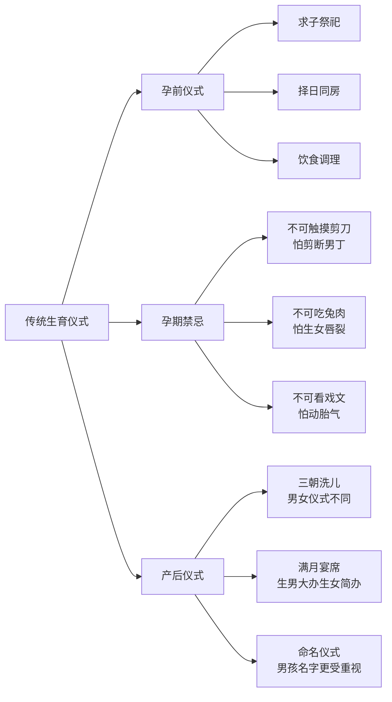
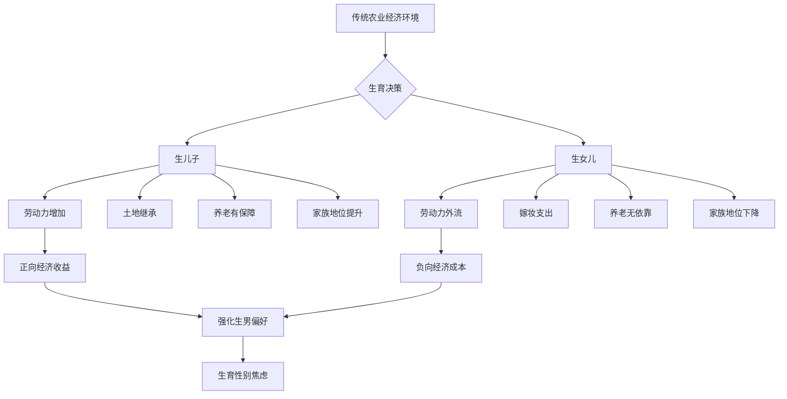
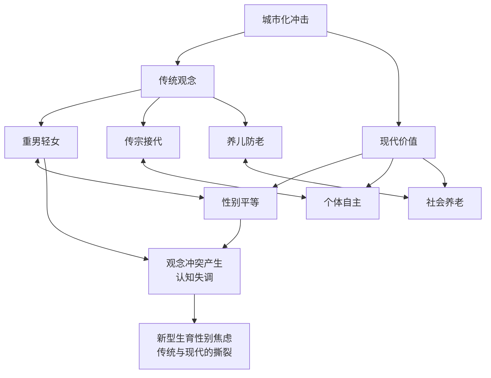

# Birth Gender Anxiety: Chinese Traditional Culture Analysis (生育性别焦虑的中国传统文化根源分析)

## 儒家思想与生育性别观念 (Confucian Thought and Birth Gender Concepts)

### 宗法继承制的核心逻辑 (Core Logic of Patrilineal Succession)

| 理论要素 | 经典依据 | 核心观点 | 对生育焦虑的影响 |
| :--- | :--- | :--- | :--- |
| **血脉延续** | 《礼记·大传》："别子为祖，继别为宗" | 男性承担家族血统延续的神圣责任 | 生男成为家族存续的必要条件 |
| **无后为大** | 《孟子·离娄上》："不孝有三，无后为大" | 无男性后代是最大的不孝 | 催生强烈的生育性别焦虑 |
| **祖先崇拜** | 《论语·学而》："慎终追远，民德归厚" | 祭祀祖先必须由男性后代执行 | 女儿被视为"无法延续香火" |
| **姓氏传承** | 《白虎通·姓名》："人所以有姓者何？所以崇恩爱" | 姓氏只能通过男性传递 | 生女意味着姓氏中断 |

### 儒家经典文本分析 (Analysis of Confucian Classic Texts)

```mermaid
graph TB
    A[儒家经典体系] --> B[《孝经》]
    A --> C[《礼记》]
    A --> D[《孟子》]
    A --> E[《仪礼》]
    
    B --> B1["身体发肤，受之父母"<br>身体承载家族血脉]
    B --> B2["立身行道，扬名后世"<br>男性承担家族荣耀]
    
    C --> C1["男有分，女有归"<br>性别角色固定化]
    C --> C2["大宗小宗"体系<br>男性继承权合法化]
    
    D --> D1["不孝有三，无后为大"<br>生育压力的道德化]
    D --> D2["亲亲而仁民"<br>血缘关系优先]
    
    E --> E1[丧服制度<br>男性居丧主位]
    E --> E2[婚礼仪式<br>女性"归"于夫家]
```

### 儒家伦理的心理内化机制 (Psychological Internalization of Confucian Ethics)

| 内化层次 | 具体表现 | 心理机制 | 焦虑表达形式 |
| :--- | :--- | :--- | :--- |
| **认知层** | "生儿子是天经地义" | 社会化习得、选择性注意 | 反复确认胎儿性别 |
| **情感层** | 对生女儿感到羞愧 | 内疚-羞耻情绪循环 | 隐瞒怀孕性别信息 |
| **行为层** | 寻求各种"生男秘方" | 控制感缺失的补偿 | 迷信行为、过度检查 |
| **身份层** | "没儿子就不是完整女人" | 自我价值与生育性别捆绑 | 自我否定、抑郁倾向 |

---

## 道家与民间信仰的影响 (Taoist and Folk Belief Influences)

### 阴阳平衡观念 (Yin-Yang Balance Concepts)

| 观念要素 | 传统诠释 | 与生育焦虑的关联 | 现代遗存 |
| :--- | :--- | :--- | :--- |
| **阳为尊** | 阳气代表刚健、光明、主导 | 男孩被视为"阳气"传承者 | "养儿壮阳气"的说法 |
| **阴为从** | 阴气代表柔顺、依附、辅助 | 女孩被视为"阴气"过重 | "生女克夫"的迷信 |
| **阴阳相生** | 阴阳需要平衡以维持和谐 | "有儿有女"的完整家庭观 | 计划生育后的"补偿"心理 |
| **乾坤定位** | 《易经》乾为父、坤为母 | 男性=乾=天=主导的等式 | 家庭决策权的性别分配 |

### 民间生育信仰体系 (Folk Fertility Belief Systems)

| 信仰类型 | 具体内容 | 实践形式 | 焦虑强化作用 |
| :--- | :--- | :--- | :--- |
| **送子观音** | 观音菩萨送子的神话叙事 | 拜观音、求签问卦 | 将生育性别归于神意 |
| **床神信仰** | 床公床婆主管生育 | 安床仪式、床头供品 | 仪式失败引发焦虑 |
| **风水命理** | 祖坟风水影响子嗣性别 | 迁坟、改门向 | 环境决定论强化无力感 |
| **梦兆解析** | 胎梦预示胎儿性别 | 梦见龙=男、梦见凤=女 | 梦境引发持续性焦虑 |

### 生育禁忌与仪式 (Fertility Taboos and Rituals)



---

## 宗族制度与祠堂文化 (Clan System and Ancestral Hall Culture)

### 宗族结构中的性别定位 (Gender Position in Clan Structure)

| 结构层次 | 男性地位 | 女性地位 | 生育焦虑来源 |
| :--- | :--- | :--- | :--- |
| **族谱系统** | 入谱是男性的"存在证明" | 女性仅作为"某氏"附注 | 生女无法延续族谱 |
| **祠堂祭祀** | 主祭权专属男性 | 女性只能在侧协助 | 无子则祭祀中断 |
| **族产分配** | 按男丁数量分配 | 女性无继承权 | 经济利益驱动生育焦虑 |
| **族规惩戒** | 无子可被视为"不孝" | 无子之责常归咎女性 | 女性承受双重压力 |

### 祠堂的象征权力分析 (Symbolic Power Analysis of Ancestral Halls)

| 象征维度 | 具体表现 | 心理功能 | 焦虑传导机制 |
| :--- | :--- | :--- | :--- |
| **空间神圣性** | 祠堂是家族神圣空间 | 增强族群认同感 | 无子=被排斥于神圣空间外 |
| **时间连续性** | 牌位代代相传 | 提供存在感与不朽感 | 无子=时间链条断裂 |
| **集体记忆** | 祠堂存储家族记忆 | 强化血缘纽带意识 | 无子=被集体记忆遗忘 |
| **权力合法性** | 祠堂是权威象征 | 确立家族内等级秩序 | 无子=丧失话语权 |

### 族谱文化与男性焦虑 (Genealogy Culture and Male Anxiety)

| 族谱要素 | 文化意涵 | 对男性的压力 | 对女性的压力 |
| :--- | :--- | :--- | :--- |
| **入谱资格** | 只有男性才能正式入谱 | "不入谱=白活一世" | 未能生男=愧对丈夫 |
| **辈分排序** | 男性按字辈排序 | 家族延续责任压力 | 需配合丈夫完成使命 |
| **功绩记载** | 记录男性成就荣耀 | 需有子承继家业 | 生育成为唯一"功绩" |
| **迁徙分支** | 记录男性迁徙开枝 | 开枝散叶的期望 | 被视为"生育工具" |

---

## 农业社会经济基础 (Agricultural Society Economic Foundation)

### 劳动力性别经济学 (Gender Economics of Labor)

| 经济因素 | 男性价值 | 女性价值 | 焦虑驱动力 |
| :--- | :--- | :--- | :--- |
| **体力劳动** | 农耕主力，创造直接收益 | 家务为主，价值被低估 | 男孩=经济资产 |
| **技术传承** | 手艺/技术传男不传女 | 技能习得受限 | 男孩=技术资本延续 |
| **土地继承** | 土地按男丁分配 | 女儿无继承权 | 男孩=土地财产保障 |
| **养老功能** | 儿子承担养老责任 | 女儿"嫁出去的水" | 男孩=养老保险 |

### 传统经济结构下的生育决策模型 (Fertility Decision Model in Traditional Economy)



### 嫁妆与聘礼经济 (Dowry and Bride Price Economics)

| 经济行为 | 传统模式 | 对女儿的定位 | 焦虑机制 |
| :--- | :--- | :--- | :--- |
| **嫁妆支出** | 嫁女需准备嫁妆 | 女儿=支出项 | 生女增加经济负担 |
| **聘礼收入** | 娶妻需支付聘礼 | 儿子需要高额投入 | 但儿子"值得"投入 |
| **婚后资源** | 嫁妆归夫家所有 | 女儿带走家产 | "肥水流外人田" |
| **娘家关系** | 婚后与娘家疏远 | 投入无法回收 | 生女=亏本投资 |

---

## 科举制度与社会流动 (Imperial Examination and Social Mobility)

### 科举对生育偏好的影响 (Impact of Imperial Examination on Birth Preference)

| 影响维度 | 具体表现 | 历史证据 | 现代遗存 |
| :--- | :--- | :--- | :--- |
| **阶层跃升** | 科举是底层翻身唯一通道 | "朝为田舍郎，暮登天子堂" | 高考寄托"出人头地"期望 |
| **性别限制** | 女性无参加科举资格 | 法律明确排斥女性 | "女子无才便是德"观念 |
| **家族荣耀** | 一人登科，全族荣光 | 立牌坊、修祠堂 | 子女成就与家族荣誉捆绑 |
| **教育投资** | 男孩优先获得教育资源 | "读书郎"专指男孩 | 教育性别差异延续 |

### 从科举到高考的焦虑传承 (Anxiety Transmission from Imperial Exam to Gaokao)

| 时代特征 | 科举时代 | 高考时代 | 焦虑核心 |
| :--- | :--- | :--- | :--- |
| **选拔方式** | 考试选拔官员 | 考试选拔大学生 | 考试决定命运 |
| **性别比例** | 男性专属 | 形式平等但资源倾斜 | 隐性偏好延续 |
| **家族期望** | 光宗耀祖 | 出人头地 | 成就归于家族 |
| **生育关联** | 生子=有希望考取功名 | 生子=有希望上好大学 | 生育焦虑代际传递 |

---

## 传统文化要素的现代转化 (Modern Transformation of Traditional Cultural Elements)

### 文化观念的延续与变异 (Continuity and Variation of Cultural Concepts)

| 传统要素 | 传统形态 | 现代变异 | 焦虑表现形式 |
| :--- | :--- | :--- | :--- |
| **宗法继承** | 祠堂、族谱、祭祀 | 房产继承、姓氏延续 | "房产必须留给儿子" |
| **孝道文化** | 养儿防老的制度依赖 | 养老金不足的补偿心理 | "有儿子老了才有依靠" |
| **面子文化** | 生子光宗耀祖 | 朋友圈炫耀、攀比心理 | "没儿子在亲戚面前抬不起头" |
| **传宗接代** | 血脉延续神圣化 | 家族姓氏延续焦虑 | "我家姓氏不能断在我这" |

### 城市化进程中的观念冲突 (Value Conflicts in Urbanization)



### 代际文化传递机制 (Intergenerational Cultural Transmission Mechanisms)

| 传递渠道 | 传递内容 | 传递方式 | 干预要点 |
| :--- | :--- | :--- | :--- |
| **家庭教养** | 性别角色期望 | 言传身教、差别对待 | 家庭性别教育 |
| **婚姻习俗** | 男方主导的婚礼仪式 | 仪式实践、符号强化 | 婚俗改革 |
| **节日礼仪** | 男性为尊的礼节规范 | 重复实践、代际示范 | 文化符号更新 |
| **语言表达** | "嫁出去的女儿"等表达 | 日常语言、无意识习得 | 性别敏感语言倡导 |

---

## 文化心理学视角的整合分析 (Integrative Analysis from Cultural Psychology Perspective)

### 文化-心理互动模型 (Culture-Psychology Interaction Model)

| 分析层次 | 文化要素 | 心理机制 | 焦虑形成路径 |
| :--- | :--- | :--- | :--- |
| **宏观层** | 儒家伦理体系 | 社会规范内化 | 道德自我要求过高 |
| **中观层** | 宗族制度实践 | 群体认同压力 | 害怕被排斥/边缘化 |
| **微观层** | 家庭互动模式 | 依恋与分离焦虑 | 代际关系紧张 |
| **个体层** | 自我概念建构 | 自我价值与生育捆绑 | 自我否定与低价值感 |

### 集体主义文化下的个体焦虑 (Individual Anxiety in Collectivist Culture)

| 文化特征 | 心理影响 | 焦虑表现 | 应对困境 |
| :--- | :--- | :--- | :--- |
| **关系本位** | 自我边界模糊 | 他人期望成为内在压力 | 难以表达个人需求 |
| **面子导向** | 社会评价敏感 | 害怕"丢脸"与社会否定 | 隐藏真实情绪 |
| **权威服从** | 对长辈意见高度重视 | 难以反驳公婆的期望 | 被动顺从增加焦虑 |
| **和谐优先** | 回避冲突与表达 | 压抑焦虑情绪 | 躯体化症状增多 |

---

## 参考文献 (References)

1. 费孝通. (1998). 乡土中国与生育制度. 北京: 北京大学出版社.
2. 林耀华. (1989). 金翼: 一个中国家族的史记. 北京: 生活·读书·新知三联书店.
3. Greenhalgh, S. (2008). Just One Child: Science and Policy in Deng's China. Berkeley: University of California Press.
4. 阎云翔. (2006). 私人生活的变革: 一个中国村庄里的爱情、家庭与亲密关系. 上海: 上海书店出版社.
5. Murphy, R., Tao, R., & Lu, X. (2011). Son preference in rural China: Patrilineal families and socioeconomic change. *Population and Development Review*, 37(4), 665-690.
6. 李银河. (2003). 中国人的性爱与婚姻. 北京: 中国友谊出版公司.

---

*返回目录: [INDEX.md](INDEX.md) | 上级目录: [gender-discrimination](../INDEX.md)*
