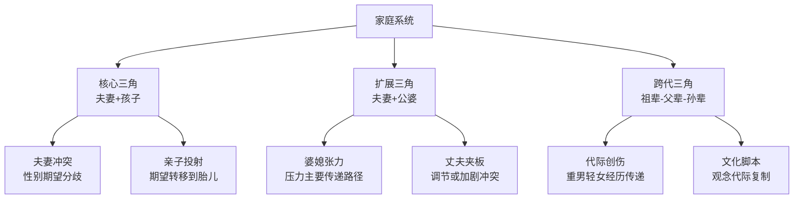
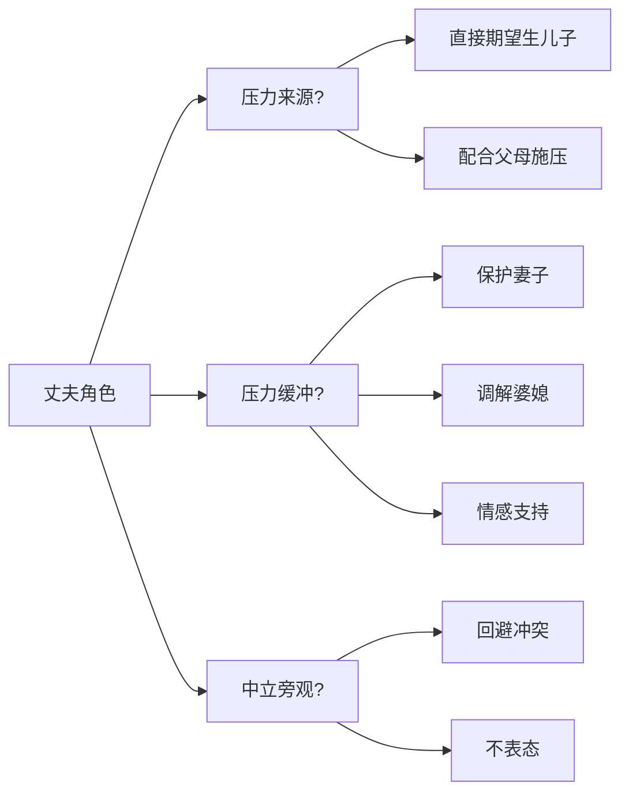
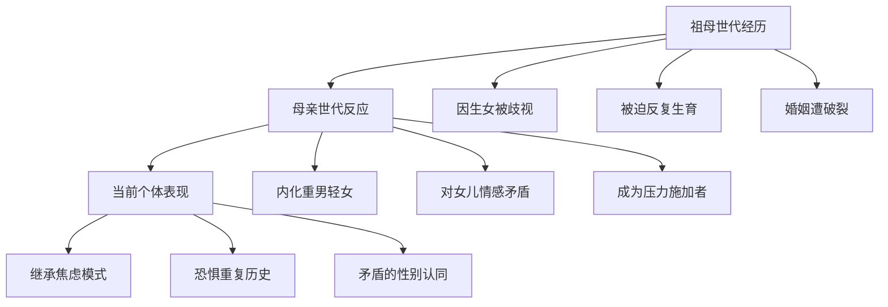

# Birth Gender Anxiety: Family Dynamics (生育性别焦虑的家庭动力学)

## 家庭系统理论视角 (Family Systems Theory Perspective)

### 家庭系统中的焦虑传递 (Anxiety Transmission in Family System)



### 家庭三角化现象 (Triangulation Phenomenon)

| 三角类型 | 参与者 | 焦虑流向 | 典型表现 |
| :--- | :--- | :--- | :--- |
| **婆媳三角** | 妻子-丈夫-婆婆 | 婆婆→妻子 | 婆婆施压，妻子焦虑，丈夫回避 |
| **夫妻三角** | 妻子-丈夫-胎儿 | 夫妻→胎儿 | 夫妻焦虑投射到胎儿性别 |
| **娘家三角** | 妻子-丈夫-娘家人 | 娘家↔妻子 | 娘家支持与婆家压力冲突 |
| **跨代三角** | 妻子-婆婆-祖婆婆 | 代际传递 | 祖母经历影响婆婆态度 |

### 家庭功能评估维度 (Family Functioning Assessment Dimensions)

| 维度 | 健康家庭 | BGA高发家庭 | 评估指标 |
| :--- | :--- | :--- | :--- |
| **沟通** | 开放、直接 | 间接、回避、指责 | 性别话题能否坦诚讨论 |
| **角色** | 灵活、清晰 | 僵化、模糊 | 生育责任归属是否明确 |
| **情感反应** | 适度、同理 | 过度或冷漠 | 对性别结果的情绪反应 |
| **情感卷入** | 适度关心 | 过度卷入或疏离 | 家人对孕妇的关注程度 |
| **行为控制** | 灵活、一致 | 混乱或过度控制 | 对孕期行为的管控 |
| **问题解决** | 协商、合作 | 回避或冲突 | 面对压力时的应对方式 |

---

## 婆媳关系动力 (Mother-in-Law and Daughter-in-Law Dynamics)

### 婆媳冲突的核心议题 (Core Issues of MIL-DIL Conflict)

| 冲突议题 | 婆婆立场 | 媳妇立场 | 潜在需求 |
| :--- | :--- | :--- | :--- |
| **性别期望** | "我儿子需要有个儿子" | "我想生什么是我的事" | 控制vs自主 |
| **养育权力** | "我有经验，应该听我的" | "这是我的孩子" | 权威vs主体性 |
| **关系边界** | "我们是一家人" | "我需要私人空间" | 融合vs分化 |
| **儿子归属** | "儿子永远是我的" | "他现在是我的丈夫" | 占有vs分享 |

### 婆婆施压的常见模式 (Common Patterns of MIL Pressure)

| 施压方式 | 具体表现 | 媳妇反应 | 焦虑强化机制 |
| :--- | :--- | :--- | :--- |
| **直接言语** | "一定要生个孙子" | 愤怒、压力 | 直接增加心理负担 |
| **间接暗示** | "隔壁家抱孙子了" | 焦虑、自卑 | 社会比较引发焦虑 |
| **情感控制** | 生女儿后冷淡 | 委屈、自责 | 条件化情感造成不安全感 |
| **联盟施压** | 联合丈夫/亲戚施压 | 孤立、无助 | 支持系统被削弱 |
| **物质奖惩** | 生儿子有奖励 | 物化感、交易感 | 价值被功利化定义 |

### 媳妇的应对策略类型 (DIL Coping Strategy Types)

| 策略类型 | 行为表现 | 短期效果 | 长期后果 |
| :--- | :--- | :--- | :--- |
| **顺从型** | 完全接受婆婆期望 | 减少冲突 | 自我丧失、焦虑内化 |
| **对抗型** | 直接反驳、冲突 | 表达自我 | 关系恶化、支持减少 |
| **回避型** | 减少接触、沉默 | 减少直接压力 | 问题未解决、关系疏远 |
| **寻求盟友型** | 找丈夫/娘家支持 | 获得支持 | 可能加剧家庭分裂 |
| **自我调节型** | 内部消化、重新解释 | 维持表面和谐 | 可能躯体化或抑郁 |

---

## 夫妻关系动力 (Marital Dynamics)

### 夫妻在BGA中的角色 (Spousal Roles in BGA)



### 丈夫类型与妻子焦虑关系 (Husband Types and Wife's Anxiety)

| 丈夫类型 | 行为特征 | 对妻子焦虑的影响 | 干预要点 |
| :--- | :--- | :--- | :--- |
| **施压型** | 明确表达要儿子 | 焦虑最高 | 丈夫认知重建 |
| **顺从父母型** | 配合父母施压 | 焦虑高，伴愤怒 | 夫妻界限建立 |
| **中立回避型** | 不表态、回避话题 | 焦虑中等，伴孤独 | 促进夫妻沟通 |
| **支持保护型** | 主动保护妻子 | 焦虑较低 | 强化支持行为 |
| **协同对抗型** | 与妻子一起对抗压力 | 焦虑最低 | 巩固联盟 |

### 夫妻沟通模式 (Marital Communication Patterns)

| 沟通模式 | 特征描述 | 对BGA的影响 | 干预方向 |
| :--- | :--- | :--- | :--- |
| **开放讨论** | 坦诚分享感受和想法 | 保护因素 | 维持与强化 |
| **责备-防御** | 互相指责 | 风险因素 | 沟通技能训练 |
| **追逃模式** | 一方追问，一方回避 | 加剧焦虑 | 打破恶性循环 |
| **冷战模式** | 双方都回避 | 问题累积 | 促进表达 |
| **过度保护** | 一方完全隐瞒压力 | 表面好但不持久 | 建立安全表达空间 |

---

## 代际传递机制 (Intergenerational Transmission Mechanisms)

### 重男轻女观念的代际传递 (Intergenerational Transmission of Son Preference)

| 传递路径 | 传递内容 | 传递方式 | 影响持续性 |
| :--- | :--- | :--- | :--- |
| **祖→父→孙** | 宗法继承观念 | 言传身教 | 最持久 |
| **母→女→孙女** | 生存策略 | 经验传授 | 较持久 |
| **婆→媳** | 期望与评判标准 | 互动中习得 | 中等 |
| **社会→家庭** | 文化规范 | 社会化 | 随文化变迁而变 |

### 创伤的代际传递 (Intergenerational Trauma Transmission)



### 代际创伤的表现形式 (Manifestations of Intergenerational Trauma)

| 表现类型 | 具体表现 | 心理机制 | 临床识别 |
| :--- | :--- | :--- | :--- |
| **过度警觉** | 对性别问题高度敏感 | 代际创伤唤醒 | 家族史询问 |
| **重复性梦境** | 梦见祖辈/母辈经历 | 创伤记忆浮现 | 梦境探索 |
| **躯体记忆** | 讨论性别时躯体反应 | 身体承载创伤 | 躯体觉察 |
| **矛盾情感** | 既愤怒又认同传统 | 认同与反叛冲突 | 情感探索 |

---

## 家庭干预策略 (Family Intervention Strategies)

### 系统家庭治疗技术 (Systemic Family Therapy Techniques)

| 技术 | 应用目的 | 操作方法 | 预期效果 |
| :--- | :--- | :--- | :--- |
| **循环提问** | 揭示关系模式 | 询问家庭成员对彼此的看法 | 理解关系动力 |
| **重新框架** | 改变问题定义 | 将"生男压力"重新定义为"家庭沟通困难" | 减少指责 |
| **去三角化** | 打破不良三角 | 促进直接沟通，减少中间人 | 改善关系结构 |
| **家庭雕塑** | 呈现家庭关系 | 用空间位置表达关系 | 增加觉察 |
| **边界干预** | 建立健康边界 | 明确夫妻子系统与原生家庭界限 | 保护核心家庭 |

### 针对不同家庭成员的干预 (Interventions for Different Family Members)

| 对象 | 干预目标 | 干预策略 | 关键技术 |
| :--- | :--- | :--- | :--- |
| **孕妇** | 减少焦虑，增强自我价值 | 个体心理治疗 | 认知重建、自我接纳 |
| **丈夫** | 成为支持者，协调角色 | 伴侣咨询 | 沟通训练、角色澄清 |
| **婆婆** | 减少施压，理解现代观念 | 老年心理教育 | 同理心培养、观念更新 |
| **夫妻** | 增强联盟，统一立场 | 夫妻治疗 | 亲密关系修复、共同应对 |
| **全家庭** | 改变系统模式 | 家庭会议 | 沟通规则、冲突解决 |

### 家庭会议引导框架 (Family Meeting Facilitation Framework)

```
家庭会议议程框架
================================

一、开场（5分钟）
- 说明会议目的：增进理解，而非分辨对错
- 建立基本规则：轮流发言、不打断、尊重

二、循环分享（20分钟）
- 每位成员分享：关于这件事，我的感受是...
- 治疗师反映：我听到您说...

三、澄清期望（15分钟）
- 探索：每个人真正需要的是什么？
- 寻找共同点：我们都希望...

四、解决方案（15分钟）
- 头脑风暴：有什么方法可以...
- 协商：我们可以尝试...

五、总结与约定（5分钟）
- 总结共识
- 约定下次会议
================================
```

---

## 家庭资源与保护因素 (Family Resources and Protective Factors)

### 保护性家庭因素 (Protective Family Factors)

| 保护因素 | 具体表现 | 保护机制 | 强化方法 |
| :--- | :--- | :--- | :--- |
| **丈夫支持** | 情感支持、积极态度 | 缓冲外部压力 | 肯定、强化 |
| **娘家支持** | 情感后盾、实际帮助 | 提供替代支持源 | 维持联系 |
| **经济独立** | 妻子有经济收入 | 增强谈判能力 | 职业规划 |
| **教育水平** | 高教育背景 | 认知灵活性 | 信息提供 |
| **开明公婆** | 公婆态度开明 | 减少直接压力 | 感恩与交流 |

### 家庭韧性培养 (Family Resilience Building)

| 韧性维度 | 培养策略 | 具体方法 |
| :--- | :--- | :--- |
| **信念系统** | 建立积极信念 | 挑战"必须生儿子"的绝对化信念 |
| **组织模式** | 优化家庭结构 | 建立清晰边界、灵活角色 |
| **沟通过程** | 改善沟通质量 | 开放表达、协作解决问题 |
| **共同应对** | 联合面对压力 | 将问题外化、共同对抗 |

---

## 参考文献 (References)

1. Bowen, M. (1978). Family Therapy in Clinical Practice. New York: Jason Aronson.
2. Minuchin, S. (1974). Families and Family Therapy. Cambridge, MA: Harvard University Press.
3. McGoldrick, M., Gerson, R., & Petry, S. (2020). Genograms: Assessment and Treatment (4th ed.). New York: W.W. Norton.
4. Walsh, F. (2016). Strengthening Family Resilience (3rd ed.). New York: Guilford Press.
5. 方晓义, 戴丽琼. (2003). 中国人婆媳关系研究. *心理学报*, 35(1), 88-94.
6. 徐安琪. (2009). 中国家庭变迁与家庭政策重构. *社会科学*, (11), 63-72.

---

*返回目录: [INDEX.md](INDEX.md) | 上级目录: [gender-discrimination](../INDEX.md)*
