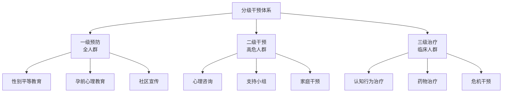
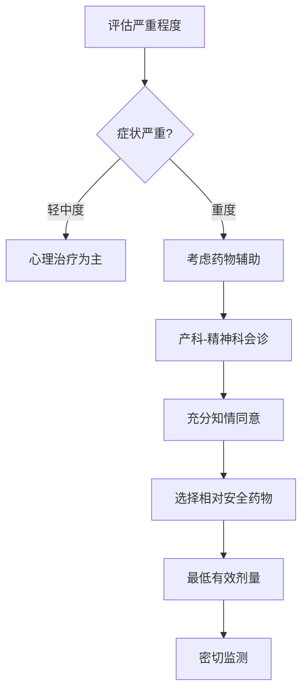
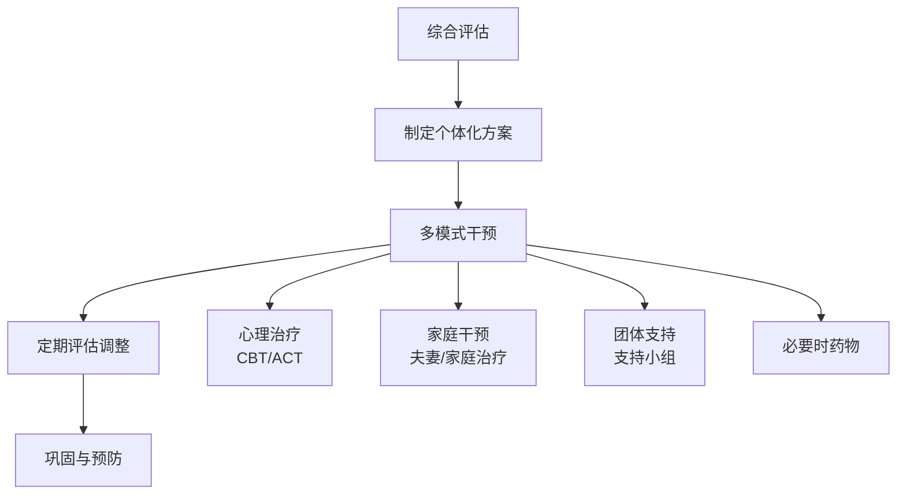

# Birth Gender Anxiety: Intervention Strategies (生育性别焦虑干预策略与治疗)

## 干预框架总览 (Intervention Framework Overview)

### 分级干预模型 (Tiered Intervention Model)



### 干预目标层次 (Intervention Goal Hierarchy)

| 层次 | 目标 | 干预内容 | 效果指标 |
| :--- | :--- | :--- | :--- |
| **症状层** | 减轻焦虑症状 | 放松训练、认知重建 | 焦虑量表分数下降 |
| **认知层** | 改变不合理信念 | 挑战核心信念 | 性别观念灵活性提升 |
| **关系层** | 改善家庭关系 | 家庭治疗、沟通训练 | 家庭功能改善 |
| **社会层** | 增强社会支持 | 资源链接、支持网络 | 社会支持得分提升 |

---

## 心理治疗方法 (Psychotherapy Methods)

### 认知行为治疗 (Cognitive Behavioral Therapy, CBT)

#### CBT治疗方案框架 (CBT Treatment Protocol)

| 阶段 | 会谈次数 | 主要内容 | 技术应用 |
| :--- | :--- | :--- | :--- |
| **评估与教育** | 1-2次 | 评估症状、心理教育 | 量表评估、CBT模型讲解 |
| **认知干预** | 3-6次 | 识别和挑战不合理信念 | 认知重建、苏格拉底式提问 |
| **行为干预** | 7-10次 | 改变回避和安全行为 | 暴露练习、行为实验 |
| **巩固与预防** | 11-12次 | 巩固成果、预防复发 | 复习、制定预防计划 |

#### 认知重建技术 (Cognitive Restructuring Techniques)

| 不合理信念 | 苏格拉底式提问 | 替代性合理信念 |
| :--- | :--- | :--- |
| "必须生儿子才能被家人接受" | "如果您的朋友生了女儿，您会不接受她吗？" | "家人对我的接受不应该只取决于孩子性别" |
| "生女儿我的人生就失败了" | "除了孩子性别，还有什么定义成功人生？" | "孩子性别只是人生的一个小部分，不能定义全部" |
| "公婆一定会看不起我" | "您有确凿证据吗？如果公婆真的这样，说明什么？" | "公婆的态度反映他们的观念，不代表我的价值" |
| "我应该能控制胎儿性别" | "性别是由染色体决定的，谁能控制？" | "性别是自然决定的，不在任何人控制范围内" |

#### 行为干预技术 (Behavioral Intervention Techniques)

| 技术 | 适用情况 | 操作方法 | 预期效果 |
| :--- | :--- | :--- | :--- |
| **渐进放松训练** | 躯体紧张症状 | 肌肉放松、腹式呼吸 | 降低生理唤醒 |
| **暴露练习** | 回避行为 | 逐步接触回避情境 | 减少回避，增加耐受 |
| **行为激活** | 社交退缩 | 安排愉快活动 | 改善情绪，增加社交 |
| **反应预防** | 安全行为 | 阻止反复检查等行为 | 打破焦虑维持循环 |

### 接纳承诺疗法 (Acceptance and Commitment Therapy, ACT)

#### ACT核心过程 (ACT Core Processes)

```mermaid
graph TB
    A[心理灵活性] --> B[接纳]
    A --> C[认知解离]
    A --> D[此时此刻]
    A --> E[观察性自我]
    A --> F[价值澄清]
    A --> G[承诺行动]
    
    B --> B1[接受焦虑感受<br>而非对抗]
    C --> C1[与"必须生儿子"<br>的想法拉开距离]
    D --> D1[关注当下<br>而非担忧未来]
    E --> E1[我不等于我的想法]
    F --> F1[我真正重视的是什么?]
    G --> G1[基于价值采取行动]
```

#### ACT技术应用 (ACT Techniques Application)

| 技术 | 应用目的 | 操作示例 |
| :--- | :--- | :--- |
| **认知解离** | 与想法拉开距离 | "我注意到我有一个'必须生儿子'的想法" |
| **接纳练习** | 接受不舒服的感受 | "允许焦虑的感觉存在，就像天空允许云朵飘过" |
| **价值澄清** | 明确人生方向 | "作为母亲/妻子，我真正重视的是什么？" |
| **正念练习** | 活在当下 | 正念呼吸、身体扫描 |
| **隐喻使用** | 促进理解 | "乘客与司机"隐喻 |

### 正念减压疗法 (Mindfulness-Based Stress Reduction, MBSR)

| 组成部分 | 内容 | 孕期适用调整 |
| :--- | :--- | :--- |
| **正念冥想** | 坐禅、行禅 | 缩短时间，增加支撑 |
| **身体扫描** | 觉察身体感受 | 关注孕期身体变化 |
| **正念瑜伽** | 温和伸展 | 孕妇瑜伽改编 |
| **日常正念** | 吃饭、走路正念 | 胎动觉察作为正念练习 |

---

## 家庭与关系干预 (Family and Relational Interventions)

### 夫妻治疗 (Couple Therapy)

| 治疗目标 | 干预策略 | 具体技术 |
| :--- | :--- | :--- |
| **增强沟通** | 改善表达和倾听 | 非暴力沟通、轮流发言 |
| **统一立场** | 形成夫妻联盟 | 共同应对外部压力 |
| **情感支持** | 增强情感连接 | 情感表达、共情训练 |
| **角色协商** | 明确期望和责任 | 角色澄清、任务分配 |

#### 夫妻沟通练习 (Couple Communication Exercise)

```
非暴力沟通四步骤 (应用于性别焦虑话题)
======================================

步骤一：观察 (Observation)
"当婆婆说'一定要生个孙子'时..."

步骤二：感受 (Feeling)
"我感到压力很大、很焦虑..."

步骤三：需要 (Need)
"因为我需要被理解和支持..."

步骤四：请求 (Request)
"你能在婆婆面前支持我吗？"
======================================
```

### 婆媳关系干预 (MIL-DIL Relationship Intervention)

| 干预层次 | 干预策略 | 操作方法 |
| :--- | :--- | :--- |
| **心理教育** | 向婆婆提供现代观念 | 讲座、资料、医生说明 |
| **共情促进** | 帮助双方理解对方 | 换位思考练习 |
| **边界设定** | 建立合理界限 | 协商互动规则 |
| **丈夫调解** | 发挥丈夫桥梁作用 | 调解技能培训 |

---

## 团体干预 (Group Interventions)

### 孕妇支持小组 (Pregnant Women Support Group)

| 元素 | 内容 |
| :--- | :--- |
| **规模** | 6-10人 |
| **频率** | 每周1次，共8次 |
| **时长** | 每次90分钟 |
| **带领者** | 1-2名专业心理咨询师 |

#### 支持小组课程大纲 (Support Group Curriculum)

| 次数 | 主题 | 主要内容 |
| :--- | :--- | :--- |
| 1 | 开场与建立安全 | 自我介绍、小组规则、期望分享 |
| 2 | 认识焦虑 | 心理教育：什么是生育性别焦虑 |
| 3 | 探索压力来源 | 分享各自的压力来源，相互理解 |
| 4 | 文化与个人 | 讨论文化观念如何影响个人 |
| 5 | 认知重建 | 识别和挑战不合理信念 |
| 6 | 应对策略 | 学习和分享有效应对方法 |
| 7 | 家庭关系 | 讨论如何处理家庭压力 |
| 8 | 总结与展望 | 收获分享、持续支持资源 |

### 准爸爸工作坊 (Expectant Father Workshop)

| 工作坊目标 | 内容设计 | 预期效果 |
| :--- | :--- | :--- |
| **理解妻子压力** | 情境模拟、角色扮演 | 增加同理心 |
| **学习支持技能** | 沟通技巧、情感支持方法 | 提升支持能力 |
| **挑战性别观念** | 讨论、反思 | 观念松动 |
| **协调家庭角色** | 案例讨论 | 明确定位 |

---

## 药物治疗 (Pharmacotherapy)

### 药物治疗原则 (Pharmacotherapy Principles)

| 原则 | 具体内容 |
| :--- | :--- |
| **孕期安全** | 优先考虑胎儿安全，选择FDA妊娠分级B类或更安全药物 |
| **权衡利弊** | 严重焦虑对胎儿的危害vs药物风险 |
| **最小剂量** | 使用最低有效剂量 |
| **心理优先** | 心理治疗为主，药物为辅 |
| **知情同意** | 充分告知风险和获益 |

### 孕期可用药物 (Medications Safe in Pregnancy)

| 药物类别 | 代表药物 | FDA分级 | 使用建议 |
| :--- | :--- | :--- | :--- |
| **SSRI** | 舍曲林 (Sertraline) | C | 相对安全，首选 |
| **SNRI** | 文拉法辛 (Venlafaxine) | C | 二线选择 |
| **苯二氮卓** | 劳拉西泮 (Lorazepam) | D | 尽量避免，短期急性使用 |
| **非药物** | 褪黑素 | 未分级 | 睡眠辅助，数据有限 |

### 药物治疗流程 (Pharmacotherapy Protocol)



---

## 危机干预 (Crisis Intervention)

### 危机情况识别 (Crisis Situation Identification)

| 危机类型 | 识别线索 | 风险等级 |
| :--- | :--- | :--- |
| **自杀意念** | 表达活着没意思、想死 | 高危 |
| **自伤行为** | 有自伤史或当前自伤 | 高危 |
| **强制堕胎风险** | 家人施压非法性别鉴定/堕胎 | 高危 |
| **家庭暴力** | 因性别问题遭受暴力 | 高危 |
| **严重躯体症状** | 影响孕期健康的症状 | 中高危 |

### 危机干预步骤 (Crisis Intervention Steps)

| 步骤 | 内容 | 操作要点 |
| :--- | :--- | :--- |
| **建立联系** | 表达关心和理解 | 冷静、温和、不评判 |
| **评估风险** | 评估自杀/伤害风险 | 直接询问自杀意念 |
| **确保安全** | 移除危险物品、陪伴 | 联系家人、就近陪护 |
| **支持应对** | 帮助找到应对资源 | 问题解决、支持网络 |
| **转介治疗** | 联系专业机构 | 精神科急诊、危机热线 |
| **后续跟进** | 持续关注 | 随访、后续治疗安排 |

### 危机资源清单 (Crisis Resource List)

| 资源类型 | 联系方式 | 服务内容 |
| :--- | :--- | :--- |
| **心理援助热线** | 全国心理援助热线 400-161-9995 | 24小时心理支持 |
| **妇女热线** | 全国妇联维权热线 12338 | 妇女权益保护 |
| **医疗急救** | 120 | 医疗急救 |
| **警察报案** | 110 | 家暴、强制堕胎报案 |

---

## 整合治疗模式 (Integrated Treatment Model)

### BGA整合治疗方案 (Integrated BGA Treatment Protocol)



### 治疗效果评估 (Treatment Outcome Evaluation)

| 评估时点 | 评估内容 | 评估工具 |
| :--- | :--- | :--- |
| **基线** | 症状严重度、功能水平 | BGA-S、GAF |
| **中期 (4周)** | 症状变化、治疗反应 | BGA-S、治疗满意度 |
| **结束时** | 治疗效果、功能改善 | BGA-S、GAF、目标达成量表 |
| **随访 (3月)** | 效果维持、复发情况 | BGA-S、生活质量量表 |

---

## 参考文献 (References)

1. Beck, J. S. (2020). Cognitive Behavior Therapy: Basics and Beyond (3rd ed.). New York: Guilford Press.
2. Hayes, S. C., Strosahl, K. D., & Wilson, K. G. (2016). Acceptance and Commitment Therapy (2nd ed.). New York: Guilford Press.
3. Kabat-Zinn, J. (2013). Full Catastrophe Living (Revised Edition). New York: Bantam Books.
4. Gottman, J. M., & Silver, N. (2015). The Seven Principles for Making Marriage Work (2nd ed.). New York: Harmony Books.
5. 中华医学会精神医学分会. (2020). 中国焦虑障碍防治指南. 北京: 人民卫生出版社.
6. American College of Obstetricians and Gynecologists. (2018). Use of Psychiatric Medications During Pregnancy and Lactation. ACOG Practice Bulletin No. 92.

---

*返回目录: [INDEX.md](INDEX.md) | 上级目录: [gender-discrimination](../INDEX.md)*
