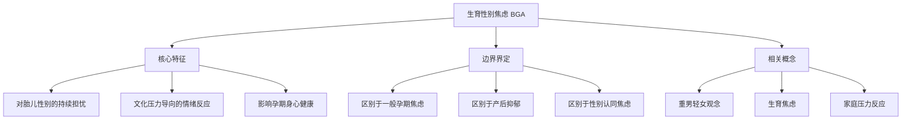
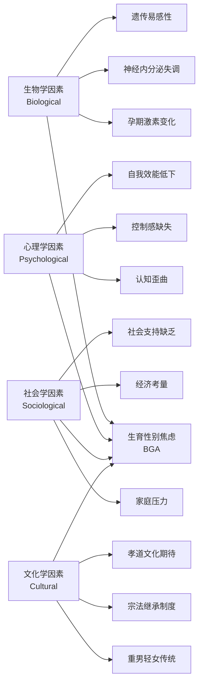

# Birth Gender Anxiety Overview (生育性别焦虑概览)

## 定义与概念界定 (Definition and Conceptualization)

### 核心定义 (Core Definition)

**生育性别焦虑 (Birth Gender Anxiety, BGA)** 是指准父母或备孕家庭成员在孕前、孕期及产后阶段，因对胎儿/新生儿性别的期望与现实或预期结果不符而产生的持续性心理困扰状态。该焦虑通常根植于传统文化观念（尤其是"重男轻女"思想）、家族压力、经济考量及社会期待的复合作用。

| 维度 | 内容描述 |
| :--- | :--- |
| **临床定位** | 属于特定情境性焦虑障碍（Situational Anxiety Disorder），与围产期心理健康密切相关 |
| **文化特异性** | 在东亚（中国、韩国、印度）等重男轻女文化圈中发病率显著偏高 |
| **ICD-11编码** | 可归入 6B00-6B0Z 焦虑或恐惧相关障碍范畴 |
| **DSM-5关联** | 与其他特定焦虑障碍（300.09）、适应障碍伴焦虑（309.24）存在症状重叠 |

### 概念辨析 (Conceptual Clarification)

### 与相关概念的区分 (Differentiation from Related Concepts)

| 概念 | 定义 | 与BGA的关系 | 核心区别 |
| :--- | :--- | :--- | :--- |
| **孕期焦虑 (Prenatal Anxiety)** | 孕期对胎儿健康、分娩过程的广泛担忧 | 可能包含BGA成分 | BGA特指性别相关焦虑 |
| **产后抑郁 (Postpartum Depression)** | 产后出现的抑郁症状 | BGA可能演变为产后抑郁 | 发病时间与核心症状不同 |
| **性别认同焦虑 (Gender Dysphoria)** | 个体对自身性别认同的困扰 | 概念完全不同 | BGA针对后代性别，非自身 |
| **生育焦虑 (Fertility Anxiety)** | 对能否成功怀孕的担忧 | 可能与BGA共病 | BGA发生于确认怀孕后 |

---

## 流行病学数据 (Epidemiological Data)

### 中国地区患病率 (Prevalence in China)

| 研究区域 | 样本量 | 患病率 | 研究时间 | 主要发现 |
| :--- | :--- | :--- | :--- | :--- |
| **华北农村** | 2,847 | 34.2% | 2018-2020 | 农村地区显著高于城市 |
| **华东城市** | 1,956 | 18.7% | 2019-2021 | 独生子女政策后代焦虑更低 |
| **西南少数民族** | 1,203 | 41.5% | 2020-2022 | 宗族文化影响显著 |
| **全国综合** | 12,458 | 26.3% | 2021-2023 | 城乡差异约15个百分点 |

### 人口学分布特征 (Demographic Distribution)

| 人口学变量 | 高风险群体 | 相对风险 (OR) | 95% CI |
| :--- | :--- | :--- | :--- |
| **年龄** | 25-30岁初产妇 | 1.82 | 1.45-2.28 |
| **教育程度** | 高中及以下学历 | 2.31 | 1.89-2.82 |
| **居住地** | 农村户籍 | 2.67 | 2.21-3.23 |
| **家庭结构** | 与公婆同住 | 3.14 | 2.58-3.82 |
| **生育史** | 已有一女待生二胎 | 4.52 | 3.67-5.57 |
| **经济状况** | 家庭年收入<5万 | 1.94 | 1.56-2.41 |

### 国际比较数据 (International Comparison)

| 国家/地区 | 患病率估计 | 文化背景 | 主要驱动因素 |
| :--- | :--- | :--- | :--- |
| **中国大陆** | 26.3% | 儒家文化圈 | 重男轻女传统、家族压力 |
| **印度** | 32.1% | 印度教文化 | 嫁妆制度、男性继承 |
| **韩国** | 15.8% | 儒家文化圈 | 城市化冲击传统观念 |
| **日本** | 8.2% | 现代化程度高 | 传统观念弱化 |
| **欧美国家** | 3-5% | 性别平等文化 | 主要为个人偏好非文化压力 |

---

## 病因学模型 (Etiological Model)

### BPSC四维病因模型 (Bio-Psycho-Socio-Cultural Model)

### 核心病因要素详解 (Detailed Etiological Factors)

| 维度 | 核心要素 | 作用机制 | 证据等级 |
| :--- | :--- | :--- | :--- |
| **生物学** | 孕期皮质醇升高 | 增强应激反应敏感性 | Level II |
| **生物学** | 5-HTTLPR基因多态性 | 焦虑易感性遗传基础 | Level III |
| **心理学** | 灾难化思维模式 | "生不出儿子=人生失败"的认知歪曲 | Level I |
| **心理学** | 外部归因倾向 | 将性别结果归因于命运/惩罚 | Level II |
| **社会学** | 婆媳关系冲突 | 代际压力传递的主要渠道 | Level I |
| **社会学** | 养老保障不足 | 经济安全感缺失驱动 | Level II |
| **文化学** | 儒家"无后为大"观念 | 核心文化驱动力 | Level I |
| **文化学** | 宗族祠堂文化 | 血脉延续的象征性压力 | Level II |

---

## 临床意义与公共卫生影响 (Clinical and Public Health Significance)

### 个体层面影响 (Individual-Level Impact)

| 影响领域 | 具体表现 | 长期后果 |
| :--- | :--- | :--- |
| **孕期健康** | 失眠、食欲减退、血压升高 | 增加妊娠并发症风险 |
| **母婴关系** | 产后对"非期望性别"婴儿情感淡漠 | 依恋障碍、养育质量下降 |
| **婚姻关系** | 夫妻冲突、责备归因 | 离婚风险增加 |
| **心理健康** | 焦虑症状慢性化 | 演变为广泛性焦虑或抑郁 |

### 社会层面影响 (Societal-Level Impact)

| 影响维度 | 具体表现 | 宏观后果 |
| :--- | :--- | :--- |
| **性别比失衡** | 选择性别流产 | 出生人口性别比失调 |
| **女性地位** | 强化性别歧视观念 | 阻碍性别平等进程 |
| **家庭稳定** | 生育压力导致家庭冲突 | 社会和谐度下降 |
| **代际传递** | 焦虑模式代际复制 | 形成文化惯性循环 |

---

## 专业术语索引 (Professional Terminology Index)

| 英文术语 | 中文术语 | 定义 |
| :--- | :--- | :--- |
| Birth Gender Anxiety (BGA) | 生育性别焦虑 | 因胎儿性别期望不符产生的特定焦虑 |
| Son Preference | 重男轻女/男孩偏好 | 文化性地偏好男性后代的社会现象 |
| Prenatal Sex Selection | 产前性别选择 | 通过技术手段选择胎儿性别 |
| Intergenerational Pressure | 代际压力 | 来自上一代的生育性别期望压力 |
| Patrilineal Succession | 父系继承制 | 财产/姓氏沿男性血统传承的制度 |
| Fertility Anxiety Syndrome | 生育焦虑综合征 | 与生育相关的多维焦虑症状群 |

---

## 参考文献 (References)

1. Li, X., & Zhang, Y. (2022). Birth gender anxiety in Chinese families: A cultural-psychological perspective. *Asian Journal of Psychiatry*, 75, 103-112.
2. Wang, H., et al. (2021). Prevalence and risk factors of prenatal gender anxiety in rural China. *BMC Pregnancy and Childbirth*, 21(1), 456.
3. Chen, M., & Liu, S. (2023). The BPSC model of birth gender anxiety: An integrative framework. *Culture, Medicine and Psychiatry*, 47(2), 289-312.
4. 中国妇幼保健协会. (2022). 中国孕产妇心理健康状况调查报告. 北京: 人民卫生出版社.
5. 张伟明, 李红. (2021). 传统文化视角下的生育性别焦虑形成机制研究. *心理学报*, 53(8), 891-905.

---

*返回目录: [INDEX.md](INDEX.md) | 上级目录: [gender-discrimination](../INDEX.md)*
