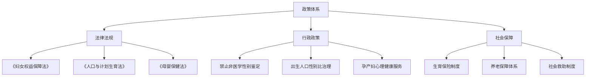
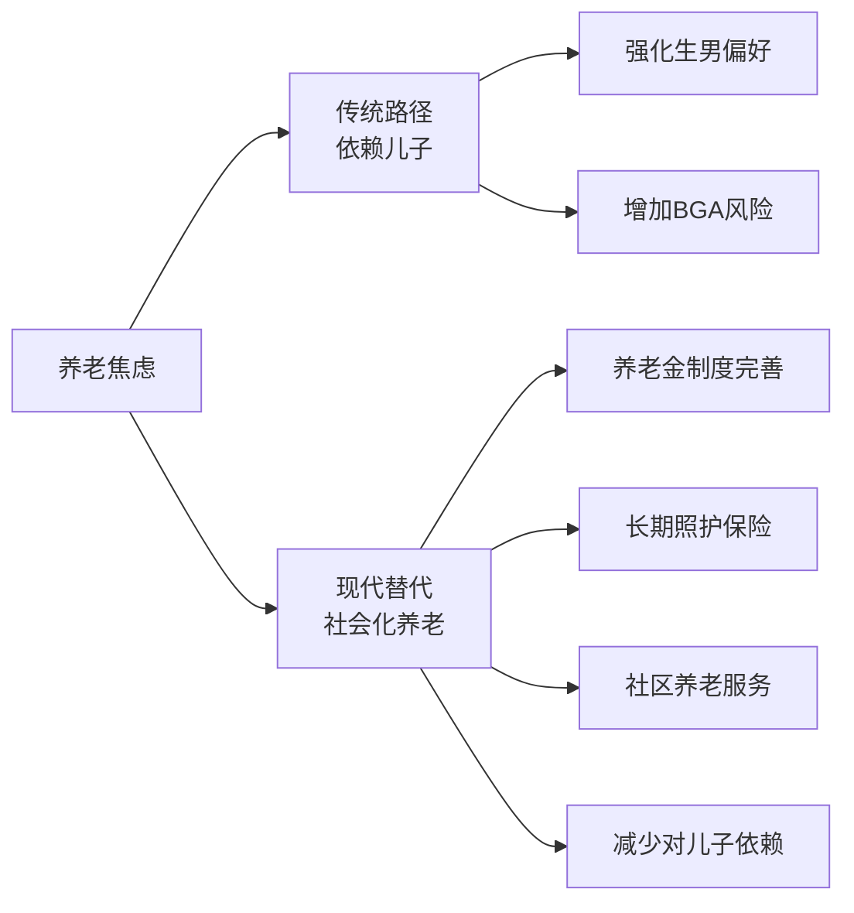
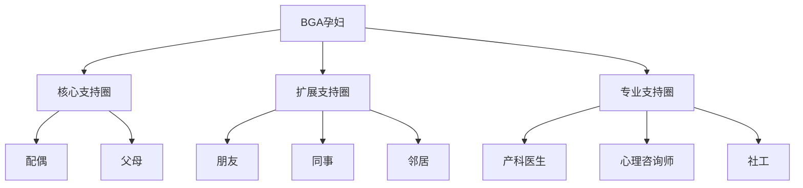
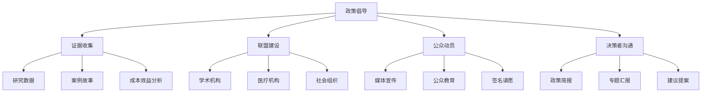

# Birth Gender Anxiety: Policy and Social Support (生育性别焦虑的政策与社会支持)

## 政策框架分析 (Policy Framework Analysis)

### 相关政策体系 (Relevant Policy System)



### 现行法律法规要点 (Key Points of Current Laws and Regulations)

| 法律法规 | 相关条款 | 与BGA的关联 |
| :--- | :--- | :--- |
| **《妇女权益保障法》** | 禁止歧视女婴；保护孕产妇权益 | 法律层面保护女性生育权益 |
| **《人口与计划生育法》** | 禁止非医学需要的胎儿性别鉴定 | 禁止助长BGA的技术手段 |
| **《母婴保健法》** | 保护母婴健康权益 | 为心理健康服务提供法律基础 |
| **《刑法》** | 非法行医、非法鉴定性别罪 | 打击非法性别鉴定 |

### 政策执行现状评估 (Policy Implementation Assessment)

| 评估维度 | 现状 | 问题 | 改进方向 |
| :--- | :--- | :--- | :--- |
| **法律覆盖** | 基本完善 | 心理健康条款不足 | 增加孕产期心理健康专项 |
| **执行力度** | 地区差异大 | 基层执行力弱 | 加强监督和资源配置 |
| **配套措施** | 较薄弱 | 心理服务供给不足 | 建设服务网络 |
| **公众知晓** | 较低 | 宣传不足 | 加大普法宣传 |

---

## 社会保障体系与BGA (Social Security System and BGA)

### 养老保障对BGA的影响 (Impact of Pension System on BGA)

| 保障类型 | 覆盖现状 | 与BGA关系 | 政策建议 |
| :--- | :--- | :--- | :--- |
| **城镇职工养老** | 覆盖率高 | 降低"养儿防老"依赖 | 继续完善 |
| **城乡居民养老** | 保障水平低 | 农村"养儿防老"观念强 | 提高保障水平 |
| **农村养老** | 家庭养老为主 | 强化男孩偏好 | 发展社会化养老 |

### "养儿防老"替代方案 (Alternatives to "Raise Sons for Old Age")



### 生育保险与支持政策 (Maternity Insurance and Support Policies)

| 政策类型 | 内容 | 对BGA的影响 | 完善方向 |
| :--- | :--- | :--- | :--- |
| **产假政策** | 98天+地方延长 | 保护孕产妇身心健康 | 增加心理假期 |
| **生育津贴** | 按工资发放 | 减轻经济压力 | 扩大覆盖面 |
| **托幼服务** | 覆盖率较低 | 减轻养育压力 | 大力发展 |
| **心理服务** | 纳入不足 | 直接相关 | 纳入基本医疗 |

---

## 医疗服务政策 (Healthcare Service Policies)

### 孕产期心理健康服务政策 (Perinatal Mental Health Service Policies)

| 政策文件 | 核心内容 | 执行现状 |
| :--- | :--- | :--- |
| **《"健康中国2030"规划纲要》** | 加强心理健康服务体系建设 | 逐步推进 |
| **《全国社会心理服务体系建设试点工作方案》** | 心理健康服务纳入基层 | 试点开展 |
| **《孕产妇心理健康服务指南》** | 规范孕产期心理服务 | 执行不一 |

### 医疗服务可及性分析 (Healthcare Service Accessibility Analysis)

| 维度 | 现状 | 问题 | 改进措施 |
| :--- | :--- | :--- | :--- |
| **地理可及性** | 城市优于农村 | 农村心理服务匮乏 | 下沉资源、远程服务 |
| **经济可及性** | 费用自付为主 | 心理服务未纳入医保 | 逐步纳入医保 |
| **服务供给** | 专业人员不足 | 心理咨询师数量有限 | 培训更多专业人员 |
| **文化可及性** | 病耻感明显 | 不愿寻求帮助 | 去病耻化宣传 |

### 医保政策建议 (Medical Insurance Policy Recommendations)

| 建议内容 | 具体措施 | 预期效果 |
| :--- | :--- | :--- |
| **纳入医保** | 将孕产期心理咨询纳入基本医疗 | 降低经济门槛 |
| **设置病种** | 建立BGA诊断编码 | 规范诊疗、便于统计 |
| **分级支付** | 不同级别服务不同报销比例 | 引导合理就医 |
| **绩效考核** | 将心理筛查纳入产科质控 | 提高筛查率 |

---

## 社会支持网络建设 (Social Support Network Building)

### 正式支持系统 (Formal Support System)

| 支持来源 | 服务内容 | 获取方式 |
| :--- | :--- | :--- |
| **医疗机构** | 心理筛查、诊疗、转介 | 就诊 |
| **妇幼保健机构** | 健康教育、孕妇学校 | 产检时获取 |
| **社区卫生中心** | 基础心理服务、随访 | 社区登记 |
| **妇联组织** | 权益保护、法律援助 | 主动联系 |
| **心理援助热线** | 即时心理支持 | 电话拨打 |

### 非正式支持系统 (Informal Support System)

| 支持来源 | 支持内容 | 强化策略 |
| :--- | :--- | :--- |
| **配偶** | 情感支持、实际帮助 | 伴侣教育 |
| **娘家人** | 情感后盾、生活照料 | 鼓励保持联系 |
| **朋友同事** | 倾诉对象、信息分享 | 社交活动参与 |
| **网络社群** | 经验分享、情感共鸣 | 引导健康社群 |

### 支持网络整合模式 (Integrated Support Network Model)



---

## 社区服务体系 (Community Service System)

### 社区心理健康服务中心功能 (Community Mental Health Center Functions)

| 功能模块 | 服务内容 | 服务对象 |
| :--- | :--- | :--- |
| **筛查评估** | BGA风险筛查 | 辖区孕产妇 |
| **心理咨询** | 个体/家庭咨询 | 高危及患者 |
| **健康教育** | 讲座、工作坊 | 孕产妇及家属 |
| **支持小组** | 互助小组活动 | 有相似经历者 |
| **危机干预** | 紧急心理支援 | 危机个案 |
| **资源链接** | 转介、协调资源 | 有需要者 |

### 家庭访视服务 (Home Visit Services)

| 访视内容 | 具体任务 | 执行者 |
| :--- | :--- | :--- |
| **心理评估** | 家庭环境评估、风险识别 | 社区护士/社工 |
| **健康教育** | 家庭成员教育 | 健康教育员 |
| **支持提供** | 情感支持、问题解决 | 社工/志愿者 |
| **资源链接** | 介绍可用资源 | 社工 |

---

## 社会组织与志愿服务 (Social Organizations and Volunteer Services)

### 相关社会组织类型 (Types of Relevant Social Organizations)

| 组织类型 | 服务内容 | 联系方式 |
| :--- | :--- | :--- |
| **妇女权益组织** | 权益倡导、法律援助 | 当地妇联 |
| **心理健康NGO** | 心理服务、培训 | 在线搜索 |
| **孕产妇支持组织** | 互助、信息分享 | 医院推荐 |
| **家庭服务机构** | 家庭关系调解 | 社区推荐 |

### 志愿服务项目设计 (Volunteer Service Project Design)

```
"孕妈心理关爱"志愿服务项目
================================

项目目标：
为有生育性别焦虑风险的孕妇提供同伴支持

志愿者招募：
- 有生育经历的女性
- 心理学/社工专业学生
- 社区热心人士

培训内容：
- BGA基础知识
- 倾听技巧
- 边界意识
- 转介流程

服务形式：
- 电话陪伴
- 线下探访
- 活动带领
- 信息提供

督导支持：
- 定期督导会
- 个案讨论
- 情绪支持
================================
```

---

## 政策建议与倡导 (Policy Recommendations and Advocacy)

### 短期政策建议 (Short-Term Policy Recommendations)

| 建议领域 | 具体建议 | 预期效果 |
| :--- | :--- | :--- |
| **医疗服务** | 将BGA筛查纳入产检常规 | 提高早期发现率 |
| **医保政策** | 孕产期心理咨询纳入医保 | 降低就医门槛 |
| **人员培训** | 产科医护BGA识别培训 | 提高识别能力 |
| **服务网络** | 每个区县建心理服务点 | 提高服务可及性 |

### 中长期政策建议 (Medium-to-Long-Term Policy Recommendations)

| 建议领域 | 具体建议 | 预期效果 |
| :--- | :--- | :--- |
| **养老制度** | 完善农村养老保障 | 减少"养儿防老"依赖 |
| **性别平等** | 强化性别平等教育 | 从根本上减少偏好 |
| **文化建设** | 推动性别平等文化 | 改变社会观念 |
| **研究支持** | 设立专项研究基金 | 增进科学认识 |

### 政策倡导策略 (Policy Advocacy Strategies)



---

## 国际经验借鉴 (International Experience Reference)

### 各国应对性别偏好政策 (Policies Addressing Sex Preference in Different Countries)

| 国家/地区 | 主要措施 | 效果 | 可借鉴点 |
| :--- | :--- | :--- | :--- |
| **韩国** | 女儿养育支持、性别平等教育 | 性别比趋于平衡 | 综合干预策略 |
| **印度** | 法律禁止+现金激励女孩 | 效果有限 | 需文化改变配合 |
| **越南** | 媒体宣传+社区服务 | 有一定效果 | 社区层面干预 |
| **欧美** | 性别平等文化为主 | 无明显偏好 | 文化建设重要性 |

### 国际组织建议 (International Organization Recommendations)

| 组织 | 核心建议 |
| :--- | :--- |
| **WHO** | 综合干预：法律+经济+教育+服务 |
| **UNFPA** | 关注根本原因：性别不平等 |
| **UNICEF** | 投资女孩教育和赋权 |

---

## 参考文献 (References)

1. 全国人民代表大会. (2023). 《中华人民共和国妇女权益保障法》. 北京: 法律出版社.
2. 国家卫生健康委员会. (2021). 《出生人口性别比综合治理工作方案》. 北京: 国家卫生健康委员会.
3. World Health Organization. (2011). Preventing Gender-Biased Sex Selection: An Interagency Statement. Geneva: WHO.
4. United Nations Population Fund. (2020). State of World Population 2020. New York: UNFPA.
5. 郑真真. (2017). 中国出生性别比的政策干预与效果. *人口研究*, 41(3), 3-14.

---

*返回目录: [INDEX.md](INDEX.md) | 上级目录: [gender-discrimination](../INDEX.md)*
