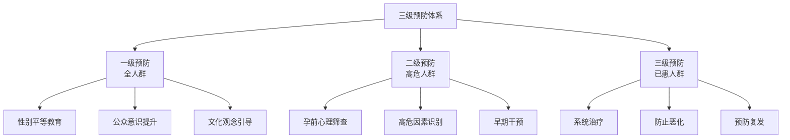
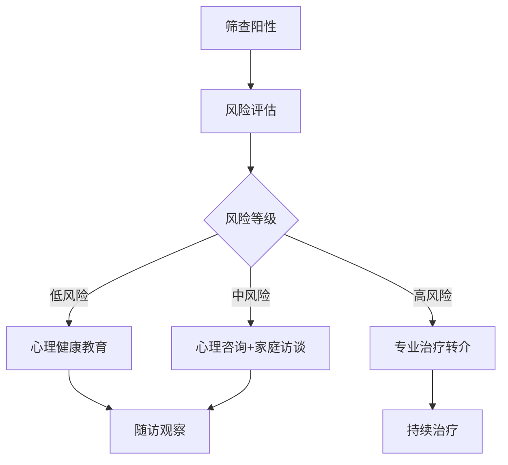
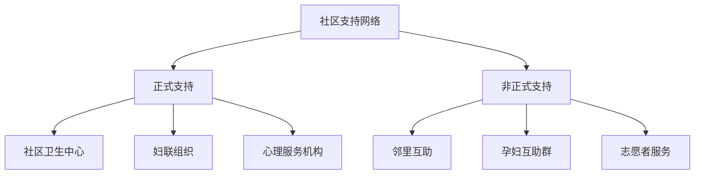
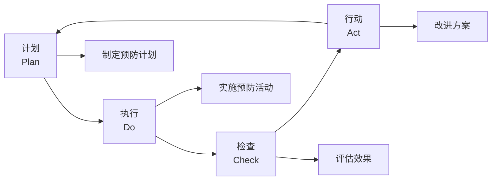

# Birth Gender Anxiety: Prevention and Education (生育性别焦虑的预防与教育)

## 预防策略框架 (Prevention Strategy Framework)

### 三级预防模型 (Three-Level Prevention Model)



### 预防目标与策略 (Prevention Goals and Strategies)

| 预防级别 | 目标人群 | 预防目标 | 核心策略 |
| :--- | :--- | :--- | :--- |
| **一级预防** | 全社会 | 减少发生 | 性别平等文化建设 |
| **二级预防** | 备孕/孕期女性 | 早发现早干预 | 心理筛查、早期识别 |
| **三级预防** | BGA患者 | 减少危害、防止复发 | 规范治疗、持续支持 |

---

## 一级预防：社会文化层面 (Primary Prevention: Socio-Cultural Level)

### 性别平等教育体系 (Gender Equality Education System)

| 教育阶段 | 教育内容 | 实施方式 | 预期效果 |
| :--- | :--- | :--- | :--- |
| **学前教育** | 性别平等基础认知 | 游戏、绘本、活动 | 奠定平等观念基础 |
| **基础教育** | 性别刻板印象识别 | 课程融合、主题班会 | 培养批判性思维 |
| **高等教育** | 性别研究深度学习 | 选修课、研讨会 | 培养性别敏感性 |
| **成人教育** | 家庭性别观念更新 | 社区讲座、线上课程 | 改变已有观念 |

### 媒体与公众宣传 (Media and Public Communication)

| 宣传渠道 | 内容形式 | 目标受众 | 关键信息 |
| :--- | :--- | :--- | :--- |
| **电视节目** | 公益广告、访谈节目 | 中老年人群 | 性别平等、家庭和谐 |
| **社交媒体** | 短视频、图文推送 | 年轻人群 | 打破性别偏见 |
| **社区活动** | 讲座、工作坊 | 社区居民 | 健康生育观念 |
| **医疗机构** | 海报、宣传册 | 就诊人群 | 心理健康知识 |

### 公众意识提升活动 (Public Awareness Campaigns)

```
"生育无性别焦虑"主题宣传活动
================================

主题口号：
- "男孩女孩一样好"
- "爱，不分性别"
- "健康宝宝最重要"

活动形式：
1. 线上：
   - #生育平等# 话题讨论
   - 名人代言公益视频
   - 在线知识问答

2. 线下：
   - 社区宣传日
   - 医院义诊咨询
   - 学校主题班会

3. 媒体合作：
   - 电视专题片
   - 报纸专栏
   - 电台心理热线
================================
```

---

## 二级预防：早期识别与干预 (Secondary Prevention: Early Identification and Intervention)

### 孕前心理筛查体系 (Preconception Psychological Screening System)

| 筛查时机 | 筛查内容 | 筛查工具 | 后续处理 |
| :--- | :--- | :--- | :--- |
| **孕前检查** | 性别观念、家庭压力 | BGA筛查问卷 | 风险评估与教育 |
| **首次产检** | 焦虑症状初筛 | SAS+BGA-S | 高危者转介 |
| **孕中期** | 焦虑症状追踪 | BGA-S | 必要时干预 |
| **孕晚期** | 心理状态评估 | EPDS+BGA-S | 产后支持准备 |

### 高危因素识别清单 (High-Risk Factor Identification Checklist)

| 风险类别 | 具体因素 | 风险权重 |
| :--- | :--- | :--- |
| **人口学因素** | 农村户籍 | ++ |
| | 低教育水平 | ++ |
| | 经济困难 | + |
| **生育史** | 已有一女待生二胎 | +++ |
| | 既往因性别流产 | +++ |
| | 不孕治疗后怀孕 | ++ |
| **家庭因素** | 与公婆同住 | ++ |
| | 婆婆有强烈性别期望 | +++ |
| | 丈夫有性别偏好 | ++ |
| **个人因素** | 焦虑症病史 | ++ |
| | 自我价值感低 | ++ |
| | 成长中被歧视经历 | ++ |

### 早期干预方案 (Early Intervention Protocol)



---

## 孕产期心理健康教育 (Perinatal Mental Health Education)

### 孕妇学校课程设计 (Prenatal Class Curriculum Design)

| 课次 | 主题 | 内容要点 | 教学方法 |
| :--- | :--- | :--- | :--- |
| 1 | 孕期心理变化 | 孕期情绪波动的正常性 | 讲座+讨论 |
| 2 | 认识生育焦虑 | BGA的识别与应对 | 案例+互动 |
| 3 | 健康家庭关系 | 夫妻沟通、婆媳相处 | 角色扮演 |
| 4 | 压力管理技巧 | 放松训练、正念入门 | 实操练习 |
| 5 | 积极心理资源 | 社会支持、求助途径 | 资源介绍 |

### 准父母工作坊 (Expectant Parents Workshop)

| 模块 | 内容 | 目标 |
| :--- | :--- | :--- |
| **理解篇** | 什么是生育性别焦虑 | 知识普及 |
| **反思篇** | 我们的性别观念从哪来 | 自我觉察 |
| **沟通篇** | 如何与家人沟通这个话题 | 技能学习 |
| **支持篇** | 丈夫如何支持妻子 | 角色定位 |
| **资源篇** | 哪里可以获得帮助 | 资源链接 |

### 家属教育内容 (Family Education Content)

| 对象 | 教育内容 | 关键信息 |
| :--- | :--- | :--- |
| **丈夫** | 妻子心理支持技巧 | 倾听、理解、保护 |
| **公婆** | 现代生育观念 | 尊重、支持、不施压 |
| **娘家人** | 情感支持方法 | 倾听、陪伴、实际帮助 |

---

## 社区层面预防 (Community-Level Prevention)

### 社区心理健康服务 (Community Mental Health Services)

| 服务类型 | 服务内容 | 服务提供者 |
| :--- | :--- | :--- |
| **心理咨询** | 个体/夫妻咨询 | 社区心理咨询师 |
| **支持小组** | 孕妇互助小组 | 社工+志愿者 |
| **讲座活动** | 心理健康讲座 | 专业人员 |
| **家访服务** | 高危家庭访视 | 社区护士+社工 |

### 基层医疗机构能力建设 (Primary Healthcare Capacity Building)

| 培训对象 | 培训内容 | 培训目标 |
| :--- | :--- | :--- |
| **产科医生** | BGA识别与转介 | 能识别、能转介 |
| **助产士** | 心理支持技巧 | 提供基本心理支持 |
| **社区护士** | 筛查与随访 | 执行筛查、追踪随访 |
| **妇幼保健员** | 健康教育 | 开展宣教活动 |

### 社区支持网络建设 (Community Support Network Building)



---

## 医疗机构预防措施 (Healthcare Institution Prevention Measures)

### 产科心理健康整合服务 (Integrated Obstetric Mental Health Services)

| 服务环节 | 心理服务内容 | 执行者 |
| :--- | :--- | :--- |
| **孕前咨询** | 心理准备评估 | 妇科医生 |
| **首次产检** | 心理健康筛查 | 产科护士 |
| **孕中产检** | 定期心理评估 | 产科团队 |
| **产前准备** | 心理准备辅导 | 助产士 |
| **产后访视** | 产后心理筛查 | 社区护士 |

### 医护人员培训要点 (Healthcare Provider Training Points)

| 培训主题 | 核心内容 | 技能目标 |
| :--- | :--- | :--- |
| **识别能力** | BGA的表现和识别 | 能主动发现疑似案例 |
| **沟通技巧** | 敏感话题沟通方法 | 能不评判地询问 |
| **基本干预** | 心理急救、支持技巧 | 能提供初步支持 |
| **转介流程** | 何时、如何转介 | 能及时有效转介 |

---

## 教育材料开发 (Educational Material Development)

### 宣传材料类型 (Types of Educational Materials)

| 材料类型 | 内容 | 目标人群 | 发放渠道 |
| :--- | :--- | :--- | :--- |
| **宣传折页** | BGA基本知识、自助方法 | 孕产妇 | 产科门诊 |
| **海报** | 公益宣传口号和图片 | 公众 | 医院、社区 |
| **视频课程** | 系统教育内容 | 孕妇、家属 | 线上平台 |
| **手机APP** | 自我评估、资源链接 | 孕产妇 | 应用商店 |

### 宣传折页内容示例 (Sample Brochure Content)

```
=======================================
您有"生育性别焦虑"吗？
=======================================

什么是生育性别焦虑？
因担心胎儿性别而产生的过度担忧和焦虑。

常见表现：
- 反复想着"会是男孩还是女孩"
- 担心如果生女儿会被家人嫌弃
- 失眠、食欲下降、心神不宁
- 反复查看"生男秘诀"

这种焦虑的影响：
- 影响孕期身心健康
- 影响胎儿发育
- 影响家庭关系

您可以怎么做：
1. 认识到：性别是自然决定的，不在任何人控制范围
2. 告诉自己：男孩女孩一样好
3. 和丈夫/朋友聊聊您的感受
4. 学习放松技巧，如深呼吸
5. 如果焦虑严重，请寻求专业帮助

寻求帮助热线：
- 全国心理援助热线：400-161-9995
- 本院心理咨询门诊：xxx-xxxx

记住：健康的宝宝比性别更重要！
您和宝宝的健康是我们最关心的。
=======================================
```

---

## 效果评估与持续改进 (Evaluation and Continuous Improvement)

### 预防效果评估指标 (Prevention Effectiveness Indicators)

| 评估层面 | 评估指标 | 数据来源 | 评估频率 |
| :--- | :--- | :--- | :--- |
| **知识层面** | 公众对BGA的知晓率 | 调查问卷 | 年度 |
| **态度层面** | 性别平等态度得分 | 态度量表 | 年度 |
| **行为层面** | BGA就诊率、早期识别率 | 医疗数据 | 季度 |
| **结果层面** | BGA患病率变化 | 流行病学调查 | 年度 |

### 持续质量改进循环 (Continuous Quality Improvement Cycle)



---

## 参考文献 (References)

1. World Health Organization. (2014). Preventing Gender-Biased Sex Selection. Geneva: WHO.
2. 国家卫生健康委员会. (2020). 孕产妇心理健康服务指南. 北京: 国家卫生健康委员会.
3. Mrazek, P. J., & Haggerty, R. J. (Eds.). (1994). Reducing Risks for Mental Disorders: Frontiers for Preventive Intervention Research. Washington, DC: National Academy Press.
4. 全国妇联. (2019). 中国性别平等与妇女发展白皮书. 北京: 人民出版社.
5. Austin, M. P., et al. (2017). Perinatal mental health: A guide to the Edinburgh Postnatal Depression Scale (EPDS). *Camberwell: Beyondblue*.

---

*返回目录: [INDEX.md](INDEX.md) | 上级目录: [gender-discrimination](../INDEX.md)*
