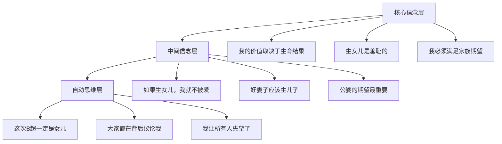
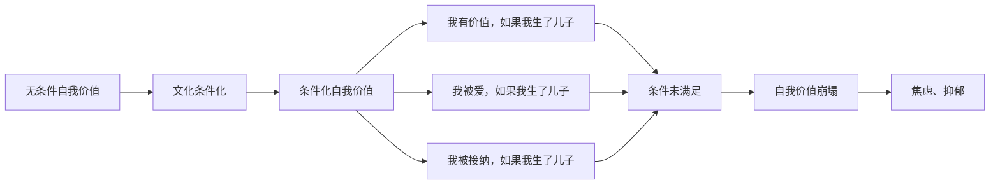

# Birth Gender Anxiety: Psychological Formation Mechanisms (生育性别焦虑的心理形成机制)

## 认知层面机制 (Cognitive Mechanisms)

### 认知歪曲模式 (Cognitive Distortion Patterns)

| 认知歪曲类型 | 典型表现 | 核心信念 | 焦虑强化效应 |
| :--- | :--- | :--- | :--- |
| **灾难化思维** | "如果生了女儿，我的人生就完了" | 性别结果与人生成败等同 | 极度恐惧，回避检查 |
| **非黑即白** | "不是儿子就是失败" | 只有两种结果，无中间地带 | 排斥多元可能性 |
| **过度概括** | "我家族就是生女儿的命" | 个别经验推广为普遍规律 | 宿命感，无力感 |
| **选择性注意** | 只关注别人生儿子的消息 | 信息筛选偏向负面 | 社会比较加剧焦虑 |
| **读心术** | "公婆一定看不起我" | 过度揣测他人想法 | 人际关系紧张 |
| **应该化思维** | "我应该给老公生个儿子" | 将期望转化为绝对义务 | 自我苛责，压力倍增 |

### 核心信念系统 (Core Belief Systems)



### 认知评估过程 (Cognitive Appraisal Process)

| 评估阶段 | 评估内容 | 典型思维 | 情绪反应 |
| :--- | :--- | :--- | :--- |
| **初级评估** | 性别结果的威胁性 | "生女儿会威胁我的婚姻/地位" | 恐惧、担忧 |
| **次级评估** | 自身应对资源 | "我没有能力控制性别结果" | 无力感、绝望 |
| **再评估** | 情境的可改变性 | "即使努力也无法改变" | 习得性无助 |

---

## 情绪层面机制 (Emotional Mechanisms)

### 焦虑情绪的发展轨迹 (Developmental Trajectory of Anxiety)

| 阶段 | 时间节点 | 情绪特征 | 行为表现 |
| :--- | :--- | :--- | :--- |
| **潜伏期** | 备孕阶段 | 隐性担忧，模糊不安 | 搜索"生男秘方"，询问有经验者 |
| **激活期** | 确认怀孕后 | 焦虑被激活，期待与恐惧并存 | 频繁检查，解读胎动 |
| **高峰期** | 性别鉴定前后 | 焦虑达到顶峰，坐立不安 | 失眠、食欲下降、反复求证 |
| **确认期** | 性别确定后 | 如愿则释放，不如愿则崩溃 | 情绪剧烈波动 |
| **适应期** | 孕中晚期至产后 | 逐渐接受或持续焦虑 | 依个体差异表现不同 |

### 情绪调节困难 (Emotional Regulation Difficulties)

| 调节策略 | 正常功能 | BGA患者困难表现 | 后果 |
| :--- | :--- | :--- | :--- |
| **认知重评** | 改变对情境的解释 | 无法重新解释"生女"的意义 | 焦虑无法缓解 |
| **表达抑制** | 隐藏情绪表达 | 过度抑制导致情绪累积 | 躯体化症状 |
| **接受策略** | 接受不可控事件 | 无法接受"无法控制性别" | 持续对抗心理 |
| **问题聚焦** | 直接解决问题 | 性别无法"解决"加剧无力 | 替代行为（迷信）|

### 羞耻-内疚情绪循环 (Shame-Guilt Emotional Cycle)

```mermaid
graph LR
    A[文化期望：生儿子] --> B[期望未满足]
    B --> C[羞耻感<br>"我有问题"]
    C --> D[内疚感<br>"我对不起家人"]
    D --> E[自我贬低<br>"我没有价值"]
    E --> F[焦虑升级<br>更害怕再次"失败"]
    F --> A
```

---

## 行为层面机制 (Behavioral Mechanisms)

### 焦虑维持行为 (Anxiety Maintenance Behaviors)

| 行为类型 | 具体表现 | 短期效果 | 长期后果 |
| :--- | :--- | :--- | :--- |
| **安全行为** | 反复B超检查 | 暂时获得确定感 | 依赖检查，焦虑反弹 |
| **回避行为** | 不参加有孩子的聚会 | 减少比较带来的痛苦 | 社交隔离，支持减少 |
| **寻求保证** | 不断询问"怎么能生儿子" | 暂时安抚焦虑 | 依赖他人，自信下降 |
| **控制行为** | 严格遵循"生男食谱" | 获得控制感 | 控制失败时焦虑加剧 |
| **信息过度搜索** | 大量阅读相关文章 | 感觉在"做准备" | 信息过载，焦虑增加 |

### 迷信行为的心理功能 (Psychological Functions of Superstitious Behaviors)

| 迷信行为 | 常见形式 | 心理功能 | 强化机制 |
| :--- | :--- | :--- | :--- |
| **求神拜佛** | 拜送子观音、许愿 | 将控制权交给超自然力量 | 归因外部，减轻自责 |
| **饮食禁忌** | 吃碱性食物、避某些食物 | 获得"我在努力"的感觉 | 行动感代替无力感 |
| **择时同房** | 按黄历、排卵期 | 感觉在科学地"控制" | 伪控制感维持 |
| **胎梦解读** | 将梦境与性别关联 | 预测感带来暂时安心 | 如应验则强化迷信 |
| **物品象征** | 床头放花生、红枣 | 象征性满足愿望 | 仪式感提供安慰 |

---

## 社会学习机制 (Social Learning Mechanisms)

### 观察学习与模仿 (Observational Learning and Modeling)

| 学习来源 | 学习内容 | 习得方式 | 焦虑形成路径 |
| :--- | :--- | :--- | :--- |
| **原生家庭** | 父母对性别的态度 | 观察父母差别对待兄弟姐妹 | 内化"男孩更受欢迎" |
| **公婆家庭** | 婆家的性别期望 | 观察婆婆对儿媳的态度 | 害怕"不能完成任务" |
| **社交圈** | 同龄人生育经历 | 社会比较与模仿 | "别人都生了儿子" |
| **媒体信息** | 新闻、电视剧情节 | 文化脚本习得 | 强化性别刻板印象 |

### 社会强化与惩罚 (Social Reinforcement and Punishment)

| 行为结果 | 正强化表现 | 负惩罚表现 | 焦虑关联 |
| :--- | :--- | :--- | :--- |
| **生儿子** | 受到祝贺、地位提升 | — | 期望强化 |
| **生女儿** | — | 冷落、失望、批评 | 害怕惩罚 |
| **生育尝试** | 家人关注、支持 | — | 生育行为被强化 |
| **表达焦虑** | — | 被忽视或批评"想太多" | 情绪压抑 |

### 代际传递模型 (Intergenerational Transmission Model)

```mermaid
graph TB
    A[祖辈世代] --> B[父母世代]
    B --> C[当前个体]
    C --> D[下一代]
    
    A --> A1[重男轻女观念<br>文化创伤经历]
    
    B --> B1[养育方式偏差<br>性别差别对待]
    B --> B2[言语传递<br>"没儿子不行"]
    B --> B3[情感氛围<br>焦虑敏感化]
    
    C --> C1[内化观念]
    C --> C2[习得焦虑模式]
    C --> C3[重复行为模式]
    
    D --> D1[继续传递<br>或打破循环]
```

---

## 依恋理论视角 (Attachment Theory Perspective)

### 依恋模式与生育焦虑 (Attachment Patterns and Birth Anxiety)

| 依恋类型 | 特征描述 | BGA表现特点 | 干预重点 |
| :--- | :--- | :--- | :--- |
| **安全型** | 自信、信任他人 | 焦虑程度较低，易调节 | 强化已有资源 |
| **焦虑型** | 过度依赖、害怕被抛弃 | 极度害怕"因生女被嫌弃" | 建立安全感 |
| **回避型** | 情感疏离、自我封闭 | 表面不在意但内心焦虑 | 情感连接 |
| **混乱型** | 矛盾、不稳定 | 焦虑表现复杂多变 | 创伤修复 |

### 母女依恋与代际焦虑传递 (Mother-Daughter Attachment and Anxiety Transmission)

| 原生家庭经历 | 对女性自身的影响 | BGA表现 | 干预方向 |
| :--- | :--- | :--- | :--- |
| **被忽视的女儿** | 自我价值感低 | 更强烈地希望生儿子以"证明自己" | 自我价值重建 |
| **被偏爱的女儿** | 矛盾的性别认同 | 可能复制或反叛父母观念 | 澄清个人价值观 |
| **目睹母亲受歧视** | 代际创伤内化 | 既愤怒又无奈地重复模式 | 创伤疗愈 |

---

## 自我概念与身份认同 (Self-Concept and Identity)

### 女性身份与生育角色捆绑 (Female Identity and Reproductive Role)

| 身份维度 | 传统定义 | 内化表现 | 焦虑来源 |
| :--- | :--- | :--- | :--- |
| **妻子身份** | 为夫家生育继承人 | "给老公生个儿子是我的责任" | 害怕无法履行"职责" |
| **儿媳身份** | 延续公婆血脉 | "公婆就等着抱孙子" | 害怕让公婆失望 |
| **母亲身份** | 母凭子贵 | "有儿子才是完整的母亲" | 身份不完整感 |
| **女性身份** | 生育是女性天职 | "生不出儿子是我的问题" | 自我否定 |

### 自我价值条件化 (Conditional Self-Worth)



### 身份冲突与角色压力 (Identity Conflict and Role Stress)

| 冲突类型 | 冲突内容 | 心理张力 | 焦虑表现 |
| :--- | :--- | :--- | :--- |
| **现代女性vs传统媳妇** | 性别平等信念vs婆家期望 | 认知失调 | 愤怒与无奈交织 |
| **个体需求vs家族责任** | 自我实现vs传宗接代 | 价值冲突 | 迷茫与压力 |
| **职业女性vs生育角色** | 事业发展vs生育使命 | 时间资源冲突 | 疲惫与焦虑 |

---

## 神经生物学基础 (Neurobiological Basis)

### 应激反应系统 (Stress Response System)

| 系统 | 生理机制 | BGA中的表现 | 临床意义 |
| :--- | :--- | :--- | :--- |
| **HPA轴** | 皮质醇分泌增加 | 孕期皮质醇持续偏高 | 影响胎儿发育 |
| **自主神经系统** | 交感神经激活 | 心悸、出汗、肌肉紧张 | 躯体症状明显 |
| **杏仁核** | 威胁检测过度敏感 | 对性别相关信息高度警觉 | 认知偏向 |
| **前额叶皮层** | 情绪调节功能 | 调节能力下降 | 冲动控制困难 |

### 孕期激素与情绪 (Pregnancy Hormones and Emotions)

| 激素 | 孕期变化 | 与焦虑的关系 | 临床建议 |
| :--- | :--- | :--- | :--- |
| **孕酮** | 显著升高 | 具有抗焦虑作用，但个体差异大 | 监测水平 |
| **雌激素** | 显著升高 | 可能增加情绪波动性 | 情绪监测 |
| **皮质醇** | 生理性升高 | 叠加心理压力则进一步升高 | 压力管理 |
| **甲状腺激素** | 可能波动 | 影响情绪稳定性 | 甲功筛查 |

---

## 综合心理机制模型 (Integrated Psychological Mechanism Model)

```mermaid
graph TB
    A[文化-社会背景] --> B[认知层面]
    A --> C[情绪层面]
    A --> D[行为层面]
    A --> E[生理层面]
    
    B --> B1[核心信念<br>"必须生儿子"]
    B --> B2[认知歪曲<br>灾难化/非黑即白]
    B --> B3[自动思维<br>"我会失败"]
    
    C --> C1[焦虑情绪]
    C --> C2[羞耻-内疚]
    C --> C3[恐惧-无助]
    
    D --> D1[安全行为<br>反复检查]
    D --> D2[回避行为<br>社交退缩]
    D --> D3[迷信行为<br>求神拜佛]
    
    E --> E1[HPA轴激活]
    E --> E2[自主神经失调]
    E --> E3[睡眠障碍]
    
    B1 <--> C1
    C1 <--> D1
    D1 <--> E1
    E1 <--> B1
    
    B1 --> F[生育性别焦虑<br>BGA]
    C1 --> F
    D1 --> F
    E1 --> F
```

---

## 参考文献 (References)

1. Beck, A. T., & Clark, D. A. (2011). Cognitive Therapy of Anxiety Disorders: Science and Practice. New York: Guilford Press.
2. Bowlby, J. (1988). A Secure Base: Parent-Child Attachment and Healthy Human Development. London: Routledge.
3. Gross, J. J. (2014). Handbook of Emotion Regulation (2nd ed.). New York: Guilford Press.
4. 姚树桥, 杨德森. (2001). 医学心理学. 北京: 人民卫生出版社.
5. 钱铭怡. (2006). 变态心理学. 北京: 北京大学出版社.
6. Bandura, A. (1986). Social Foundations of Thought and Action: A Social Cognitive Theory. Englewood Cliffs, NJ: Prentice-Hall.

---

*返回目录: [INDEX.md](INDEX.md) | 上级目录: [gender-discrimination](../INDEX.md)*
