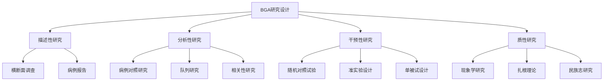
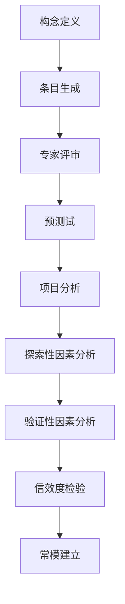
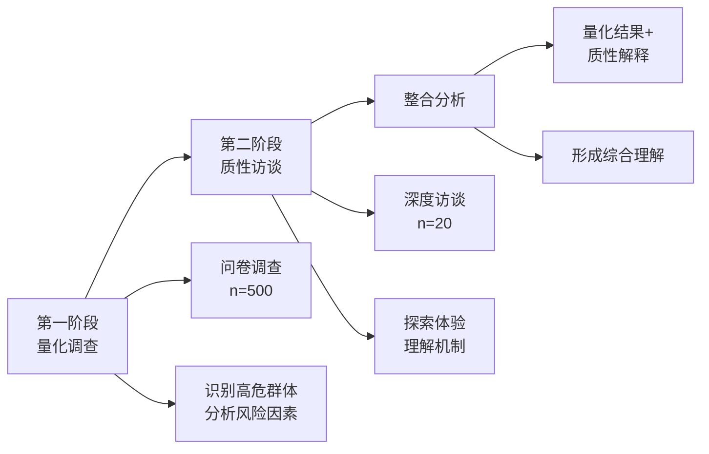
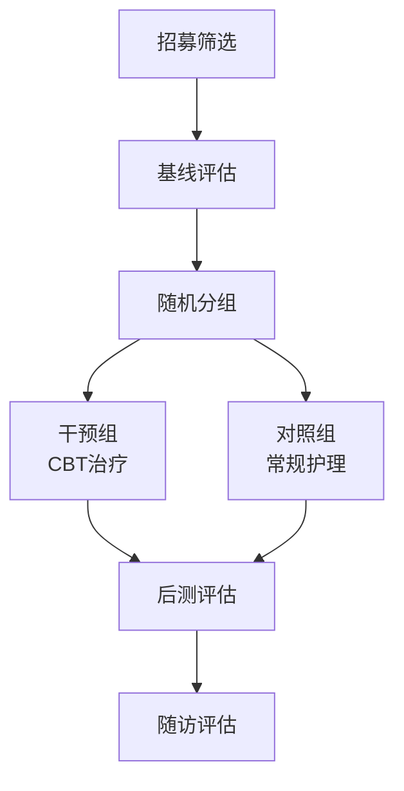

# Birth Gender Anxiety: Research Methods (生育性别焦虑研究方法与实证)

## 研究方法论框架 (Research Methodology Framework)

### 研究范式 (Research Paradigms)

| 范式 | 认识论基础 | 适用问题 | 方法类型 |
| :--- | :--- | :--- | :--- |
| **实证主义** | 客观真理可测量 | 发病率、危险因素 | 量化研究 |
| **解释主义** | 理解主观意义 | 个体体验、文化意义 | 质性研究 |
| **批判主义** | 揭示权力结构 | 性别不平等根源 | 批判性研究 |
| **实用主义** | 问题导向整合 | 复杂现象综合理解 | 混合方法 |

### 研究设计类型 (Research Design Types)



---

## 量化研究方法 (Quantitative Research Methods)

### 流行病学研究设计 (Epidemiological Study Designs)

| 设计类型 | 研究问题 | 优点 | 局限 |
| :--- | :--- | :--- | :--- |
| **横断面调查** | BGA患病率是多少？ | 快速、经济 | 无法确定因果 |
| **病例对照研究** | 什么因素与BGA相关？ | 适合罕见结局 | 回忆偏倚 |
| **前瞻性队列** | 危险因素如何预测BGA？ | 可确定时序 | 耗时、费用高 |
| **嵌套病例对照** | 综合队列和病例对照 | 效率高 | 复杂 |

### 样本量估算 (Sample Size Calculation)

#### 患病率调查样本量公式

```
n = Z² × P(1-P) / d²

其中：
Z = 1.96 (95%置信水平)
P = 预期患病率
d = 允许误差

示例：
若P = 25%, d = 3%
n = 1.96² × 0.25 × 0.75 / 0.03² = 800
```

#### 干预研究样本量

| 效应量 | Cohen's d | 所需样本量(每组) | 统计效力 |
| :--- | :--- | :--- | :--- |
| 小效应 | 0.2 | 394 | 80% |
| 中效应 | 0.5 | 64 | 80% |
| 大效应 | 0.8 | 26 | 80% |

### 测量工具开发 (Measurement Tool Development)

#### BGA量表开发流程 (BGA Scale Development Process)



#### 测量学指标标准 (Psychometric Standards)

| 指标 | 标准 | 检验方法 |
| :--- | :--- | :--- |
| **内部一致性** | Cronbach's α > 0.70 | 计算α系数 |
| **重测信度** | ICC > 0.70 | 间隔2周重测 |
| **结构效度** | CFI > 0.90, RMSEA < 0.08 | CFA |
| **聚合效度** | r > 0.50 (与相关量表) | 相关分析 |
| **区分效度** | 能区分临床/非临床组 | t检验或ROC |

### 统计分析方法 (Statistical Analysis Methods)

| 分析目的 | 统计方法 | 适用情况 |
| :--- | :--- | :--- |
| **描述性分析** | 均值、标准差、百分比 | 描述样本特征 |
| **组间比较** | t检验、ANOVA | 比较不同组差异 |
| **相关分析** | Pearson/Spearman | 变量间关系 |
| **回归分析** | 多元线性/逻辑回归 | 预测因素分析 |
| **结构方程模型** | SEM | 复杂关系验证 |
| **多层次分析** | HLM | 考虑嵌套结构 |
| **生存分析** | Cox回归 | 时间-事件分析 |

---

## 质性研究方法 (Qualitative Research Methods)

### 现象学研究 (Phenomenological Study)

| 要素 | 内容 |
| :--- | :--- |
| **研究问题** | BGA孕妇的生活体验是什么？ |
| **理论基础** | 描述性/解释性现象学 |
| **抽样策略** | 目的性抽样，达到饱和 |
| **数据收集** | 深度访谈 |
| **数据分析** | Colaizzi七步法 |
| **质量标准** | 可信性、可转移性、可依赖性、可确认性 |

#### 现象学访谈提纲示例 (Phenomenological Interview Guide)

```
1. 能告诉我您怀孕以来的感受吗？

2. 当您想到胎儿性别的问题时，是什么样的体验？
   - 您有什么想法？
   - 您有什么感受？
   - 您的身体有什么反应？

3. 这种感受是从什么时候开始的？
   - 什么情况下会更强烈？
   - 什么情况下会减轻？

4. 周围的人对孩子性别是什么态度？
   - 这对您有什么影响？

5. 这种体验对您的生活有什么影响？
   - 对睡眠、饮食？
   - 对家庭关系？
   - 对工作？

6. 您是如何应对这种感受的？

7. 还有什么是您想分享的吗？
```

### 扎根理论研究 (Grounded Theory Study)

| 要素 | 内容 |
| :--- | :--- |
| **研究问题** | BGA是如何形成和发展的？ |
| **理论基础** | Strauss & Corbin程序化扎根理论 |
| **抽样策略** | 理论抽样 |
| **数据分析** | 开放编码→轴心编码→选择性编码 |
| **目标产出** | 生成BGA形成机制的实质理论 |

#### 编码示例 (Coding Example)

```
原始资料：
"婆婆每天都念叨，说她们家三代单传，
必须生个孙子。我每次听到都很烦，
但又不敢反驳，只能自己默默承受。"

开放编码：
- 婆婆施压
- 家族继承压力
- 负面情绪反应
- 不敢反驳
- 独自承受

轴心编码（现象）：
代际压力传递

选择性编码（核心范畴）：
文化期望的内化与冲突
```

### 民族志研究 (Ethnographic Study)

| 要素 | 内容 |
| :--- | :--- |
| **研究问题** | BGA在特定文化社区中是如何被理解和应对的？ |
| **研究场域** | 特定农村社区/城市社区 |
| **数据收集** | 参与观察、深度访谈、文件分析 |
| **分析方法** | 主题分析 |
| **研究时长** | 6-12个月 |

---

## 混合方法研究 (Mixed Methods Research)

### 混合设计类型 (Mixed Design Types)

| 设计类型 | 特点 | 适用情况 |
| :--- | :--- | :--- |
| **解释性顺序设计** | 量→质 | 用质性解释量化结果 |
| **探索性顺序设计** | 质→量 | 用质性探索指导量化 |
| **汇聚设计** | 量+质同时 | 三角验证 |
| **嵌入设计** | 一种嵌入另一种 | 补充不同类型数据 |

### 混合方法研究示例 (Mixed Methods Study Example)



---

## 干预研究设计 (Intervention Study Designs)

### 随机对照试验 (Randomized Controlled Trial)

#### RCT设计框架 (RCT Design Framework)



#### RCT报告标准 (CONSORT流程图)

```
识别 (Identification)
    评估合格性 (n = )
    排除 (n = )
        不符合纳入标准 (n = )
        拒绝参与 (n = )
        其他原因 (n = )
            ↓
随机化 (Randomization)
    随机分配 (n = )
            ↓
    ┌───────────────┬───────────────┐
    ↓               ↓               
分配到干预组      分配到对照组    
(n = )           (n = )          
    ↓               ↓               
接受分配干预      接受分配干预    
(n = )           (n = )          
未接受 (n = )    未接受 (n = )    
    ↓               ↓               
随访               随访            
失访 (n = )      失访 (n = )     
    ↓               ↓               
分析               分析            
纳入分析 (n = )  纳入分析 (n = ) 
```

### 单被试实验设计 (Single-Subject Experimental Design)

| 设计类型 | 结构 | 适用情况 |
| :--- | :--- | :--- |
| **A-B设计** | 基线-干预 | 初步探索 |
| **A-B-A设计** | 基线-干预-撤回 | 证明因果（伦理限制） |
| **多基线设计** | 跨行为/被试/情境 | 不适合撤回的情况 |

---

## 研究伦理 (Research Ethics)

### 伦理审查要点 (Ethics Review Points)

| 伦理原则 | 具体要求 | BGA研究特殊考虑 |
| :--- | :--- | :--- |
| **知情同意** | 充分告知、自愿参与 | 孕妇为弱势群体，确保自愿 |
| **保密性** | 保护隐私 | 性别焦虑话题敏感 |
| **最小伤害** | 避免伤害 | 访谈可能引发情绪，需准备 |
| **公正性** | 选择公平 | 避免只选择某类人群 |

### 知情同意书要素 (Informed Consent Elements)

```
知情同意书
=======================================

研究题目：中国孕妇生育性别焦虑的调查研究

研究目的：了解孕妇对胎儿性别的想法和感受

参与内容：
- 填写问卷（约20分钟）
- 可能被邀请参加访谈（约60分钟）

风险与不适：
- 问卷和访谈可能涉及敏感话题
- 如感到不适可随时停止

益处：
- 促进对孕产妇心理健康的认识
- 参与者可获得心理咨询资源信息

保密措施：
- 资料匿名处理
- 仅研究团队有权访问数据
- 结果发表不包含个人识别信息

自愿参与：
- 参与完全自愿
- 可随时退出，无任何负面后果

联系方式：
- 研究负责人：XXX，电话：XXX
- 伦理委员会：XXX，电话：XXX

=======================================
我已阅读以上信息，自愿参与本研究。

签名：____________ 日期：____________
```

---

## 研究局限与未来方向 (Research Limitations and Future Directions)

### 当前研究局限 (Current Research Limitations)

| 局限类型 | 具体表现 | 改进方向 |
| :--- | :--- | :--- |
| **概念定义** | BGA定义不统一 | 共识定义 |
| **测量工具** | 缺乏标准化量表 | 开发验证专用量表 |
| **研究设计** | 横断面为主 | 增加纵向和干预研究 |
| **样本代表性** | 医院样本为主 | 社区抽样 |
| **文化比较** | 主要为单一文化 | 跨文化比较研究 |

### 未来研究方向 (Future Research Directions)

1. **基础研究**：
   - BGA的神经生物学机制
   - 遗传-环境交互作用
   - 代际传递的生物学基础

2. **应用研究**：
   - 有效干预方法的RCT验证
   - 预防项目的效果评估
   - 数字化干预工具开发

3. **政策研究**：
   - 政策干预的效果评估
   - 医疗服务整合模式研究
   - 成本效益分析

---

## 参考文献 (References)

1. Creswell, J. W., & Creswell, J. D. (2018). Research Design: Qualitative, Quantitative, and Mixed Methods Approaches (5th ed.). Los Angeles: SAGE.
2. Kazdin, A. E. (2011). Single-Case Research Designs: Methods for Clinical and Applied Settings (2nd ed.). New York: Oxford University Press.
3. Moher, D., et al. (2010). CONSORT 2010 Statement: Updated guidelines for reporting parallel group randomised trials. *BMJ*, 340, c332.
4. 陈向明. (2000). 质的研究方法与社会科学研究. 北京: 教育科学出版社.
5. DeVellis, R. F. (2016). Scale Development: Theory and Applications (4th ed.). Los Angeles: SAGE.

---

*返回目录: [INDEX.md](INDEX.md) | 上级目录: [gender-discrimination](../INDEX.md)*
