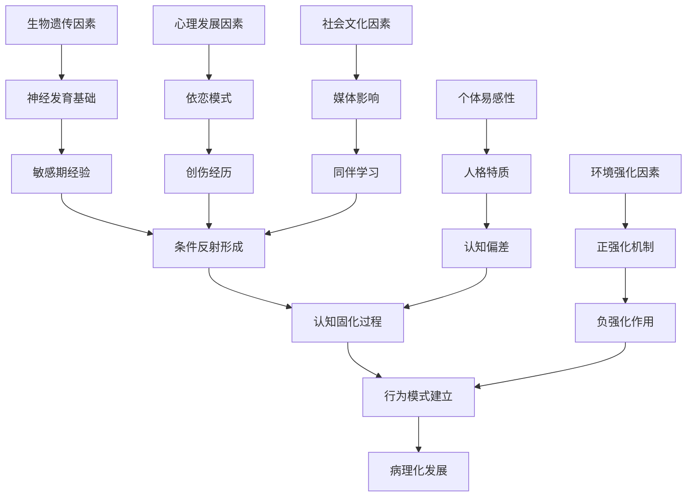

# Paraphilic Disorders: Formation Mechanisms Analysis (恋物癖形成机制深度分析)

> 📘 **文档导航**: 本专题文档深入分析恋物癖的形成机制。相关主题请参考：
> - [恋物癖概览](Paraphilia_Overview.md) - 基础概念和整体框架
> - [恋物癖神经科学](Paraphilia_Neuroscience_Biology.md) - 生物学机制基础
> - [恋物癖心理学理论](Paraphilia_Psychological_Theory.md) - 理论基础支撑
> - [具体恋物类型](specific-types/) - 各类恋物癖的详细特征

## 形成机制综合分析框架

### 多层次整合理论模型



## 生物学形成机制

### 遗传易感性机制

#### 基因多态性影响

| 基因系统 | 相关基因 | 功能影响 | 恋物关联性 | 研究证据 |
| :--- | :--- | :--- | :--- | :--- |
| **多巴胺系统** | DRD4 VNTR | 奖赏敏感性调节 | novelty seeking倾向 | 中等证据支持 |
| **血清素系统** | 5-HTTLPR | 情绪调节能力 | 冲动控制困难 | 良好研究证据 |
| **雄激素受体** | AR CAG repeats | 性激素敏感性 | 性冲动强度 | 初步研究支持 |
| **BDNF基因** | Val66Met多态性 | 神经可塑性 | 创伤记忆固化 | 新兴研究领域 |

#### 神经发育异常

##### 关键发育期影响

```
神经发育关键期：

产前期(孕期2-8月)：
- 激素暴露异常影响
- 营养不良的潜在影响
- 母体应激的宫内效应
- 神经管发育关键期

婴幼儿期(0-3岁)：
- 大脑可塑性高峰期
- 神经回路模式形成
- 依恋关系质量影响
- 感觉统合发展

儿童期(3-12岁)：
- 性别认同发展期
- 社会学习关键期
- 道德发展敏感期
- 同伴关系建立期

青春期(12-18岁)：
- 性激素 surge影响
- 神经重塑高峰期
- 身份认同探索期
- 风险-taking行为增加
```

### 神经生物学机制

#### 奖赏系统异常

##### 多巴胺通路改变

```
多巴胺系统异常：

中脑边缘通路异常：
- VTA→NAcc通路过 度激活
- 奖赏预测误差信号增强
- 强化学习机制异常化
- 对特定刺激的超敏反应

神经可塑性改变：
- 突触连接强度异常
- 神经回路固化模式
- 长期增强效应(LTP)异常
- 神经适应性调节失衡
```

#### 感觉处理异常

##### 感官通道超敏

| 感官系统 | 处理异常 | 神经基础 | 临床表现 | 形成机制 |
| :--- | :--- | :--- | :--- | :--- |
| **视觉系统** | 注意偏向和选择性增强 | 枕叶皮层过度激活 | 对特定视觉特征的痴迷 | 条件反射强化 |
| **触觉系统** | 躯体感觉皮层敏感化 | S1区异常放大 | 触觉唤起的强烈反应 | 感觉统合异常 |
| **嗅觉系统** | 边缘系统连接增强 | 嗅觉皮层与情感中枢 | 对气味的特殊敏感 | 情绪记忆关联 |
| **听觉系统** | 听觉皮层选择性注意 | 颞叶处理异常 | 对特定声音的反应 | 注意偏向固化 |

## 心理发展机制

### 早期依恋理论

#### 依恋模式影响

##### 依恋类型与恋物发展

```
依恋模式对恋物形成的影响：

安全型依恋：
- 适度的分离焦虑
- 健康的自我安抚能力
- 较少发展病理性恋物
- 形成机制：正常的心理发展轨迹

焦虑-矛盾型依恋：
- 过度的分离焦虑
- 依恋对象的理想化
- 可能发展补偿性恋物
- 形成机制：通过物品寻求安全感

回避型依恋：
- 情感表达抑制
- 自我依赖倾向
- 可能通过物品寻求安慰
- 形成机制：情感隔离的替代满足

混乱型依恋：
- 创伤性依恋经历
- 解离性防御机制
- 复杂的恋物表现形式
- 形成机制：创伤性经验的象征化
```

#### 内部工作模式

##### 依恋表征系统异常

| 表征类型 | 正常功能 | 异常表现 | 恋物关联 | 形成路径 |
| :--- | :--- | :--- | :--- | :--- |
| **自我表征** | 稳定的自我概念 | 无价值感、不安全感 | 通过恋物寻求自我肯定 | 自尊补偿机制 |
| **他人表征** | 可靠的照顾者形象 | 不可靠、拒绝性 | 恋物对象的理想化 | 安全感替代 |
| **关系表征** | 安全的互动模式 | 不安全、不可预测 | 控制性关系模式 | 边界调节异常 |

### 创伤理论机制

#### 创伤经历影响

##### 创伤性学习

```
创伤对恋物形成的机制：

急性创伤影响：
- 应激反应系统激活
- 情绪记忆强化编码
- 注意资源的病理性集中
- 安全信号识别困难

慢性创伤后果：
- HPA轴功能紊乱
- 情绪调节能力受损
- 解离性防御机制
- 现实检验能力下降

创伤性条件反射：
- 创伤刺激与性唤起的异常关联
- 情绪状态的记忆编码
- 生理反应的条件化
- 行为模式的固化
```

#### 解离性机制

##### 心理防御过程

| 解离类型 | 防御功能 | 恋物表现 | 形成机制 | 临床意义 |
| :--- | :--- | :--- | :--- | :--- |
| **人格解离** | 自我分裂保护 | 多重身份表现 | 创伤性身份整合失败 | 复杂性PTSD |
| **现实解离** | 现实逃避机制 | 幻想世界沉浸 | 现实压力的逃避 | 功能性回避 |
| **情感解离** | 情绪隔离保护 | 情感麻木状态 | 痛苦情绪的隔离 | 情感调节困难 |
| **记忆解离** | 创伤遗忘保护 | 选择性遗忘 | 创伤记忆的压抑 | 心理保护机制 |

## 学习理论机制

### 经典条件反射

#### 条件化形成过程

##### Pavlovian conditioning model

```
条件反射形成机制：

初始配对阶段：
- 中性刺激(普通物品) + 无条件刺激(性唤起)
- 反复同时呈现建立神经连接
- 突触可塑性变化和长时程增强
- 神经通路的强化和固化

泛化和分化过程：
- 对相似刺激的反应扩展
- 刺激辨别能力的发展
- 反应强度的梯度变化
- 条件反应的精细化

消退和自发恢复：
- 条件刺激单独呈现时反应减弱
- 神经连接的弱化过程
- 时间间隔后的重新出现
- 永久性消除的困难性
```

#### 关键影响因素

| 影响因子 | 作用机制 | 形成效果 | 临床意义 |
| :--- | :--- | :--- | :--- |
| **强化频率** | 重复配对的次数 | 条件反射强度 | 治疗干预时机 |
| **时间间隔** | 刺激呈现的时间差 | 学习效果 | 干预策略设计 |
| **情绪强度** | 伴随的情绪唤醒水平 | 记忆固化程度 | 创伤处理重点 |
| **个体差异** | 遗传和经验背景 | 易感性差异 | 个性化治疗 |

### 操作性条件反射

#### 强化机制分析

##### Skinnerian reinforcement theory

| 强化类型 | 机制原理 | 恋物维持 | 形成机制 | 干预策略 |
| :--- | :--- | :--- | :--- | :--- |
| **正强化** | 行为后获得愉悦刺激 | 快感强化恋物行为 | 奖赏系统激活 | 移除强化物 |
| **负强化** | 行为后移除不愉快刺激 | 焦虑缓解维持行为 | 应激反应调节 | 替代应对策略 |
| **惩罚** | 行为后出现负面后果 | 社会谴责的矛盾效应 | 社会学习影响 | 建设性后果 |
| **消退** | 行为后无任何后果 | 自然减弱过程 | 强化缺失效应 | 环境管理 |

## 认知发展机制

### 注意偏向理论

#### 认知加工异常

##### 选择性注意机制

```
注意偏向形成过程：

初始注意捕获：
- 特定刺激的自动注意吸引
- 感官通道的选择性激活
- 情绪显著性的快速评估
- 神经资源的优先分配

注意维持机制：
- 对目标刺激的持续关注
- 注意资源的集中投入
- 其他刺激的抑制处理
- 认知资源的专门化分配

注意偏向固化：
- 长期的注意模式强化
- 神经回路的习惯化改变
- 自动化处理模式形成
- 意识控制能力下降
```

#### 认知图式理论

##### 图式形成与发展

| 发展阶段 | 图式特征 | 形成机制 | 临床表现 | 干预焦点 |
| :--- | :--- | :--- | :--- | :--- |
| **早期图式** | 基础认知框架 | 经验积累和整合 | 原始的恋物倾向 | 预防性教育 |
| **核心图式** | 稳定的认知结构 | 重复经验强化 | 固化的恋物模式 | 认知重构治疗 |
| **补偿图式** | 适应性认知策略 | 应对机制发展 | 功能性的恋物表达 | 技能训练发展 |
| **元认知图式** | 对认知的认知 | 反思和监控能力 | 自我调节能力 | 元认知训练 |

### 社会学习机制

#### 观察学习理论

##### 模仿和示范作用

```
社会学习形成机制：

观察学习过程：
- 注意过程：选择性关注恋物相关model
- 保持过程：将观察到的行为模式内化
- 动作再现：实际执行learned行为
- 动机过程：强化和期待影响行为表现

替代性学习：
- 通过他人经验学习
- 社会norms的内化
- 文化价值观的影响
- 同伴群体的压力

媒体影响机制：
- 大众传媒的示范效应
- 网络社区的强化作用
- 虚拟环境的学习机会
- 技术媒介的便利性
```

#### 文化建构影响

##### 社会文化因素

| 文化维度 | 影响机制 | 恋物表现 | 形成路径 | 干预策略 |
| :--- | :--- | :--- | :--- | :--- |
| **性别文化** | 性别角色社会化 | 性别特定的恋物倾向 | 社会期待内化 | 性别平等教育 |
| **消费文化** | 商品拜物教现象 | 物品恋物的合理化 | 消费主义影响 | 价值观澄清 |
| **技术文化** | 数字化性文化 | 网络恋物行为 | 技术便利性 | 数字素养培养 |
| **亚文化** | 特殊兴趣群体 | 群体归属需求 | 同伴认同机制 | 社会支持建设 |

## 发展轨迹分析

### 生命周期发展模型

#### 不同阶段的特点

##### 年龄相关发展模式

```
恋物发展的生命周期轨迹：

儿童期(3-12岁)：
- 性好奇心的正常表达
- 感官探索的自然倾向
- 模仿学习的关键期
- 边界意识的初步形成

青春期(12-18岁)：
- 性唤起模式的确立
- 身份认同的探索期
- 同伴影响的高峰期
- 风险-taking行为增加

成年早期(18-25岁)：
- 模式的稳定和固化
- 理性控制能力发展
- 社会适应策略形成
- 治疗干预的敏感期

成年中期(26-50岁)：
- 症状模式的维持
- 功能损害的显现
- 应对策略的多样化
- 治疗动机的增强

老年期(50+岁)：
- 症状可能的减轻
- 适应性策略发展
- 生活重心的转移
- 社会支持的重要性
```

### 关键转折点

#### 发展里程碑

| 转折点 | 关键事件 | 影响机制 | 长期后果 | 干预时机 |
| :--- | :--- | :--- | :--- | :--- |
| **初次接触** | 首次恋物体验 | 条件反射的建立 | 基础模式形成 | 预防教育关键 |
| **模式固化** | 重复行为强化 | 神经回路固化 | 症状稳定性增强 | 早期干预窗口 |
| **功能损害** | 社会功能受损 | 病理化发展 | 寻求治疗动机 | 治疗介入时机 |
| **治疗响应** | 接受专业治疗 | 神经可塑性利用 | 症状改善可能 | 康复发展期 |

## 个体差异机制

### 人格特质影响

#### 易感性人格特征

##### 五大人格维度

| 人格维度 | 高分特征 | 恋物关联 | 形成机制 | 临床意义 |
| :--- | :--- | :--- | :--- | :--- |
| **开放性** | 想象力丰富、好奇心强 | 对新颖刺激的敏感 | 认知灵活性影响 | 创造性表达可能 |
| **尽责性** | 自律性强、目标导向 | 冲动控制能力 | 自我调节机制 | 治疗依从性好 |
| **外向性** | 社交活跃、寻求刺激 | 社交回避倾向 | 社会适应困难 | 人际治疗重点 |
| **宜人性** | 合作性强、信任他人 | 边界模糊风险 | 人际关系模式 | 边界训练需要 |
| **神经质** | 情绪不稳定、焦虑敏感 | 情绪调节困难 | 应激反应异常 | 情绪管理重点 |

#### 特殊人格特征

| 人格类型 | 核心特征 | 恋物表现 | 形成路径 | 治疗考虑 |
| :--- | :--- | :--- | :--- | :--- |
| **强迫性人格** | 完美主义、控制欲强 | 仪式化恋物行为 | 控制需求的表达 | 灵活性训练 |
| **边缘性人格** | 情绪不稳定、关系混乱 | 情感依赖性恋物 | 安全感寻求 | 情绪稳定化 |
| **回避性人格** | 社交焦虑、自我怀疑 | 孤独中的恋物 | 社交替代满足 | 社交技能训练 |
| **自恋性人格** | 自我中心、特权感 | 控制性恋物关系 | 权力需求表达 | 共情能力培养 |

### 认知风格差异

#### 信息加工特点

##### 认知偏差模式

| 认知偏差 | 表现特征 | 维持机制 | 形成基础 | 干预策略 |
| :--- | :--- | :--- | :--- | :--- |
| **注意偏向** | 优先关注恋物相关信息 | 选择性注意强化 | 神经回路固化 | 注意力重新训练 |
| **记忆偏向** | 恋物相关记忆过度编码 | 情绪增强效应 | 海马-杏仁核连接 | 记忆重构技术 |
| **解释偏向** | 将中性刺激解释为性相关 | 认知图式固化 | 先验知识影响 | 认知灵活性训练 |
| **预期偏向** | 对恋物刺激结果的积极预期 | 正强化循环 | 学习经验积累 | 预期管理干预 |

## 环境强化机制

### 家庭环境影响

#### 家庭系统因素

##### 家庭动力机制

```
家庭环境对恋物形成的影响：

家庭结构因素：
- 亲子关系质量影响
- 家庭功能完整性
- 兄弟姐妹关系模式
- 家庭边界清晰度

教养方式影响：
- 过度保护vs放任不管
- 情感表达方式
- 性教育的适时性
- 价值观传递模式

家庭创伤影响：
- 早期创伤经历
- 家庭暴力暴露
- 性虐待历史
- 情感忽视经验
```

### 社会环境强化

#### 同伴和社会影响

##### 社会学习机制

| 环境因素 | 影响机制 | 恋物表现 | 形成路径 | 预防策略 |
| :--- | :--- | :--- | :--- | :--- |
| **同伴压力** | 群体norms的内化 | 模仿和从众行为 | 社会认同需求 | 同伴教育干预 |
| **媒体影响** | 大众传媒的示范 | 审美标准内化 | 文化价值观吸收 | 媒体素养教育 |
| **网络环境** | 虚拟社区的强化 | 匿名性行为增加 | 技术便利性利用 | 网络安全教育 |
| **社会支持** | 支持系统的质量 | 应对策略发展 | 社会资源整合 | 支持网络建设 |

## 治疗机制理解

### 神经可塑性原理

#### 治疗改变的生物学基础

##### 神经适应性机制

```
治疗引起的变化机制：

神经回路重塑：
- 突触连接的重新组织
- 神经通路的功能性改变
- 大脑网络的重新配置
- 神经效率的优化提升

神经递质调节：
- 多巴胺系统的正常化
- 血清素功能的改善
- GABA抑制的增强
- 神经调节的平衡

认知功能改善：
- 注意控制能力提升
- 执行功能的增强
- 情绪调节的改善
- 冲动控制的加强
```

### 心理机制改变

#### 治疗过程的心理变化

##### 认知重构机制

| 治疗阶段 | 核心变化 | 神经基础 | 行为表现 | 长期效果 |
| :--- | :--- | :--- | :--- | :--- |
| **觉察阶段** | 问题识别和意识提升 | 前额叶激活增强 | 自我监控能力 | 元认知发展 |
| **理解阶段** | 机制理解和因果认识 | 海马记忆整合 | 洞察力增强 | 理解深化 |
| **改变阶段** | 行为模式的替换 | 基底ganglia调节 | 新习惯形成 | 行为固化 |
| **维持阶段** | 技能巩固和预防复发 | 神经网络稳定 | 长期保持 | 持续改善 |

## 未来研究方向

### 整合性研究趋势

#### 多层次整合模型

##### 系统性研究approach

```
未来研究重点领域：

跨学科整合：
- 神经科学与心理学的深度融合
- 生物学与社会学的交叉研究
- 定量与定性方法的结合
- 基础研究与应用研究的衔接

纵向追踪研究：
- 发展轨迹的长期追踪
- 干预效果的持续评估
- 个体差异的动态观察
- 预防策略的长期效果

精准医学approach：
- 个体化治疗策略开发
- 生物标志物的识别和验证
- 预测模型的建立和完善
- 治疗响应的个性化预测
```

#### 新兴技术应用

| 技术领域 | 应用前景 | 研究价值 | 发展挑战 |
| :--- | :--- | :--- | :--- |
| **神经影像技术** | 精确的神经机制揭示 | 诊断和治疗指导 | 技术成本和可及性 |
| **人工智能** | 个性化治疗方案 | 预测和优化治疗 | 数据隐私和伦理问题 |
| **虚拟现实** | 沉浸式治疗环境 | 暴露治疗的创新 | 技术成熟度和标准化 |
| **大数据分析** | 模式识别和预测 | 群体水平的理解 | 数据质量和偏倚控制 |

---

*本文档基于当前最佳研究证据编制，将持续更新以反映学科最新发展。*