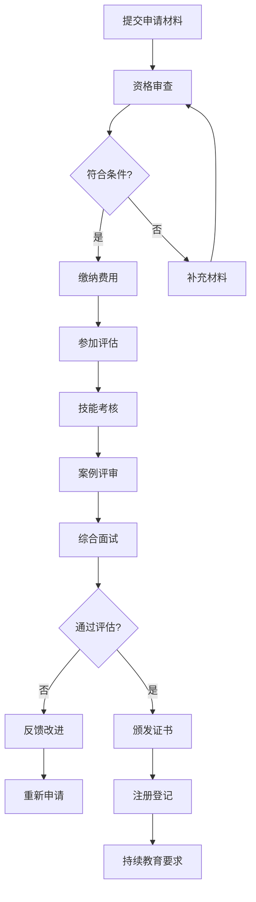

# 表达性艺术治疗培训认证体系 (Expressive Arts Therapy Training & Certification System)

> **专业化人才培养与发展路径**
> 
> *"专业能力的培养是一个系统工程——从基础技能掌握到高级临床胜任力的全面发展。"*
> 
> 本体系建立完整的表达性艺术治疗专业人才培养框架，提供标准化的培训课程、认证标准和职业发展路径。

---

## 1. 培训体系架构 (Training System Architecture)

### 表1.1 分层级培训体系 (Tiered Training System)

| 培训层级 | 目标群体 | 培训目标 | 核心内容 | 培训时长 | 认证要求 |
| :--- | :--- | :--- | :--- | :--- | :--- |
| **入门级** (Level 1) | 心理健康工作者、教育工作者 | 掌握基础理论和基本技能 | 理论基础、基础技术、伦理规范 | 40小时理论 + 20小时实践 | 课程考核 + 案例分析 |
| **中级** (Level 2) | 具备入门资格的专业人员 | 发展临床应用能力 | 进阶技术、案例工作、督导实践 | 80小时理论 + 60小时实践 | 技能考核 + 临床实习 |
| **高级** (Level 3) | 中级认证持有者 | 培养独立执业能力 | 高级技术、研究方法、教学能力 | 120小时理论 + 100小时实践 | 综合考试 + 督导认证 |
| **督导级** (Level 4) | 高级认证持有者 | 培养培训和督导能力 | 督导理论、培训技能、专业发展 | 60小时督导培训 + 实习 | 督导实习 + 能力评估 |

### 表1.2 专业能力发展路径 (Professional Competency Development Pathway)

| 能力维度 | 入门级要求 | 中级发展目标 | 高级胜任标准 | 督导级专精水平 |
| :--- | :--- | :--- | :--- | :--- |
| **理论基础** | 理解基本概念和原理 | 掌握多元理论体系 | 整合理论并创新发展 | 指导理论建构和研究 |
| **技术技能** | 掌握基础操作技术 | 熟练运用多种技术 | 创新技术应用和发展 | 培训他人技术能力 |
| **临床实践** | 在督导下开展基础工作 | 独立处理常规案例 | 处理复杂疑难案例 | 指导他人临床工作 |
| **伦理规范** | 理解并遵守基本伦理 | 在复杂情境中应用伦理 | 处理伦理困境 | 指导伦理决策 |
| **研究能力** | 理解研究基本方法 | 开展小型研究项目 | 独立设计研究方案 | 指导研究和发表成果 |
| **教学培训** | 接受培训和学习 | 分享经验和知识 | 设计和实施培训 | 培养培训师能力 |

---

## 2. 核心课程体系 (Core Curriculum System)

### 表2.1 OH卡疗法课程设置 (OH Cards Therapy Curriculum)

#### 入门级课程 (Level 1 Courses)
| 课程名称 | 课程目标 | 主要内容 | 教学方法 | 评估方式 |
| :--- | :--- | :--- | :--- | :--- |
| **OH卡疗法概论** | 建立基本概念框架 | 理论基础、发展历史、应用领域 | 讲授 + 讨论 | 理论考试 |
| **基础投射技术** | 掌握核心操作技能 | 自由投射、双卡组合、基础解读 | 示范 + 练习 | 技能演示 |
| **治疗关系建立** | 发展专业工作关系 | 建立联盟、共情技巧、边界维护 | 角色扮演 + 反馈 | 模拟评估 |
| **伦理与安全** | 理解专业规范要求 | 伦理准则、安全协议、风险管理 | 案例分析 + 讨论 | 情景判断 |

#### 中级课程 (Level 2 Courses)
| 课程名称 | 课程目标 | 主要内容 | 教学方法 | 评估方式 |
| :--- | :--- | :--- | :--- | :--- |
| **高级技术应用** | 掌握复杂技术组合 | 时间线法、角色扮演、隐喻转化 | 实操训练 + 督导 | 临床案例 |
| **特殊人群工作** | 适应不同服务对象 | 儿童、老年人、创伤患者工作方法 | 案例研讨 + 实践 | 专业报告 |
| **团体OH卡工作** | 发展团体带领能力 | 团体动力、过程管理、冲突处理 | 团体模拟 + 观摩 | 团体带领 |
| **效果评估方法** | 掌握测量评估技能 | 量化评估、质性分析、过程记录 | 实操练习 + 案例 | 评估报告 |

#### 高级课程 (Level 3 Courses)
| 课程名称 | 课程目标 | 主要内容 | 教学方法 | 评估方式 |
| :--- | :--- | :--- | :--- | :--- |
| **整合性干预** | 发展综合治疗能力 | 多技术整合、个性化方案设计 | 督导实践 + 案例分析 | 综合案例 |
| **研究方法应用** | 培养循证实践能力 | 研究设计、数据分析、文献综述 | 研究项目 + 指导 | 研究论文 |
| **跨文化适应** | 发展文化敏感性 | 文化差异、适应性调整、本土化应用 | 文化沉浸 + 反思 | 文化案例 |
| **专业发展指导** | 规划职业成长路径 | 继续教育、专业网络、领导力发展 | 导师指导 + 规划 | 发展计划 |

### 表2.2 绘画疗法课程设置 (Art Therapy Curriculum)

#### 入门级课程 (Level 1 Courses)
| 课程名称 | 课程目标 | 主要内容 | 教学方法 | 评估方式 |
| :--- | :--- | :--- | :--- | :--- |
| **绘画疗法基础** | 建立艺术治疗概念 | 理论框架、历史发展、基本原理 | 讲授 + 体验 | 理论测试 |
| **艺术媒材掌握** | 熟悉治疗性媒材 | 传统媒材、数字媒材、安全使用 | 实操练习 + 体验 | 媒材应用 |
| **创作过程理解** | 理解创造性机制 | 准备、孵化、顿悟、验证四阶段 | 创作体验 + 反思 | 过程分析 |
| **作品解读基础** | 掌握基本分析技能 | 符号象征、色彩心理学、构图分析 | 作品分析 + 讨论 | 解读练习 |

#### 中级课程 (Level 2 Courses)
| 课程名称 | 课程目标 | 主要内容 | 教学方法 | 评估方式 |
| :--- | :--- | :--- | :--- | :--- |
| **专业技法深化** | 精通核心治疗技术 | 曼陀罗、家庭绘画、自画像等 | 技法训练 + 督导 | 技法展示 |
| **创伤艺术治疗** | 掌握创伤工作技能 | 创伤知情护理、安全建立、意义重建 | 案例研讨 + 模拟 | 创伤案例 |
| **发展性应用** | 适应不同发展阶段 | 儿童、青少年、成人发展特点 | 发展评估 + 实践 | 发展案例 |
| **团体艺术工作** | 发展团体带领能力 | 团体动力、过程管理、作品分享 | 团体实践 + 观摩 | 团体带领 |

#### 高级课程 (Level 3 Courses)
| 课程名称 | 课程目标 | 主要内容 | 教学方法 | 评估方式 |
| :--- | :--- | :--- | :--- | :--- |
| **理论整合创新** | 发展理论建构能力 | 多理论整合、本土化发展、创新应用 | 理论研讨 + 写作 | 理论论文 |
| **神经科学应用** | 理解生物学机制 | 脑机制、神经可塑性、测量方法 | 神经科学讲座 + 讨论 | 机制分析 |
| **督导技能培训** | 培养督导胜任力 | 督导理论、反馈技巧、能力评估 | 督导实践 + 反思 | 督导演示 |
| **专业领导发展** | 培养行业影响力 | 专业标准制定、教育培训、研究引领 | 项目实践 + 指导 | 领导项目 |

---

## 3. 认证标准与流程 (Certification Standards & Process)

### 表3.1 认证分级标准 (Certification Level Standards)

| 认证级别 | 基本要求 | 专业能力 | 实践经验 | 评估标准 |
| :--- | :--- | :--- | :--- | :--- |
| **初级认证** (EAT-I) | 完成入门级培训 | 掌握基础理论和技术 | 50小时督导下实践 | 课程考核 + 案例报告 |
| **中级认证** (EAT-II) | 完成中级培训 | 独立开展常规工作 | 200小时独立实践 | 技能考核 + 督导评价 |
| **高级认证** (EAT-III) | 完成高级培训 | 处理复杂临床案例 | 500小时专业实践 | 综合考试 + 案例评审 |
| **督导认证** (EAT-S) | 完成督导级培训 | 培训和督导他人 | 1000小时实践经验 | 督导实习 + 能力评估 |

### 表3.2 认证申请流程 (Certification Application Process)

### 表3.3 持续教育要求 (Continuing Education Requirements)

| 认证级别 | 年度学时要求 | 学习内容要求 | 评估方式 | 有效期 |
| :--- | :--- | :--- | :--- | :--- |
| **初级认证** | 20学时/年 | 理论更新、技能提升 | 学时记录 + 反思报告 | 3年 |
| **中级认证** | 30学时/年 | 专业深化、案例研讨 | 学时记录 + 案例分享 | 3年 |
| **高级认证** | 40学时/年 | 研究前沿、创新应用 | 学时记录 + 专业贡献 | 3年 |
| **督导认证** | 50学时/年 | 督导发展、行业引领 | 学时记录 + 培训他人 | 3年 |

---

## 4. 质量保障体系 (Quality Assurance System)

### 表4.1 培训质量监控 (Training Quality Monitoring)

| 监控维度 | 监控指标 | 监控方法 | 改进措施 | 责任主体 |
| :--- | :--- | :--- | :--- | :--- |
| **课程质量** | 内容准确性、实用性 | 学员反馈、专家评审 | 课程更新、师资培训 | 课程委员会 |
| **教学效果** | 学习成果、技能掌握 | 前后测对比、技能评估 | 教学方法改进、个别辅导 | 培训师团队 |
| **师资水平** | 专业能力、教学技巧 | 同行评议、学员评价 | 持续教育、教学研讨 | 师资发展部 |
| **实践指导** | 督导质量、案例支持 | 督导记录、案例评审 | 督导培训、质量控制 | 督导委员会 |
| **认证公正** | 评估客观性、标准一致性 | 过程审计、结果复核 | 程序优化、申诉机制 | 认证委员会 |

### 表4.2 伦理合规监督 (Ethical Compliance Oversight)

| 监督领域 | 具体要求 | 监督机制 | 违规处理 | 预防措施 |
| :--- | :--- | :--- | :--- | :--- |
| **培训伦理** | 尊重学员、保护隐私 | 定期检查、匿名举报 | 警告、暂停、撤销资格 | 伦理培训、明确规范 |
| **认证公正** | 客观评估、程序透明 | 第三方审计、申诉程序 | 重新评估、纪律处分 | 标准化流程、回避制度 |
| **实践安全** | 保护来访者权益 | 案例审核、投诉处理 | 督导加强、暂停执业 | 安全培训、应急预案 |
| **专业诚信** | 真实申报、诚实执业 | 背景核查、持续监督 | 资格撤销、法律追责 | 诚信教育、信用记录 |

---

## 5. 国际认证对接 (International Certification Alignment)

### 表5.1 国际认证标准对照 (International Certification Standards Comparison)

| 国际组织 | 认证名称 | 培训要求 | 实践要求 | 评估方式 |
| :--- | :--- | :--- | :--- | :--- |
| **美国艺术治疗协会** (AATA) | ATR/ATR-BC | 硕士学位 + 750小时督导实践 | 1000小时临床经验 | 书面考试 + 案例评审 |
| **英国艺术治疗师协会** (BAAT) | HCPC注册 | 认可硕士课程 + 督导实践 | 持续注册要求 | 注册评估 + 督导记录 |
| **加拿大艺术治疗协会** (CATAC) | RCAT认证 | 研究生学历 + 700小时实践 | 1000小时工作经验 | 综合评估 + 面试 |
| **澳大利亚艺术治疗协会** (ANZACATA) | MAAT认证 | 认可课程 + 督导实践 | 750小时临床经验 | 评估中心 + 案例展示 |
| **国际表达性艺术治疗协会** (IEATA) | REAT认证 | 跨模式培训 + 整合实践 | 1000小时整合经验 | 综合评审 + 作品集 |

### 表5.2 本土化适应策略 (Localization Adaptation Strategy)

| 适应维度 | 本土化考虑 | 具体措施 | 实施要点 |
| :--- | :--- | :--- | :--- |
| **文化适应** | 中华文化背景 | 融入传统文化元素，发展本土化技术 | 尊重文化差异，避免生搬硬套 |
| **教育体系** | 中国教育体制 | 建立学历教育与职业培训双轨制 | 衔接现有教育体系，提供多元选择 |
| **实践环境** | 中国临床环境 | 适应本土心理健康服务体系 | 考虑资源配置，发展适宜技术 |
| **法规框架** | 中国法律法规 | 符合相关法律要求和行业规范 | 确保合法合规，规避法律风险 |
| **经济条件** | 中国经济发展水平 | 提供多层次、可负担的培训选择 | 平衡质量与成本，扩大服务覆盖面 |

---

## 6. 职业发展支持 (Career Development Support)

### 表6.1 职业发展路径规划 (Career Development Path Planning)

| 发展阶段 | 时间框架 | 核心任务 | 支持资源 | 成功指标 |
| :--- | :--- | :--- | :--- | :--- |
| **起步阶段** (1-3年) | 入门到中级认证 | 建立专业基础，积累实践经验 | 督导支持、同行网络、继续教育 | 独立执业能力，稳定案源 |
| **发展阶段** (3-7年) | 中级到高级认证 | 深化专业技能，拓展服务领域 | 专业进修、研究机会、领导岗位 | 专业声誉建立，服务能力提升 |
| **成熟阶段** (7-15年) | 高级到督导认证 | 发展专业特长，承担培训督导 | 学术研究、专业领导、行业影响 | 行业影响力，专业贡献度 |
| **专家阶段** (15年以上) | 督导认证及以上 | 引领行业发展，培养后继人才 | 政策咨询、标准制定、国际交流 | 行业权威地位，持续创新贡献 |

### 表6.2 专业网络建设 (Professional Network Building)

| 网络类型 | 建设目标 | 参与方式 | 价值收益 | 维护策略 |
| :--- | :--- | :--- | :--- | :--- |
| **学术网络** | 促进知识交流和研究合作 | 学术会议、期刊发表、研究合作 | 知识更新、研究机会、学术声誉 | 积极参与、贡献价值、互惠合作 |
| **实践网络** | 分享临床经验和最佳实践 | 案例研讨、督导小组、经验交流 | 技能提升、问题解决、专业支持 | 定期聚会、案例分享、互相学习 |
| **培训网络** | 共同发展培训和教育事业 | 培训合作、课程开发、师资交流 | 教学能力、资源共享、品牌建设 | 质量保证、创新发展、合作共赢 |
| **政策网络** | 参与行业标准制定和政策影响 | 专业组织、政府咨询、标准制定 | 行业话语权、政策影响、专业地位 | 积极参与、专业贡献、长远规划 |

---

*本培训认证体系基于国际标准并结合本土实际制定，旨在推动表达性艺术治疗行业的专业化和规范化发展。*
*所有培训和认证活动均需符合相关法律法规要求，并接受行业监管机构的监督指导。*
