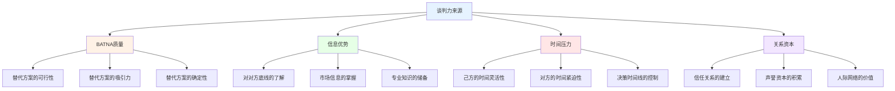
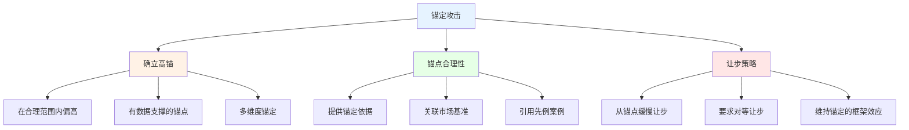
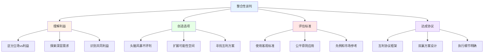
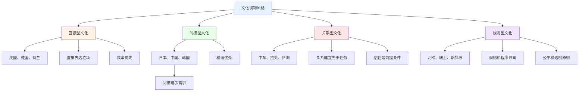

# 谈判心理学深度研究 (Negotiation Psychology Deep Dive)

## BATNA与谈判筹码

### 最佳替代方案(BATNA)理论

#### BATNA的核心概念

**BATNA(Best Alternative to a Negotiated Agreement)的定义：**

Fisher & Ury (1981) 在《Getting to Yes》中提出BATNA概念，指谈判者在谈判失败时可采取的最佳替代行动方案。BATNA是谈判力(Negotiation Power)的核心来源。

**BATNA分析与强化步骤：**
| 步骤 | 行动 | 分析要点 | 工具方法 | 常见错误 |
|------|------|---------|---------|---------|
| **1.识别替代** | 列出所有可能的替代方案 | 全面性、可行性 | 头脑风暴+可行性评估 | 遗漏可行替代方案 |
| **2.评估价值** | 量化各替代方案的价值 | 客观性、可比性 | 决策矩阵+评分模型 | 主观高估或低估 |
| **3.选择最优** | 确定最佳替代方案 | 综合考量、风险调整 | 多准则决策分析 | 忽略隐性成本 |
| **4.强化BATNA** | 主动改善最佳替代方案 | 创造性、执行力 | 行动计划+时间表 | 停留在分析不行动 |
| **5.设定底线** | 确定可接受的最低条件 | 清晰性、坚定性 | 预先承诺+退出策略 | 底线模糊或随意改变 |

#### BATNA的应用场景

**不同情境下的BATNA构建：**
- **薪资谈判** - 其他公司的录用offer、当前工作的保留价值
- **商业合同** - 竞争供应商的报价、自主研发的成本
- **租房协商** - 其他房源的租金和条件、搬家成本
- **关系协商** - 独立生活的能力和资源、社会支持网络

## 锚定效应在谈判中的应用

### 锚定偏差(Anchoring Bias)的心理学

#### 锚定效应的科学基础

**Tversky & Kahneman (1974) 的经典发现：**

锚定效应是认知心理学中最稳健的发现之一。在谈判中，首先提出的数字(锚点)会强烈影响最终协议的范围，即使这个数字是任意的。

**锚定效应的心理机制：**
| 机制 | 描述 | 谈判影响 | 研究支持 | 应对策略 |
|------|------|---------|---------|---------|
| **不充分调整** | 从锚点出发的调整通常不够充分 | 最终价格偏向锚点方向 | Tversky & Kahneman (1974) | 独立评估后再听对方出价 |
| **选择性激活** | 锚点激活与之相关的信息 | 支持锚点的证据更容易获得 | Strack & Mussweiler (1997) | 主动寻找反方向证据 |
| **态度改变** | 锚点可能改变对合理范围的判断 | 锚点改变了"公平价格"的感知 | Wegener et al. (2010) | 提前确定自己的合理范围 |

#### 锚定策略的攻与防

**锚定攻击策略(作为先出价方)：**

**锚定防御策略(作为后出价方)：**
1. **忽略锚点** - 不让对方的出价影响自己的独立评估
2. **反锚定** - 立即提出一个反向的极端数字
3. **质疑锚点** - 直接挑战对方出价的合理性
4. **转移焦点** - 将讨论从价格转向其他价值维度
5. **休息暂停** - 离开谈判桌重新进行独立评估

## 整合性vs分配性谈判

### 谈判类型的理论框架

#### 两种谈判范式的对比

**分配性vs整合性谈判的核心差异：**

| 维度 | 分配性谈判(Distributive) | 整合性谈判(Integrative) | 混合型谈判 |
|------|------------------------|----------------------|-----------|
| **隐喻** | 分蛋糕(固定馅饼) | 做大蛋糕(扩大馅饼) | 先做大再分配 |
| **目标** | 最大化己方份额 | 创造共同价值 | 平衡创造和索取 |
| **信息策略** | 保密和误导 | 分享和透明 | 选择性分享 |
| **关系导向** | 短期、一次性 | 长期、关系维护 | 视情况调整 |
| **出价策略** | 极端出价+缓慢让步 | 合理出价+协作探索 | 分阶段混合策略 |
| **典型场景** | 买车、法庭和解 | 商业合作、家庭决策 | 大多数真实谈判 |

#### 整合性谈判的四个关键步骤

**创造价值的整合方法：**

**立场vs利益的区别：**
| 情境 | 表面立场 | 深层利益 | 整合方案 |
|------|---------|---------|---------|
| **薪资谈判** | "我要月薪3万" | 经济安全+被认可 | 基本工资+绩效奖金+培训机会 |
| **租房协商** | "房租必须降500" | 可负担性+公平感 | 降300+免物业费+免费停车位 |
| **家庭度假** | "我要去海边" | 放松+新鲜体验 | 山间度假村(有泳池的温泉酒店) |
| **工作分配** | "我不要做这个项目" | 技能匹配+成长空间 | 角色重新分配+学习新技能计划 |

### 不对称信息下的谈判

#### 信息不对称的管理

**谈判中的信息博弈：**
- 信号传递(Signaling) - 通过可观察的行为传递不可观察的特质
- 筛选(Screening) - 设计机制使对方自愿揭示真实信息
- 信息揭露的节奏控制 - 何时分享、分享多少、以何种顺序
- 可信承诺(Credible Commitment) - 建立让对方信任的机制

## 文化谈判风格

### 跨文化谈判的心理学

#### 文化维度对谈判风格的影响

**不同文化背景的谈判特征：**

**中西方谈判风格的系统比较：**
| 谈判维度 | 中国文化风格 | 西方文化风格 | 冲突风险 | 桥接策略 |
|---------|------------|------------|---------|---------|
| **初始接触** | 通过中间人介绍、关系先行 | 直接联系、任务导向 | 信任建立困难 | 尊重双方的建立方式 |
| **谈判节奏** | 缓慢、耐心、多轮 | 快速、高效、限期 | 节奏不匹配引发焦虑 | 协商共同时间框架 |
| **信息分享** | 有限、渐进式 | 开放、直接式 | 互不信任对方意图 | 建立信息交换协议 |
| **决策过程** | 集体决策、层级审批 | 个人决策、授权充分 | 决策速度差异大 | 了解对方决策流程 |
| **让步模式** | 最后时刻才让步 | 逐步交替让步 | 让步时机不匹配 | 协商让步方式和节奏 |
| **合同观念** | 关系导向、灵活解读 | 法律导向、严格执行 | 对合同理解的差异 | 明确合同灵活性和边界 |

#### 面子文化对谈判的影响

**面子(Face)在跨文化谈判中的作用：**

Ting-Toomey (1988) 的面子协商理论(Face-Negotiation Theory)指出，不同文化对"面子"的关注程度和类型深刻影响冲突处理方式。

| 面子策略 | 行为表现 | 文化偏好 | 谈判优势 | 潜在风险 |
|---------|---------|---------|---------|---------|
| **维护自己面子** | 不承认错误、坚持立场 | 高权力距离文化 | 谈判立场坚定 | 僵局难以打破 |
| **维护对方面子** | 避免公开批评、委婉表达 | 集体主义文化 | 关系维护良好 | 问题可能被回避 |
| **互相保全面子** | 寻找双方都能接受的方案 | 东亚文化 | 促进和谐解决 | 可能延迟关键决策 |
| **不给面子** | 直接批评、公开施压 | 低语境文化 | 问题直击要害 | 关系严重受损 |

### 跨文化谈判的实用框架

#### 跨文化谈判能力模型

**跨文化谈判者的核心能力：**
1. **文化自我觉察** - 了解自身文化偏见和默认假设
2. **文化知识储备** - 学习对方文化的谈判规范和期望
3. **灵活适应能力** - 根据文化情境调整谈判策略
4. **关系建立技能** - 投资于跨文化的信任和关系建设
5. **沟通桥接能力** - 在不同沟通风格之间建立桥梁
6. **耐心和尊重** - 对文化差异的开放态度和尊重精神

---

*本文件从BATNA理论、锚定效应、整合性vs分配性谈判和跨文化谈判风格四个维度深入分析谈判心理学，为提升谈判能力提供科学理论基础和实用策略指导。*
