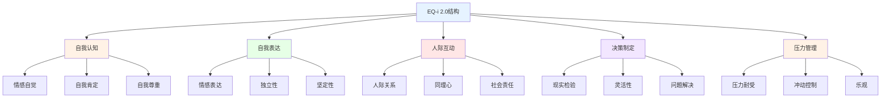
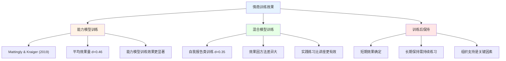
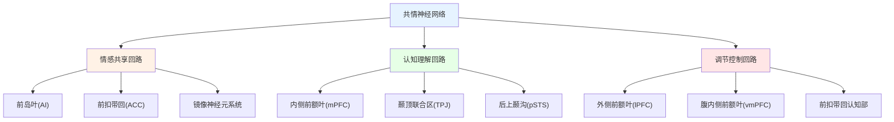

---

title: "情商评估与发展体系 (EI Assessment & Development)"
description: "情商评估与发展体系 (EI Assessment & Development)的详细解析与实践指南"
category: "实践与个人增长 > 个人发展 > 情商"
tags: ["communication"]
last_updated: "2026-05"
difficulty: "advanced"
reading_level: "advanced"
estimated_read_time: "5min"
intent_queries:
  - "什么是情商评估与发展体系"
  - "情商评估与发展体系的核心概念"
  - "情商评估与发展体系的方法与实践"
trigger_keywords: ["情商评估与发展体系", "anxiety", "assessment", "behavioral", "body"]
cross_refs:
  - path: "01-Wisdom-Traditions/yoga/therapy-clinical/Yoga_Psychological_Healing_Principles.md"
    relation: "anxiety/communication/emotion"
  - path: "02-Mind-Psychology/meditation/clinical/clinical-conditions/depression/11-Special-Populations.md"
    relation: "anxiety/communication/emotion"
  - path: "02-Mind-Psychology/meditation/clinical/clinical-conditions/depression/14-Movement-Mindfulness.md"
    relation: "anxiety/communication/emotion"
  - path: "02-Mind-Psychology/meditation/clinical/clinical-conditions/occupational-burnout/06-Depersonalization-Transformation.md"
    relation: "anxiety/communication/emotion"
  - path: "02-Mind-Psychology/meditation/courses/course/C3-4-intimacy-with-body.md"
    relation: "anxiety/communication/emotion"

---
# 情商评估与发展体系 (EI Assessment & Development)

## 情商测评工具深度解析

### EQ-i 2.0评估体系

#### EQ-i 2.0的理论基础与结构

**EQ-i 2.0 (Emotional Quotient Inventory) 概述：**

EQ-i 2.0是基于Bar-On (1997) 情绪-社交智力模型开发的自我报告式情商测评工具，是全球使用最广泛的情商评估工具之一，已翻译为50多种语言。



**EQ-i 2.0的15个子量表详解：**
| 复合量表 | 子量表 | 定义 | 高分表现 | 低分表现 | 信度(α) |
|---------|--------|------|---------|---------|---------|
| **自我认知** | 情感自觉 | 识别和理解自己情绪的能力 | 清楚自己的感受和原因 | 对自己的情绪状态模糊 | 0.81 |
| | 自我肯定 | 了解并接受自身优缺点 | 自知之明、坦诚面对自己 | 自我认知扭曲 | 0.81 |
| | 自我尊重 | 对自我价值的理解和接受 | 自信、自我接纳 | 自我否定、缺乏自信 | 0.85 |
| **自我表达** | 情感表达 | 清晰表达情绪和想法 | 善于表达感受 | 压抑情感、难以表达 | 0.78 |
| | 独立性 | 自主思考和行动的能力 | 自主决策、不依赖他人 | 过度依赖他人决策 | 0.79 |
| | 坚定性 | 非攻击性地表达感受和信念 | 适度坚持、不卑不亢 | 被动或攻击性表达 | 0.77 |
| **人际互动** | 人际关系 | 建立和维持互利关系 | 人际关系和谐融洽 | 社交困难、关系紧张 | 0.80 |
| | 同理心 | 识别和理解他人情绪 | 感同身受、善解人意 | 忽视他人感受 | 0.78 |
| | 社会责任 | 为社会群体做贡献的意愿 | 积极参与、乐于助人 | 社会参与度低 | 0.74 |
| **决策制定** | 现实检验 | 客观评估现实的能力 | 现实客观、不幻想 | 脱离现实、理想化 | 0.77 |
| | 灵活性 | 调整情感和思维的能力 | 灵活变通、适应力强 | 固执己见、刻板 | 0.80 |
| | 问题解决 | 有效解决个人和人际问题 | 系统解决、方法得当 | 回避问题、方法混乱 | 0.79 |
| **压力管理** | 压力耐受 | 有效应对压力和逆境 | 压力下保持冷静 | 压力下容易崩溃 | 0.83 |
| | 冲动控制 | 抵抗冲动和诱惑的能力 | 三思而行、情绪稳定 | 冲动行事、情绪失控 | 0.81 |
| | 乐观 | 积极看待生活的能力 | 看到积极面、充满希望 | 悲观、消极思维 | 0.81 |

#### EQ-i 2.0的评分与解释

**EQ-i 2.0的标准分解释体系：**
| 标准分范围 | 等级 | 解释 | 发展建议 |
|-----------|------|------|---------|
| **130+** | 非常高 | 显著优于常模，可能过度 | 检查是否在某些方面过度使用 |
| **120-129** | 高 | 发展良好的情商能力 | 继续保持和优化 |
| **110-119** | 较高 | 高于平均水平的情商 | 维持并发展相对较弱的维度 |
| **90-109** | 平均 | 与大多数人类似 | 识别最有提升空间的维度 |
| **80-89** | 较低 | 低于平均水平、需关注 | 针对性训练和提升 |
| **70-79** | 低 | 显著低于常模 | 密切关注、积极发展 |
| **<70** | 非常低 | 严重不足、影响生活 | 优先干预和系统训练 |

### MSCEIT能力测验

#### MSCEIT的基于能力的评估方法

**MSCEIT (Mayer-Salovey-Caruso Emotional Intelligence Test) 概述：**

MSCEIT是基于Mayer & Salovey (1997) 四分支能力模型的客观能力测验。与EQ-i 2.0的自我报告方式不同，MSCEIT通过情绪问题的正确答案来评估情商能力。

**MSCEIT的四个分支任务：**
| 分支 | 任务类型 | 能力评估 | 题目示例 | 评分方式 |
|------|---------|---------|---------|---------|
| **情绪感知** | 面部识别、图片情绪判断 | 感知自己和他人情绪 | "这张面部表情中包含多少悲伤？" | 专家共识/一般人群 |
| **情绪促进** | 感觉-感觉匹配、感觉-思维匹配 | 利用情绪辅助思维 | "什么情绪状态最适合产生创意？" | 专家共识/一般人群 |
| **情绪理解** | 情绪变化理解、情绪混合理解 | 理解情绪复杂关系 | "悲伤+愤怒可能演变为？" | 专家共识/一般人群 |
| **情绪管理** | 自我情绪管理、他人情绪管理 | 调节情绪以达成目标 | "以下哪种策略最能缓解焦虑？" | 专家共识/一般人群 |

**MSCEIT vs EQ-i 2.0的关键差异：**
| 比较维度 | MSCEIT | EQ-i 2.0 |
|---------|--------|----------|
| **理论基础** | 能力模型(Mayer & Salovey) | 混合模型(Bar-On) |
| **评估方法** | 客观能力测试 | 自我报告量表 |
| **评分方式** | 正确答案(专家/共识) | 自我评估频率 |
| **测量内容** | 情商的实际能力 | 情商的自我感知 |
| **文化偏见** | 较多(面部图片有文化差异) | 较少 |
| **伪装难度** | 高(难以伪装正确答案) | 低(可以假装) |
| **应用场景** | 研究、选拔 | 发展、辅导 |

## 情商训练项目

### 循证情商发展方法

#### 情商培训的效果研究

**情商可训练性的元分析证据：**


**影响训练效果的关键因素：**
| 因素 | 说明 | 效果影响 | 优化策略 |
|------|------|---------|---------|
| **训练方法** | 实践vs讲授 | 实践型效果2-3倍于讲授型 | 增加角色扮演和情境模拟 |
| **培训时长** | 短期vs长期 | 20小时以上效果更显著 | 分阶段持续培训 |
| **参与者动机** | 自愿vs强制 | 自愿参与效果显著更好 | 创造内在动机和兴趣 |
| **反馈机制** | 有反馈vs无反馈 | 个性化反馈提升效果50% | 结合测评结果提供反馈 |
| **后续支持** | 有跟踪vs无跟踪 | 持续支持延长保持时间 | 建立辅导和同伴支持系统 |

#### 情商能力的发展方法

**四大情商分支的训练路径：**
| 能力分支 | 训练方法 | 练习活动 | 推荐频率 | 预期提升 |
|---------|---------|---------|---------|---------|
| **情绪感知** | 正念觉察训练 | 身体扫描、情绪日记 | 每天10分钟 | 4-8周可感知变化 |
| **情绪促进思维** | 情绪-创意练习 | 情绪驱动写作、情绪绘画 | 每周3次 | 6-12周可见效果 |
| **情绪理解** | 情绪词汇扩展 | 学习情绪层级、情绪故事分析 | 每天学习3个新词汇 | 8-12周显著提升 |
| **情绪管理** | 认知重评训练 | 情境重解读、呼吸调节 | 每天15分钟练习 | 4-8周建立新习惯 |

## 共情的神经科学

### 共情(Empathy)的脑机制

#### 共情的神经网络

**共情的三成分模型(Decety & Jackson, 2004)：**

| 共情成分 | 神经基础 | 功能描述 | 个体差异 | 训练可能性 |
|---------|---------|---------|---------|-----------|
| **情感共享** | 前岛叶、前扣带回 | 感受他人的情感状态 | 镜像神经元敏感度不同 | 可通过正念和暴露提升 |
| **自我-他人区分** | 右侧颞顶联合区、内侧前额叶 | 区分自己的感受和他人的感受 | 高共情者区分能力更强 | 需要专门训练 |
| **观点采择** | 内侧前额叶、颞顶联合区 | 认知上理解他人的视角 | 心理理论能力因人而异 | 可通过练习显著提升 |

**共情神经回路的关键脑区：**


#### 共情疲劳与保护机制

**助人专业中的共情疲劳(Empathy Fatigue)：**

共情疲劳指在持续接触他人痛苦后产生的情感耗竭和疏离感，常见于医疗、心理咨询、社会工作等助人行业。

| 共情类型 | 功能 | 优势 | 风险 | 平衡策略 |
|---------|------|------|------|---------|
| **情感共情(Affective Empathy)** | 感受他人的情感 | 建立深层情感连接 | 情感耗竭、过度卷入 | 情感边界设定 |
| **认知共情(Cognitive Empathy)** | 理解他人的想法 | 保持理性的理解力 | 可能疏远、冷漠 | 结合适度的情感参与 |
| **慈悲共情(Compassionate Empathy)** | 感受+理解+行动意愿 | 既关怀又有行动力 | 行动倦怠 | 自我关怀和能量管理 |

### 共情训练的神经可塑性

#### 冥想对共情脑回路的影响

**慈心冥想(Loving-Kindness Meditation)的神经效应：**

Klimecki et al. (2013) 研究发现，仅一周的慈心冥想训练就能显著改变共情相关的神经激活模式，增强前岛叶和前扣带回的活动，同时降低与痛苦相关的消极情感。

**共情训练的神经可塑性证据：**
| 训练类型 | 训练时长 | 神经变化 | 行为变化 | 研究 |
|---------|---------|---------|---------|------|
| **慈心冥想** | 1周(每天30分钟) | AI和ACC激活增强 | 共情准确度提升 | Klimecki et al. (2013) |
| **正念训练** | 8周MBSR | 杏仁核反应性降低 | 情绪调节改善 | Hölzel et al. (2011) |
| **认知共情训练** | 6周ToM训练 | mPFC和TPJ连接增强 | 观点采择能力提升 | Dodell-Feder et al. (2013) |
| **行为训练** | 12周社交技能 | 多脑区功能连接增强 | 社交能力改善 | Schipper et al. (2020) |

#### 情商发展的整合方案

**组织情商发展的系统框架：**
```
发展系统四层次：
□ 个人层面：自我觉察练习+情绪调节技能
□ 人际层面：共情训练+沟通技能发展
□ 团队层面：团队情商+集体情感管理
□ 组织层面：情商文化+领导力发展
```

---

*本文件系统介绍了EQ-i 2.0和MSCEIT两大情商测评工具、循证情商训练方法和共情的神经科学基础，为情商的科学评估和系统发展提供全面的指导。*
