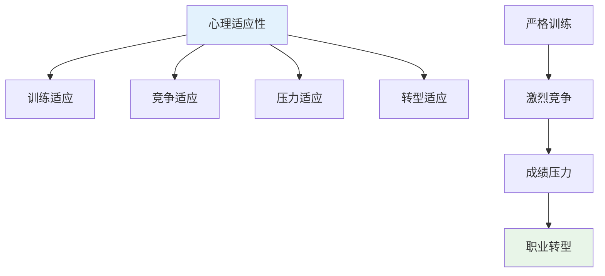
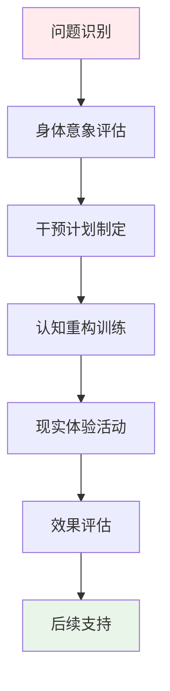
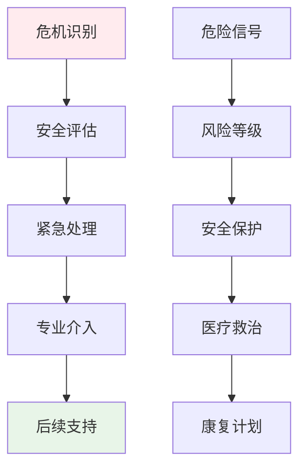

# Ballet Professional Attraction Clinical Assessment (芭蕾舞职业吸引临床评估)

> 📘 **文档导航**: 本指南提供芭蕾舞职业吸引现象的专业临床评估方法和实践指导。相关文档：
> - [芭蕾舞职业吸引心理学](Ballet_Professional_Attraction.md) - 理论基础和艺术特征
> - [职业吸引临床评估](../Professional_Attraction_Clinical_Assessment.md) - 通用评估框架
> - [职业吸引伦理法律](../Professional_Attraction_Ethics_Legal.md) - 专业伦理规范

## 芭蕾舞职业吸引评估专项框架

### 芭蕾领域特殊评估考虑

#### 1. 艺术特征适应性评估

**芭蕾职业独特性分析**:
- **身体美学要求**: 严格的体型标准、优美的肢体线条、协调的动作表现
- **技艺精湛需求**: 高难度技术动作、精准的节奏控制、完美的艺术表达
- **青春时效特征**: 职业生涯相对较短、巅峰期有限、转型挑战较大
- **艺术创造力**: 情感表达能力、艺术理解力、创新表现力

**评估重点调整**:
| 评估维度 | 通用标准 | 芭蕾专项调整 | 调整理由 |
| :--- | :--- | :--- | :--- |
| **身体意象** | 一般身体满意度 | 舞蹈身体概念、体型焦虑 | 芭蕾美学特殊要求 |
| **艺术感知** | 一般审美能力 | 舞蹈艺术敏感性、音乐感知力 | 艺术专业需求 |
| **创造力评估** | 一般创意思维 | 舞蹈编创能力、即兴表现力 | 艺术表达核心 |
| **韧性评估** | 一般抗压能力 | 舞蹈训练耐受性、伤病恢复力 | 职业特殊挑战 |

#### 2. 芭蕾职业吸引特有量表

##### 芭蕾职业吸引专项量表(Ballet Specific PAS)

**量表结构**:
- **A分量表**: 身体美学吸引维度(8题)
- **B分量表**: 技艺崇拜吸引维度(8题)
- **C分量表**: 艺术表达吸引维度(7题)
- **D分量表**: 青春特质吸引维度(6题)
- **E分量表**: 舞台魅力吸引维度(6题)

**题目示例**:
1. "当我看到芭蕾舞者的优美身姿时，会产生强烈的向往"
2. "我对芭蕾舞的高难度技巧有着特殊的崇拜和追求"
3. "我渴望通过舞蹈来表达内心深处的情感和故事"
4. "我对芭蕾舞者青春活力的形象特别着迷"
5. "我梦想着能够在舞台上展现自己的艺术才华"

**评分标准**:
- 5点李克特量表(1=完全不符合, 5=完全符合)
- 总分范围: 35-175分
- 临床临界值: ≥105分为显著芭蕾职业吸引

#### 3. 芭蕾职业技能匹配评估

##### 身体条件评估维度

**身体素质评估**:
| 素质类型 | 评估内容 | 评估方法 | 芭蕾意义 |
| :--- | :--- | :--- | :--- |
| **柔韧性** | 关节活动度、肌肉延展性 | 柔韧度测试、把杆练习 | 技术动作基础 |
| **力量控制** | 核心力量、肢体控制 | 力量测试、跳跃动作 | 稳定性保障 |
| **协调性** | 身体各部位协调配合 | 协调性测试、组合练习 | 动作流畅关键 |
| **平衡感** | 静态平衡、动态平衡 | 平衡测试、旋转动作 | 技巧表现核心 |

**身体意象评估**:
| 评估维度 | 具体内容 | 评估工具 | 临床关注 |
| :--- | :--- | :--- | :--- |
| **体型满意度** | 对身体各部位的满意程度 | 身体意象问卷 | 饮食障碍风险 |
| **舞蹈身体概念** | 对理想舞者身材的认知 | 舞蹈身体意象量表 | 现实期望管理 |
| **体型焦虑** | 对体重和身材的担忧程度 | 体型焦虑量表 | 心理健康监测 |

##### 艺术能力评估维度

**艺术感知能力**:
| 能力类型 | 评估内容 | 评估方法 | 发展意义 |
| :--- | :--- | :--- | :--- |
| **音乐感知** | 节奏感、旋律感、和声理解 | 音乐感知测试、即兴配合 | 舞蹈基础要素 |
| **空间感知** | 舞台空间利用、方位感 | 空间感知测试、编舞任务 | 舞台表现力 |
| **情感表达** | 情感理解、情绪传达 | 情感表达测试、角色诠释 | 艺术感染力 |

**创造表现能力**:
| 能力维度 | 评估指标 | 评估方式 | 培养价值 |
| :--- | :--- | :--- | :--- |
| **即兴创作** | 临场发挥、创意展现 | 即兴舞蹈测试 | 创新思维培养 |
| **角色塑造** | 人物理解、性格表现 | 角色诠释测试 | 表演能力提升 |
| **风格把握** | 不同流派的理解和表现 | 风格模仿测试 | 艺术修养深化 |

### 芭蕾职业吸引发展评估

#### 发展阶段专项评估

##### 青少年期芭蕾兴趣评估

**评估重点**:
- 芭蕾兴趣的萌芽和发展过程
- 家庭艺术氛围对兴趣的影响
- 身体条件与芭蕾兴趣的匹配度
- 同伴群体中的艺术交流情况

**评估工具**:
- 芭蕾兴趣发展史访谈
- 家庭艺术环境评估问卷
- 身体条件-兴趣匹配度量表
- 同伴艺术活动观察记录

##### 专业训练期评估

**评估内容**:
- 专业学习动机和坚持程度
- 技能进步速度和质量水平
- 舞团实践经验积累情况
- 职业规划的合理性和可行性

**专项评估**:
- 专业课程成绩分析
- 技能等级考试结果
- 舞团实习表现评估
- 职业发展前景分析

#### 芭蕾职业适应性评估

##### 心理适应性评估

**适应性维度**:

**评估指标**:
| 适应维度 | 具体指标 | 评估方法 | 判定标准 |
| :--- | :--- | :--- | :--- |
| **训练适应** | 对高强度训练的耐受性 | 训练日记分析、生理指标监测 | 良好耐受水平 |
| **竞争适应** | 面对竞争的心理承受力 | 竞争情境模拟、心理量表 | 健康竞争心态 |
| **压力适应** | 成绩和表现压力管理 | 压力应对问卷、访谈评估 | 有效压力管理 |
| **转型适应** | 职业转换的心理准备 | 转型准备量表、生涯规划 | 积极转型态度 |

##### 身体适应性评估

**身体健康监测**:
- 定期体检和伤病预防
- 营养状况和体重管理
- 训练负荷和恢复平衡
- 长期健康风险评估

**评估流程**:
1. 基础健康状况筛查
2. 专项运动能力测试
3. 持续健康监测跟踪
4. 伤病预防和管理

### 芭蕾职业吸引干预策略

#### 预防性干预措施

##### 教育引导策略

**分级教育模式**:
| 教育阶段 | 目标群体 | 教育内容 | 实施方式 | 预期效果 |
| :--- | :--- | :--- | :--- | :--- |
| **启蒙阶段** | 小学低年级 | 芭蕾基础知识、艺术欣赏 | 兴趣班、观摩演出 | 兴趣培养 |
| **了解阶段** | 小学高年级 | 专业介绍、身体要求 | 体验课程、专家讲座 | 理性认知 |
| **准备阶段** | 初中阶段 | 专业选择指导、基础训练 | 专业培训班、技能测试 | 能力评估 |
| **专业阶段** | 高中及以上 | 专业深化、职业规划 | 专业院校、舞团实习 | 职业准备 |

##### 身心健康管理

**身体健康管理**:
- 科学的训练计划制定
- 合理的营养膳食指导
- 充分的休息恢复安排
- 伤病预防和及时治疗

**心理健康维护**:
- 建立积极的身体意象
- 培养健康的竞争心态
- 学会有效的压力管理
- 发展多元化兴趣爱好

#### 治疗性干预方法

##### 身体意象干预

**核心干预技术**:
1. **认知重构**: 帮助建立健康的身体认知
2. **现实检验**: 通过专业评估了解真实身体条件
3. **价值澄清**: 重新认识芭蕾艺术的本质价值
4. **多元发展**: 培养除外形外的其他核心能力

**干预流程**:

##### 艺术治疗干预

**表达性艺术治疗**:
- 通过舞蹈表达内心情感
- 利用音乐舒缓心理压力
- 借助创作释放内心冲突
- 在艺术中寻找自我价值

**治疗方法**:
- 舞动治疗技术应用
- 音乐治疗元素融入
- 戏剧治疗技巧借鉴
- 综合艺术疗法整合

### 芭蕾职业吸引风险管理

#### 风险识别与评估

##### 潜在风险类型

**身体健康风险**:
| 风险类型 | 表现特征 | 识别指标 | 干预要点 |
| :--- | :--- | :--- | :--- |
| **饮食障碍** | 过度节食、暴食后催吐 | EDE-Q量表异常、BMI异常 | 营养干预、心理治疗 |
| **运动损伤** | 反复性劳损、急性外伤 | 伤病频率、疼痛程度 | 医疗治疗、康复训练 |
| **生长发育影响** | 青春期发育延迟、骨密度降低 | 发育指标、骨密度检测 | 医学监护、营养补充 |

**心理健康风险**:
| 风险类型 | 表现特征 | 识别指标 | 干预要点 |
| :--- | :--- | :--- | :--- |
| **完美主义** | 过度追求完美、害怕失败 | MPS量表高分 | 认知行为治疗 |
| **焦虑抑郁** | 情绪低落、过度担心 | PHQ-9、GAD-7量表 | 心理治疗介入 |
| **身份认同困扰** | 职业身份迷茫、价值怀疑 | 身份认同量表 | 生涯咨询支持 |

#### 危机干预体系

##### 紧急干预程序

**危机识别信号**:
- 明显的自伤或自杀倾向表达
- 严重的饮食障碍行为
- 急性心理崩溃状态
- 重大伤病或家庭变故

**应急处理流程**:

**资源配置**:
- 专业医疗救治团队
- 心理危机干预专家
- 家庭和学校支持网络
- 同行互助支持系统

### 芭蕾职业吸引跟踪随访

#### 长期跟踪机制

##### 随访时间安排

**阶段性随访计划**:
| 随访阶段 | 时间节点 | 随访重点 | 评估工具 | 频率要求 |
| :--- | :--- | :--- | :--- | :--- |
| **初期跟踪** | 干预后1-3个月 | 症状改善情况 | 症状自评量表 | 每月一次 |
| **中期评估** | 干预后6个月 | 功能恢复程度 | 功能评估量表 | 每季度一次 |
| **长期随访** | 干预后1-2年 | 发展适应情况 | 综合发展评估 | 每半年一次 |
| **远期追踪** | 干预后3-5年 | 长远发展效果 | 长期追踪调查 | 每年一次 |

##### 随访内容体系

**多维度跟踪评估**:
- 身心健康状况监测
- 专业技能发展水平
- 职业适应和发展情况
- 生活质量改善程度
- 家庭关系和谐度

**数据收集方法**:
- 定期健康检查记录
- 专业技能评估报告
- 深度访谈和问卷调查
- 第三方观察反馈

#### 效果评估与持续改进

##### 干预效果评估

**评估指标体系**:
| 评估维度 | 具体指标 | 评估方法 | 判定标准 |
| :--- | :--- | :--- | :--- |
| **症状改善** | 吸引强度降低程度 | 量表前后对比 | 降低≥30%为有效 |
| **功能恢复** | 身心功能改善水平 | 功能评估量表 | 恢复至正常水平 |
| **专业发展** | 技能水平和职业适应 | 专业发展评估 | 良好发展态势 |
| **生活质量** | 整体生活满意度 | 生活质量问卷 | 显著提升 |

##### 持续改进机制

**质量改进循环**:

**改进重点领域**:
- 评估工具的针对性优化
- 干预方法的艺术化创新
- 服务流程的个性化定制
- 专业团队的跨学科合作

---
*📚 本文档为芭蕾舞职业吸引现象提供专业的临床评估体系和干预指导，特别关注艺术专业的特殊需求和身心健康发展。*