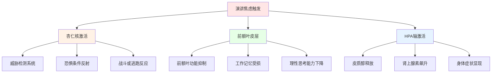
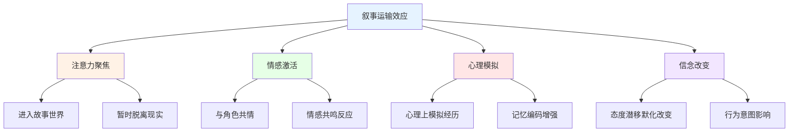
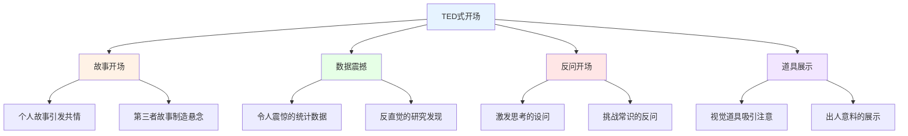

# 公众演讲精通指南 (Public Speaking Mastery)

## 演讲焦虑的神经科学基础

### 演讲恐惧症(Glossophobia)的神经机制

#### 恐惧反应的神经通路

**演讲焦虑的神经生物学：**

**演讲焦虑的生理症状与神经基础：**
| 症状表现 | 生理机制 | 神经基础 | 进化功能 | 应对策略 |
|---------|---------|---------|---------|---------|
| **心跳加速** | 肾上腺素释放 | 交感神经系统激活 | 为战斗准备能量 | 深呼吸、渐进放松 |
| **手心出汗** | 汗腺过度活跃 | 交感神经支配 | 增强抓握力 | 握紧-放松练习 |
| **声音颤抖** | 声带肌肉紧张 | 神经肌肉过度激活 | 警告信号传递 | 发声热身练习 |
| **大脑空白** | 工作记忆受损 | 前额叶功能抑制 | 注意力集中于威胁 | 过度练习至自动化 |
| **呼吸急促** | 呼吸频率增加 | 脑干呼吸中枢激活 | 增加氧气供给 | 4-7-8呼吸法 |
| **胃部不适** | 消化系统抑制 | 迷走神经反应 | 将能量转移至肌肉 | 避免演讲前大量进食 |

#### 演讲焦虑的个体差异

**影响焦虑水平的关键因素：**
| 因素类别 | 低焦虑预测 | 高焦虑预测 | 可改变性 | 干预方向 |
|---------|-----------|-----------|---------|---------|
| **遗传倾向** | 低神经质得分 | 高神经质得分 | 不可改变 | 接纳+管理策略 |
| **过往经验** | 积极演讲经历 | 创伤性公开经历 | 可部分改变 | 渐进暴露+认知重构 |
| **准备程度** | 充分准备 | 准备不足 | 完全可改变 | 系统化准备流程 |
| **自我效能** | 高演讲自我效能 | 低演讲自我效能 | 可培养 | 掌握性经验积累 |
| **认知评估** | 视为挑战 | 视为威胁 | 可改变 | 认知重构训练 |

### 演讲焦虑的循证干预

#### 认知行为干预策略

**CBT技术在演讲焦虑中的应用：**
1. **认知重构(Cognitive Restructuring)**
   - 识别自动化消极思维："我一定会搞砸"
   - 挑战思维证据："之前有过成功的经历"
   - 替换为现实思维："即使不完美也可以传达价值"

2. **渐进暴露(Gradual Exposure)**
   - 从低焦虑情境开始：对镜子练习
   - 逐步增加难度：小群体→中等群体→大型观众
   - 系统脱敏：结合放松技巧的阶梯暴露

3. **注意力训练(Attention Training)**
   - 从内部关注转向外部关注
   - 专注于传递信息而非自我表现
   - 关注观众反应而非自身紧张

#### 生理调节技术

**演讲前和演讲中的生理管理：**
| 技术 | 方法 | 作用机制 | 最佳时机 | 效果 |
|------|------|---------|---------|------|
| **4-7-8呼吸** | 吸4秒-屏7秒-呼8秒 | 激活副交感神经 | 上台前5分钟 | 显著降低焦虑 |
| **渐进肌肉放松** | 系统性紧张-放松各肌群 | 减少肌肉紧张 | 演讲前30分钟 | 中等效果 |
| **力量姿势** | 高能量身体姿势2分钟 | 降低皮质醇、提升自信 | 后台准备时 | 争议性但常用 |
| **锚定技术** | 回忆成功演讲的身体感觉 | 条件反射式激活资源态 | 上台前瞬间 | 个人化效果 |

## 故事讲述框架

### 叙事心理学在演讲中的应用

#### 故事的神经科学效应

**为什么故事比数据更有说服力：**

Paul Zak的神经经济学研究发现，引人入胜的故事能显著提高听众大脑中催产素(Oxytocin)的水平，从而增强同理心和合作意愿。

**叙事运输(Narrative Transportation)理论：**

#### 有效故事的经典结构

**六大故事讲述框架：**
| 框架 | 结构 | 最佳用途 | 示例 | 关键要素 |
|------|------|---------|------|---------|
| **英雄之旅** | 召唤→考验→归来 | 激励型演讲 | 乔布斯斯坦福演讲 | 转变、成长、回归 |
| **问题-解决** | 困境→探索→方案 | 说服型演讲 | TED解决方案演讲 | 紧迫感、可行方案 |
| **对比框架** | 过去vs现在vs未来 | 愿景型演讲 | MLK《我有一个梦想》 | 鲜明对比、希望 |
| **三幕剧** | 建立→对抗→解决 | 叙事型演讲 | 个人经历分享 | 冲突、高潮、结局 |
| **STAR法则** | 情境→任务→行动→结果 | 面试和汇报 | 职场能力展示 | 具体、可量化 |
| **SCQA模型** | 情境→冲突→问题→答案 | 学术演讲 | 麦肯锡式汇报 | 逻辑清晰、层层推进 |

#### 故事的核心要素

**引人入胜故事的五大要素：**
1. **共鸣角色(Relatable Character)** - 听众能在角色身上看到自己
2. **明确赌注(Clear Stakes)** - 角色面临的真实后果和代价
3. **感官细节(Sensory Details)** - 视觉、听觉、触觉的具体描写
4. **情感弧线(Emotional Arc)** - 从一个情感状态到另一个的转变
5. **核心信息(Core Message)** - 故事服务的中心论点

## TED演讲分析

### TED演讲的成功模式

#### TED演讲的结构解码

**高效TED演讲的共性特征：**

Gallo (2014) 在《像TED一样演讲》中分析了500场最受欢迎的TED演讲，提炼出三大核心特质：情感(Emotional)、新奇(Novel)、难忘(Memorable)。

**顶级TED演讲的分析：**
| 演讲者 | 主题 | 时长 | 核心技巧 | 情感策略 | 关键数据 |
|--------|------|------|---------|---------|---------|
| **Ken Robinson** | 学校扼杀创造力 | 19分钟 | 幽默+颠覆性观点 | 自嘲式幽默+深刻洞察 | 史上最多观看(6800万+) |
| **Brené Brown** | 脆弱的力量 | 20分钟 | 个人故事+学术数据 | 坦诚自我暴露 | 学术与故事完美融合 |
| **Simon Sinek** | 从为什么开始 | 18分钟 | 黄金圈模型+案例 | 理想主义感染力 | 简洁有力的核心模型 |
| **Jill Bolte Taylor** | 我的中风洞见 | 18分钟 | 亲历者叙事+大脑科学 | 情感高潮(人脑道具) | 科学与体验的结合 |
| **Amy Cuddy** | 身体语言塑造你 | 21分钟 | 研究+个人故事 | 脆弱分享(演讲高潮) | 可操作的实用建议 |

#### TED演讲的技巧提炼

**开场技术分析：**

**TED演讲的节奏控制：**
- **18分钟法则** - TED标准时长，符合注意力最佳持续区间
- **每3分钟一个变化** - 故事→数据→视觉→互动的交替节奏
- **幽默分布** - 平均每2-3分钟一个轻松点
- **情感曲线设计** - 升→降→升的节奏感
- **记忆锚点** - 每个关键概念配一个可记忆的表达

## 身体语言精要

### 非言语沟通在演讲中的力量

#### Mehrabian法则与演讲身体语言

**身体语言的维度分析：**

虽然Mehrabian的"7-38-55法则"(文字7%、声音38%、身体语言55%)常被过度简化，但研究确实证实非言语信号在沟通中占据重要地位。

**演讲中的五大身体语言维度：**
| 维度 | 具体元素 | 最佳实践 | 常见错误 | 练习方法 |
|------|---------|---------|---------|---------|
| **手势** | 手臂和手的动作 | 开放手势配合论点、手势放大关键概念 | 双手交叉、频繁小动作 | 录像回放+刻意练习 |
| **面部表情** | 微表情和持续表情 | 与内容匹配的真实表情、微笑建立亲和 | 木头脸、表情与内容不匹配 | 镜子练习+情绪回忆 |
| **眼神交流** | 与观众的对视 | 区域扫描法、单人对视3-5秒 | 看天花板、读稿不看人 | 真人练习+区域分割 |
| **姿势移动** | 站立和走动 | 稳定站立、有目的的走动 | 来回踱步、倚靠讲台 | 走位规划+限制移动 |
| **空间使用** | 舞台空间的利用 | 前进强调重点、侧移转换话题 | 固守一处、过多后退 | 舞台分区标记练习 |

#### 权力与亲和的身体语言

**Amy Cuddy的身体语言研究应用：**
- 高力量姿势(High Power Pose) - 扩张性姿势，占据更多空间
- 低力量姿势(Low Power Pose) - 收缩性姿势，缩小占用空间
- 演讲前的2分钟力量姿势可能降低皮质醇、提高自信
- 演讲中应展现开放、自信、但有亲和力的姿态
- 避免封闭性姿势：双臂交叉、手插口袋、身体后倾

### 声音表达的艺术

#### 演讲声音的六大维度

**声音表现力的控制技巧：**
| 声音维度 | 控制要点 | 情感效果 | 练习方法 | 名家参考 |
|---------|---------|---------|---------|---------|
| **音量** | 大小变化、关键处加强 | 控制感和权威感 | 渐强渐弱朗读 | Martin Luther King Jr. |
| **语速** | 快慢交替、关键处减速 | 紧迫感和深思熟虑 | 标记变速点练习 | Barack Obama |
| **停顿** | 句前停顿、关键后停顿 | 强调、悬念、思考空间 | 计时停顿练习 | Winston Churchill |
| **音调** | 上扬提问、下降断言 | 确定性和开放性 | 音阶练习 | Morgan Freeman |
| **音色** | 温暖vs冷硬的调节 | 亲和力和权威感 | 放松喉咙练习 | Brené Brown |
| **节奏** | 规律性韵律模式 | 音乐感和记忆性 | 诗歌朗诵练习 | Maya Angelou |

#### 停顿的艺术

**演讲停顿的类型与功能：**
1. **戏剧性停顿(Dramatic Pause)** - 在重要声明前后的2-3秒沉默
2. **过渡性停顿(Transitional Pause)** - 段落和话题转换之间的短暂间隔
3. **互动性停顿(Interactive Pause)** - 抛出问题后等待观众思考
4. **情感性停顿(Emotional Pause)** - 情感高点后给观众消化时间
5. **节奏性停顿(Rhythmic Pause)** - 形成韵律感的规律性停顿

---

*本文件从演讲焦虑的神经科学基础、故事讲述框架、TED演讲分析和身体语言精要四个维度深入探讨公众演讲的精通之道，为演讲者提供从理论到实践的全面指导。*
