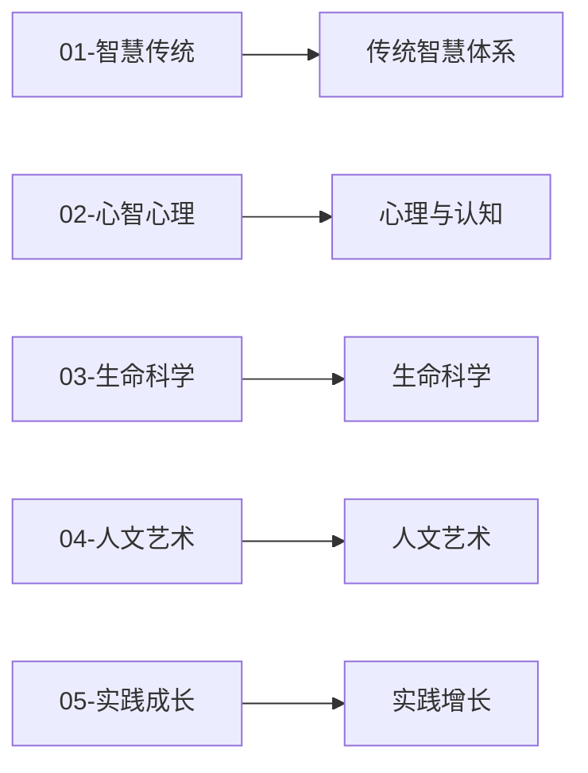

---

title: "分类法与架构决策 (Taxonomy & Architecture Decisions)"
description: "分类法与架构决策 (Taxonomy & Architecture Decisions)的详细解析与实践指南"
category: "general"
tags: ["addiction", "ballet", "cinema"]
last_updated: "2026-05"
difficulty: "advanced"
reading_level: "advanced"
estimated_read_time: "5min"
intent_queries:
  - "什么是分类法与架构决策"
  - "分类法与架构决策的核心概念"
  - "分类法与架构决策的方法与实践"
trigger_keywords: ["分类法与架构决策", "act", "addiction", "art", "ballet"]
cross_refs:
  - path: "README.md"
    relation: "佛教/沟通/道家ism"
  - path: "01-智慧传统/宗教/禅宗/Zen_Daily_Life_Practice.md"
    relation: "佛教/沟通/冥想"
  - path: "01-智慧传统/宗教/佛教/现代应用/INDEX.md"
    relation: "佛教/道家ism/冥想"
  - path: 01-智慧传统/宗教/佛教-南怀瑾-Nan_Huaijin_Teachings.md
    relation: "佛教/道家ism/冥想"
  - path: 02-心智心理/冥想/基础-总览-Meditation_Practitioner_QA.md
    relation: "佛教/沟通/冥想"

---
# 分类法与架构决策 (Taxonomy & Architecture Decisions)

> 本文档记录 Peace Lab Database 的分类原则、决策树与架构设计理由。

---

## 五大支柱分类原则



| 支柱 | 判定标准 | 典型内容 |
|------|----------|----------|
| `01-智慧传统` | 源自古代传承的系统性教导 | 佛教、道家、瑜伽、禅宗、哲学 |
| `02-心智心理` | 现代科学框架下的心理研究与干预 | 临床心理、冥想、疗法、关系心理 |
| `03-生命科学` | 以身体/生物机制为核心 | 神经科学、营养、睡眠、性学 |
| `04-人文艺术` | 审美表达与文化疗愈 | 艺术史、芭蕾、音乐、电影、文学 |
| `05-实践成长` | 可直接执行的技能与方法论 | 超级个体、沟通、写作、讲座 |

---

## 分类决策树

当一个新主题需要归类时：

1. **它是否基于古代传承体系？** → `01-智慧传统/`
2. **它是否关注心理机制、测评或临床治疗？** → `02-心智心理/`
3. **它的核心是身体、生物学或医学？** → `03-生命科学/`
4. **它涉及艺术创作、审美或媒体？** → `04-人文艺术/`
5. **它是可执行的个人技能或商业实践？** → `05-实践成长/`

---

## 交叉归属处理

当主题跨越多个支柱时：

- **主体**放在最核心的支柱
- **影子链接**放在其他相关支柱的 INDEX.md 中
- **交叉引用**记录到 `_meta/cross-references.md`

### 示例

| 主题 | 主体位置 | 影子链接 |
|------|----------|----------|
| 太极拳 | `01-智慧传统/太极拳/` | `03-生命科学/` INDEX 交叉引用 |
| 瑜伽解剖学 | `01-智慧传统/瑜伽/` | `03-生命科学/生物学/` 交叉引用 |
| 冥想神经科学 | `02-心智心理/冥想/` | `03-生命科学/生物学/脑科学/` 交叉引用 |

---

## psychology/ 子分类逻辑

| 子类 | 判定标准 | 内含专题数 |
|------|----------|------------|
| `基础/` | 理论性、流派性、工具性内容 | 4 |
| `临床/` | 有 DSM/ICD 诊断标准的障碍 | 9 |
| `压力与HPA轴/` | 以 HPA 轴与皮质醇为核心机制 | 3 |
| `发展心理/` | 与生命阶段相关的发展议题 | 3 |
| `社会心理/` | 人际关系与社会群体动力 | 7 |
| `行为心理/` | 以行为模式和成瘾为核心 | 5 |
| `躯体身心/` | 涉及躯体感觉与身体反应 | 5 |
| `selfregulation/` | 自我调节与应对技能 | 5 |
| `应用心理/` | 特定场景（职场、消费等）应用 | 4 |
| `特殊专题/` | 无法归入以上类别的独立专题 | 7 |

---

## 根目录布局

```
peace-lab-database/
├── 01~05-*/                  ← 五大内容支柱（知识主体）
├── 06-临床专题/       ← 临床专题聚合层（跨支柱临床知识包，按疾病维度组织）
│
├── _meta/                    ← 知识关联层（cross-references, learning-paths, topic-maps, skills-index）
│   ├── docs/                 ← 项目规范文档（CONTRIBUTING, GLOSSARY, TAXONOMY, CRISIS_RESOURCES 等）
│   └── research-topics/      ← 跨领域课题研究（原 07 层，已降级并入：意识/具身/冥想/整合医学等交叉研究）
│
├── Web/                      ← Web 站点层（MkDocs 配置、assets、docs、visualization 知识图谱前端）
├── Tools/                    ← 质量工具与运维（scripts 脚本、reports 审计报告、qa-corpus、plans、logs）
│
├── .github/                  ← GitHub 配置（CI/Issue 模板等）
└── README.md / LICENSE / .gitignore   ← 项目入口、许可与忽略规则
```

> 注：历史布局中的 `docs/`、`Project/`、`scripts/`、`Visualization/`、`资源/`、`site/`、`mkdocs.yml` 等顶层项已重组：规范文档归入 `_元信息/docs/`，运维脚本归入 `Tools/scripts/`，可视化归入 `Web/可视化/`。

### `_元信息/docs/` vs `_元信息/` 边界

| 目录 | 职责 | 典型内容 |
|:-----|:-----|:---------|
| `_元信息/docs/` | **项目规范**：面向贡献者的标准文档 | CONTRIBUTING.md, GLOSSARY.md, TAXONOMY.md, DIRECTORY_CONVENTIONS.md, CRISIS_RESOURCES.md |
| `_元信息/`（根） | **知识关联**：跨支柱的知识图谱与索引 | cross-references.md, learning-paths/, topic-maps/, skills-index.md |

**原则**：
- 规范类文档 → `_元信息/docs/`
- 知识关联/索引/地图 → `_元信息/`
- Agent Skills 嵌入在各专题的 `技能/` 子目录中，`_meta/skills-index.md` 提供聚合索引

---

## 架构变更记录

| 日期 | 变更 | 理由 |
|------|------|------|
| 2026-06-01 | `06-topic/` 合并入 `06-临床专题/`，消除 06- 编号冲突 | 目录审计 P0 |
| 2026-06-01 | `cbt-疗法/` 合并入 `认知行为疗法/`，消除 CBT 重复 | 目录审计 P0 |
| 2026-06-01 | `sufi-冥想/` 合并入 `苏菲冥想/`，消除苏菲冥想重复 | 目录审计 P1 |
| 2026-04-08 | psychology/ 从 51 个平级目录重组为 10 个子分类 | 可维护性极大提升 |
| 2026-04-08 | eye-floaters/ 合并入 floaters/ | 消除重复目录 |
| 2026-04-08 | western-philosophy/western/ 重命名为 practical-philosophy/ | 消除自我嵌套命名 |
| 2026-04-08 | western-philosophy/eastern/ 迁移到 east-asian-philosophy/ | 修正分类归属 |
| 2026-04-08 | parent-dependent-male/ 从 philosophy/ 迁到 psychology/ | 心理学内容归属修正 |
| 2026-04-08 | _krishnamurti/ 合并入 wisdom-traditions/ | 非宗教属性重归类 |
| 2026-04-08 | tai-chi/ 从 religions/ 升格为 01 顶层 | 身心实践独立归属 |

---
*返回根目录 [README.md](../../README.md)*
