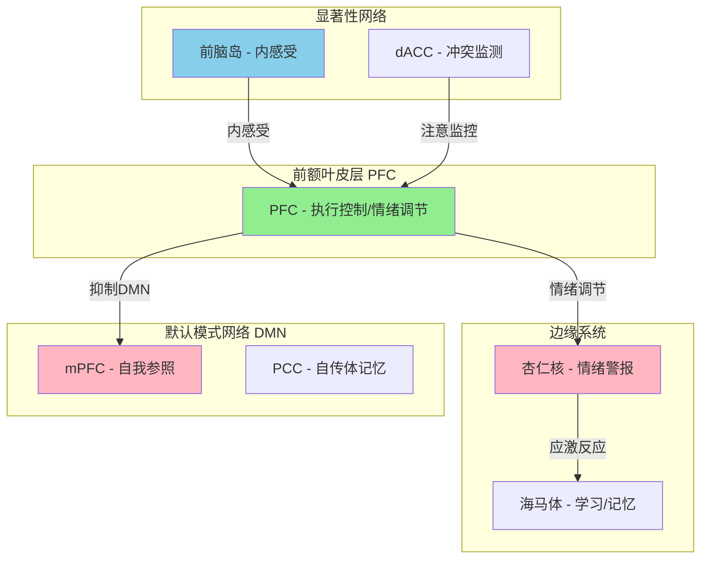

# Neuroscience & Meditation Crossroads | 神经科学与冥想交叉专题

> **版本**: v1.0
> **创建日期**: 2026-05-18
> **定位**: 整合跨支柱的神经科学与冥想研究内容，为智能体和研究者提供统一的导航地图

---

## 一、专题概述

本专题连接以下支柱中的神经科学与冥想交叉内容：

| 来源支柱 | 主要内容 | 文件位置 |
|----------|---------|----------|
| **01-智慧传承** | 瑜伽神经科学、禅宗神经科学、太极拳神经科学 | `yoga/anatomy-science/Yoga_Neuroscience_Modern_Research.md` · `religions/zen/Zen_Neuroscience_Psychology.md` · `tai-chi/Tai_Chi_Neuroscience_Evidence.md` |
| **02-心智心理** | 冥想神经科学机制、止观神经科学研究、曼荼罗神经科学、直接认知神经科学 | `meditation/foundations/overview/Meditation_Neuroscience_Mechanisms.md` · `meditation/traditions/buddhist/samatha-vipassana/Neuroscience_Research.md` · `meditation/techniques/mandala-meditation/Mandala_Meditation_Neuroscience.md` |
| **03-生命科学** | HPA轴神经科学、压力神经科学、性学神经科学 | `biology/hpa-axis/HPA_Axis_Neuroscience.md` · `sexuality/Sexuality_Neuroscience_Biology.md` |
| **04-人文艺术** | 阅读神经科学、戏剧疗法神经科学、书法疗愈神经科学 | `reading/Reading_Neuroscience.md` · `arts/drama-therapy/Drama_Therapy_Neuroscience.md` · `arts/calligraphy-therapy/Calligraphy_Neuroscience.md` |

---

## 二、核心文献地图

### 2.1 基础神经科学机制

| 文档 | 内容摘要 | 优先级 |
|------|---------|--------|
| [Meditation_Neuroscience_Mechanisms.md](../02-心智心理/冥想/基础/基础-总览-冥想神经科学Mechanisms.md) | 冥想神经机制全解：神经递质、脑波、网络连接、自主神经系统 | ⭐⭐⭐ |
| [Zen_Neuroscience_Psychology.md](../01-智慧传统/宗教/禅宗/禅宗神经科学心理学/禅宗-禅宗神经科学心理学.md) | 禅修的神经生物学架构、临床心理学整合模型 | ⭐⭐⭐ |
| [Yoga_Neuroscience_Modern_Research.md](../01-智慧传统/瑜伽/解剖科学/解剖科学-瑜伽神经科学现代研究.md) | 瑜伽神经科学研究：脑区变化、神经递质、临床证据 | ⭐⭐⭐ |
| [HPA_Axis_Neuroscience.md](../03-生命科学/生物学/HPA轴/HPA轴-HPA轴Axis神经科学.md) | HPA轴神经内分泌机制：应激反应、皮质醇节律 | ⭐⭐ |

### 2.2 冥想类型专项研究

| 文档 | 冥想类型 | 神经科学发现 |
|------|---------|-------------|
| [Neuroscience_Research.md](../02-心智心理/冥想/传统/佛教/止观/传统-佛教-止观-神经科学研究.md) | 止观（Samatha-Vipassana） | 南传佛教冥想的神经影像研究 |
| [Mandala_Meditation_Neuroscience.md](../02-心智心理/冥想/传统/藏传冥想/传统-佛教-藏传冥想-Mandala冥想神经科学.md) | 曼荼罗冥想 | 观想训练的神经机制 |
| [Meditation_Direct_Recognition_Neuroscience.md](../02-心智心理/冥想/传统/佛教/直接认知/传统-佛教-直接认知-Meditation_Direct_Recognition_Neuroscience.md) | 直接认知/直指 | 高阶冥想的神经特征 |
| Tai_Chi_Neuroscience_Evidence.md | 太极拳 | 运动冥想的脑影像与HRV证据 |

### 2.3 艺术与感知神经科学

| 文档 | 内容 | 跨支柱关联 |
|------|------|-----------|
| [Reading_Neuroscience.md](../04-人文艺术/阅读/阅读神经科学.md) | 阅读的神经机制 | 04人文→02心理学 |
| [Calligraphy_Neuroscience.md](../04-人文艺术/艺术/书法疗法/书法疗法-书法神经科学.md) | 书法疗愈的神经科学 | 04人文→01智慧（书道） |
| [Drama_Therapy_Neuroscience.md](../04-人文艺术/艺术/戏剧疗法/戏剧疗法-Drama疗法神经科学.md) | 戏剧疗愈神经机制 | 04人文→02心理学 |

---

## 三、核心概念框架

### 3.1 冥想神经解剖学地图

### 3.2 脑网络与冥想效应

| 脑网络 | 冥想前状态 | 冥想后状态 | 功能意义 |
|--------|-----------|-----------|---------|
| **DMN** | 过度活跃（反刍） | 显著抑制 | 减少自我中心思维 |
| **显著性网络** | 效率低 | 效率提升 | 更好筛选信息 |
| **执行控制网络** | 激活不足 | 强化 | 自我调节增强 |
| **前额叶-杏仁核连接** | 连接弱 | 功能连接增强 | 情绪"自上而下"调控 |

### 3.3 神经递质与冥想

| 递质 | 变化 | 心理效应 | 相关冥想类型 |
|------|------|---------|-------------|
| **GABA** | ↑27% | 焦虑减少 | 瑜伽、正念 |
| **血清素** | ↑ | 情绪稳定 | 内观、正念 |
| **多巴胺** | ↑65% | 内在奖赏 | 瑜伽尼德拉 |
| **皮质醇** | ↓ | 应激韧性 | 正念、慈心 |
| **催产素** | ↑ | 社会连接 | 慈心禅 |

---

## 四、跨支柱整合

### 4.1 01智慧传承 ↔ 02心智心理学

| 智慧传统 | 对应心理学 | 神经机制 |
|----------|-----------|----------|
| 止观双运 | MBCT正念认知疗法 | 前额叶-杏仁核连接增强 |
| 禅宗"不执著" | ACT接纳承诺疗法 | DMN抑制 |
| 瑜伽"回春" | 压力管理 | 皮质醇降低、BDNF增加 |
| 太极拳"身心合一" | 躯体疗法 | 岛叶激活、前庭觉整合 |
| 慈心禅 | 积极心理学 | 催产素增加、前额叶激活 |

### 4.2 02心智心理学 ↔ 03生命科学

| 心理学主题 | 神经科学基础 |
|------------|-------------|
| 压力与HPA轴 | 皮质醇节律紊乱→海马萎缩 |
| 抑郁与可塑性 | 前额叶灰质减少、神经发生受阻 |
| 焦虑与杏仁核 | 杏仁核过度激活、前额叶调控不足 |
| 正念与DMN | DMN解耦→抑郁症改善 |

---

## 五、Agent Skills 整合

本专题为以下 Agent Skills 提供神经科学支撑：

| 智能体技能 | 神经科学基础 |
|------------|-------------|
| [Stress_Assessment_Skill.md](../02-心智心理/心理学/压力与HPA轴/技能/压力与HPA轴-技能-压力评估Skill.md) | HPA轴神经科学、皮质醇节律 |
| [Cortisol_Management_Skill.md](../02-心智心理/心理学/压力与HPA轴/技能/压力与HPA轴-技能-皮质醇管理Skill.md) | 皮质醇神经内分泌机制 |
| [Relaxation_Techniques_Guide_Skill.md](../02-心智心理/心理学/压力与HPA轴/技能/压力与HPA轴-技能-放松技术指南Skill.md) | 副交感神经激活、HRV增加 |
| [Meditation_Brain_Science_Foundations.md](../02-心智心理/冥想/基础/基础-总览-冥想Brain科学基础.md) | 冥想神经机制全景图 |

---

## 六、关键研究引用

### 主要研究文献

| 研究 | 作者/团队 | 年份 | 关键发现 |
|------|----------|------|---------|
| 冥想增加皮层厚度 | Lazar | 2005 | 8周MBSR可见前额叶、岛叶皮层增厚 |
| 正念改变大脑结构 | Hölzel | 2011 | 海马、杏仁核、前扣带回灰质变化 |
| 藏传僧人γ波研究 | Lutz | 2004 | 长期冥想者γ波振幅是对照组25倍 |
| DMN与禅修 | Brewer | 2011 | 禅修时DMN内部连接显著减弱 |
| 太极拳HRV研究 | Wang | 2010 | 太极拳练习显著提高HRV |

### 证据等级说明

| 等级 | 定义 | 研究类型 |
|------|------|---------|
| **A** | 强证据 | RCT、元分析、大型纵向研究 |
| **B** | 中等证据 | 小型RCT、重复性观察研究 |
| **C** | 初步证据 | 案例研究、相关性研究 |

---

## 七、持续更新与维护

### 内容更新机制

- 每季度审查现有文档的神经科学研究更新
- 新增文献时更新对应表格和概念框架
- 与 `_meta/cross-references.md` 保持同步

### 扩展方向

| 方向 | 当前状态 | 计划 |
|------|---------|------|
| 神经反馈技术 | 缺失 | 添加神经反馈（EEG Biofeedback）专题 |
| 迷幻药与冥想 | 少量 | 扩展psilocybin/PSYPL研究内容 |
| AI与神经科学 | 缺失 | 探索AI辅助冥想神经科学研究 |

---

*本专题由 Peace Lab Database 维护，为智能体语料库和专业知识库提供神经科学-冥想交叉领域的统一入口。*