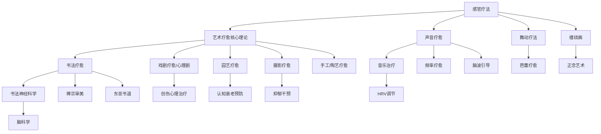

# 🎭 艺术疗愈生态主题地图 (Arts Therapy Ecosystem)

> 多模态艺术疗愈在五大支柱中的分布与关联网络。

---

## 知识图谱

## 节点索引

| 节点 | 文件位置 | 支柱 |
|------|---------|------|
| 艺术疗愈核心理论 | `04-Humanities-Arts/arts/arts-therapy/Art_Therapy_Overview.md` | 04 |
| 书法疗愈 | `04-Humanities-Arts/arts/calligraphy-therapy/Calligraphy_Therapy_Overview.md` | 04 |
| 书法神经科学 | `04-Humanities-Arts/arts/calligraphy-therapy/Calligraphy_Neuroscience.md` | 04 |
| 摄影疗愈 | `04-Humanities-Arts/arts/photography-therapy/Photography_Therapy_Overview.md` | 04 |
| 戏剧疗愈 | `04-Humanities-Arts/arts/drama-therapy/Drama_Therapy_Overview.md` | 04 |
| 园艺疗愈 | `04-Humanities-Arts/arts/horticultural-therapy/Horticultural_Therapy_Overview.md` | 04 |
| 手工/陶艺疗愈 | `04-Humanities-Arts/arts/craft-therapy/Craft_Therapy_Overview.md` | 04 |
| 芭蕾疗愈 | `04-Humanities-Arts/arts/ballet/Ballet_Therapy_Applications.md` | 04 |
| 音乐治疗 | `04-Humanities-Arts/media/music/` | 04 |
| 感官疗法 | `02-Mind-Psychology/therapy/sensory/` | 02 |
| 舞动疗法 | `02-Mind-Psychology/therapy/sensory/Sensory_Dance_Expressive.md` | 02 |
| 声音疗愈 | `02-Mind-Psychology/therapy/sensory/Sensory_Sound_Medicine.md` | 02 |
| 频率疗愈 | `02-Mind-Psychology/therapy/sensory/Sensory_Solfeggio_Frequencies.md` | 02 |
| 脑波引导 | `02-Mind-Psychology/therapy/sensory/Sensory_Brainwave_Entrainment.md` | 02 |
| 禅宗审美 | `01-Wisdom-Traditions/religions/zen/Zen_Aesthetics_Culture.md` | 01 |
| 东亚书道 | `01-Wisdom-Traditions/religions/wisdom-traditions/Wisdom_East_Asian_Calligraphy_Way.md` | 01 |
| 脑科学 | `03-Bio-Science/biology/brain/` | 03 |
| 认知衰老预防 | `03-Bio-Science/biology/aging-longevity/Cognitive_Aging_Prevention.md` | 03 |

## 相关学习路径

- [艺术疗愈路径](../learning-paths/Art_Healing_Path.md)
- [智慧老化路径](../learning-paths/Aging_Wisdom_Path.md)

---
*返回 [主题地图索引](../INDEX.md) | 返回根目录 [README.md](./)*
