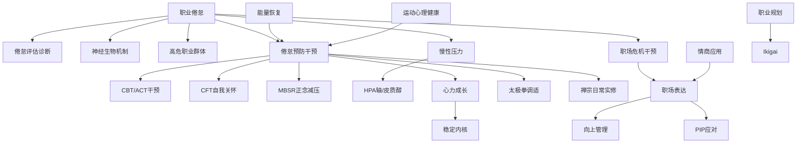

# 💼 职业心理生态主题地图 (Career Psychology Ecosystem)

> 职业压力-倦怠-恢复-成长相关知识的跨支柱关联网络。

---

## 知识图谱

## 节点索引

| 节点 | 文件位置 | 支柱 |
|------|---------|------|
| 职业倦怠 | `02-Mind-Psychology/psychology/applied/occupational-burnout/Occupational_Burnout_Overview.md` | 02 |
| 倦怠评估 | `02-Mind-Psychology/psychology/applied/occupational-burnout/Occupational_Burnout_Assessment_Diagnosis.md` | 02 |
| 倦怠预防 | `02-Mind-Psychology/psychology/applied/occupational-burnout/Occupational_Burnout_Prevention_Intervention.md` | 02 |
| 职场危机 | `02-Mind-Psychology/psychology/applied/workplace-psychological-crisis/` | 02 |
| MBSR 正念减压 | `02-Mind-Psychology/meditation/mbsr-program/MBSR_Program_Overview.md` | 02 |
| 慢性压力 | `02-Mind-Psychology/psychology/stress-hpa/chronic-stress/` | 02 |
| 太极拳调适 | `01-Wisdom-Traditions/tai-chi/Tai_Chi_Psychological_Adjustment_Mechanism.md` | 01 |
| 禅宗实修 | `01-Wisdom-Traditions/religions/zen/Zen_Daily_Life_Practice.md` | 01 |
| 能量恢复 | `03-Bio-Science/biology/energy-restoration/Energy_Restoration_Overview.md` | 03 |
| 运动心理 | `03-Bio-Science/biology/exercise-science/Exercise_Mental_Health.md` | 03 |
| 职场表达 | `05-Praxis-Growth/personal-development/workplace-expression/` | 05 |
| 心力成长 | `05-Praxis-Growth/personal-development/mental-resilience/Mental_Resilience_Overview.md` | 05 |
| 稳定内核 | `05-Praxis-Growth/personal-development/stable-inner-core/Stable_Inner_Core_Overview.md` | 05 |
| 情商应用 | `05-Praxis-Growth/personal-development/emotional-intelligence/EI_Overview.md` | 05 |
| 职业规划 | `05-Praxis-Growth/personal-development/career-planning/Career_Ikigai.md` | 05 |

## 相关学习路径

- [职业身心健康路径](../learning-paths/Career_Wellbeing_Path.md)
- [压力韧性路径](../learning-paths/Stress_Resilience_Path.md)

---
*返回 [主题地图索引](../INDEX.md) | 返回根目录 [README.md](../../README.md)*
