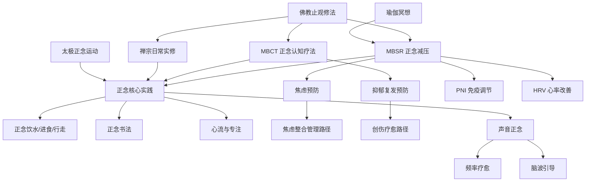

# 🧘 正念生态主题地图 (Mindfulness Ecosystem)

> 正念相关知识在五大支柱中的分布与关联网络。

---

## 知识图谱

## 节点索引

| 节点 | 文件位置 | 支柱 |
|------|---------|------|
| 佛教止观修法 | `01-智慧传统/religions/buddhism/meditation/Buddhism_Samatha_Vipassana.md` | 01 |
| MBSR 正念减压 | `02-心智心理/meditation/clinical/mbsr-program/MBSR_Program_Overview.md` | 02 |
| MBCT 正念认知疗法 | `02-心智心理/therapy/integrative/mbct-therapy/MBCT_Mindfulness_Based_Cognitive_Therapy_Overview.md` | 02 |
| 正念核心实践 | `05-实践成长/personal-development/mindfulness/Mindfulness_Core.md` | 05 |
| 正念饮水 | `05-实践成长/personal-development/mindfulness/mindful-daily-living/Mindful_Drinking_Practice.md` | 05 |
| 正念书法 | `04-人文艺术/arts/calligraphy-therapy/Calligraphy_Practice_Guide.md` | 04 |
| 禅宗日常实修 | `01-智慧传统/religions/zen/Zen_Daily_Life_Practice.md` | 01 |
| 瑜伽冥想 | `01-智慧传统/yoga/meditation-consciousness/Yoga_Meditation_Dharana_Dhyana.md` | 01 |
| 太极正念运动 | `01-智慧传统/tai-chi/Tai_Chi_Psychological_Adjustment_Mechanism.md` | 01 |
| PNI 免疫调节 | `03-生命科学/biology/immune-inflammation/Psychoneuroimmunology.md` | 03 |
| HRV 心率改善 | `03-生命科学/biology/cardiovascular/Heart_Rate_Variability.md` | 03 |
| 心流与专注 | `05-实践成长/personal-development/flow/Flow_State_Core.md` | 05 |
| 声音正念 | `02-心智心理/therapy/sensory-nature/sensory/Sensory_Sound_Medicine.md` | 02 |
| 频率疗愈 | `02-心智心理/therapy/sensory-nature/sensory/Sensory_Solfeggio_Frequencies.md` | 02 |
| 脑波引导 | `02-心智心理/therapy/sensory-nature/sensory/Sensory_Brainwave_Entrainment.md` | 02 |

## 相关学习路径

- [焦虑整合管理路径](../../06-临床专题/焦虑/学习路径-焦虑整合Path.md)
- [压力韧性路径](../学习路径/压力韧性Path.md)
- [身心整合路径](../学习路径/Body_Mind_Integration_Path.md)

---
*返回 [主题地图索引](../INDEX.md) | 返回根目录 [README.md](.)*
