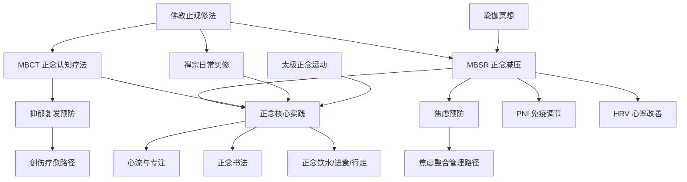

# 🧘 正念生态主题地图 (Mindfulness Ecosystem)

> 正念相关知识在五大支柱中的分布与关联网络。

---

## 知识图谱

## 节点索引

| 节点 | 文件位置 | 支柱 |
|------|---------|------|
| 佛教止观修法 | `01-Wisdom-Traditions/religions/buddhism/Buddhism_Samatha_Vipassana.md` | 01 |
| MBSR 正念减压 | `02-Mind-Psychology/meditation/mbsr-program/MBSR_Program_Overview.md` | 02 |
| MBCT 正念认知疗法 | `02-Mind-Psychology/therapy/mbct-therapy/MBCT_Mindfulness_Based_Cognitive_Therapy_Overview.md` | 02 |
| 正念核心实践 | `05-Praxis-Growth/personal-development/mindfulness/Mindfulness_Core.md` | 05 |
| 正念饮水 | `05-Praxis-Growth/personal-development/mindfulness/mindful-daily-living/Mindful_Drinking_Practice.md` | 05 |
| 正念书法 | `04-Humanities-Arts/arts/calligraphy-therapy/Calligraphy_Practice_Guide.md` | 04 |
| 禅宗日常实修 | `01-Wisdom-Traditions/religions/zen/Zen_Daily_Life_Practice.md` | 01 |
| 瑜伽冥想 | `01-Wisdom-Traditions/yoga/Yoga_Meditation_Dharana_Dhyana.md` | 01 |
| 太极正念运动 | `01-Wisdom-Traditions/tai-chi/Tai_Chi_Psychological_Adjustment_Mechanism.md` | 01 |
| PNI 免疫调节 | `03-Bio-Science/biology/immune-inflammation/Psychoneuroimmunology.md` | 03 |
| HRV 心率改善 | `03-Bio-Science/biology/cardiovascular/Heart_Rate_Variability.md` | 03 |
| 心流与专注 | `05-Praxis-Growth/personal-development/flow/Flow_State_Core.md` | 05 |

## 相关学习路径

- [焦虑整合管理路径](../learning-paths/Anxiety_Integration_Path.md)
- [压力韧性路径](../learning-paths/Stress_Resilience_Path.md)
- [身心整合路径](../learning-paths/Body_Mind_Integration_Path.md)

---
*返回 [主题地图索引](../INDEX.md) | 返回根目录 [README.md](../../README.md)*
