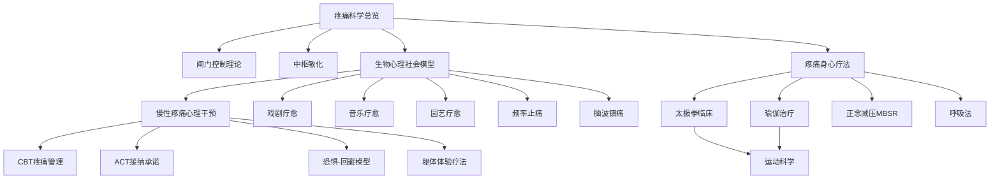

# 🔥 疼痛疗愈生态主题地图 (Pain Healing Ecosystem)

> 疼痛管理相关知识在五大支柱中的分布与关联网络。

---

## 知识图谱

## 节点索引

| 节点 | 文件位置 | 支柱 |
|------|---------|------|
| 疼痛科学总览 | `03-生命科学/biology/pain-science/Pain_Science_Overview.md` | 03 |
| 慢性疼痛心理干预 | `03-生命科学/biology/pain-science/Pain_Psychology_Intervention.md` | 03 |
| 疼痛身心疗法 | `03-生命科学/biology/pain-science/Pain_Mind_Body_Approaches.md` | 03 |
| 太极拳临床 | `01-智慧传统/tai-chi/Tai_Chi_Clinical_Applications.md` | 01 |
| 瑜伽治疗 | `01-智慧传统/yoga/therapy-clinical/Yoga_Therapy.md` | 01 |
| MBSR 正念减压 | `02-心智心理/meditation/clinical/mbsr-program/MBSR_Program_Overview.md` | 02 |
| ACT 接纳承诺 | `02-心智心理/疗法/认知行为/接纳承诺疗法/` | 02 |
| 躯体体验疗法 | `02-心智心理/心理学/躯体身心/躯体/` | 02 |
| 运动科学 | `03-生命科学/biology/exercise-science/Exercise_Science_Overview.md` | 03 |
| 戏剧疗愈 | `04-人文艺术/arts/drama-therapy/Drama_Therapy_Overview.md` | 04 |
| 音乐疗愈 | `04-人文艺术/媒体/音乐/` | 04 |
| 园艺疗愈 | `04-人文艺术/arts/horticultural-therapy/Horticultural_Therapy_Overview.md` | 04 |
| 频率止痛 (Solfeggio 174Hz) | `02-心智心理/therapy/sensory-nature/sensory/Sensory_Solfeggio_Frequencies.md` | 02 |
| 脑波镇痛 (Alpha-Delta) | `02-心智心理/therapy/sensory-nature/sensory/Sensory_Brainwave_Entrainment.md` | 02 |

## 相关学习路径

- [疼痛管理路径](../学习路径/Pain_Management_Path.md)
- [身心整合路径](../学习路径/Body_Mind_Integration_Path.md)

---
*返回 [主题地图索引](../INDEX.md) | 返回根目录 [README.md](.)*
