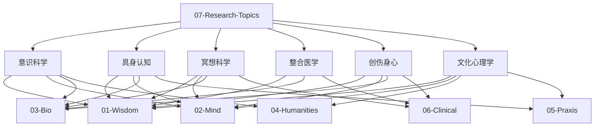

# 跨领域课题研究图谱

> Mermaid 格式的跨领域研究知识网络，展示六大课题与五大支柱的交叉关系。

```mermaid
graph TB
    RT[07-Research-Topics]

    CS[意识科学]
    EC[具身认知]
    CSc[冥想科学]
    IM[整合医学]
    TBM[创伤身心]
    CP[文化心理学]

    RT --> CS
    RT --> EC
    RT --> CSc
    RT --> IM
    RT --> TBM
    RT --> CP

    W[01-Wisdom]
    M[02-Mind]
    B[03-Bio]
    H[04-Humanities]
    P[05-Praxis]
    CT[06-Clinical]

    CS --> W
    CS --> M
    CS --> B
    CS --> H

    EC --> W
    EC --> M
    EC --> B
    EC --> P

    CSc --> W
    CSc --> M
    CSc --> B
    CSc --> CT

    IM --> W
    IM --> B
    IM --> CT

    TBM --> W
    TBM --> M
    TBM --> B
    TBM --> CT

    CP --> W
    CP --> M
    CP --> H
    CP --> P
```

---
*返回 [07-Research-Topics](../07-Research-Topics/INDEX.md) | [主题地图索引](../INDEX.md)*
