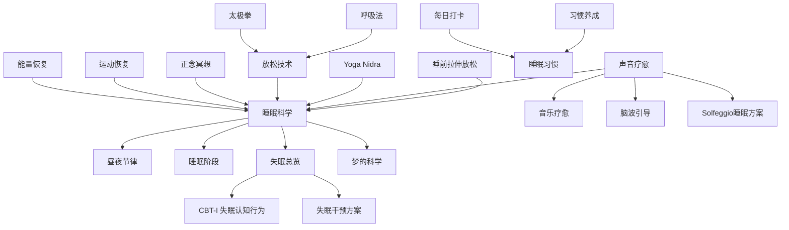

# 🌙 睡眠恢复生态主题地图 (Sleep Restoration Ecosystem)

> 睡眠-恢复-放松相关知识在五大支柱中的分布与关联网络。

---

## 知识图谱

## 节点索引

| 节点 | 文件位置 | 支柱 |
|------|---------|------|
| 睡眠科学 | `02-Mind-Psychology/psychology/somatic-body/sleep/Bio_Sleep_Science.md` | 02 |
| 失眠总览 | `02-Mind-Psychology/psychology/somatic-body/sleep/Sleep_Insomnia_Overview.md` | 02 |
| CBT-I | `02-Mind-Psychology/psychology/somatic-body/sleep/Sleep_Insomnia_CBT.md` | 02 |
| 梦的科学 | `02-Mind-Psychology/psychology/somatic-body/sleep/Bio_Sleep_Dreams.md` | 02 |
| 睡前拉伸 | `03-Bio-Science/biology/pre-sleep-stretching/Pre_Sleep_Stretching_Overview.md` | 03 |
| 运动恢复 | `03-Bio-Science/biology/exercise-science/Recovery_Regeneration.md` | 03 |
| 能量恢复 | `03-Bio-Science/biology/energy-restoration/Energy_Restoration_Overview.md` | 03 |
| 呼吸法 | `03-Bio-Science/biology/breathwork/` | 03 |
| Yoga Nidra | `01-Wisdom-Traditions/yoga/Yoga_Nidra.md` | 01 |
| 放松技术 | `02-Mind-Psychology/psychology/somatic-body/relaxation/` | 02 |
| 声音疗愈 | `02-Mind-Psychology/therapy/sensory/Sensory_Sound_Medicine.md` | 02 |
| 脑波引导 | `02-Mind-Psychology/therapy/sensory/Sensory_Brainwave_Entrainment.md` | 02 |
| Solfeggio睡眠方案 | `02-Mind-Psychology/therapy/sensory/Sensory_Solfeggio_Frequencies.md` | 02 |
| 音乐疗愈 | `04-Humanities-Arts/media/music/` | 04 |
| 习惯养成 | `05-Praxis-Growth/personal-development/topics/Personal_Development_Habit_Science.md` | 05 |
| 每日打卡 | `05-Praxis-Growth/personal-development/daily-checkin/Daily_Checkin_Systems.md` | 05 |
| 正念冥想 | `05-Praxis-Growth/personal-development/mindfulness/Mindfulness_Core.md` | 05 |

## 相关学习路径

- [睡眠优化路径](../learning-paths/Sleep_Optimization_Path.md)
- [压力韧性路径](../learning-paths/Stress_Resilience_Path.md)

---
*返回 [主题地图索引](../INDEX.md) | 返回根目录 [README.md](./)*
