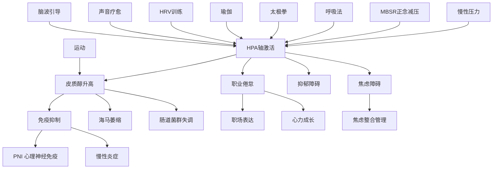

# ⚡ 压力生态主题地图 (Stress HPA Ecosystem)

> 压力-HPA轴-免疫-调节相关知识的跨支柱关联网络。

---

## 知识图谱

## 节点索引

| 节点 | 文件位置 | 支柱 |
|------|---------|------|
| 慢性压力 | `02-Mind-Psychology/psychology/stress-hpa/chronic-stress/` | 02 |
| 皮质醇 | `02-Mind-Psychology/psychology/stress-hpa/cortisol/` | 02 |
| HPA轴 | `03-Bio-Science/biology/hpa-axis/` | 03 |
| PNI 心理神经免疫 | `03-Bio-Science/biology/immune-inflammation/Psychoneuroimmunology.md` | 03 |
| 慢性炎症 | `03-Bio-Science/biology/immune-inflammation/Chronic_Inflammation.md` | 03 |
| 肠道菌群 | `03-Bio-Science/biology/gut-microbiome/Gut_Brain_Axis.md` | 03 |
| MBSR 正念减压 | `02-Mind-Psychology/meditation/clinical/mbsr-program/MBSR_Program_Overview.md` | 02 |
| 呼吸法 | `03-Bio-Science/biology/breathwork/` | 03 |
| 太极拳 | `01-Wisdom-Traditions/tai-chi/Tai_Chi_Psychological_Adjustment_Mechanism.md` | 01 |
| 瑜伽 | `01-Wisdom-Traditions/yoga/therapy-clinical/Yoga_Mental_Health_Clinical.md` | 01 |
| 运动 | `03-Bio-Science/biology/exercise-science/Exercise_Mental_Health.md` | 03 |
| HRV训练 | `03-Bio-Science/biology/cardiovascular/Heart_Rate_Variability.md` | 03 |
| 焦虑障碍 | `02-Mind-Psychology/psychology/clinical/anxiety/` | 02 |
| 抑郁障碍 | `02-Mind-Psychology/psychology/clinical/depression/` | 02 |
| 职业倦怠 | `02-Mind-Psychology/psychology/applied/occupational-burnout/` | 02 |
| 心力成长 | `05-Praxis-Growth/personal-development/mental-resilience/Mental_Resilience_Overview.md` | 05 |
| 声音疗愈 | `02-Mind-Psychology/therapy/sensory-nature/sensory/Sensory_Sound_Medicine.md` | 02 |
| 脑波引导 | `02-Mind-Psychology/therapy/sensory-nature/sensory/Sensory_Brainwave_Entrainment.md` | 02 |

## 相关学习路径

- [压力韧性路径](../learning-paths/Stress_Resilience_Path.md)
- [焦虑整合管理路径](../learning-paths/Anxiety_Integration_Path.md)
- [职业身心健康路径](../learning-paths/Career_Wellbeing_Path.md)

---
*返回 [主题地图索引](../INDEX.md) | 返回根目录 [README.md](./)*
