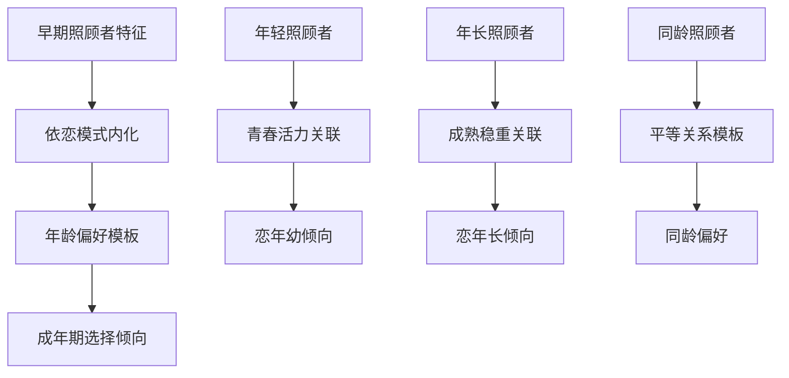
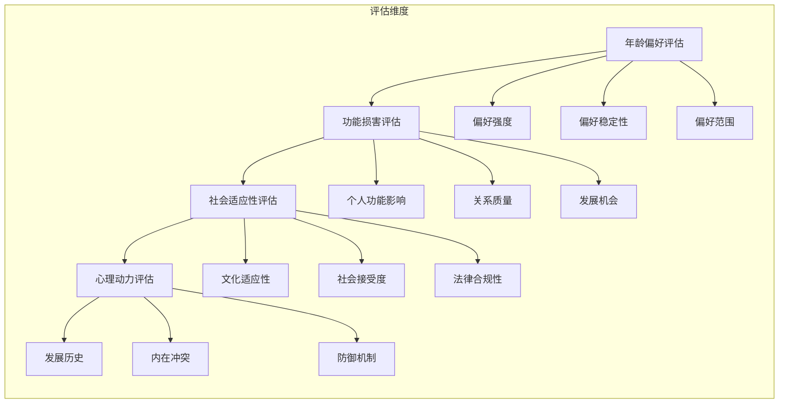

# 年龄差异吸引情结 (Age Difference Attraction Complex)

> 📘 **文档导航**: 本专题深入探讨年龄相关吸引的心理机制、社会文化因素和临床处理策略。相关主题请参考：
> - [权威情结概览](Authority_Complex_Overview.md) - 整体理论框架
> - [恋父恋母情结](Father_Mother_Complex.md) - 家庭权威吸引
> - [恋师恋教练情结](Teacher_Coach_Complex.md) - 教育环境中的年龄吸引
> - [权威恐惧情结](Authority_Fear_Complex.md) - 年龄相关的恐惧反应
> - [临床整合指南](Clinical_Assessment_Treatment.md) - 评估与治疗方法
> - [参考文献与资源](Authority_Complex_References.md) - 学术支撑材料

## 核心概念与分类体系 (Core Concepts and Classification System)

### 年龄吸引障碍定义 (Age Attraction Disorder Definition)
**临床定义**: 个体对特定年龄段人群产生持续性、强烈的性或情感吸引，这种吸引模式超出了社会文化认可的正常变异范围，并可能对个人功能或他人福祉造成负面影响。

**诊断关键要素**:
- **持续性**: 吸引模式稳定持续至少6个月
- **强度性**: 吸引强度显著超出一般偏好水平
- **功能影响**: 对个人社会功能或他人造成实际损害
- **社会偏离**: 超出特定文化背景下的社会接受范围

### 分类维度与类型 (Classification Dimensions and Types)

#### 按吸引方向分类
| 吸引方向 | 核心特征 | 典型表现 | 发展关联 |
| :--- | :--- | :--- | :--- |
| **恋年长倾向** | 偏好明显年长的伴侣 | 寻找成熟稳重的对象、崇拜年长异性 | 可能源于对安全感和指导的需求 |
| **恋年幼倾向** | 偏好明显年轻的伴侣 | 被青春活力吸引、喜欢照顾他人 | 可能反映对纯真或控制的需求 |
| **年龄范围狭窄** | 严格限定特定年龄段 | 只对某个年龄区间感兴趣 | 可能表明发展固着或创伤影响 |
| **年龄范围宽泛** | 可接受较大年龄跨度 | 对不同年龄段都有吸引力 | 通常属于正常变异范围 |

#### 按功能性质分类
| 功能性质 | 心理机制 | 适应性水平 | 临床关注点 |
| :--- | :--- | :--- | :--- |
| **适应性偏好** | 健康的发展性选择 | 高适应性 | 无需特殊干预 |
| **轻度固着** | 发展性延迟但可调整 | 中等适应性 | 需要引导和支持 |
| **病理性固着** | 发展创伤或异常强化 | 低适应性 | 需要专业治疗 |
| **强迫性模式** | 冲动控制困难 | 极低适应性 | 需要医疗干预 |

## 发展心理学机制 (Developmental Psychology Mechanisms)

### 关键发展期分析 (Critical Developmental Periods Analysis)

#### 早期依恋期影响 (0-3岁 Early Attachment Period Impact)
**核心机制**: 早期照顾者的年龄特征影响后续年龄偏好模式的形成

**影响路径**:


**神经生物学基础**:
- **镜像神经元系统**: 通过观察学习内化年龄相关的行为模式
- **奖励系统激活**: 特定年龄照顾者的互动激活多巴胺回路
- **依恋记忆编码**: 早期依恋体验形成稳定的神经回路模式

#### 青春期身份探索期 (12-18岁 Identity Exploration Period)
**心理发展任务**:
- **同伴关系建立**: 通过同龄人互动发展社交技能
- **异性交往学习**: 探索不同年龄段异性的交往模式
- **身份认同整合**: 整合早期经验形成稳定的择偶偏好

**关键影响因素**:
| 发展因素 | 影响机制 | 长期效应 |
| :--- | :--- | :--- |
| **同伴群体构成** | 同龄人年龄分布影响社交经验 | 塑造年龄偏好的社会规范 |
| **家庭关系模式** | 父母年龄差异影响期待模式 | 内化家庭中的年龄关系模板 |
| **媒体文化影响** | 大众传媒中的年龄配对模式 | 形成社会文化层面的偏好标准 |

### 心理动力学机制 (Psychodynamic Mechanisms)

#### 无意识驱动力分析
**核心冲突结构**:
```
恋年长倾向的心理动力:
• 安全需求: 寻求年长者的保护和指导
• 权威认同: 通过与权威结合获得力量感
• 补偿机制: 弥补早期权威缺失的体验

恋年幼倾向的心理动力:
• 控制需求: 通过年幼对象获得主导地位
• 纯真向往: 回归早期无忧无虑的状态
• 保护欲望: 满足照顾他人的内在需求
```

#### 防御机制运用
| 防御机制 | 在年龄吸引中的表现 | 心理功能 | 潜在风险 |
| :--- | :--- | :--- | :--- |
| **理想化** | 将特定年龄段极端美化 | 减少焦虑，增强吸引力 | 可能忽视现实问题 |
| **投射** | 认为对方也有相同偏好 | 合理化自己的选择 | 可能导致误解和边界侵犯 |
| **退行** | 回到早期发展阶段的心理状态 | 获得安全感和舒适感 | 可能阻碍成熟关系发展 |
| **升华** | 将年龄吸引转化为创作动力 | 建设性地表达内在体验 | 健康的心理调节机制 |

## 社会文化因素分析 (Socio-Cultural Factor Analysis)

### 文化差异与年龄偏好 (Cultural Differences and Age Preferences)

#### 东西方文化对比
| 文化维度 | 东方文化特征 | 西方文化特征 | 对年龄偏好的影响 |
| :--- | :--- | :--- | :--- |
| **年龄观念** | 尊重年长者，重视经验智慧 | 崇尚年轻活力，追求新鲜感 | 东方更接受年长差异，西方更接受年轻差异 |
| **婚姻观念** | 注重门当户对，年龄匹配 | 强调个人选择，情感优先 | 影响社会对年龄差异的接受度标准 |
| **性别期待** | 男性年长被视为正常，女性年长受质疑 | 双向接受度相对均衡 | 造成不同性别在年龄偏好上的社会压力差异 |

#### 代际文化变迁
**历史发展趋势**:
```
传统社会(50年前):
• 年龄差异接受度较低
• 社会规范严格约束
• 家庭安排主导婚配

现代社会(当代):
• 年龄差异接受度提高
• 个人选择空间扩大
• 多元化关系模式涌现

未来趋势(预测):
• 年龄概念进一步模糊
• 以心理成熟度而非生理年龄为准
• 更加个性化的年龄偏好模式
```

### 媒体影响与社会建构 (Media Influence and Social Construction)

#### 大众传媒的角色
**强化机制**:
- **浪漫化呈现**: 媒体作品中美化的年龄差异关系
- **成功案例展示**: 高调年龄差异情侣的正面报道
- **消费文化推动**: 商业营销对特定年龄组合的推崇

**影响效果评估**:
| 媒体类型 | 影响方式 | 心理效应 | 社会后果 |
| :--- | :--- | :--- | :--- |
| **影视作品** | 情节渲染和角色塑造 | 强化特定年龄偏好模式 | 影响现实期望和选择标准 |
| **社交媒体** | 网红效应和潮流传播 | 加速年龄偏好的流行化 | 造成跟风现象和社会压力 |
| **广告营销** | 情感诉求和价值绑定 | 将年龄差异与特定品质关联 | 塑造消费文化和身份认同 |

#### 社会建构理论视角
**年龄意义的社会生产**:
```
1. 符号意义赋予
   • 年龄被赋予特定的社会符号价值
   • 不同年龄段代表不同的社会资本
   • 年龄差异成为身份表达的载体

2. 权力关系体现
   • 年龄差异反映社会权力结构
   • 通过年龄关系维护或挑战既有秩序
   • 年龄成为社会控制和反抗的工具

3. 文化资本积累
   • 特定年龄组合被视为拥有文化品味
   • 年龄差异成为社会地位的标识
   • 通过年龄选择展示个人价值观
```

## 临床评估与诊断 (Clinical Assessment and Diagnosis)

### 评估框架体系 (Assessment Framework System)

#### 多维度评估模型


#### 标准化评估工具

##### 年龄偏好评估量表 (Age Preference Assessment Scale)
| 评估维度 | 测评项目 | 评分标准 | 临床意义 |
| :--- | :--- | :--- | :--- |
| **偏好强度** | "我对特定年龄段人群的吸引程度" | 1-10级强度评定 | 判断吸引的活跃程度 |
| **偏好稳定性** | "这种偏好持续的时间长度" | 持续时间分级评估 | 区分暂时偏好与固着模式 |
| **功能影响** | "年龄偏好对我生活的影响程度" | 功能损害程度评定 | 确定临床显著性标准 |
| **社会适应** | "我的选择是否符合社会规范" | 社会接受度评估 | 判断社会文化适宜性 |

##### 发展历史访谈指南 (Developmental History Interview Guide)
**关键访谈主题**:

1. **早期经历探索**
   ```
   • "童年时期与不同年龄段成年人的互动经历"
   • "早期照顾者的年龄特征和照顾方式"
   • "关键发展期的重要关系体验"
   ```

2. **偏好发展轨迹**
   ```
   • "年龄偏好的首次出现时间和情境"
   • "偏好模式的变化和发展过程"
   • "重要转折点和影响因素"
   ```

3. **社会文化影响**
   ```
   • "家庭和社会对年龄差异的态度"
   • "媒体和文化作品的影响体验"
   • "同伴群体的年龄构成和影响"
   ```

### 诊断标准与鉴别 (Diagnostic Criteria and Differentiation)

#### DSM-5相关诊断类别
| 诊断类别 | 诊断要点 | 与年龄吸引的关系 | 鉴别要点 |
| :--- | :--- | :--- | :--- |
| **其他特定的性偏好障碍** | 持续的性吸引模式造成痛苦或损害 | 可能包含年龄偏好异常 | 需要功能损害标准 |
| **依恋障碍** | 早期依恋关系异常 | 可能影响年龄偏好形成 | 重点关注早期发展史 |
| **人格障碍** | 持续的行为模式异常 | 可能表现为固定的年龄偏好 | 需要全面的人格评估 |
| **适应障碍** | 对生活变化的异常反应 | 可能暂时改变年龄偏好 | 通常是短期和情境性的 |

#### 正常变异与病理状态区分
| 区分维度 | 正常变异特征 | 病理状态特征 | 评估方法 |
| :--- | :--- | :--- | :--- |
| **灵活性** | 能够适应不同年龄段 | 固定于特定年龄段 | 行为观察和访谈 |
| **功能影响** | 不影响正常社会功能 | 造成显著功能损害 | 功能评估量表 |
| **痛苦程度** | 无明显主观痛苦 | 伴有显著心理痛苦 | 痛苦量表评估 |
| **现实检验** | 保持良好的现实检验能力 | 现实检验受损 | 临床观察和测试 |

## 神经生物学机制 (Neurobiological Mechanisms)

### 大脑结构与功能关联 (Brain Structure and Function Correlations)

#### 关键脑区激活模式
**神经影像学发现**:
```python
# 年龄偏好相关的脑区激活模式
class AgePreferenceNeuralCorrelates:
    def __init__(self):
        self.key_regions = {
            '腹侧纹状体': '奖励处理和动机驱动',
            '前扣带回': '冲突监测和决策制定',
            '颞叶皮层': '面孔识别和社会认知',
            '杏仁核': '情绪处理和威胁检测'
        }
    
    def analyze_activation_patterns(self, age_preferences):
        """
        分析不同年龄偏好类型的脑区激活模式
        """
        patterns = {}
        for preference_type, brain_data in age_preferences.items():
            patterns[preference_type] = self.identify_neural_signature(brain_data)
        return patterns
```

#### 神经递质系统影响
| 系统 | 功能作用 | 与年龄偏好的关系 | 调节机制 |
| :--- | :--- | :--- | :--- |
| **多巴胺系统** | 奖励和动机 | 年龄相关刺激的奖励价值评估 | 通过预期和实际体验调节 |
| **血清素系统** | 情绪调节 | 影响年龄偏好的稳定性和灵活性 | 压力和创伤可能造成紊乱 |
| **催产素系统** | 社会联结 | 促进对特定年龄段的安全感 | 通过积极互动增强分泌 |
| **性激素系统** | 性吸引调节 | 影响年龄偏好的性吸引力成分 | 青春期和成年期变化显著 |

### 遗传与环境交互作用 (Gene-Environment Interactions)

#### 遗传易感性因素
**候选基因研究**:
- **DRD4基因**: 多巴胺受体基因变异与新奇寻求行为相关
- **COMT基因**: 儿茶酚-O-甲基转移酶基因影响认知灵活性
- **OXTR基因**: 催产素受体基因与社会行为倾向相关

#### 环境调节因素
| 环境因素 | 调节机制 | 对年龄偏好的影响 |
| :--- | :--- | :--- |
| **早期养育质量** | 影响依恋系统发展 | 塑造基本的人际关系模板 |
| **同伴群体构成** | 提供社会学习机会 | 影响年龄偏好的社会化过程 |
| **文化价值观念** | 提供社会规范框架 | 界定可接受的年龄偏好范围 |
| **生活压力事件** | 可能触发防御性回归 | 暂时改变年龄选择模式 |

## 治疗干预策略 (Treatment Intervention Strategies)

### 认知行为治疗方法 (Cognitive-Behavioral Approaches)

#### 认知重构技术
**核心认知偏差识别**:
```
常见适应不良认知:
• "只有特定年龄段的人才能理解我"
• "年龄差异决定了关系的质量"
• "我无法改变对年龄的偏好"
• "社会偏见让我必须隐藏真实想法"

重构策略:
1. 证据检验法: 收集反驳这些信念的具体证据
2. 替代思维训练: 发展更加平衡和现实的认知
3. 行为实验设计: 通过实际行动验证新的认知假设
```

#### 暴露与反应预防
**治疗技术实施**:
```
第一阶段: 认知准备
• 识别和挑战适应不良认知
• 建立治疗动机和合作同盟
• 制定个性化的暴露等级

第二阶段: 渐进暴露
• 从低焦虑情境开始逐步接触
• 练习新的应对技能和认知模式
• 监控和调整暴露强度

第三阶段: 巩固维持
• 强化学习到的新模式
• 制定复发预防计划
• 建立长期支持系统
```

### 心理动力学治疗方法 (Psychodynamic Approaches)

#### 精神分析技术应用
**核心技术要素**:
1. **自由联想分析**
   ```
   治疗师: "请告诉我任何想到的关于年龄差异的想法"
   来访者: "我想到了小时候的邻居阿姨，她总是很照顾我..."
   分析焦点: 探索早期照顾者年龄特征的影响
   ```

2. **梦境解析技术**
   - 分析年龄相关元素在梦中的象征意义
   - 探索无意识冲突的表达方式
   - 理解内心愿望和恐惧的转换机制

3. **移情分析工作**
   ```mermaid
   flowchart TD
       A[年龄相关移情] --> B[早期关系重现]
       B --> C[无意识冲突激活]
       C --> D[防御机制识别]
       D --> E[洞察获得]
       E --> F[模式改变]
   ```

#### 客体关系治疗策略
**治疗目标**: 修复早期客体关系创伤，建立健康的人际模式

**核心技术应用**:
- **矫正性情感体验**: 在治疗关系中提供安全的年龄多元化体验
- **内化健康客体**: 帮助来访者内化不同年龄段的积极品质
- **关系模式重构**: 识别和改变适应不良的年龄偏好模式

### 依恋聚焦治疗方法 (Attachment-Focused Approaches)

#### 情感聚焦治疗 (Emotionally Focused Therapy)
**治疗原理**: 通过修复依恋创伤促进情感调节能力发展

**核心干预阶段**:
```
第一阶段: 评估和去活化
• 识别不安全的依恋模式
• 处理相关的创伤记忆
• 建立治疗联盟和安全感

第二阶段: 重塑和整合
• 创造安全的情感体验
• 发展新的互动模式
• 整合不同年龄段的积极体验

第三阶段: 巩固和迁移
• 强化新的依恋模式
• 练习在现实关系中的应用
• 建立长期的自我支持能力
```

#### 内在家庭系统治疗 (Internal Family Systems Therapy)
**理论基础**: 每个人内心都有多个子人格，需要和谐整合

**治疗过程框架**:
```
1. 识别内在的年龄相关部分
   • "年轻的部分" - 代表纯真和活力需求
   • "年长的部分" - 代表智慧和安全感需求
   • "批判的部分" - 对年龄偏好的道德评判

2. 理解各部分的积极意图
   • 每个部分都在试图保护或满足某种需求
   • 识别各部分之间的冲突和联盟

3. 促进内在系统的和谐对话
   • 帮助不同部分相互理解和合作
   • 整合各部分的经验和智慧

4. 发展Self领导能力
   • 培养观察和协调内在系统的技能
   • 建立更加平衡和灵活的年龄偏好模式
```

### 系统性干预方法 (Systemic Intervention Methods)

#### 家庭系统治疗
**干预重点**: 调整家庭内的年龄关系模式

**核心技术应用**:
- **家庭雕塑技术**: 通过身体位置展现家庭中的年龄权力结构
- **代际传递分析**: 识别年龄偏好模式的家族传承路径
- **沟通模式改善**: 发展家庭成员间关于年龄差异的健康对话

#### 团体治疗方法
**团体设置优势**:
- **多元年龄构成**: 提供不同年龄段的积极互动体验
- **同伴支持网络**: 获得理解和共鸣的社会支持
- **技能练习机会**: 在安全环境中练习新的交往模式

## 预防与促进策略 (Prevention and Promotion Strategies)

### 发展性预防措施 (Developmental Prevention Measures)

#### 儿童期干预策略
**关键预防要素**:
```
1. 多元化依恋体验
   • 接触不同年龄段的照顾者
   • 参与跨年龄的社交活动
   • 培养对不同年龄群体的理解和尊重

2. 健康的媒体素养教育
   • 批判性分析媒体中的年龄呈现
   • 理解商业化对年龄偏好的影响
   • 发展独立的价值判断能力

3. 情感教育和社交技能
   • 学习健康的人际关系模式
   • 发展适当的情感表达和调节技能
   • 培养同理心和换位思考能力
```

#### 青少年期指导策略
**发展支持重点**:
- **身份认同整合**: 帮助青少年整合不同的年龄相关经验
- **价值观澄清**: 引导形成基于内在价值而非外在标准的择偶观
- **边界意识培养**: 发展健康的人际边界和自我保护能力

### 社会文化层面干预 (Socio-Cultural Level Interventions)

#### 教育宣传策略
**公众教育内容**:
```
1. 科学知识普及
   • 年龄偏好的正常变异范围
   • 健康关系的核心要素
   • 发展性vs病理性的区分标准

2. 去污名化努力
   • 减少对年龄差异的刻板印象
   • 促进包容和理解的社会氛围
   • 提供专业支持和服务信息

3. 文化价值引导
   • 强调人格品质胜过年龄数字
   • 推广多元化的关系模式
   • 倡导基于相互尊重的交往原则
```

#### 政策制度支持
**制度建设方向**:
- **法律保护框架**: 建立保护个人选择权的法律基础
- **专业服务体系**: 发展专门针对年龄差异问题的服务网络
- **研究支持机制**: 促进相关科学研究和循证实践发展

## 研究前沿与发展趋势 (Research Frontiers and Development Trends)

### 当前研究热点 (Current Research Hotspots)

#### 跨学科研究整合
**新兴研究领域**:
- **神经经济学视角**: 探索年龄偏好决策的神经经济机制
- **进化心理学解释**: 从适应性角度理解年龄偏好的演化意义
- **计算社会科学方法**: 利用大数据分析年龄偏好的社会分布规律

#### 技术创新应用
**数字化研究工具**:
```
1. 虚拟现实技术
   • 创造安全的年龄差异互动环境
   • 研究不同年龄组合的交往模式
   • 提供治疗性的暴露练习平台

2. 人工智能辅助
   • 开发个性化的评估和干预系统
   • 分析大规模的年龄偏好数据
   • 优化治疗方案的匹配度

3. 移动健康应用
   • 提供随时随地的自助支持
   • 收集生态化的日常行为数据
   • 增强治疗的可及性和便利性
```

### 未来发展方向 (Future Development Directions)

#### 理论创新趋势
```
整合性理论发展:
• 生物-心理-社会模型的深化应用
• 文化心理学视角的本土化发展
• 系统论和复杂性科学的引入

精准化干预推进:
• 基于个体差异的个性化治疗
• 预测性分析和预防性干预
• 循证实践与临床智慧的结合
```

#### 实践应用拓展
**服务模式创新**:
- **社区嵌入式服务**: 将专业服务融入日常社区环境
- **同伴支持网络**: 发展基于经验分享的互助模式
- **跨专业合作**: 整合心理健康、教育、社会工作等多方资源

## 研究前沿与发展趋势 (Research Frontiers and Development Trends)

### 当前研究热点 (Current Research Hotspots)

#### 跨学科研究整合
**新兴研究领域**:
- **神经经济学视角**: 探索年龄偏好决策的神经经济机制
- **进化心理学解释**: 从适应性角度理解年龄偏好的演化意义
- **计算社会科学方法**: 利用大数据分析年龄偏好的社会分布规律

#### 技术创新应用
**数字化研究工具**:
```
1. 虚拟现实技术
   • 创造安全的年龄差异互动环境
   • 研究不同年龄组合的交往模式
   • 提供治疗性的暴露练习平台

2. 人工智能辅助
   • 开发个性化的评估和干预系统
   • 分析大规模的年龄偏好数据
   • 优化治疗方案的匹配度

3. 移动健康应用
   • 提供随时随地的自助支持
   • 收集生态化的日常行为数据
   • 增强治疗的可及性和便利性
```

### 未来发展方向 (Future Development Directions)

#### 理论创新趋势
```
整合性理论发展:
• 生物-心理-社会模型的深化应用
• 文化心理学视角的本土化发展
• 系统论和复杂性科学的引入

精准化干预推进:
• 基于个体差异的个性化治疗
• 预测性分析和预防性干预
• 循证实践与临床智慧的结合
```

#### 实践应用拓展
**服务模式创新**:
- **社区嵌入式服务**: 将专业服务融入日常社区环境
- **同伴支持网络**: 发展基于经验分享的互助模式
- **跨专业合作**: 整合心理健康、教育、社会工作等多方资源

---
*本专题将持续更新最新的研究成果和临床实践经验*

**相关文档链接:**
- [权威情结概览](Authority_Complex_Overview.md)
- [恋父恋母情结](Father_Mother_Complex.md)
- [恋师恋教练情结](Teacher_Coach_Complex.md)
- [权威恐惧情结](Authority_Fear_Complex.md)
- [临床整合指南](Clinical_Assessment_Treatment.md)
- [参考文献与资源](Authority_Complex_References.md)