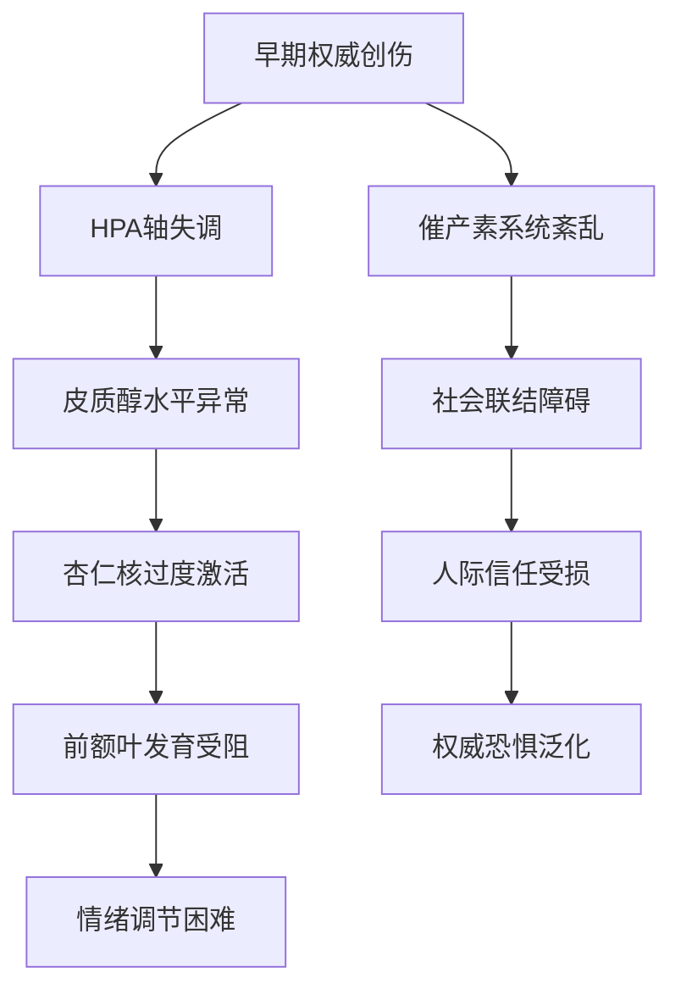
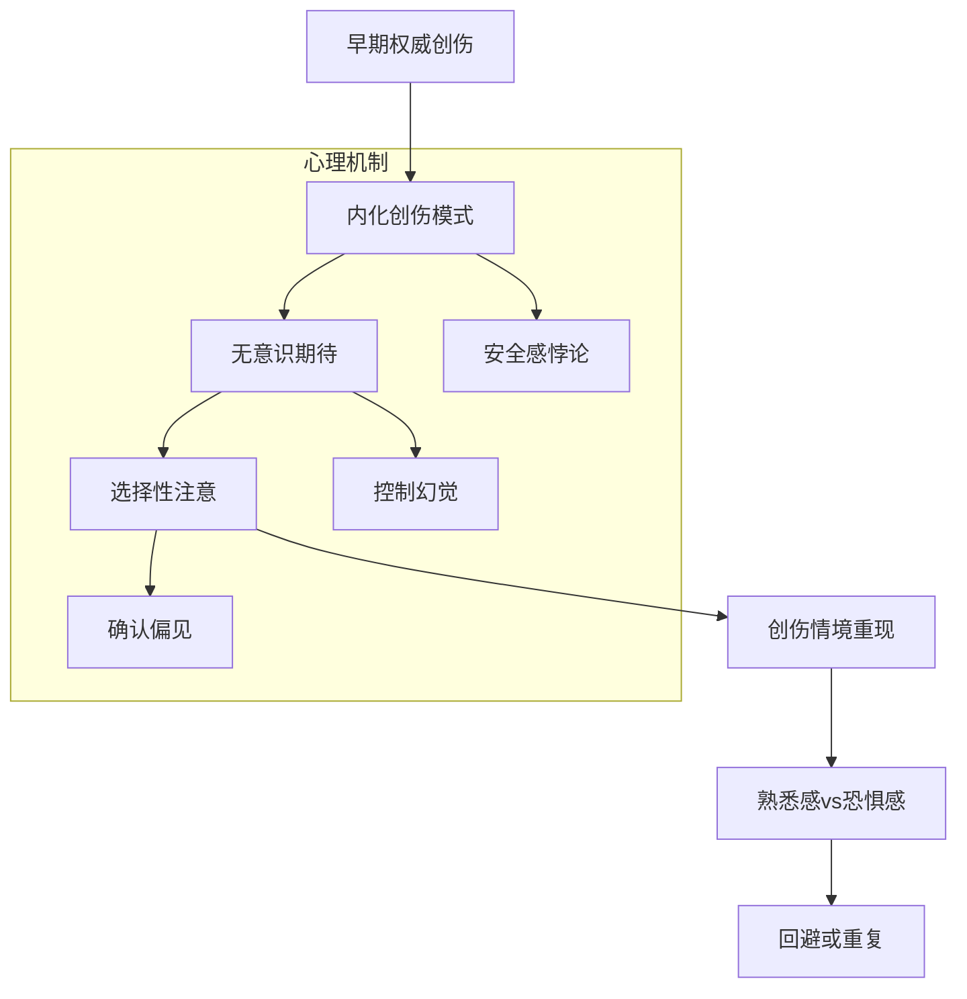
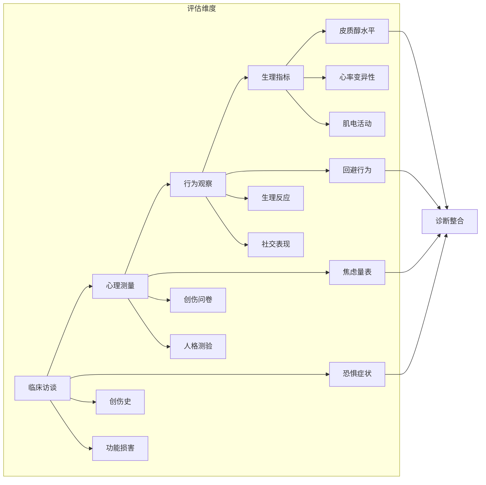
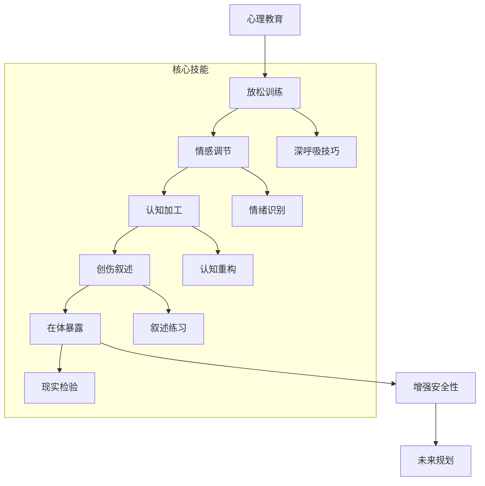
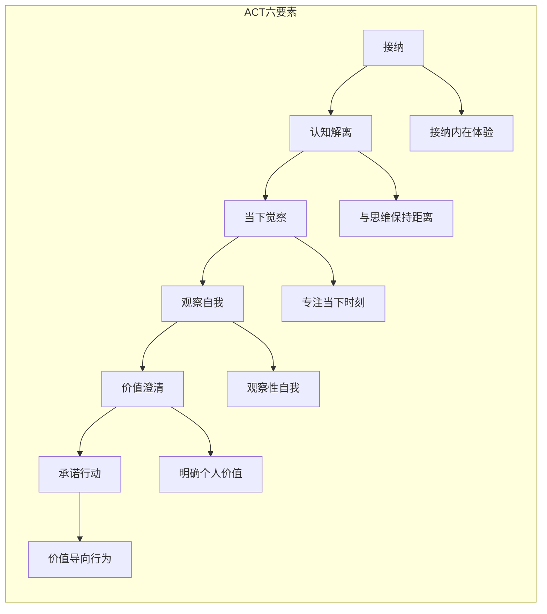

# 权威恐惧情结 (Authority Fear Complex)

> 📘 **文档导航**: 本专题深入探讨对权威人物和权威情境的恐惧反应、形成机制和治疗策略。相关主题请参考：
> - [权威情结概览](Authority_Complex_Overview.md) - 整体理论框架
> - [恋父恋母情结](Father_Mother_Complex.md) - 权威吸引的另一极
> - [恋师恋教练情结](Teacher_Coach_Complex.md) - 教育环境中的权威体验
> - [年龄差异吸引](Age_Attraction_Complex.md) - 年龄相关的情感模式

## 核心概念与定义 (Core Concepts and Definitions)

### 权威恐惧症定义 (Authority Phobia Definition)
**临床定义**: 个体对权威人物（父母、教师、上司、政府官员等）或权威情境产生过度、非理性的恐惧反应，这种恐惧显著超出了正常敬畏的范围，严重影响个体的社会功能、职业发展和个人成长。

**诊断核心要素**:
- **恐惧强度**: 显著超过正常敬畏水平的强烈恐惧
- **回避行为**: 为避免接触权威而采取的回避策略
- **功能损害**: 对工作、学习、人际关系造成实质性影响
- **持续时间**: 症状持续至少6个月且非情境性

### 恐惧表现维度分类 (Fear Manifestation Dimension Classification)

#### 按恐惧对象分类
| 恐惧对象类型 | 具体表现 | 心理机制 | 发展关联 |
| :--- | :--- | :--- | :--- |
| **父母权威恐惧** | 害怕父母的愤怒、惩罚或失望 | 早期依恋创伤或过度严厉管教 | 通常源于童年期不良教养经历 |
| **教师权威恐惧** | 害怕老师的批评、嘲笑或排斥 | 学习创伤或师生关系不良 | 多发生在学龄期关键发展阶段 |
| **职场权威恐惧** | 害怕上司的指责、解雇或权力压制 | 职场创伤或权力滥用经历 | 常见于工作环境中的负面体验 |
| **制度权威恐惧** | 害怕法律、规章或社会制度的约束 | 社会化过程中的创伤体验 | 可能源于制度性歧视或不公正对待 |

#### 按恐惧反应类型分类
| 反应类型 | 生理症状 | 行为表现 | 认知特征 | 情绪体验 |
| :--- | :--- | :--- | :--- | :--- |
| **急性恐惧反应** | 心跳加速、出汗、颤抖 | 逃避、僵住、哭泣 | "我会被伤害"、"我无法应对" | 强烈的恐慌和无助感 |
| **慢性焦虑状态** | 肌肉紧张、睡眠障碍 | 过度准备、反复检查 | "总有一天会被发现"、"我不够好" | 持续的担忧和不安全感 |
| **回避行为模式** | 无明显生理症状 | 主动远离权威情境 | "躲开就好"、"不接触就安全" | 相对平静但限制性很强 |
| **躯体化表现** | 头痛、胃痛、疲劳 | 身体不适作为回避借口 | "我生病了所以不能..." | 通过身体症状表达心理恐惧 |

## 发展心理学机制 (Developmental Psychology Mechanisms)

### 早期创伤形成机制 (Early Trauma Formation Mechanisms)

#### 创伤性依恋经历 (Traumatic Attachment Experiences)
**核心创伤类型**:

1. **恐惧型依恋创伤**
   ```
   创伤特征:
   • 照顾者同时是恐惧来源和安全需求对象
   • 形成矛盾的依恋行为模式
   • 内化"接近带来痛苦"的基本信念
   
   典型表现:
   • 既渴望亲近又害怕接触
   • 对权威人物的推拉行为
   • 情感调节困难和自我 soothing能力不足
   ```

2. **虐待型权威创伤**
   ```
   创伤形式:
   • 身体暴力: 打骂、体罚等直接伤害
   • 情感虐待: 贬低、羞辱、情感忽视
   • 性虐待: 权力不对等的性侵害
   • 忽视虐待: 基本需求的系统性忽视
   
   长期影响:
   • 对权威的泛化恐惧
   • 信任能力受损
   • 自我价值感低下
   ```

#### 关键发展期创伤影响 (Critical Period Trauma Impact)

##### 依恋建立期创伤 (0-3岁 Attachment Formation Trauma)
**神经生物学影响**:


**心理发展模式**:
- **基本信任危机**: 难以相信权威人物会提供保护和支持
- **安全感缺失**: 缺乏稳定的情感安全基地
- **自我调节困难**: 情绪和行为调节能力发展受阻

##### 学龄期创伤经历 (6-12岁 School Age Trauma)
**创伤类型分析**:
| 创伤类型 | 典型情境 | 心理影响 | 长期后果 |
| :--- | :--- | :--- | :--- |
| **学业创伤** | 公开批评、成绩羞辱、同伴排斥 | 学习自信受损、完美主义倾向 | 学业回避、成就焦虑 |
| **师生冲突** | 不公正对待、权力滥用、情感忽视 | 对教育权威的不信任 | 学习动机下降、师生关系困难 |
| **同伴压力** | 权威同伴的欺凌和排斥 | 社会地位焦虑、从众压力 | 社交回避、身份认同困惑 |

### 心理动力学机制 (Psychodynamic Mechanisms)

#### 无意识冲突结构 (Unconscious Conflict Structure)
**核心冲突模式**:
```
内在冲突三角:
需求 ←→ 恐惧 ←→ 愤怒
(对权威的需要) (对权威的恐惧) (对权威的愤怒)

防御机制运作:
• 压抑: 将对权威的愤怒和需求压入无意识
• 投射: 将内心的恐惧和愤怒投射到外部权威
• 退行: 回到早期发展阶段的应对模式
• 理智化: 用理性分析掩盖情感体验
```

#### 创伤重现机制 (Trauma Reenactment Mechanism)
**重复强迫现象**:


### 认知行为机制 (Cognitive-Behavioral Mechanisms)

#### 适应不良认知模式 (Maladaptive Cognitive Patterns)
**核心认知偏差**:
```
灾难化思维:
• "权威人物一定会伤害我"
• "我永远无法满足他们的期望"
• "一次失败就意味着彻底的否定"

过度概括:
• 从个别权威的负面经历推广到所有权威
• 将特定情境的威胁泛化到所有类似情境
• 基于有限经验形成绝对化信念

心智化缺陷:
• 难以理解权威人物的真实意图
• 无法区分合理的权威要求与不当权力行使
• 缺乏对权威行为的多角度理解能力
```

#### 行为强化循环 (Behavioral Reinforcement Cycle)
**回避学习机制**:
| 阶段 | 过程 | 短期效果 | 长期后果 |
| :--- | :--- | :--- | :--- |
| **预期焦虑** | 预测权威接触带来的威胁 | 暂时减少焦虑 | 强化恐惧预期 |
| **回避行为** | 采取各种方式避免接触 | 获得短暂安全感 | 维持恐惧模式 |
| **负强化** | 通过回避获得焦虑缓解 | 增强回避倾向 | 阻碍适应性学习 |
| **维持循环** | 恐惧-回避的恶性循环 | 症状持续存在 | 功能损害加重 |

## 神经生物学基础 (Neurobiological Foundation)

### 大脑结构异常 (Brain Structural Abnormalities)

#### 关键脑区功能改变
**神经影像学发现**:
```python
# 权威恐惧相关的脑区异常模式
class AuthorityFearNeuralPatterns:
    def __init__(self):
        self.abnormal_regions = {
            '前扣带回': {
                '功能': '冲突监测和错误检测',
                '异常': '过度激活导致警觉性过高',
                '影响': '对权威信号的过度敏感'
            },
            '杏仁核': {
                '功能': '威胁检测和恐惧反应',
                '异常': '反应阈值降低，激活增强',
                '影响': '对权威相关刺激的过度恐惧'
            },
            '海马': {
                '功能': '记忆编码和情境评估',
                '异常': '体积缩小，功能受损',
                '影响': '创伤记忆的过度巩固'
            },
            '前额叶皮层': {
                '功能': '执行控制和情绪调节',
                '异常': '活性降低，连接减弱',
                '影响': '恐惧反应的调节能力下降'
            }
        }
    
    def analyze_neural_correlates(self, clinical_data):
        """分析临床数据中的神经相关性"""
        return self.identify_abnormal_patterns(clinical_data)
```

#### 神经递质系统紊乱
| 系统 | 正常功能 | 异常表现 | 临床症状关联 |
| :--- | :--- | :--- | :--- |
| **GABA系统** | 抑制性神经调节，焦虑缓解 | 活性降低，抑制功能不足 | 焦虑水平升高，放松困难 |
| **去甲肾上腺素系统** | 警觉性和应激反应调节 | 过度激活，反应性增强 | 警觉性过高，易受惊吓 |
| **血清素系统** | 情绪稳定和冲动控制 | 功能紊乱，调节失衡 | 情绪波动大，冲动行为 |
| **多巴胺系统** | 奖励预测和动机驱动 | 敏感性改变，预测误差增大 | 对权威反馈的过度反应 |

### HPA轴功能异常 (HPA Axis Dysfunction)

#### 应激反应模式改变
**慢性应激影响**:
```
正常应激反应:
感知威胁 → HPA轴激活 → 皮质醇释放 → 生理唤醒 → 适应性应对 → 系统恢复

病理应激模式:
轻微威胁 → HPA轴过度激活 → 皮质醇持续高水平 → 慢性生理唤醒 → 适应不良 → 系统失调

长期后果:
• 海马体积缩小影响记忆功能
• 前额叶皮层活性降低影响执行功能
• 免疫系统功能受损增加疾病风险
• 情绪调节能力持续下降
```

#### 创伤记忆巩固机制
**神经生物学过程**:
- **肾上腺素增强**: 创伤情境下肾上腺素释放增强记忆编码
- **皮质醇影响**: 慢性高皮质醇水平损害记忆整合
- **海马功能**: 创伤相关记忆的过度巩固和泛化
- **杏仁核作用**: 情绪记忆的优先存储和快速提取

## 临床评估与诊断 (Clinical Assessment and Diagnosis)

### 综合评估框架 (Comprehensive Assessment Framework)

#### 多维度评估模型


#### 标准化评估工具

##### 权威恐惧评估量表 (Authority Fear Assessment Scale)
| 评估维度 | 测评项目 | 评分标准 | 临床解释 |
| :--- | :--- | :--- | :--- |
| **恐惧强度** | "面对权威人物时的恐惧程度" | 0-10级强度评定 | 评估症状严重程度 |
| **回避程度** | "为避免权威接触而采取的行为" | 频率和影响程度评估 | 判断功能损害水平 |
| **生理反应** | "接触权威时的身体反应" | 症状清单和强度评定 | 识别躯体化表现 |
| **认知模式** | "对权威的思维和信念" | 认知偏差类型和程度 | 指导认知干预方向 |

##### 创伤经历问卷 (Trauma History Questionnaire)
**核心评估内容**:
```
1. 早期创伤经历
   • 身体虐待史
   • 情感忽视经历
   • 性虐待创伤
   • 家庭暴力目睹

2. 权威相关创伤
   • 师生关系创伤
   • 职场权力滥用
   • 制度性歧视经历
   • 社会不公正对待

3. 创伤影响评估
   • 症状持续时间
   • 功能损害程度
   • 应对策略使用
   • 社会支持状况
```

### 诊断标准与鉴别 (Diagnostic Criteria and Differentiation)

#### DSM-5相关诊断类别
| 诊断类别 | 诊断要点 | 与权威恐惧的关系 | 鉴别关键点 |
| :--- | :--- | :--- | :--- |
| **特定恐惧症** | 对特定对象的显著恐惧和回避 | 权威恐惧的可能诊断类别 | 需要明确恐惧对象的特定性 |
| **社交焦虑障碍** | 对社交场合的恐惧和回避 | 可能包含权威情境恐惧 | 区分一般社交恐惧和权威特异性 |
| **创伤后应激障碍** | 创伤经历后的持续症状 | 权威恐惧可能是创伤后果 | 需要明确的创伤史 |
| **回避型人格障碍** | 广泛的社交回避和抑制 | 可能表现为对权威的回避 | 区分广泛性回避和权威特异性 |

#### 与其他恐惧障碍的鉴别
| 鉴别维度 | 权威恐惧症 | 一般焦虑障碍 | 强迫症 | 惊恐障碍 |
| :--- | :--- | :--- | :--- | :--- |
| **恐惧对象** | 特定的权威人物或情境 | 广泛的不确定威胁 | 特定的强迫思维 | 不可预测的身体症状 |
| **回避行为** | 针对权威接触的回避 | 广泛的回避多种情境 | 仪式性行为减少焦虑 | 回避可能引发惊恐的场所 |
| **认知特征** | 对权威权力的过度担忧 | 对多种生活领域的担忧 | 关于污染、伤害的强迫思维 | 对再次发作的恐惧 |
| **生理反应** | 面对权威时的特定反应 | 持续的肌肉紧张 | 暴露于强迫思维时的焦虑 | 突然出现的强烈生理症状 |

## 治疗干预策略 (Treatment Intervention Strategies)

### 创伤知情治疗方法 (Trauma-Informed Treatment Approaches)

#### 安全感建立阶段 (Safety Building Phase)
**核心治疗目标**:
- 建立治疗关系中的安全感
- 发展情绪调节技能
- 创造稳定的支持环境

**关键技术应用**:
```
1. 安全环境营造
   • 物理环境的安全和舒适
   • 治疗框架的清晰和可预测
   • 边界设定的明确和一致

2. 情绪调节训练
   • 深呼吸和放松技巧
   • 正念觉察练习
   • 身体扫描和接地技术

3. 资源强化
   • 识别和培养个人优势
   • 建立社会支持网络
   • 发展应对技能库
```

#### 创伤处理阶段 (Trauma Processing Phase)
**循证治疗方法**:

##### 眼动脱敏再加工 (EMDR)
**治疗机制**:
```
双侧刺激 → 工作记忆负荷增加 → 创伤记忆去巩固 → 新的学习整合 → 适应性信息处理

治疗过程:
1. 稳定化准备
2. 创伤记忆激活
3. 双侧刺激处理
4. 认知重构
5. 身体感觉处理
6. 安全_place安装
```

##### 创伤聚焦认知行为治疗 (TF-CBT)
**核心治疗成分**:


### 认知行为治疗方法 (Cognitive-Behavioral Approaches)

#### 认知重构技术 (Cognitive Restructuring Techniques)
**核心认知偏差矫正**:
```
常见适应不良认知及其重构:

原始认知: "所有权威都会伤害我"
重构认知: "有些权威是善意的，我需要学会区分"

原始认知: "我必须完美才能获得认可"
重构认知: "适度的努力和真实的自我表达更有价值"

原始认知: "逃避是最好的保护方式"
重构认知: "逐步面对可以帮助我建立真正的安全感"
```

#### 系统脱敏治疗 (Systematic Desensitization)
**治疗实施步骤**:

1. **焦虑等级建构**
   ```
   1级: 想象权威人物在远处
   3级: 想象与权威人物简短对话
   5级: 想象接受权威人物的正常反馈
   7级: 想象处理权威人物的批评
   9级: 想象与权威人物发生冲突
   10级: 想象权威人物的合理要求
   ```

2. **放松训练**
   - 渐进性肌肉放松
   - 腹式呼吸训练
   - 正念冥想练习

3. **想象暴露**
   - 从低焦虑等级开始
   - 配合放松技巧
   - 逐步提高暴露强度

#### 暴露反应预防 (Exposure with Response Prevention)
**治疗技术要点**:
```
暴露层次设计:
• 想象暴露: 安全环境中想象权威接触
• 虚拟现实暴露: 技术辅助的情境模拟
• 现实暴露: 实际的权威接触练习

反应预防策略:
• 避免安全行为(如过度准备、回避眼神接触)
• 延迟寻求安慰的行为
• 忍受不适情绪而不立即缓解
```

### 正念为基础治疗方法 (Mindfulness-Based Approaches)

#### 正念认知治疗 (MBCT)
**核心治疗要素**:
```
1. 正念觉察训练
   • 身体扫描练习
   • 呼吸觉察冥想
   • 日常生活中的正念

2. 认知去中心化
   • 观察思维而不认同
   • 识别自动化思维模式
   • 发展观察者立场

3. 情绪调节技能
   • 接纳困难情绪
   • 非评判性态度
   • 慈悲心培养
```

#### 接纳承诺治疗 (ACT)
**治疗框架应用**:


### 人际关系治疗方法 (Interpersonal Approaches)

#### 人际关系治疗 (IPT)
**治疗焦点领域**:
```
1. 人际角色转换
   • 适应权威关系的变化
   • 处理权力动态的转变
   • 发展平等的交往模式

2. 人际缺陷改善
   • 提高社交技能
   • 增强沟通能力
   • 改善边界设定

3. 悲伤处理
   • 处理权威相关的失落体验
   • 整合创伤经历
   • 重建意义感
```

#### 心理动力学人际治疗
**治疗技术重点**:
- **移情分析**: 识别和处理对治疗师的权威移情
- **关系模式探索**: 理解早期权威关系对当前人际模式的影响
- **冲突解决**: 处理内在的依赖与独立冲突

## 预防与促进策略 (Prevention and Promotion Strategies)

### 创伤预防措施 (Trauma Prevention Measures)

#### 家庭环境优化 (Family Environment Optimization)
**预防性干预策略**:
```
1. 积极教养方式
   • 一致性规则设定
   • 情感温暖表达
   • 合理的期望和反馈
   • 尊重孩子的自主性

2. 健康的权威示范
   • 展示合理的权力行使
   • 承认错误和道歉
   • 鼓励开放的沟通
   • 建立民主的家庭氛围

3. 创伤知情养育
   • 识别孩子的情绪信号
   • 提供安全感和可预测性
   • 及时响应孩子的需求
   • 创造支持性的环境
```

#### 教育环境改善 (Educational Environment Improvement)
**学校预防措施**:
- **教师培训**: 提高教师的创伤知情能力
- **反霸凌政策**: 建立有效的校园安全机制
- **心理健康教育**: 普及心理健康知识和求助技能
- **同伴支持系统**: 培养同学间的互助文化

### 社会支持系统建设 (Social Support System Building)

#### 专业支持网络 (Professional Support Network)
**多层次支持体系**:
```
1. 初级预防
   • 公众教育和意识提升
   • 社区心理健康服务
   • 家庭教育资源提供

2. 二级预防
   • 早期识别和干预
   • 心理健康筛查
   • 危机干预服务

3. 三级预防
   • 专业化治疗服务
   • 康复支持项目
   • 长期跟踪关怀
```

#### 同伴支持机制 (Peer Support Mechanisms)
**支持性环境营造**:
- **互助小组**: 同类经历者的经验分享和支持
- **同伴辅导**: 训练有经验的同伴提供支持
- **在线社区**: 安全的网络交流平台
- **倡导活动**: 提高社会对相关问题的认识和理解

## 研究前沿与发展趋势 (Research Frontiers and Development Trends)

### 当前研究热点 (Current Research Hotspots)

#### 神经科学进展 (Neuroscientific Advances)
**前沿研究方向**:
- **神经可塑性**: 创伤后大脑重组和恢复的可能性
- **生物标记物**: 识别权威恐惧的客观生理指标
- **精准医学**: 基于个体神经特征的个性化治疗

#### 数字化治疗创新 (Digital Therapeutic Innovation)
**技术应用领域**:
```
1. 虚拟现实治疗
   • 安全的暴露治疗环境
   • 可控制的权威接触模拟
   • 实时生理反馈整合

2. 人工智能辅助
   • 智能聊天机器人提供支持
   • 个性化治疗方案推荐
   • 治疗进展实时监测

3. 移动健康应用
   • 日常焦虑管理工具
   • 正念练习指导
   • 社交支持平台
```

### 未来发展方向 (Future Development Directions)

#### 整合性治疗模式 (Integrative Treatment Models)
**发展趋势**:
```
理论整合:
• 生物-心理-社会模型的深化应用
• 东西方治疗理念的有机结合
• 个体化与标准化的平衡发展

技术融合:
• 传统治疗与数字技术的无缝整合
• 多模态治疗方案的协同应用
• 远程与面对面治疗的有效结合
```

#### 预防性干预强化 (Enhanced Preventive Interventions)
**发展方向**:
- **早期识别系统**: 建立有效的早期预警和识别机制
- **全民心理健康教育**: 提高全社会的心理健康素养
- **环境改造策略**: 创建更加支持性的社会环境

---
*本专题将持续更新最新的研究成果和临床实践经验*