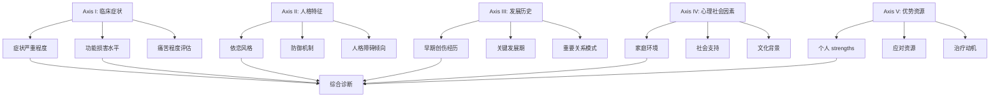
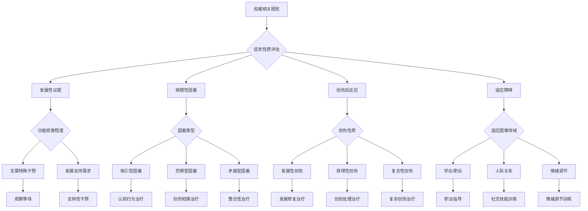
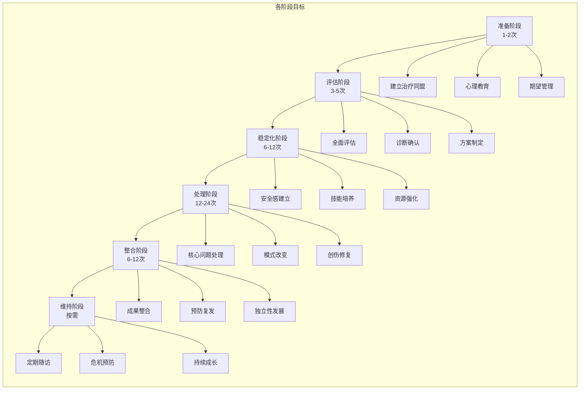
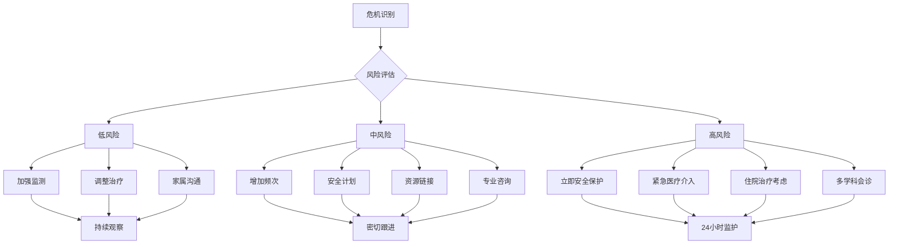

# 权威情结临床整合指南 (Authority Complex Clinical Integration Guide)

> 📘 **文档导航**: 本指南提供权威情结相关障碍的综合临床处理框架。相关主题请参考：
> - [权威情结概览](Authority_Complex_Overview.md) - 理论基础和分类体系
> - [各专题文档](./) - 恋父恋母、恋师恋教练、年龄吸引、权威恐惧等具体类型

## 综合评估框架 (Comprehensive Assessment Framework)

### 多轴诊断评估系统 (Multi-Axial Diagnostic Assessment System)

#### 评估轴线设计


### 标准化评估工具包 (Standardized Assessment Toolkit)

#### 核心评估量表矩阵
| 评估工具 | 适用范围 | 主要维度 | 信效度指标 | 临床应用 |
| :--- | :--- | :--- | :--- | :--- |
| **权威关系问卷** | 成人一般人群 | 吸引强度、恐惧程度、功能影响 | α=0.88，重测信度良好 | 初步筛查和症状评估 |
| **依恋风格量表** | 各年龄段 | 安全型、焦虑型、回避型依恋 | 良好因子结构效度 | 关系模式评估 |
| **创伤经历问卷** | 创伤相关症状 | 早期创伤、权威创伤、影响评估 | 敏感性85%，特异性78% | 创伤史详细采集 |
| **功能损害量表** | 临床患者 | 社会、职业、人际功能 | 临床样本验证良好 | 诊断严重程度判断 |
| **认知偏差问卷** | 认知治疗 | 灾难化、过度概括、黑白思维 | 良好区分效度 | 认知模式识别 |

#### 评估实施流程
**阶段性评估方案**:

**第一阶段：初步筛查 (30-45分钟)**
```
1. 权威关系问卷快速筛查
2. 临床访谈症状评估
3. 基本人口学信息收集
4. 初步风险评估

输出: 筛查结果和进一步评估建议
```

**第二阶段：详细评估 (90-120分钟)**
```
1. 标准化量表施测
2. 半结构化临床访谈
3. 发展史详细采集
4. 功能损害评估

输出: 详细的评估报告和诊断建议
```

**第三阶段：综合判断 (60分钟)**
```
1. 多轴诊断整合
2. 治疗方案制定
3. 风险管理规划
4. 治疗同盟建立

输出: 个性化治疗计划和预期目标
```

## 诊断分类与鉴别 (Diagnostic Classification and Differentiation)

### 综合诊断决策树 (Integrated Diagnostic Decision Tree)



### 跨诊断鉴别要点 (Cross-Diagnostic Differentiation Points)

#### 与相关障碍的鉴别
| 需要鉴别的障碍 | 核心鉴别特征 | 评估重点 | 鉴别方法 |
| :--- | :--- | :--- | :--- |
| **社交焦虑障碍** | 广泛的社交情境恐惧 | 恐惧的泛化程度 | 情境特异性评估 |
| **回避型人格障碍** | 广泛的人际回避模式 | 回避行为的普遍性 | 行为模式分析 |
| **创伤后应激障碍** | 创伤相关的症状群 | 创伤史的明确性 | 创伤经历核实 |
| **强迫症** | 强迫思维和行为 | 强迫症状的主导性 | 症状结构分析 |
| **边缘性人格障碍** | 情绪不稳定和关系动荡 | 人格结构的整体性 | 长期模式观察 |

#### 严重程度分级标准
| 分级 | 症状表现 | 功能影响 | 痛苦程度 | 治疗建议 |
| :--- | :--- | :--- | :--- | :--- |
| **轻度** | 偶尔的不适感 | 轻微功能干扰 | 轻度痛苦 | 心理教育和支持 |
| **中度** | 明显的症状困扰 | 中等功能损害 | 中度痛苦 | 短期专业干预 |
| **重度** | 持续的症状表现 | 严重功能损害 | 重度痛苦 | 强化治疗和监测 |
| **危机** | 自伤或伤人风险 | 功能严重受损 | 极度痛苦 | 紧急干预和住院 |

## 整合治疗模型 (Integrative Treatment Model)

### 个性化治疗方案设计 (Personalized Treatment Plan Design)

#### 治疗匹配算法
```python
# 个性化治疗匹配系统
class TreatmentMatchingSystem:
    def __init__(self):
        self.treatment_options = {
            'cbt': {
                '适应症': ['认知偏差明显', '功能损害中等', '动机良好'],
                '优势': ['结构化', '短期见效', '技能导向'],
                '局限': ['深度有限', '关系因素关注较少']
            },
            'psychodynamic': {
                '适应症': ['深层冲突', '关系模式固化', '寻求深度理解'],
                '优势': ['深度洞察', '人格改变', '长期效果'],
                '局限': ['时间较长', '成本较高', '技能训练有限']
            },
            'trauma_informed': {
                '适应症': ['创伤史明确', '闪回症状', '安全感缺乏'],
                '优势': ['安全优先', '创伤处理', '身心整合'],
                '局限': ['进度较慢', '需要稳定环境']
            },
            'mindfulness_based': {
                '适应症': ['情绪调节困难', '当下觉察不足', '压力反应强烈'],
                '优势': ['情绪稳定', '自我觉察', '生活质量提升'],
                '局限': ['需要练习投入', '急性症状效果有限']
            }
        }
    
    def match_treatment(self, client_profile):
        """
        基于客户档案匹配最适合的治疗方案
        """
        best_matches = []
        for treatment, criteria in self.treatment_options.items():
            match_score = self.calculate_match_score(client_profile, criteria)
            best_matches.append((treatment, match_score))
        
        return sorted(best_matches, key=lambda x: x[1], reverse=True)
```

### 阶段性治疗框架 (Staged Treatment Framework)

#### 治疗阶段划分


#### 阶段性技术整合
| 治疗阶段 | 核心技术 | 辅助技术 | 整合策略 |
| :--- | :--- | :--- | :--- |
| **准备阶段** | 治疗关系建立 | 心理教育、动机访谈 | 营造安全环境，建立信任基础 |
| **评估阶段** | 多轴评估 | 标准化测验、结构化访谈 | 全面了解问题，制定个性化方案 |
| **稳定化阶段** | 情绪调节训练 | 正念练习、放松训练 | 建立稳定基础，培养应对技能 |
| **处理阶段** | 核心问题干预 | 认知重构、暴露练习 | 针对性处理，促进行为改变 |
| **整合阶段** | 成果巩固 | 关系修复、价值澄清 | 整合学习成果，预防复发 |
| **维持阶段** | 长期支持 | 同伴支持、自助策略 | 保持治疗效果，促进持续成长 |

## 循证干预技术 (Evidence-Based Intervention Techniques)

### 核心治疗技术矩阵 (Core Treatment Techniques Matrix)

#### 认知行为技术集合
| 技术名称 | 适用问题 | 实施要点 | 预期效果 |
| :--- | :--- | :--- | :--- |
| **认知重构** | 适应不良认知 | 识别-质疑-替换三步法 | 减少认知扭曲，提高现实检验能力 |
| **行为实验** | 假设验证 | 设计-实施-评估循环 | 检验信念真实性，促进学习 |
| **系统脱敏** | 特定恐惧 | 焦虑等级+放松训练 | 降低恐惧反应，提高应对能力 |
| **暴露疗法** | 回避行为 | 逐步暴露+反应预防 | 减少回避，增强耐受性 |
| **行为激活** | 动机缺乏 | 活动安排+积极强化 | 提高参与度，改善情绪 |

#### 心理动力学技术集合
| 技术名称 | 适用问题 | 实施要点 | 预期效果 |
| :--- | :--- | :--- | :--- |
| **自由联想** | 无意识内容 | 不加筛选地表达想法 | 揭示内在冲突和防御机制 |
| **梦的解析** | 象征性内容 | 象征意义探索和联想 | 理解无意识愿望和恐惧 |
| **移情分析** | 关系模式重现 | 识别-理解-修通过程 | 处理关系创伤，促进成长 |
| **解释技术** | 阻抗和防御 | 时机恰当的洞察提供 | 促进领悟和改变动机 |
| **修通工作** | 阻抗克服 | 反复探索和整合 | 实现深层人格改变 |

#### 依恋聚焦技术集合
| 技术名称 | 适用问题 | 实施要点 | 预期效果 |
| :--- | :--- | :--- | :--- |
| **情感聚焦** | 情绪表达困难 | 情感觉察-表达-调节序列 | 提高情感智力和调节能力 |
| **安全基地体验** | 安全感缺乏 | 治疗关系中的安全感提供 | 修复依恋创伤，建立信任 |
| **内在工作模型修正** | 关系模式固化 | 新经验的内化和整合 | 改变关系期待和行为模式 |
| **关系修复** | 人际创伤 | 共情-理解-修复过程 | 重建健康的人际连接 |
| **分离个体化** | 独立性发展 | 平衡连接与自主 | 促进成熟的人格发展 |

### 技术整合策略 (Technology Integration Strategy)

#### 整合治疗方案示例
**案例：混合型权威情结患者**

**初始评估结果**:
- 恋师情结(中度) + 权威恐惧(轻度)
- 功能损害：中等(学业受影响)
- 依恋风格：焦虑型
- 创伤史：轻微的师生关系创伤

**整合治疗方案**:
```
第1-4周：准备和评估阶段
• 建立治疗关系，心理教育
• 完成全面评估，制定治疗计划
• 开始情绪调节技能训练

第5-12周：稳定化阶段
• 认知行为技术：识别和挑战适应不良认知
• 正念练习：提高当下觉察能力
• 安全感建立：治疗关系中的安全体验

第13-24周：处理阶段
• 心理动力学技术：探索师生关系模式的深层含义
• 暴露练习：逐步面对权威情境
• 依恋聚焦工作：修复早期关系创伤

第25-32周：整合阶段
• 成果巩固：整合学到的技能和洞察
• 预防复发：制定应对策略和预警系统
• 独立性发展：培养自我支持能力

第33周后：维持阶段
• 定期随访：监测进展和预防复发
• 持续支持：根据需要提供补充治疗
```

## 危机管理与风险管理 (Crisis Management and Risk Management)

### 危机识别与干预 (Crisis Identification and Intervention)

#### 危险信号监测系统
**高风险指标**:
```
自杀风险信号:
• 直接表达死亡念头
• 无价值感和绝望感
• 社会功能急剧下降
• 物质滥用行为增加

自伤风险信号:
• 表达自我惩罚的愿望
• 身体自伤行为史
• 情绪调节能力严重受损
• 人际关系极度恶化

暴力风险信号:
• 对权威的极端愤怒表达
• 冲动控制困难
• 威胁或攻击性行为
• 物质影响下的行为失控
```

#### 紧急干预程序
**危机响应流程**:


### 风险管理策略 (Risk Management Strategies)

#### 预防性风险管理
**风险因素识别**:
| 风险类型 | 识别指标 | 预防策略 | 监测频率 |
| :--- | :--- | :--- | :--- |
| **复发风险** | 症状波动、压力增加 | 预防性干预、技能强化 | 每月评估 |
| **关系风险** | 边界模糊、权力不平衡 | 边界训练、监督机制 | 每两周检查 |
| **依从性风险** | 治疗动机下降、配合度低 | 动机增强、同盟修复 | 每次会谈评估 |
| **环境风险** | 支持系统薄弱、压力源增加 | 环境改善、资源链接 | 根据情况调整 |

#### 治疗边界管理
**专业边界维护**:
```
1. 角色边界清晰化
   • 明确治疗师和来访者角色定位
   • 避免双重关系和个人利益冲突
   • 建立清晰的沟通和互动规则

2. 情感边界管理
   • 识别和处理移情反移情现象
   • 保持专业的情感距离
   • 定期进行自我反思和督导

3. 信息边界控制
   • 保护来访者隐私和机密性
   • 合理的信息分享和沟通
   • 建立信息安全管理制度
```

## 治疗效果评估 (Treatment Outcome Evaluation)

### 多维度效果评估 (Multi-Dimensional Outcome Assessment)

#### 评估指标体系
**核心评估维度**:
| 评估维度 | 具体指标 | 评估工具 | 评估时机 |
| :--- | :--- | :--- | :--- |
| **症状改善** | 焦虑水平、恐惧强度、回避行为 | 焦虑量表、恐惧问卷、行为记录 | 基线、中期、结束、随访 |
| **功能恢复** | 学业/职业表现、人际关系质量、日常生活能力 | 功能评估量表、生活质量问卷 | 基线、结束、3月随访、6月随访 |
| **认知改变** | 适应不良认知减少、现实检验能力提升 | 认知偏差问卷、现实检验任务 | 中期、结束 |
| **情感调节** | 情绪稳定性、调节策略使用 | 情绪调节问卷、生理指标监测 | 基线、结束、随访 |
| **关系改善** | 权威关系质量、人际互动模式 | 关系满意度量表、社交技能评估 | 结束、随访 |

#### 评估实施策略
**阶段性评估安排**:
```
治疗前评估(第1次):
• 建立基线数据
• 制定评估计划
• 获得知情同意

治疗中期评估(第12次左右):
• 监测治疗进展
• 调整治疗方案
• 强化积极变化

治疗结束评估(最后1-2次):
• 全面效果评估
• 巩固治疗成果
• 制定维持计划

随访评估(3个月、6个月):
• 监测长期效果
• 预防复发
• 提供持续支持
```

### 质量保证与持续改进 (Quality Assurance and Continuous Improvement)

#### 治疗质量监控
**质量指标体系**:
| 质量维度 | 监控指标 | 目标标准 | 改进措施 |
| :--- | :--- | :--- | :--- |
| **治疗完整性** | 治疗协议遵循度 | ≥85% | 督导反馈、技能培训 |
| **来访者满意度** | 治疗满意度评分 | ≥4.0/5.0 | 流程优化、沟通改善 |
| **症状改善率** | 临床显著改善比例 | ≥70% | 方案调整、技术更新 |
| **脱落率控制** | 治疗完成率 | ≥80% | 动机增强、支持强化 |
| **复发预防** | 6个月复发率 | ≤20% | 随访加强、预防干预 |

#### 循证实践发展
**持续改进机制**:
- **案例讨论会**: 定期分享经验和挑战
- **文献学习**: 跟踪最新研究进展
- **技能培训**: 更新治疗技术和方法
- **质量审查**: 系统性评估治疗效果
- **创新试点**: 尝试新的治疗模式

## 专业发展与伦理规范 (Professional Development and Ethical Standards)

### 专业能力要求 (Professional Competency Requirements)

#### 核心能力框架
**必备专业技能**:
```
1. 理论基础能力
   • 精通发展心理学理论
   • 掌握各种治疗理论和技术
   • 理解神经生物学机制

2. 评估诊断能力
   • 熟练使用标准化评估工具
   • 准确进行诊断和鉴别诊断
   • 制定个性化治疗方案

3. 干预实施能力
   • 灵活运用多种治疗技术
   • 处理治疗过程中的复杂情况
   • 管理危机和高风险状况

4. 专业发展能力
   • 持续学习和知识更新
   • 接受督导和同行评议
   • 参与专业交流和研究
```

#### 伦理实践标准
**核心伦理原则**:
- **受益最大化**: 确保治疗对来访者有益
- **无害原则**: 避免造成不必要的伤害
- **自主尊重**: 尊重来访者的自主决定权
- **公正公平**: 提供平等和公正的服务
- **诚信透明**: 保持诚实和透明的专业关系

### 督导与质量控制 (Supervision and Quality Control)

#### 督导体系设计
**多层次督导结构**:
```
1. 个人督导
   • 每周1小时个体督导
   • 案例讨论和技能指导
   • 个人成长和盲点识别

2. 同伴督导
   • 每月小组督导会议
   • 经验分享和互相学习
   • 集体问题解决

3. 专家督导
   • 季度专家咨询
   • 复杂案例会诊
   • 专业发展方向指导
```

#### 质量控制机制
**系统性质量保障**:
- **治疗记录审查**: 定期检查治疗记录的完整性和准确性
- **来访者反馈收集**: 系统收集和分析来访者满意度数据
- **同行评议制度**: 建立同行间的相互评价和监督机制
- **持续教育要求**: 规定最低的继续教育学分要求
- **伦理合规检查**: 定期进行伦理规范遵守情况的审查

---
*本指南将根据最新研究证据和临床实践经验持续更新完善*