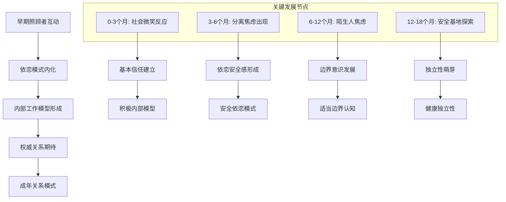
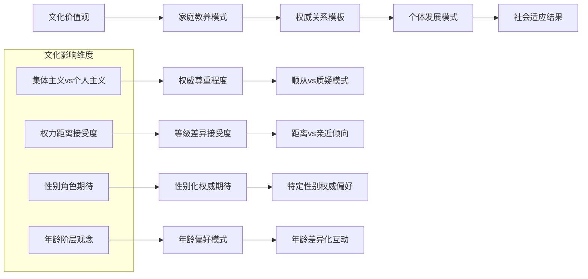
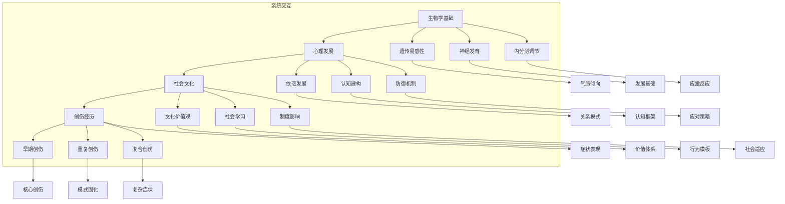

# 权威情结形成机制专业分析 (Authority Complex Formation Mechanisms Analysis)

> 📘 **文档导航**: 本专题深入分析权威情结的多层次形成机制，涵盖生物学、心理学、社会文化等维度。相关主题请参考：
> - [权威情结概览](Authority_Complex_Overview.md) - 核心概念和理论框架
> - [恋父恋母情结](Father_Mother_Complex.md) - 家庭权威情结发展机制
> - [恋师恋教练情结](Teacher_Coach_Complex.md) - 教育环境中的形成过程
> - [年龄差异吸引](Age_Attraction_Complex.md) - 年龄偏好的发展机制
> - [权威恐惧情结](Authority_Fear_Complex.md) - 恐惧形成的神经生物学基础
> - [临床整合指南](Clinical_Assessment_Treatment.md) - 机制导向的干预策略

## 多层次形成机制框架 (Multilevel Formation Mechanism Framework)

### 生物学基础机制 (Biological Foundation Mechanisms)

#### 遗传易感性机制 (Genetic Susceptibility Mechanisms)
```mermaid
graph TD
    A[遗传易感性基础] --> B[神经递质系统变异]
    B --> C[气质特征差异]
    C --> D[依恋风格倾向]
    D --> E[权威关系敏感性]
    
    A --> F[内分泌系统差异]
    F --> G[应激反应模式]
    G --> H[情绪调节能力]
    H --> I[创伤易感程度]
    
    subgraph 遗传机制
        B --> B1[多巴胺受体基因(DRD4)]
        B --> B2[血清素转运体基因(SLC6A4)]
        B --> B3[催产素受体基因(OXTR)]
        
        F --> F1[糖皮质激素受体基因(NR3C1)]
        F --> F2[CRH基因变异]
    end
    
    B1 --> J[新奇寻求倾向]
    B2 --> K[情绪稳定性差异]
    B3 --> L[社会联结能力]
    F1 --> M[应激敏感性]
    F2 --> N[焦虑易感性]
```

#### 神经发育机制 (Neurodevelopmental Mechanisms)
**关键脑区发育轨迹**:
| 发育阶段 | 核心脑区 | 功能发展 | 权威关系影响 |
| :--- | :--- | :--- | :--- |
| **胎儿期**(妊娠4-6月) | 前额叶皮层基础结构 | 执行功能雏形 | 母体应激影响神经发育 |
| **新生儿期**(0-3月) | 边缘系统 | 情绪反应基础 | 早期照顾质量塑造应激反应 |
| **婴儿期**(3-12月) | 依恋神经系统 | 社会联结能力 | 照顾者回应模式内化 |
| **幼儿期**(1-3岁) | 语言和认知区 | 符号思维发展 | 权威指令理解和内化 |
| **学龄前期**(3-6岁) | 道德判断网络 | 价值体系形成 | 父母权威的道德内化 |

#### 表观遗传机制 (Epigenetic Mechanisms)
**环境-基因交互作用**:
```python
# 权威情结表观遗传调节模型
class EpigeneticRegulationModel:
    def __init__(self):
        self.mechanisms = {
            'DNA甲基化': {
                '靶基因': ['NR3C1', 'OXTR', 'BDNF'],
                '环境触发': ['早期创伤', '慢性应激', '照顾质量'],
                '功能影响': ['应激反应调节', '社会行为', '神经可塑性']
            },
            '组蛋白修饰': {
                '靶基因': ['FKBP5', 'CRHR1', 'MAOA'],
                '环境触发': ['权威创伤', '社会压力', '支持性环境'],
                '功能影响': ['基因表达调控', '应激适应', '行为调节']
            },
            '非编码RNA': {
                '类型': ['microRNA', 'lncRNA'],
                '调控目标': ['神经发育', '突触可塑性', '应激反应'],
                '环境影响': ['社会经验', '创伤暴露', '治疗干预']
            }
        }
    
    def analyze_gene_environment_interactions(self, environmental_factors):
        """分析环境因素对基因表达的表观遗传影响"""
        regulation_effects = {}
        for mechanism, details in self.mechanisms.items():
            regulation_effects[mechanism] = self.calculate_epigenetic_impact(
                environmental_factors, details['环境触发']
            )
        return regulation_effects
```

### 心理发展机制 (Psychological Developmental Mechanisms)

#### 依恋形成机制 (Attachment Formation Mechanisms)
**内部工作模型建构过程**:


#### 认知发展机制 (Cognitive Developmental Mechanisms)
**权威认知建构过程**:
| 认知发展阶段 | 年龄范围 | 权威认知特征 | 形成机制 | 临床意义 |
| :--- | :--- | :--- | :--- | :--- |
| **感知运动期** | 0-2岁 | 具体权威体验 | 感官动作学习 | 建立基本权威概念 |
| **前运算期** | 2-7岁 | 权威魔幻思维 | 象征性思维发展 | 权威人物理想化倾向 |
| **具体运算期** | 7-11岁 | 权威逻辑理解 | 规则和因果推理 | 权威合理性的初步判断 |
| **形式运算期** | 11+岁 | 权威抽象思辨 | 抽象逻辑和假设推理 | 独立权威判断能力 |

#### 防御机制形成 (Defense Mechanism Formation)
**适应性vs病理性防御的发展**:
```
正常发展路径:
早期全能感(0-2岁) → 理想化防御(2-6岁) → 认同机制(3-6岁) → 整合能力(6+岁)

病理发展路径:
早期创伤 → 过度防御 → 固着模式 → 功能损害

关键防御机制演变:
1. 压抑: 将冲突内容排除意识之外
2. 投射: 将内在冲突归因于外部权威
3. 认同: 通过与权威认同获得安全感
4. 升华: 将冲突转化为建设性行为
5. 退行: 回到早期发展阶段的应对模式
```

### 社会文化机制 (Sociocultural Mechanisms)

#### 文化传递机制 (Cultural Transmission Mechanisms)
**代际传递路径**:


#### 社会学习机制 (Social Learning Mechanisms)
**观察学习和强化过程**:
| 学习机制 | 具体过程 | 权威情结相关性 | 影响因素 |
| :--- | :--- | :--- | :--- |
| **示范学习** | 观察他人与权威的互动模式 | 内化权威关系模板 | 榜样特征、关系质量 |
| **替代强化** | 通过他人经验学习权威互动后果 | 形成权威接近-回避策略 | 结果性质、个人相关性 |
| **自我强化** | 基于内在标准评价权威互动 | 发展自主的权威关系模式 | 自我效能、价值体系 |
| ** vicarious learning** | 通过媒体观察权威关系 | 扩展权威认知框架 | 媒体类型、文化背景 |

#### 制度化机制 (Institutionalization Mechanisms)
**社会制度对权威情结的塑造**:
- **教育制度**: 通过师生关系模式传递权威期待
- **家庭制度**: 通过代际权力结构影响权威认知
- **职场制度**: 通过组织层级强化权威关系模式
- **法律制度**: 通过规范体系建立权威合法性认知

### 创伤形成机制 (Trauma Formation Mechanisms)

#### 创伤性依恋机制 (Traumatic Attachment Mechanisms)
**不安全依恋的病理发展**:
```
创伤性依恋循环:
创伤体验 → 依恋系统紊乱 → 内部工作模型扭曲 → 关系模式异常 → 再创伤风险

具体机制:
1. 恐惧型依恋: 照顾者同时是恐惧源和安全需求对象
2. 回避型依恋: 通过回避策略应对不可预测的权威
3. 紊乱型依恋: 创伤性权威导致依恋行为混乱
4. 焦虑型依恋: 过度寻求权威认可以缓解不安全感
```

#### 创伤记忆机制 (Traumatic Memory Mechanisms)
**创伤相关记忆的特殊编码和存储**:
| 记忆特征 | 神经机制 | 临床表现 | 治疗意义 |
| :--- | :--- | :--- | :--- |
| **碎片化存储** | 海马功能受损 | 闪回、解离 | 需要整合性治疗 |
| **情绪优先编码** | 杏仁核过度激活 | 情绪强度过高 | 情绪调节优先 |
| **情境泛化** | 前额叶调节不足 | 过度概括化 | 需要具体化训练 |
| **身体记忆** | 身体感觉皮层激活 | 躯体化症状 | 身心整合治疗 |

### 系统整合机制 (Systemic Integration Mechanisms)

#### 多系统交互模型 (Multi-System Interaction Model)


#### 动态平衡机制 (Dynamic Balance Mechanisms)
**系统间调节和整合过程**:
- **稳态调节**: 各系统间的动态平衡维持
- **适应性调整**: 面对环境变化的系统重构
- **整合性发展**: 多系统协调发展的成熟过程
- **病理失衡**: 系统间失调导致的症状表现

## 临床应用机制 (Clinical Application Mechanisms)

### 评估机制导向 (Assessment Mechanism Orientation)
**基于形成机制的评估策略**:
```
生物学评估:
• 遗传易感性筛查
• 神经生物学标记物检测
• 内分泌功能评估

心理发展评估:
• 依恋风格评估
• 认知发展模式分析
• 防御机制识别

社会文化评估:
• 文化背景影响分析
• 社会学习历史回顾
• 制度化经验评估

创伤史评估:
• 创伤类型和时机
• 创伤记忆特征
• 创伤后适应模式
```

### 干预机制靶向 (Intervention Mechanism Targeting)
**针对不同形成机制的治疗策略**:

#### 生物学机制干预
- **神经可塑性促进**: 通过正念、运动等增强大脑适应性
- **内分泌调节**: 通过生活方式和必要时药物调节应激反应
- **遗传咨询**: 帮助理解遗传易感性并制定预防策略

#### 心理机制干预
- **依恋修复**: 在治疗关系中提供安全的依恋体验
- **认知重构**: 识别和改变适应不良的认知模式
- **防御机制工作**: 帮助发展更成熟的应对策略

#### 社会文化机制干预
- **文化敏感性治疗**: 考虑文化背景的影响
- **社会技能训练**: 发展健康的人际互动模式
- **制度批判意识**: 帮助识别和应对不合理的权威结构

#### 创伤机制干预
- **创伤知情治疗**: 理解创伤对症状的影响
- **记忆整合技术**: 帮助整合创伤记忆
- **身心治疗方法**: 处理创伤的身体和心理层面

## 研究前沿机制 (Research Frontier Mechanisms)

### 新兴研究方向 (Emerging Research Directions)
**前沿机制探索领域**:
- **微生物-肠-脑轴**: 肠道微生物对权威关系认知的影响
- **量子生物学**: 意识和量子过程在权威认知中的作用
- **人工智能建模**: 复杂机制的计算建模和预测
- **跨代遗传**: 创伤和权威模式的跨代传递机制

### 整合性理论发展 (Integrative Theory Development)
**机制整合的理论框架**:
- **系统生物学视角**: 将生物、心理、社会因素整合为统一理论
- **发展系统理论**: 强调多系统在发展过程中的动态交互
- **复杂适应系统**: 将权威情结视为复杂的适应性系统
- **文化神经科学**: 整合文化因素和神经机制的研究

---
*本文档将持续更新最新的机制研究成果和理论发展*