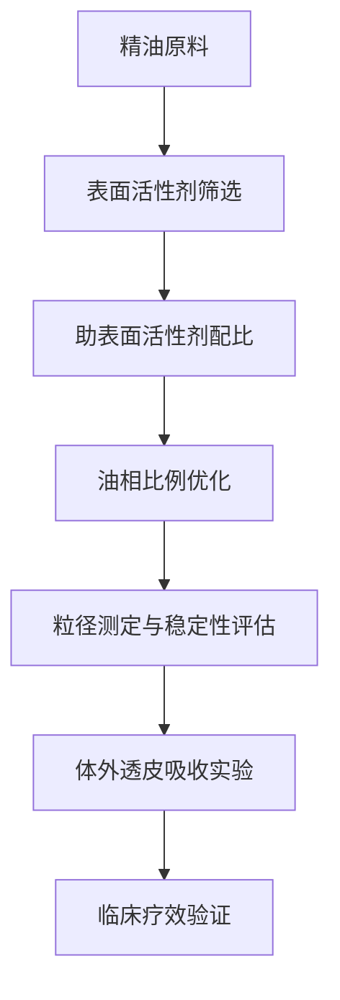

# SPA Services & Techniques (SPA服务类型与技术)

> 🏥 **专业概览**: 本文档详细介绍SPA行业的各类服务项目和技术手段，涵盖经典水疗、按摩疗法、芳香疗法、身体护理等核心技术模块。每项技术均包含操作规范、适应症、注意事项和专业要求。

## 经典水疗技术体系 (Classic Hydrotherapy Systems)

### 温泉水疗技术 (Thermal Spring Therapy)

#### 温泉分类与特性
| 温泉类型 | 温度范围 | 主要矿物质 | 治疗功效 | 适用病症 | 注意事项 |
| :--- | :--- | :--- | :--- | :--- | :--- |
| **低温温泉** | 25-33°C | 硫磺、碳酸氢钠 | 镇静神经、改善睡眠 | 神经衰弱、失眠症 | 高血压患者慎用 |
| **中温温泉** | 34-39°C | 硫磺、氯化钠 | 促进血液循环、缓解肌肉紧张 | 关节炎、肌肉疲劳 | 心脏病患者限制时间 |
| **高温温泉** | 40-45°C | 硫磺、铁 | 发汗排毒、新陈代谢加速 | 新陈代谢缓慢、肥胖症 | 高热期间禁用 |
| **超高温温泉** | >45°C | 特殊矿物质组合 | 强烈刺激、快速见效 | 慢性皮肤病、顽固性疼痛 | 严格控制浸泡时间 |

#### 标准化操作流程
1. **前期准备** (Preparation Phase)
   - 客户健康评估问卷填写
   - 体温、血压基础指标测量
   - 选择适宜温度和矿物质含量的温泉池
   - 准备毛巾、拖鞋、饮用水等用品

2. **浸浴过程** (Immersion Process)
   - **初次适应**: 5-10分钟浅水适应期
   - **主浴阶段**: 15-20分钟目标温度浸泡
   - **循环降温**: 冷水冲洗或休息3-5分钟
   - **重复循环**: 根据个人耐受度重复2-3次

3. **后续护理** (Post-Treatment Care)
   - 温水淋浴清洗残留矿物质
   - 身体保湿护理
   - 休息观察30分钟以上
   - 补充水分和电解质

### 水力按摩技术 (Hydro-Massage Therapy)

#### 设备类型与参数设置
| 设备名称 | 工作原理 | 水压强度 | 温度控制 | 适用部位 | 治疗时间 | 核心技术参数 | 生物力学效应 |
| :--- | :--- | :--- | :--- | :--- | :--- | :--- | :--- |
| **漩涡浴缸** | 水流旋转冲击 | 低压(0.5-1.5bar) | 36-40°C | 全身放松 | 15-25分钟 | 水流速度: 1.2-1.8m/s, 漩涡频率: 8-12Hz | 促进微循环、肌肉松弛 |
| **喷射按摩床** | 定点高压水流 | 中压(1.5-3.0bar) | 38-42°C | 背部、腿部 | 20-30分钟 | 喷嘴直径: 3-5mm, 冲击角度: 15-45° | 深层组织按摩、 trigger point释放 |
| **足底水疗仪** | 气泡冲击按摩 | 低压(0.3-1.0bar) | 38-43°C | 足部反射区 | 15-20分钟 | 气泡频率: 20-40Hz, 气泡大小: 0.5-2mm | 神经末梢刺激、淋巴引流 |
| **颈部水疗器** | 环绕式水流 | 低压(0.5-1.2bar) | 37-41°C | 颈肩部位 | 10-15分钟 | 环绕角度: 360°, 水流分布: 均匀环绕 | 颈椎关节活动度改善 |
| **全身水疗舱** | 多维度水流冲击 | 可调压力(0.5-4.0bar) | 35-42°C | 全身各部位 | 25-40分钟 | 12-16个喷嘴, 程序化控制 | 全身血液循环优化 |
| **局部聚焦水疗仪** | 精准定点冲击 | 高压(2.5-5.0bar) | 39-44°C | 特定痛点 | 5-10分钟 | 聚焦直径: 2-3cm, 冲击深度: 3-5cm | 深层组织松解、粘连分离 |

#### 高级技术要点与参数优化
##### 流体力学参数精确控制
- **雷诺数控制**: 保持在2000-4000范围内确保层流到湍流的平稳过渡
- **空化效应管理**: 避免过度空化造成组织损伤，控制在安全阈值内
- **剪切应力优化**: 根据不同组织类型调整剪切应力水平(0.5-5.0 Pa)
- **传热系数调节**: 通过水流速度和温度梯度控制热传递效率

##### 生物力学响应监测
| 生理指标 | 监测参数 | 正常范围 | 异常预警 | 调整策略 |
| :--- | :--- | :--- | :--- | :--- |
| **皮肤温度** | 红外热成像 | 32-36°C | >38°C或<30°C | 调节水温和时间 |
| **毛细血管反应** | 激光多普勒 | 血流速度↑20-40% | 反应迟钝或过度 | 调整水压强度 |
| **肌肉张力** | 表面肌电图 | RMS值下降15-25% | 无明显变化 | 延长治疗时间 |
| **心率变异性** | ECG监测 | LF/HF比值趋向平衡 | 异常波动 | 暂停治疗评估 |

#### 智能化水疗系统
##### AI驱动的个性化治疗
```
智能水疗算法框架:
1. 客户生理数据采集 (心率、血压、皮肤电导)
2. 实时生物反馈分析 (肌电图、温度变化)
3. 动态参数调整 (水压、温度、时间)
4. 治疗效果预测模型
5. 个性化方案优化
```

| 智能功能 | 技术实现 | 临床价值 | 安全保障 |
| :--- | :--- | :--- | :--- |
| **自适应压力调节** | 压力传感器+AI算法 | 避免过度刺激 | 实时安全阈值监控 |
| **生理节律同步** | 心率变异性分析 | 增强副交感激活 | 异常心律自动停止 |
| **疗效预测模型** | 机器学习算法 | 个性化治疗方案 | 持续优化治疗参数 |
| **远程监护系统** | 物联网技术 | 专业人员远程指导 | 紧急情况自动报警 |

#### 高级技术要点与参数优化
##### 流体力学参数精确控制
- **雷诺数控制**: 保持在2000-4000范围内确保层流到湍流的平稳过渡
- **空化效应管理**: 避免过度空化造成组织损伤，控制在安全阈值内
- **剪切应力优化**: 根据不同组织类型调整剪切应力水平(0.5-5.0 Pa)
- **传热系数调节**: 通过水流速度和温度梯度控制热传递效率

##### 生物力学响应监测
| 生理指标 | 监测参数 | 正常范围 | 异常预警 | 调整策略 |
| :--- | :--- | :--- | :--- | :--- |
| **皮肤温度** | 红外热成像 | 32-36°C | >38°C或<30°C | 调节水温和时间 |
| **毛细血管反应** | 激光多普勒 | 血流速度↑20-40% | 反应迟钝或过度 | 调整水压强度 |
| **肌肉张力** | 表面肌电图 | RMS值下降15-25% | 无明显变化 | 延长治疗时间 |
| **心率变异性** | ECG监测 | LF/HF比值趋向平衡 | 异常波动 | 暂停治疗评估 |

#### 精油芳疗技术 (Essential Oil Aromatherapy)

#### 精油分子动力学特性
| 精油类别 | 主要成分 | 分子量范围 | 挥发性等级 | 皮肤渗透系数 | CNS作用机制 |
| :--- | :--- | :--- | :--- | :--- | :--- |
| **单萜类** | 薰衣草醇、柠檬烯 | 136-154 g/mol | 高挥发性 | 10⁻⁴ - 10⁻³ cm/s | GABA-A受体调节 |
| **倍半萜类** | 榄香烯、雪松醇 | 204-222 g/mol | 中等挥发性 | 10⁻⁵ - 10⁻⁴ cm/s | 5-HT受体重塑 |
| **苯丙素类** | 肉桂醛、丁香酚 | 132-164 g/mol | 低挥发性 | 10⁻⁶ - 10⁻⁵ cm/s | TRP通道激活 |
| **酯类** | 乙酸沉香酯、乙酸牻牛儿酯 | 196-238 g/mol | 极低挥发性 | 10⁻⁷ - 10⁻⁶ cm/s | 神经递质再摄取抑制 |

#### 纳米载体递送系统
##### 脂质体包封技术参数
- **粒径分布**: 50-200nm (最优100±20nm)
- **包封效率**: ≥85%
- **载药量**: 2-8% (w/w)
- **稳定性**: 4°C保存6个月无显著降解
- **释放动力学**: 双相释放模式，初始 burst release <20%

##### 微乳化配方优化


#### 精准芳疗处方系统
##### 个体化调配算法
基于客户基因多态性、代谢酶活性和嗅觉受体基因型的AI辅助调配：

| 基因位点 | 代谢表型 | 精油浓度调整 | 配伍禁忌 |
| :--- | :--- | :--- | :--- |
| **CYP2D6*4** | 慢代谢型 | 降低50%剂量 | 避免高浓度迷迭香 |
| **OR7D4 Arg83Gln** | 嗅觉敏感型 | 降低30%浓度 | 优选温和花香调 |
| **GSTT1 null** | 解毒能力弱 | 降低40%用量 | 避免酚类化合物 |
| **COMT Val158Met** | 儿茶酚胺代谢异常 | 个性化调节 | 配合舒缓木质调 |

### 光疗技术集成 (Phototherapy Integration)

#### LED光谱治疗参数
| 光谱范围 | 波长(nm) | 功率密度(mW/cm²) | 照射时间(min) | 生物效应 | 临床应用 |
| :--- | :--- | :--- | :--- | :--- | :--- |
| **红光** | 630-700 | 20-50 | 10-20 | 线粒体激活、胶原合成 | 皮肤修复、抗衰老 |
| **蓝光** | 415-450 | 15-30 | 15-25 | 杀菌消炎、皮脂调节 | 痤疮治疗、伤口愈合 |
| **近红外** | 780-1000 | 50-100 | 5-15 | 深层组织加热、疼痛缓解 | 肌肉骨骼疾病 |
| **绿光** | 520-550 | 10-25 | 20-30 | 色素沉着改善、血管收缩 | 色斑淡化、红血丝 |
| **琥珀光** | 580-620 | 25-40 | 12-18 | 淋巴循环促进、水肿消除 | 淋巴引流、排毒 |

#### 光生物学剂量计算模型
```
有效剂量 = 功率密度 × 照射时间 × 透过率 × 生物利用率

其中：
- 透过率取决于皮肤类型和角质层厚度
- 生物利用率考虑光敏剂浓度和组织氧合状态
- 安全阈值设定为最小红斑剂量(MED)的0.3-0.7倍
```

#### 智能光疗控制系统
- **实时反馈调节**: 基于皮肤温度和血氧饱和度自动调整功率
- **节律同步**: 与人体昼夜节律匹配的光谱时序控制
- **多光谱协同**: 不同波长组合的协同增效算法
- **安全监控**: 紫外线防护和过热保护机制

## 按摩疗法技术 (Massage Therapy Techniques)

### 瑞典式按摩 (Swedish Massage)

#### 基本手法分类
| 手法名称 | 英文术语 | 技术要点 | 力度等级 | 主要功效 | 适用情况 |
| :--- | :--- | :--- | :--- | :--- | :--- |
| **抚摩法** | Effleurage | 轻柔滑动触摸，手掌贴合皮肤表面 | 轻度(1-3级) | 促进淋巴循环、放松肌肉 | 治疗开始和结束阶段 |
| **揉捏法** | Petrissage | 捏起肌肉组织，进行挤压和扭转 | 中度(4-6级) | 改善血液循环、缓解肌肉紧张 | 肌肉僵硬区域 |
| **摩擦法** | Friction | 深层圆形或直线摩擦动作 | 中高强度(5-7级) | 分解粘连组织、增加关节活动度 | 慢性损伤部位 |
| **叩击法** | Tapotement | 快速节奏的手掌或指尖敲击 | 中度(4-6级) | 刺激神经系统、提高肌肉张力 | 疲劳肌肉恢复 |
| **振动法** | Vibration | 手掌或指尖的快速震颤动作 | 轻中度(3-5级) | 放松深层肌肉、缓解痉挛 | 神经紧张区域 |

#### 标准化操作流程
1. **准备工作**
   - 环境温度控制在22-24°C
   - 准备专业按摩油(甜杏仁油、荷荷巴油等)
   - 客户采取舒适俯卧或侧卧位
   - 进行5分钟放松引导

2. **治疗顺序**
   - **背部开始**: 抚摩法预热(5分钟)
   - **主要治疗**: 揉捏法+摩擦法组合(15分钟)
   - **四肢处理**: 叩击法激活(8分钟)
   - **结束整理**: 轻柔抚摩法收尾(2分钟)

3. **注意事项**
   - 避开脊柱直接按压
   - 注意客户疼痛反馈及时调整力度
   - 治疗后建议休息15-30分钟再起身

### 深层组织按摩 (Deep Tissue Massage)

#### 适应症与禁忌症
**适应症**:
- 慢性肌肉紧张和痉挛
- 运动损伤后遗症
- 姿势不良导致的疼痛
- 纤维肌痛综合征
- 颈椎病、腰椎间盘突出

**绝对禁忌症**:
- 急性炎症期
- 血栓性疾病
- 严重骨质疏松
- 恶性肿瘤部位
- 皮肤破损或感染区域

#### 专业技术参数
| 参数项目 | 推荐值 | 调整依据 | 监控指标 |
| :--- | :--- | :--- | :--- |
| **治疗压力** | 6-8级(最大10级) | 客户耐受度和症状严重程度 | 呼吸频率、面部表情 |
| **治疗时间** | 60-90分钟 | 症状范围和严重程度 | 肌肉紧张度变化 |
| **手法频率** | 20-40次/分钟 | 组织反应速度 | 疼痛缓解程度 |
| **间隔周期** | 3-7天一次 | 恢复情况 | 功能改善指标 |

### 热石按摩 (Hot Stone Massage)

#### 专业设备规格
| 石材类型 | 最佳温度 | 加热方式 | 使用部位 | 治疗时间 |
| :--- | :--- | :--- | :--- | :--- |
| **玄武岩** | 45-50°C | 水浴加热 | 背部、四肢大肌群 | 20-30分钟 |
| **大理石** | 40-45°C | 蒸汽加热 | 面部、手足小部位 | 10-15分钟 |
| **花岗岩** | 50-55°C | 电热板加热 | 足底反射区 | 15-20分钟 |

#### 安全操作规范
- **温度监控**: 使用红外测温仪确保准确温度
- **时间控制**: 单个部位热敷不超过10分钟
- **保护措施**: 在敏感区域垫毛巾防止烫伤
- **应急处理**: 准备冷水和冰袋应对意外灼伤

## 芳香疗法技术 (Aromatherapy Techniques)

### 精油分类与功效体系

#### 按植物部位分类
| 植物部位 | 代表性精油 | 主要成分 | 核心功效 | 适用场景 |
| :--- | :--- | :--- | :--- | :--- |
| **花朵类** | 薰衣草、玫瑰、茉莉 | 芳香酯类、萜烯类 | 镇静安神、情绪调节 | 睡眠改善、压力缓解 |
| **叶片类** | 薄荷、迷迭香、茶树 | 酚类、酮类 | 清醒提神、杀菌消炎 | 感冒初期、注意力提升 |
| **果实类** | 柠檬、甜橙、佛手柑 | 柠檬烯、醛类 | 消化促进、心情愉悦 | 餐后助消化、情绪提振 |
| **根茎类** | 生姜、檀香、鸢尾 | 倍半萜类、酚类 | 温暖身体、深度放松 | 寒性体质、深度冥想 |
| **树脂类** | 乳香、没药、安息香 | 树脂酸、萜烯类 | 抗炎修复、精神集中 | 伤口愈合、专注力训练 |

#### 按功效机制分类
| 功效类别 | 作用机制 | 代表精油 | 使用方法 | 注意事项 |
| :--- | :--- | :--- | :--- | :--- |
| **镇静安神类** | 影响GABA神经递质系统 | 薰衣草、洋甘菊、檀香 | 香薰扩散、泡澡添加 | 孕妇慎用高浓度 |
| **兴奋提神类** | 刺激交感神经系统 | 薄荷、迷迭香、柠檬 | 吸入法、按摩稀释 | 高血压患者限量使用 |
| **抗菌消炎类** | 破坏细菌细胞膜结构 | 茶树、尤加利、百里香 | 局部涂抹、环境净化 | 敏感肌肤需要稀释 |
| **激素调节类** | 类似人体激素分子结构 | 依兰、天竺葵、茴香 | 香薰吸入、基础油稀释 | 内分泌疾病患者咨询医生 |

### 专业配比与使用方法

#### 安全浓度标准
| 使用方式 | 推荐浓度 | 最大安全浓度 | 稀释介质 | 适用人群 |
| :--- | :--- | :--- | :--- | :--- |
| **面部护理** | 0.5-1% | 2% | 荷荷巴油、甜杏仁油 | 所有人群 |
| **身体按摩** | 2-3% | 5% | 葡萄籽油、橄榄油 | 健康成人 |
| **足部护理** | 3-5% | 10% | 乳木果油、可可脂 | 耐受性较好区域 |
| **香薰扩散** | 1-3滴/10㎡ | 5滴/10㎡ | 纯净水、酒精 | 室内环境使用 |
| **泡澡添加** | 5-10滴/浴缸 | 15滴/浴缸 | 牛奶、浴盐载体 | 全身吸收注意剂量 |

#### 个性化配方示例
```markdown
# 压力缓解复合精油配方
## 基础配方 (适合办公室工作者)
- 薰衣草精油: 3滴 (镇静安神)
- 甜橙精油: 2滴 (情绪提振)  
- 佛手柑精油: 2滴 (抗焦虑)
- 基础油: 30ml荷荷巴油

## 睡眠改善配方 (适合失眠人群)
- 檀香精油: 3滴 (深度放松)
- 洋甘菊精油: 2滴 (镇静催眠)
- 香蜂草精油: 2滴 (缓解紧张)
- 基础油: 25ml甜杏仁油

## 精力提升配方 (适合疲劳状态)
- 迷迭香精油: 3滴 (清醒提神)
- 薄荷精油: 2滴 (清凉振奋)
- 柠檬精油: 2滴 (净化清新)
- 基础油: 35ml葡萄籽油
```

## 身体护理技术 (Body Care Techniques)

### 去角质护理 (Exfoliation Treatment)

#### 物理去角质方法
| 方法类型 | 使用材料 | 颗粒大小 | 适用肤质 | 操作频率 |
| :--- | :--- | :--- | :--- | :--- |
| **海盐磨砂** | 天然海盐+基础油 | 粗颗粒(1-2mm) | 油性、混合性肌肤 | 1-2周一次 |
| **糖霜磨砂** | 红糖/白糖+蜂蜜 | 中细颗粒(0.5-1mm) | 干性、敏感性肌肤 | 2-3周一次 |
| **咖啡渣磨砂** | 咖啡渣+椰子油 | 中粗颗粒(1-1.5mm) | 所有肤质 | 1-2周一次 |
| **燕麦磨砂** | 燕麦粉+酸奶 | 细微颗粒(0.1-0.5mm) | 敏感性、问题肌肤 | 每周一次 |

#### 化学去角质方法
| 成分类型 | 有效浓度 | pH值要求 | 作用机制 | 注意事项 |
| :--- | :--- | :--- | :--- | :--- |
| **果酸(AHA)** | 5-10% | 3.5-4.0 | 溶解角质间连接 | 防晒配合使用 |
| **水杨酸(BHA)** | 0.5-2% | 3.0-3.5 | 脂溶性深入毛孔 | 敏感肌慎用 |
| **酶类去角质** | 天然酶活性 | 5.0-6.5 | 蛋白质分解作用 | 温和适合敏感肌 |
| **维A酸衍生物** | 0.025-0.1% | 5.5-6.5 | 调节角质形成 | 孕妇禁用 |

### 身体包裹护理 (Body Wrap Treatment)

#### 不同类型包裹技术
| 包裹类型 | 主要成分 | 保温时间 | 减重效果 | 美肤功效 |
| :--- | :--- | :--- | :--- | :--- |
| **海藻包裹** | 海带、紫菜提取物 | 30-45分钟 | 暂时性脱水1-2斤 | 补充矿物质、紧致肌肤 |
| **泥土包裹** | 高岭土、膨润土 | 20-30分钟 | 轻微排水效果 | 深层清洁、收缩毛孔 |
| **巧克力包裹** | 可可脂、咖啡因 | 25-35分钟 | 促进脂肪代谢 | 抗氧化、滋润保湿 |
| **蜂蜜包裹** | 天然蜂蜜、蜂胶 | 20-30分钟 | 保湿锁水 | 抗菌消炎、营养供给 |

#### 专业操作流程
1. **准备工作**
   - 客户全身清洁去角质
   - 准备保温毯和塑料薄膜
   - 调制适宜温度的产品混合物

2. **包裹过程**
   - 均匀涂抹产品于全身
   - 用保鲜膜紧密包裹身体
   - 盖上保温毯保持温度
   - 静置规定时间

3. **结束处理**
   - 移除包裹材料
   - 温水冲洗残留产品
   - 涂抹滋养身体乳液
   - 休息观察30分钟

## 特殊护理技术 (Specialized Treatment Techniques)

### 面部护理疗程 (Facial Treatment Protocol)

#### 专业面部护理步骤
1. **清洁阶段** (10分钟)
   - 卸妆清洁
   - 深层洁面
   - 蒸汽软化角质

2. **分析诊断** (5分钟)
   - 皮肤类型判断
   - 问题区域识别
   - 护理方案制定

3. **核心治疗** (25分钟)
   - 去角质处理
   - 深层清洁(黑头、白头)
   - 精华导入
   - 面部按摩

4. **面膜护理** (15分钟)
   - 根据肌肤类型选择面膜
   - 专业手法敷贴
   - 促进精华吸收

5. **收尾保养** (5分钟)
   - 清除面膜残留
   - 涂抹防晒/保湿产品
   - 护理建议指导

### 足部反射区护理 (Foot Reflexology Treatment)

#### 反射区对应关系
| 足部区域 | 对应器官系统 | 按摩手法 | 治疗效果 |
| :--- | :--- | :--- | :--- |
| **足趾区域** | 头脑神经系统 | 指压点按 | 缓解头痛、改善睡眠 |
| **足弓内侧** | 脊柱和神经系统 | 推拿按摩 | 调节脊柱、舒缓神经 |
| **足弓外侧** | 淋巴循环系统 | 轻柔推压 | 促进排毒、减轻水肿 |
| **足跟区域** | 生殖内分泌系统 | 深层按压 | 调节激素、增强活力 |
| **足底中央** | 消化系统 | 圆形摩擦 | 促进消化、缓解腹胀 |

#### 专业操作技术
- **力度控制**: 根据客户敏感度调整，一般为中等力度
- **时间分配**: 每个反射区3-5分钟，总时长45-60分钟
- **润滑介质**: 使用专用足部按摩膏或精油
- **环境要求**: 温度适宜，播放舒缓背景音乐

---
*本技术文档提供SPA服务的标准操作规范，实际应用中需根据客户具体情况灵活调整。所有技术人员必须接受专业培训并通过相关认证。*