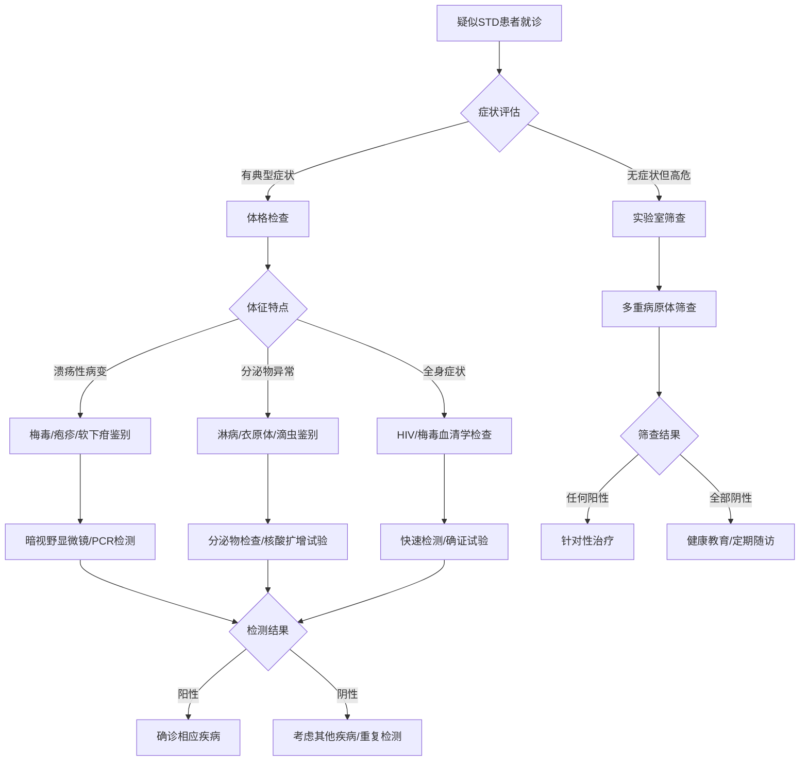
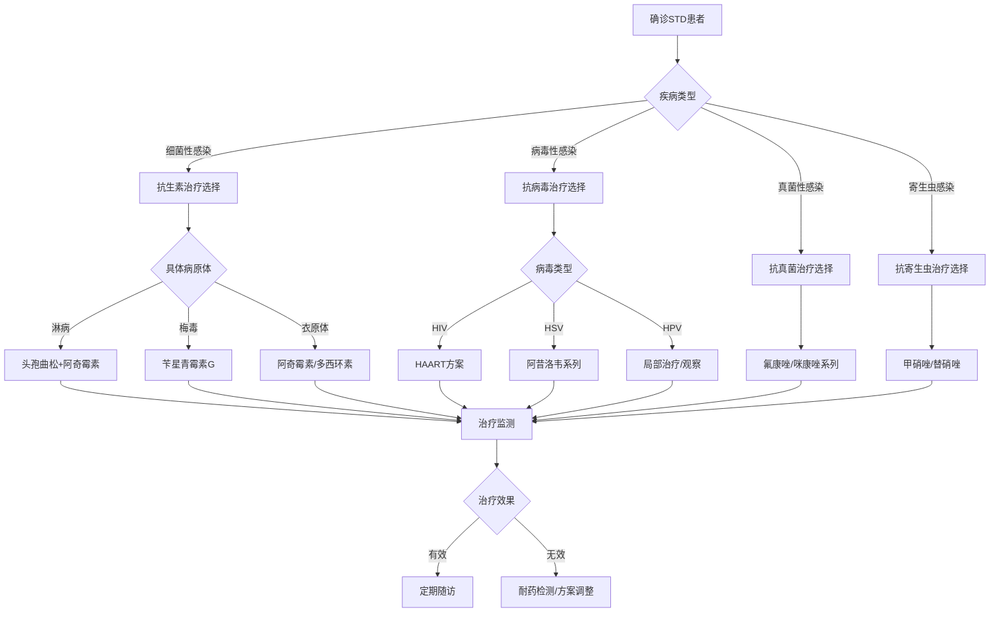

# STD Clinical Decision Support Toolkit (性传播疾病临床决策支持工具箱)

> 🛠️ **实用工具**: 本文档提供性传播疾病诊疗的实用工具、计算器、流程图和决策支持资源，帮助临床医师提高诊疗效率和准确性。

## 临床决策流程图 (Clinical Decision Flowcharts)

### 性传播疾病诊断流程图 (STD Diagnostic Flowchart)



### 治疗方案选择流程图 (Treatment Selection Flowchart)



## 用药计算器和剂量工具 (Dosage Calculators and Tools)

### 抗生素剂量计算器 (Antibiotic Dosage Calculator)

#### 成人剂量计算
```
头孢曲松剂量计算：
输入体重(kg): [______]
计算公式: 体重 × 20mg/kg (最大2g)
推荐剂量: [自动计算结果]

阿奇霉素剂量:
标准剂量: 1g 单次口服
特殊情况: 孕妇、肝功能异常需调整

多西环素剂量:
标准方案: 100mg 口服 bid × 7天
替代方案: 200mg 缓释片 qd × 7天
```

#### 儿童剂量计算
```
阿莫西林剂量:
• 体重<40kg: 50mg/kg/日 分3次
• 体重≥40kg: 成人剂量

头孢曲松儿童剂量:
• 新生儿: 25-50mg/kg 单次静脉注射
• 儿童: 50-75mg/kg 单次肌注(最大125mg)
```

### 抗病毒药物剂量工具 (Antiviral Dosage Tools)

#### HIV治疗方案计算器
```
基于体重的剂量计算:
替诺福韦剂量:
• 体重≥35kg: 300mg 每日一次
• 体重<35kg: 4mg/kg 每日一次

拉米夫定剂量:
• 体重≥25kg: 300mg 每日一次
• 体重<25kg: 4mg/kg 每日一次

依非韦伦剂量:
• 体重≥50kg: 600mg 每日晚睡前
• 体重<50kg: 400mg 每日晚睡前
```

## 风险评估工具 (Risk Assessment Tools)

### 性传播疾病风险评估量表 (STD Risk Assessment Scale)

#### 个人风险评分系统
```
风险因素评估 (每项0-3分):

行为风险因素:
□ 多性伴侣史 (0=无, 1=1个, 2=2-3个, 3=>3个)
□ 无保护性行为 (0=总是使用, 1=偶尔不用, 2=经常不用, 3=从不使用)
□ 商业性行为史 (0=无, 1=过去有, 2=偶尔, 3=经常)
□ 注射毒品史 (0=无, 1=过去有, 2=偶尔, 3=经常)

生物医学因素:
□ 年龄 (0=15-24岁, 1=25-35岁, 2=36-50岁, 3=>50岁)
□ 性别 (0=女性, 1=男性, 2=MSM, 3=跨性别者)
□ 免疫状态 (0=正常, 1=轻度抑制, 2=中度抑制, 3=重度抑制)
□ 既往STD史 (0=无, 1=1次, 2=2-3次, 3=>3次)

社会环境因素:
□ 教育水平 (0=大学以上, 1=高中, 2=初中, 3=小学以下)
□ 经济状况 (0=良好, 1=一般, 2=困难, 3=贫困)
□ 医疗可及性 (0=便利, 1=一般, 2=不便, 3=困难)
□ 社会支持 (0=良好, 1=一般, 2=不足, 3=缺乏)

总分计算: [自动计算总分]
风险等级判定:
• 低风险: 0-6分 (建议年度筛查)
• 中风险: 7-12分 (建议半年筛查)
• 高风险: 13-18分 (建议季度筛查)
• 极高风险: 19-27分 (建议月度筛查)
```

### HIV暴露风险评估工具 (HIV Exposure Risk Assessment)

#### 暴露后预防(PEP)决策工具
```
暴露风险分级评估:

高风险暴露 (推荐PEP):
□ 与HIV阳性者无保护性行为
□ 共用注射器吸毒
□ 职业暴露(针刺伤、体液接触)
□ 性侵犯受害者

中风险暴露 (个体化评估):
□ 与未知HIV状态者无保护性行为
□ 破损皮肤接触感染性体液
□ 粘膜接触可疑感染性物质

低风险暴露 (通常不需要PEP):
□ 完整皮肤接触体液
□ 安全套破损但无直接接触
□ 间接接触(衣物、物品等)

PEP启动决策:
暴露时间: [______] 小时前
风险等级: [自动评估]
推荐措施: [立即启动PEP/观察随访/无需干预]
```

## 随访管理模板 (Follow-up Management Templates)

### 治疗随访计划模板 (Treatment Follow-up Plan Template)

#### 细菌性STD随访
```
淋病随访计划:
• 治疗后7-14天: 症状评估和复查
• 治疗后3个月: 病原学复查确认治愈
• 治疗后6个月: 再次筛查防止再感染
• 合作伙伴通知: 确保性伴侣同时检查治疗

衣原体感染随访:
• 治疗后3-4周: 症状缓解情况
• 治疗后3个月: 复查确认清除
• 治疗后6个月: 重复筛查
• 依从性评估: 用药完整性和规律性
```

#### 病毒性STD随访
```
HIV感染随访:
• 病毒载量监测: 每3-6个月检测
• CD4+T细胞计数: 每6-12个月检测
• 耐药检测: 治疗失败时进行
• 药物浓度监测: 必要时进行

生殖器疱疹随访:
• 复发时及时就诊
• 每年健康体检评估
• 心理状态关注和支持
• 生活质量持续改善
```

### 患者教育材料模板 (Patient Education Material Templates)

#### 诊断告知模板
```
尊敬的患者，

您已被诊断患有[疾病名称]，这是一种常见的性传播疾病。

关于您的病情：
• 疾病性质：[简要说明疾病特点]
• 传播方式：[主要传播途径]
• 治疗方案：[具体治疗计划]
• 预后情况：[治愈可能性和注意事项]

重要提醒：
1. 请按时按量完成整个治疗过程
2. 治疗期间避免性行为或使用安全套
3. 通知近期性伴侣进行检查
4. 定期复查确认治愈
5. 如有任何不适请及时就医

我们理解这可能让您感到担心，但请放心，这种疾病是可以治愈的。我们的医疗团队将为您提供全程支持和帮助。

如有疑问，请随时联系我们。
```

#### 治疗指导模板
```
治疗期间注意事项：

用药指导：
• 严格按照医嘱服药，不可自行停药
• 注意药物副作用，如有严重反应及时就医
• 避免饮酒和某些可能相互作用的食物
• 按时复查肝肾功能等相关指标

生活指导：
• 治疗期间暂停性生活
• 保持良好的个人卫生习惯
• 充足休息，避免过度劳累
• 均衡饮食，增强免疫力

随访安排：
• 首次复查：治疗结束后[时间]
• 定期随访：每[时间]复查一次
• 紧急情况：出现异常症状立即就医
```

## 实验室检测指南 (Laboratory Testing Guide)

### 检测项目选择矩阵 (Test Selection Matrix)

| 临床情况 | 推荐检测项目 | 检测时机 | 注意事项 |
| :--- | :--- | :--- | :--- |
| **初次筛查** | HIV抗体、梅毒血清学、淋病/衣原体核酸 | 就诊时立即 | 空腹与否不影响结果 |
| **有症状患者** | 根据症状选择针对性检测 | 症状出现时 | 急性期检测敏感性高 |
| **高危暴露后** | HIV病毒载量、p24抗原 | 暴露后2-4周 | 早期诊断窗口期考虑 |
| **治疗监测** | 相关病原体定量检测 | 治疗后规定时间 | 确认治愈的标准 |
| **孕期检查** | 全套STD筛查 | 首次产检 | 母婴传播预防关键 |

### 检测结果解读指南 (Test Result Interpretation Guide)

#### 常见检测结果模式
```
HIV检测结果解读:
• 初筛阳性+确证阴性: 假阳性，无需治疗
• 初筛阳性+确证阳性: 确诊感染，需要治疗
• 窗口期内检测: 建议4周后复查

梅毒血清学解读:
• RPR阳性+TPHA阳性: 活动性梅毒
• RPR阴性+TPHA阳性: 既往感染或治愈
• RPR滴度变化: 反映治疗效果和疾病活动性

核酸检测结果:
• CT/NG阳性: 确诊感染，需要抗生素治疗
• HPV高危型阳性: 需要宫颈细胞学检查
• HSV PCR阳性: 确诊疱疹病毒感染
```

## 应急处理预案 (Emergency Response Protocols)

### 急性并发症处理流程 (Acute Complications Management)

#### 盆腔炎性疾病急诊处理
```
急诊评估要点:
1. 生命体征监测 (血压、心率、体温)
2. 腹部体征检查 (压痛、反跳痛、肌紧张)
3. 实验室检查 (血常规、CRP、血培养)
4. 影像学检查 (超声、CT必要时)

紧急处理措施:
• 抗生素治疗立即启动 (头孢曲松+多西环素)
• 液体复苏支持治疗
• 疼痛管理 (适当镇痛药物)
• 手术会诊准备 (必要时)

住院指征:
• 高热>38.5°C
• 严重腹痛无法缓解
• 恶心呕吐严重影响进食
• 门诊治疗效果不佳
```

#### 过敏反应紧急处理
```
药物过敏反应分级:
轻度过敏: 局部皮疹、轻度瘙痒
中度过敏: 全身皮疹、面部水肿
重度过敏: 呼吸困难、血压下降
过敏性休克: 循环衰竭、意识障碍

紧急处理步骤:
1. 立即停用可疑药物
2. 保持呼吸道通畅
3. 肌注肾上腺素 (0.3-0.5mg)
4. 静脉输液支持循环
5. 抗组胺药物应用
6. 糖皮质激素治疗
7. 密切监测生命体征
```

## 质量控制检查清单 (Quality Control Checklists)

### 诊疗质量核查表 (Clinical Quality Checklist)

#### 诊断质量控制
```
病史采集完整性 ✓
□ 主诉和现病史详细询问
□ 性行为史和暴露史评估
□ 既往病史和用药史了解
□ 家族史和过敏史记录

体格检查规范性 ✓
□ 系统性全身检查完成
□ 局部病变仔细观察
□ 淋巴结触诊评估
□ 相关系统检查完善

实验室检查合理性 ✓
□ 检测项目选择恰当
□ 样本采集和保存规范
□ 检测时机选择合适
□ 结果解读准确无误
```

#### 治疗质量控制
```
治疗方案适宜性 ✓
□ 药物选择符合指南推荐
□ 剂量和疗程计算准确
□ 考虑患者个体化因素
□ 药物相互作用评估

用药安全监控 ✓
□ 不良反应监测计划
□ 肝肾功能定期检查
□ 药物浓度必要时检测
□ 患者用药教育完成

随访管理规范性 ✓
□ 随访时间安排合理
□ 随访内容完整记录
□ 治疗效果及时评估
□ 并发症早期发现处理
```

---

*本工具箱旨在为临床医师提供实用的决策支持和操作指导，建议结合具体临床情况和最新指南灵活应用。*