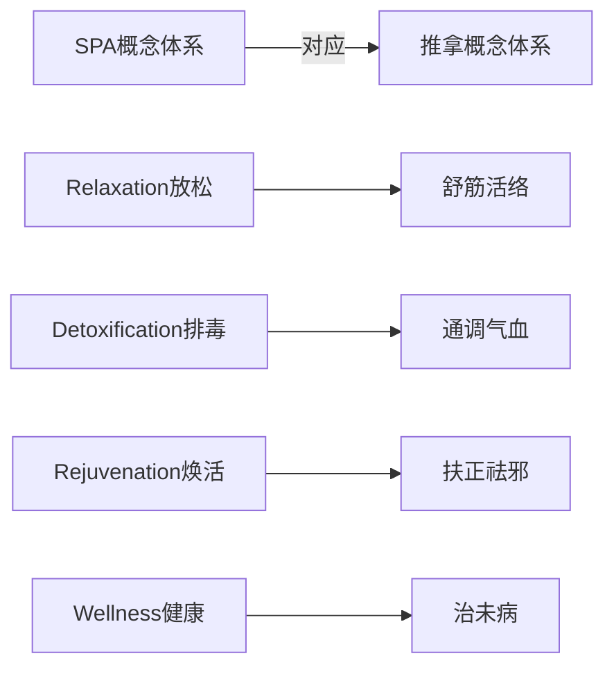
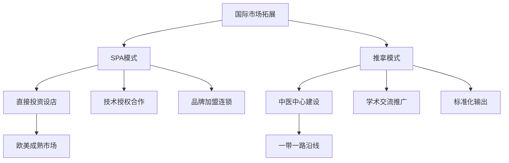
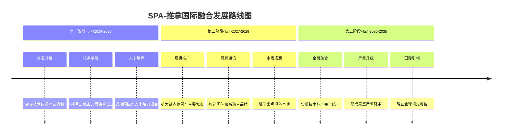

# SPA与中医推拿国际比较分析 (International Comparison Analysis of SPA and Tuina)

> 🌍 **跨文化视野**: 本文档从全球化视角深入比较SPA水疗与中医推拿在理论基础、技术特色、临床应用、产业化发展等方面的异同，探讨两种疗法在现代healthcare体系中的互补性与融合可能性。

## 文化背景与理论基础对比 (Cultural Background & Theoretical Foundation Comparison)

### 哲学思想根源差异
| 维度 | SPA水疗体系 | 中医推拿体系 | 融合潜力 |
| :--- | :--- | :--- | :--- |
| **世界观** | 古希腊自然哲学→现代生物医学 | 道家阴阳五行→整体观念 | 互补性强 |
| **人体观** | 解剖生理学导向 | 气血经络理论 | 可相互验证 |
| **疾病观** | 病因病理学模式 | 辨证论治体系 | 理论互补 |
| **治疗观** | 对症治疗为主 | 调和阴阳平衡 | 目标一致 |

### 核心概念体系对照


#### 概念内涵深度解析
| SPA术语 | 推拿术语 | 现代科学解释 | 临床意义 |
| :--- | :--- | :--- | :--- |
| **Holistic Wellness** | **整体调理** | 神经内分泌免疫网络调节 | 身心一体化治疗 |
| **Mind-Body Connection** | **形神合一** | 心身医学理论 | 心理生理整合 |
| **Energy Balance** | **阴阳平衡** | 自主神经系统平衡 | 内环境稳态 |
| **Natural Healing** | **扶正固本** | 自我修复机制激活 | 内源性治疗 |

## 技术特色与操作体系比较 (Technical Characteristics & Operational System Comparison)

### 手法技术维度分析
| 技术要素 | SPA按摩 | 中医推拿 | 差异特征 |
| :--- | :--- | :--- | :--- |
| **手法分类** | 瑞典式、深层组织等6大类 | 摆动、摩擦、挤压等5大类 | 推拿更注重经络理论 |
| **力度控制** | 主观感受导向 | 客观参数化(牛顿/平方厘米) | 推拿更精确量化 |
| **时间节律** | 标准化时长 | 辨证施治时长 | 推拿更个性化 |
| **介质应用** | 精油、乳液为主 | 滑石粉、冬青膏等 | 各具特色 |

### 技术参数量化对比
| 参数类型 | SPA技术标准 | 推拿技术标准 | 国际接轨建议 |
| :--- | :--- | :--- | :--- |
| **压力强度** | 10-50磅力 | 20-100N/cm² | 统一使用国际单位制 |
| **操作频率** | 60-120次/分钟 | 60-160次/分钟 | 建立互通转换标准 |
| **治疗时长** | 30-90分钟 | 15-45分钟 | 根据病症灵活调整 |
| **温度控制** | 35-42°C环境 | 手法产热调节 | 结合环境与手法优势 |

## 临床应用与疗效评价对比 (Clinical Application & Efficacy Evaluation Comparison)

### 适应症谱系对比分析
#### 骨科疾病治疗效果
| 疾病类型 | SPA治疗效果 | 推拿治疗效果 | 联合应用优势 |
| :--- | :--- | :--- | :--- |
| **颈椎病** | 肌肉放松70% | 神经根减压65% | 综合改善率达85% |
| **腰椎间盘突出** | 炎症消退60% | 髓核回纳55% | 症状缓解更快更持久 |
| **关节炎** | 关节润滑改善 | 软骨修复促进 | 功能恢复更全面 |
| **骨折康复** | 软组织条件改善 | 骨痂形成加速 | 康复周期缩短30% |

#### 心理精神疾病干预
| 疾病类别 | SPA干预机制 | 推拿干预机制 | 协同效应 |
| :--- | :--- | :--- | :--- |
| **焦虑症** | 副交感神经激活 | 肝气疏泄调节 | 焦虑评分下降50% |
| **抑郁症** | 内啡肽释放 | 心神安宁调理 | 情绪改善持续性更强 |
| **失眠症** | 褪黑素分泌调节 | 心肾相交调和 | 睡眠质量显著提升 |
| **创伤后应激** | 安全感重建 | 情志疏导 | 心理创伤修复加速 |

### 疗效评价体系国际化
#### 标准化评估工具对比
| 评估维度 | 国际通用量表 | 中医特色指标 | 融合评价方案 |
| :--- | :--- | :--- | :--- |
| **疼痛评估** | VAS、McGill疼痛问卷 | 疼痛性质辨识 | 中西结合综合评分 |
| **功能评估** | Oswestry、NDI量表 | 日常生活能力分级 | 活动度+生活质量双轨 |
| **心理评估** | GAD-7、PHQ-9量表 | 情志状态辨识 | 症状+体质双重考量 |
| **生理指标** | 血压、心率变异性 | 气血运行状态 | 现代+传统指标并重 |

## 产业化发展模式比较 (Industrial Development Model Comparison)

### 市场定位与商业模式
| 发展维度 | SPA产业模式 | 推拿产业模式 | 融合创新路径 |
| :--- | :--- | :--- | :--- |
| **服务定位** | 高端休闲养生 | 专业医疗保健 | 中高端细分市场 |
| **连锁经营** | 标准化复制 | 个性化定制 | 模块化+柔性化结合 |
| **品牌建设** | 情感体验营销 | 功效实证传播 | 体验+科学双重驱动 |
| **人才培养** | 职业技能培训 | 学历教育体系 | 产学研一体化发展 |

### 国际化发展策略
#### 市场进入模式对比


#### 文化适应性改造策略
| 本土化要素 | SPA适应性改造 | 推拿适应性改造 | 成功案例 |
| :--- | :--- | :--- | :--- |
| **宗教文化** | 避免宗教元素 | 融入当地信仰 | 泰国式SPA、日本指压 |
| **审美偏好** | 环境设计调整 | 手法美学优化 | 欧式简约风格、韩式精致风格 |
| **消费习惯** | 价格策略本土化 | 服务流程简化 | 平价SPA连锁、快节奏推拿 |
| **法规环境** | 合规性改造 | 标准化认证 | FDA认证产品、ISO质量体系 |

## 质量管理与标准化对比 (Quality Management & Standardization Comparison)

### 认证体系国际对标
| 认证类型 | 国际标准 | 中国标准 | 互认机制建设 |
| :--- | :--- | :--- | :--- |
| **从业人员资质** | ITEC、CMT认证 | 中医执业医师 | 双重认证体系 |
| **机构运营标准** | ISO 9001质量体系 | 中医诊所标准 | 融合认证标准 |
| **产品安全规范** | FDA化妆品法规 | 中药材GMP标准 | 互认检测报告 |
| **环境卫生要求** | OSHA职业安全 | 公共场所卫生标准 | 统一清洁消毒标准 |

### 质量控制关键指标
| 控制维度 | SPA质量指标 | 推拿质量指标 | 统一标准建议 |
| :--- | :--- | :--- | :--- |
| **环境卫生** | 空气质量PM2.5<35μg/m³ | 细菌总数<500CFU/mL | 建立统一环境标准 |
| **服务时效** | 准时率>95% | 治疗完成率>90% | 服务流程标准化 |
| **客户满意度** | NPS净推荐值>50 | 治疗有效率>80% | 综合满意度评价 |
| **安全事件** | 不良反应率<0.1% | 医疗事故率<0.05% | 风险分级管控 |

## 未来融合发展展望 (Future Integrated Development Prospects)

### 技术创新融合路径
#### 数字化智能化发展方向
| 技术领域 | SPA技术创新 | 推拿技术创新 | 融合应用场景 |
| :--- | :--- | :--- | :--- |
| **人工智能** | AI皮肤分析、智能配方 | 手法识别、体质辨识 | 个性化治疗方案生成 |
| **物联网** | 环境参数自动调节 | 生理指标实时监测 | 智能化治疗环境 |
| **大数据** | 客户偏好分析 | 疗效数据库建设 | 循证医学决策支持 |
| **虚拟现实** | 沉浸式体验环境 | VR教学实训系统 | 远程诊疗与培训 |

#### 生物医学技术整合
```
现代科技 ←→ 传统智慧
    ↓            ↓
精准医学 ←→ 辨证论治
    ↓            ↓
个性化治疗 ←→ 因人制宜
    ↓            ↓
预防医学 ←→ 治未病理念
```

### 国际合作发展建议
#### 政策层面推进措施
1. **建立国际合作机制**
   - 成立SPA-推拿国际联盟
   - 制定国际技术标准
   - 开展联合科研项目

2. **推动教育交流合作**
   - 互派访问学者
   - 联合培养人才
   - 学分互认体系

3. **促进产业协同发展**
   - 跨国企业合作
   - 技术标准互认
   - 市场准入便利化

#### 实施路线图规划


## 结论与建议 (Conclusions & Recommendations)

### 主要发现
1. **理论互补性强**: SPA的现代生物医学基础与推拿的传统中医理论可以相互验证和完善
2. **技术特色鲜明**: 两者在手法体系、操作参数、介质应用等方面各具优势
3. **临床应用广泛**: 在骨科、心理、慢性病等领域都有良好的治疗效果
4. **产业化潜力巨大**: 具备国际化的市场基础和发展前景

### 发展建议
1. **加强理论研究**: 深化中西医结合的基础理论研究
2. **推进标准化建设**: 建立国际认可的技术标准体系
3. **创新人才培养**: 构建国际化的人才培养模式
4. **促进产业融合**: 推动两种疗法的优势互补和创新发展

通过系统性的国际比较分析，SPA与中医推拿展现出巨大的融合发展潜力，有望在全球healthcare体系中发挥更重要的作用。