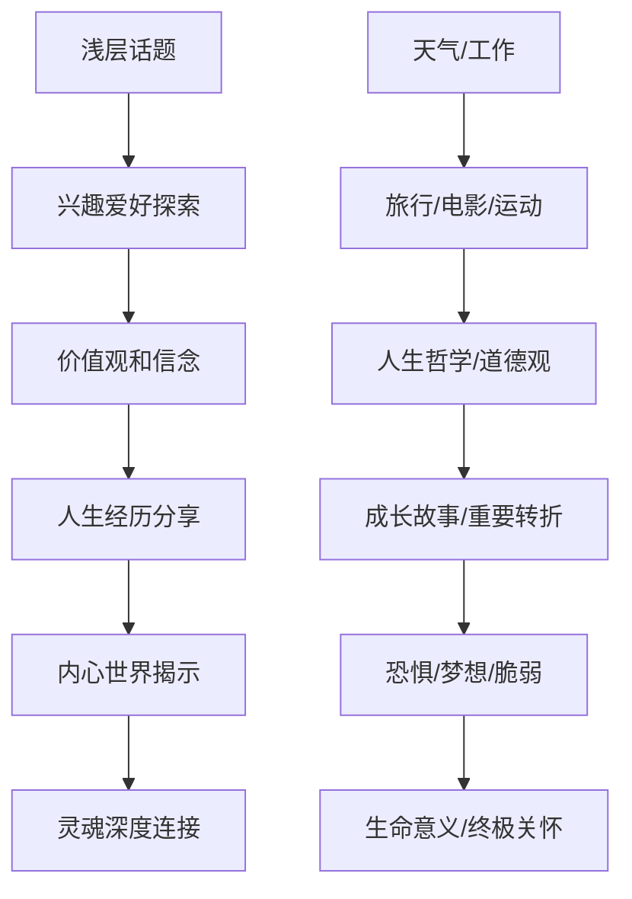

# Dating Communication Skills & Interaction Strategies (约会沟通技巧与互动策略)

> 📘 **文档导航**: 本指南提供约会各阶段的沟通技巧和互动策略。相关文档：
> - [约会心理学概览](Dating_Psychology_Overview.md) - 理论基础和核心概念
> - [吸引力法则与择偶](Dating_Attraction_Selection.md) - 吸引力提升和匹配策略
> - [关系发展阶段](Dating_Relationship_Stage.md) - 约会进程管理
> - [约会伦理与法律考量](Dating_Ethics_Legal.md) - 沟通中的伦理边界

## 初始接触与破冰技巧 (Initial Contact & Ice-breaking)

### 第一印象塑造矩阵

| 印象维度 | 关键要素 | 具体策略 | 注意事项 | 效果评估 |
| :--- | :--- | :--- | :--- | :--- |
| **视觉印象** | 着装搭配、仪态举止、面部表情 | 适合场合的得体着装、挺拔姿态、自然微笑 | 避免过于夸张或过于随意 | 观察对方眼神接触频率 |
| **声音印象** | 语调语速、音量控制、语言选择 | 温暖自信的语调、适中语速、正面词汇 | 避免单调或过于激动 | 注意对方身体语言反馈 |
| **内容印象** | 话题选择、表达方式、幽默运用 | 分享有趣经历、询问对方兴趣、适度自嘲 | 避免争议话题或自我吹嘘 | 评估对话流畅度和共鸣度 |

### 破冰对话开场白分类

| 开场类型 | 适用场景 | 具体示例 | 成功率 | 风险提示 |
| :--- | :--- | :--- | :--- | :--- |
| **环境关联型** | 咖啡厅、书店、健身房等特定场所 | "这家咖啡的拿铁真的很棒，你常来吗？" | 85% | 确保评论积极正面 |
| **活动参与型** | 聚会、讲座、户外活动 | "刚才那个演讲很有意思，你觉得哪个观点最印象深刻？" | 80% | 展现认真参与的态度 |
| **趣味观察型** | 日常生活场景 | "注意到你选了这本书，我也很喜欢这个作者" | 75% | 观察要真实细致 |
| **轻松幽默型** | 轻松社交场合 | "排队等咖啡的时候我在想，也许应该开个专门卖咖啡因的银行" | 70% | 幽默要适度，避免冒犯 |

### 非语言沟通信号解码

| 信号类型 | 积极信号 | 消极信号 | 中性信号 | 解读要点 |
| :--- | :--- | :--- | :--- | :--- |
| **目光接触** | 持续适度的眼神交流、偶尔移开视线 | 长时间凝视、频繁躲避眼神 | 偶尔看手机或周围环境 | 结合情境和文化背景理解 |
| **身体姿态** | 面向你、前倾、开放手势 | 背对你、交叉双臂、后仰 | 侧身、保持中等距离 | 注意整体姿态的一致性 |
| **面部表情** | 真诚微笑、点头回应、表情丰富 | 皱眉、撇嘴、面无表情 | 表情平淡、反应迟缓 | 微表情往往更真实 |
| **空间距离** | 主动缩短距离、进入个人空间 | 保持较远距离、明显回避接触 | 维持社交距离 | 考虑文化差异和个人习惯 |

## 深度对话技巧 (Deep Conversation Skills)

### 话题展开金字塔模型

### 高质量提问技巧库

| 提问类型 | 目标功能 | 具体示例 | 使用时机 | 注意事项 |
| :--- | :--- | :--- | :--- | :--- |
| **开放式问题** | 获取详细信息、鼓励表达 | "什么让你对摄影产生兴趣的？" | 初次深入了解时 | 避免过于宽泛的问题 |
| **假设性问题** | 探索价值观、想象力 | "如果你可以选择任何职业，会选择什么？" | 建立情感连接时 | 确保问题不会造成压力 |
| **回忆性问题** | 了解成长背景、情感深度 | "童年最快乐的记忆是什么？" | 增进亲密感时 | 尊重隐私边界 |
| **未来导向问题** | 了解目标愿景、兼容性 | "五年后你希望自己成为什么样的人？" | 评估长期匹配度 | 关注回答的积极性 |
| **情感反射问题** | 加深理解和共情 | "听起来那段经历对你影响很大，你现在怎么看？" | 对方分享重要经历后 | 真诚表达理解 |

### 倾听与回应技巧

| 倾听层次 | 表现特征 | 具体技巧 | 效果指标 | 练习方法 |
| :--- | :--- | :--- | :--- | :--- |
| **被动倾听** | 仅接收信息、无反馈 | 保持安静、点头示意 | 基本礼貌 | 观察他人对话练习 |
| **选择性倾听** | 关注感兴趣的部分 | 重复关键词、询问细节 | 信息获取 | 专注训练、笔记记录 |
| **积极倾听** | 全神贯注、理解意图 | 复述总结、情感确认 | 深度理解 | 角色扮演、反馈练习 |
| **共情倾听** | 感受情绪、心灵共鸣 | 情感共鸣、支持性回应 | 情感连接 | 冥想练习、情感词汇扩展 |

## 约会各阶段沟通策略 (Communication Strategies by Dating Stage)

### 初次约会沟通要点

| 沟通维度 | 目标 | 策略要点 | 避免事项 | 成功标志 |
| :--- | :--- | :--- | :--- | :--- |
| **自我介绍** | 建立初步印象、展现真实自我 | 简洁有趣、突出个性特点 | 过分谦虚或自夸 | 对方表现出好奇和兴趣 |
| **话题引导** | 维持对话流畅、发现共同点 | 开放式提问、分享相关经历 | 独占话题或沉默寡言 | 双向交流自然流畅 |
| **节奏把控** | 营造舒适氛围、避免压力 | 适度幽默、适时转换话题 | 过于严肃或轻浮 | 双方都感到放松愉快 |
| **结束信号** | 为下次接触铺垫、留下好印象 | 表达感谢、暗示再见意愿 | 强迫延续或突然中断 | 双方都期待下次见面 |

### 进展期沟通重点

| 发展任务 | 沟通策略 | 具体实施 | 风险管控 | 评估标准 |
| :--- | :--- | :--- | :--- | :--- |
| **加深了解** | 真实自我披露、价值观探索 | 分享个人故事、讨论重要议题 | 保持适度节奏、观察对方反应 | 信任感逐步建立 |
| **情感表达** | 传递好感、确认相互兴趣 | 适度赞美、表达欣赏 | 避免过早表白或过于保守 | 情感回应积极正面 |
| **边界试探** | 了解舒适区、建立互动规则 | 轻微身体接触、私人话题探讨 | 尊重拒绝信号、及时调整 | 边界逐渐清晰明确 |
| **未来规划** | 探讨发展方向、同步期望 | 讨论约会频率、关系定义 | 避免给对方压力、保持开放态度 | 双方对未来有一致预期 |

### 稳定期沟通维护

| 维护维度 | 核心技能 | 实践方法 | 常见误区 | 优化建议 |
| :--- | :--- | :--- | :--- | :--- |
| **日常沟通** | 保持联系、分享生活 | 定期消息、关心问候 | 过度频繁或完全忽视 | 建立舒适的沟通节奏 |
| **冲突预防** | 及时沟通、化解误解 | 主动澄清、表达感受 | 回避问题或过度敏感 | 培养直接但温和的表达习惯 |
| **情感滋养** | 表达爱意、创造惊喜 | 小礼物、贴心举动 | 理所当然或过分浪漫 | 根据对方喜好个性化表达 |
| **共同成长** | 支持发展、互相激励 | 鼓励尝试、共同学习 | 过度控制或完全放任 | 平衡支持与独立发展空间 |

## 数字化沟通技巧 (Digital Communication Skills)

### 文本消息沟通艺术

| 消息类型 | 最佳发送时机 | 内容结构 | 回复期待时间 | 效果优化 |
| :--- | :--- | :--- | :--- | :--- |
| **问候消息** | 白天工作间隙、晚上休闲时间 | 简短友好+具体内容 | 2-4小时内 | 个性化问候内容 |
| **约会邀请** | 周末前、工作日中午 | 具体时间地点+活动说明 | 24小时内 | 提供多个选项 |
| **跟进消息** | 约会后当天晚上 | 感谢+积极反馈 | 2-6小时内 | 真诚具体的内容 |
| **日常分享** | 对方空闲时段 | 有趣经历+相关图片 | 灵活响应 | 保持自然对话感 |

### 社交媒体互动策略

| 平台类型 | 互动方式 | 注意事项 | 最佳实践 | 风险防范 |
| :--- | :--- | :--- | :--- | :--- |
| **朋友圈/动态** | 点赞评论、分享共鸣 | 关注内容质量、避免过度互动 | 真诚有价值的互动 | 避免窥探隐私 |
| **照片视频** | 适度分享、创意表达 | 考虑对方感受、保护隐私 | 展现真实生活状态 | 避免炫耀或引起不适 |
| **语音视频** | 定期通话、面对面交流 | 选择合适环境、注意形象 | 营造温馨亲切氛围 | 尊重对方时间和空间 |

## 特殊情况沟通应对 (Special Situation Communication)

### 紧张焦虑时的沟通调节

| 焦虑类型 | 表现特征 | 调节策略 | 实施要点 | 效果评估 |
| :--- | :--- | :--- | :--- | :--- |
| **社交焦虑** | 手心出汗、语无伦次、过度紧张 | 深呼吸放松、积极自我暗示 | 提前准备话题、降低期望值 | 逐渐适应社交情境 |
| **表现焦虑** | 过分在意形象、担心被拒绝 | 专注当下、接受不完美 | 关注对方而非自己、保持自然 | 建立真实的人际连接 |
| **关系焦虑** | 患得患失、过度解读、缺乏安全感 | 理性分析、寻求支持 | 培养独立性、建立支持网络 | 增强心理韧性和自信 |

### 文化差异沟通桥梁

| 差异维度 | 常见冲突 | 理解策略 | 沟通技巧 | 和谐发展 |
| :--- | :--- | :--- | :--- | :--- |
| **表达方式** | 直接vs含蓄、热情vs内敛 | 学习对方文化背景、观察行为模式 | 适应对方沟通风格、明确表达意图 | 建立跨文化理解能力 |
| **价值观念** | 个人主义vs集体主义、传统vs现代 | 尊重差异、寻找共同点 | 开放讨论、求同存异 | 促进文化融合与包容 |
| **行为规范** | 礼仪习俗、时间观念、亲密程度 | 提前了解、主动询问 | 遵循当地习俗、适度调整 | 构建和谐多元关系 |

### 冲突情境沟通修复

| 冲突类型 | 根本原因 | 修复步骤 | 沟通要点 | 预防措施 |
| :--- | :--- | :--- | :--- | :--- |
| **误解冲突** | 信息不对称、表达不清 | 澄清事实、表达真实想法 | 使用"I"语句、避免指责 | 提高沟通清晰度 |
| **价值观冲突** | 根本理念差异、优先级不同 | 理解对方立场、寻找平衡点 | 尊重差异、寻求妥协 | 建立核心价值共识 |
| **情绪冲突** | 压力传导、情感积累 | 情绪疏导、共情理解 | 先处理情绪、再解决问题 | 建立定期沟通机制 |

## 沟通技能自我评估与发展 (Communication Skills Self-Assessment & Development)

### 沟通能力测评量表

| 能力维度 | 评估项目 | 评分标准 | 发展建议 | 资源推荐 |
| :--- | :--- | :--- | :--- | :--- |
| **表达能力** | 清晰度、逻辑性、感染力 | 1-5分制自我评估 | 参加演讲训练、写作练习 | Toastmasters、沟通工作坊 |
| **倾听能力** | 专注度、理解力、回应质量 | 360度反馈评估 | 正念练习、主动倾听训练 | 同理心训练课程 |
| **非语言沟通** | 肢体语言、面部表情、声音控制 | 录像自我观察 | 镜子练习、专业指导 | 肢体语言书籍、表演课程 |
| **情感智慧** | 情绪识别、共情能力、关系管理 | EQ-i 2.0测评 | 情绪日记、心理咨询 | 情商训练营、心理治疗 |

### 持续改进行动计划

| 发展阶段 | 时间周期 | 重点目标 | 具体行动 | 效果衡量 |
| :--- | :--- | :--- | :--- | :--- |
| **基础巩固期** | 1-3个月 | 掌握基本沟通技巧 | 每日对话练习、录音自我分析 | 对话流畅度提升 |
| **技能提升期** | 3-6个月 | 发展深度沟通能力 | 参加沟通工作坊、寻求导师指导 | 能够进行有意义的深度对话 |
| **精通应用期** | 6-12个月 | 灵活运用各种沟通策略 | 实际约会场景应用、持续反思优化 | 在各种情境下都能有效沟通 |

---
*📚 本文档结合心理学研究、沟通理论和实践经验编写，旨在帮助读者建立健康有效的约会沟通模式。*
