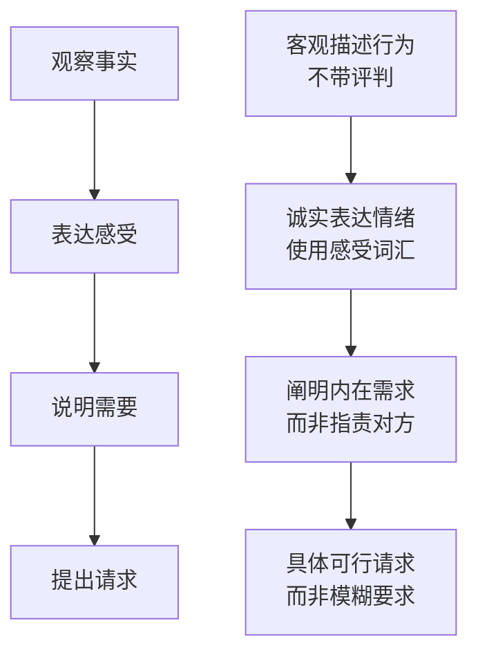
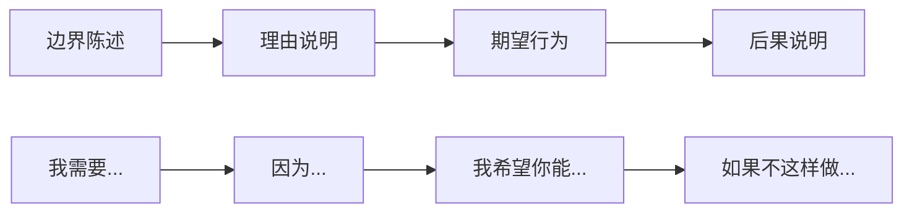
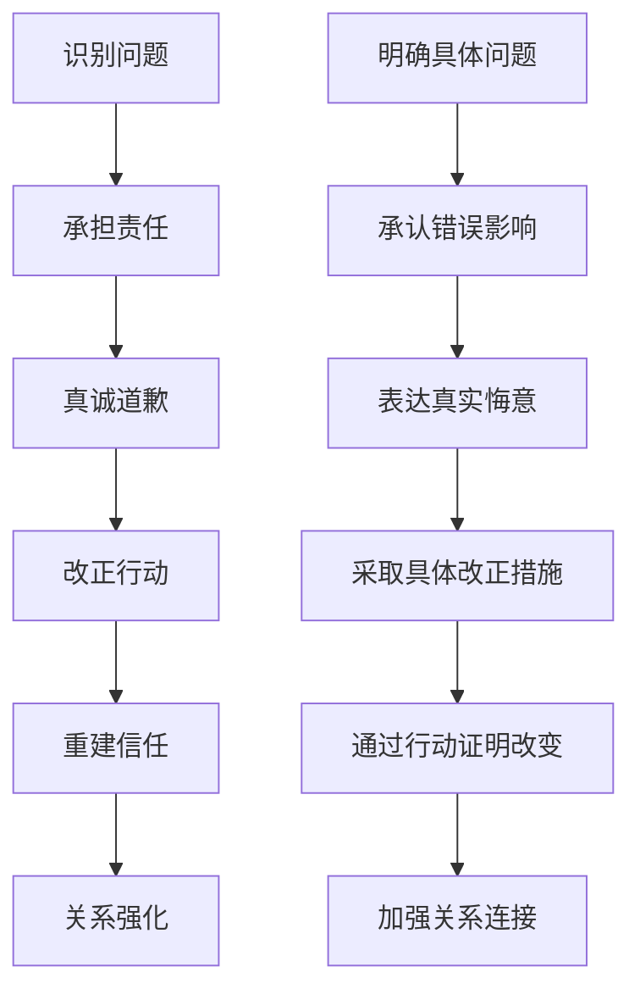

# Dating Conflict Management & Boundary Setting (约会冲突管理与边界设定)

> 📘 **文档导航**: 本指南提供约会关系中冲突预防、处理和边界维护的专业策略。相关文档：
> - [约会心理学概览](Dating_Psychology_Overview.md) - 理论基础
> - [约会沟通技巧](Dating_Communication_Skills.md) - 沟通基础
> - [关系发展阶段](Dating_Relationship_Stage.md) - 发展进程

## 冲突预防与早期识别 (Conflict Prevention & Early Recognition)

### 冲突根源分析矩阵

| 冲突类型 | 根本原因 | 表现形式 | 预防策略 | 早期信号 |
| :--- | :--- | :--- | :--- | :--- |
| **价值观冲突** | 核心信念、人生目标不一致 | 关于重要议题的分歧 | 早期深度沟通、价值观澄清 | 频繁的小分歧、根本性争论 |
| **沟通模式冲突** | 表达方式、理解习惯差异 | 误解频发、表达困难 | 学习有效沟通技巧 | 重复的误解、沟通挫败感 |
| **依恋风格冲突** | 安全需求、亲密方式不同 | 焦虑-回避的循环模式 | 理解依恋理论、适应调整 | 情感需求不匹配、安全感缺失 |
| **生活方式冲突** | 作息习惯、社交偏好差异 | 日常摩擦、活动安排困难 | 协商生活习惯、寻找平衡点 | 生活节奏不协调、活动冲突 |
| **期望不匹配** | 对关系发展速度和形式的不同期待 | 进度焦虑、发展方向分歧 | 明确讨论期望、定期检视 | 关系节奏不同步、未来规划冲突 |

### 冲突预警信号系统

#### 情感层面预警
| 预警等级 | 信号表现 | 持续时间 | 影响程度 | 应对优先级 |
| :--- | :--- | :--- | :--- | :--- |
| **轻度预警** | 轻微不满、偶尔抱怨 | 1-3天 | 局部影响 | 中等优先处理 |
| **中度预警** | 情绪波动、回避行为 | 1-2周 | 明显影响 | 高优先处理 |
| **重度预警** | 持续愤怒、冷战状态 | 2周以上 | 严重影响 | 紧急处理 |
| **危机预警** | 情感麻木、考虑分离 | 1个月以上 | 关系濒危 | 立即干预 |

#### 行为层面预警
| 预警信号 | 具体表现 | 背后含义 | 应对时机 | 处理策略 |
| :--- | :--- | :--- | :--- | :--- |
| **沟通减少** | 主动联系频率明显下降 | 情感投入度降低 | 信号出现后24-48小时内 | 主动沟通、了解原因 |
| **身体语言变化** | 避免接触、姿态封闭 | 情感距离增加 | 观察到变化后立即 | 温和询问、表达关心 |
| **话题回避** | 避免讨论重要议题 | 存在未解决的问题 | 适当时机主动提及 | 创造安全讨论环境 |
| **行为模式改变** | 作息、社交习惯异常 | 压力或不满的表现 | 变化持续3天以上 | 关心询问、提供支持 |

## 健康冲突处理技能 (Healthy Conflict Resolution Skills)

### 冲突处理核心原则

#### 非暴力沟通框架

#### 冲突处理黄金法则
| 法则内容 | 具体应用 | 注意事项 | 效果预期 |
| :--- | :--- | :--- | :--- |
| **就事论事** | 专注当前问题，不翻旧账 | 避免人身攻击和扩大化 | 提高解决效率，减少伤害 |
| **情绪先行** | 先处理情绪再解决问题 | 情绪激烈时暂停讨论 | 创造理性沟通环境 |
| **共赢导向** | 寻求双方都能接受的解决方案 | 避免零和思维 | 增强关系凝聚力 |
| **及时处理** | 问题出现后尽快解决 | 避免积累怨恨 | 防止小问题演变成大矛盾 |

### 具体冲突处理技巧

#### 开启对话的艺术
| 开启方式 | 适用情境 | 具体表达 | 成功率 | 风险控制 |
| :--- | :--- | :--- | :--- | :--- |
| **软化开场** | 敏感话题、潜在冲突 | "我想和你聊聊...这件事让我有些困扰" | 85% | 语气温和、表达关切 |
| **感谢引入** | 日常摩擦、小事争议 | "谢谢你一直以来的...，我想谈谈一个小问题" | 80% | 先肯定再提出 | 
| **好奇询问** | 误解产生、行为异常 | "我注意到...，能告诉我你是怎么想的吗？" | 75% | 表现真诚好奇 |
| **自我负责** | 自身感受、个人需求 | "我觉得...，这让我想到..." | 70% | 使用"I"语句避免指责 |

#### 情绪调节技巧库
| 调节方法 | 实施步骤 | 适用场景 | 效果评估 | 练习建议 |
| :--- | :--- | :--- | :--- | :--- |
| **深呼吸法** | 4-7-8呼吸节奏 | 情绪激动时 | 心率下降、冷静恢复 | 每日5分钟练习 |
| **暂停技巧** | 明确表达暂停需求 | 冲突升级时 | 避免冲动言行 | 建立暂停信号约定 |
| **重构思维** | 重新解读事件意义 | 消极思维时 | 情绪负担减轻 | 认知行为练习 |
| **身体放松** | 渐进式肌肉放松 | 身体紧张时 | 生理压力缓解 | 睡前放松训练 |

## 边界设定与维护 (Boundary Setting & Maintenance)

### 健康边界识别系统

#### 边界类型分类
| 边界类型 | 具体内容 | 设定方式 | 维护策略 | 破坏后果 |
| :--- | :--- | :--- | :--- | :--- |
| **物理边界** | 身体接触、个人空间、隐私领域 | 明确告知、身体语言表达 | 坚持立场、及时纠正越界 | 身体不适、安全感缺失 |
| **情感边界** | 情感投入程度、情绪责任分担 | 直接沟通、行为示范 | 保持独立性、拒绝过度承担 | 情感耗竭、关系失衡 |
| **时间边界** | 独处时间、社交时间分配 | 协商安排、提前沟通 | 坚守约定、灵活调整 | 时间冲突、个人发展受限 |
| **价值观边界** | 道德底线、核心信念坚持 | 明确表态、一致性行为 | 原则坚持、寻求理解 | 价值冲突、身份认同混乱 |
| **数字边界** | 社交媒体互动、通讯频率 | 制定规则、技术设置 | 执行约定、定期检视 | 信息过载、隐私侵犯 |

### 边界设定沟通模板

#### 边界表达结构

#### 具体表达示例
| 边界类型 | 表达模板 | 情境应用 | 注意要点 |
| :--- | :--- | :--- | :--- |
| **时间边界** | "我需要每周有两天完全属于自己的时间，用来充电和发展个人兴趣。这能让我在关系中保持更好的状态。希望你能理解和支持。如果临时有重要事情，我们可以商量调整。" | 工作日晚上个人时间 | 强调互利性、提供灵活性 |
| **情感边界** | "当我遇到困难时，我希望能先自己处理一段时间，然后再和你分享。这样我能更好地整理思路，也能减轻你的负担。如果你觉得被排斥，请相信这只是我的处理方式。" | 情绪困扰时的处理 | 解释个人需求、消除误解 |
| **社交边界** | "我希望我们在朋友面前能保持一致的形象，不要在他人面前讨论我们的分歧。这对我很重要，也是对彼此的尊重。如果我们有不同看法，可以私下交流。" | 公共场合行为准则 | 强调尊重、提供替代方案 |

## 特殊情况处理策略 (Special Situation Handling Strategies)

### 高难度冲突应对

#### 依恋相关冲突
| 冲突模式 | 核心问题 | 解决策略 | 沟通要点 | 长期改善 |
| :--- | :--- | :--- | :--- | :--- |
| **焦虑-回避循环** | 焦虑方需求亲密，回避方需要空间 | 建立"安全基地"模式 | 焦虑方表达需求但给对方时间，回避方承诺回应但需要空间 | 依恋风格成长、建立安全感 |
| **控制-反抗模式** | 一方试图控制，另一方抗拒 | 识别控制行为、建立平等对话 | 控制方学会放手，被控制方表达真实需求 | 权力平衡、相互尊重 |
| **理想化-贬低循环** | 过度理想化后转为贬低 | 现实检验、稳定评价 | 承认优点也接受缺点，避免极端化评价 | 建立稳定认知、减少情绪波动 |

#### 价值观根本冲突
| 冲突领域 | 处理原则 | 具体方法 | 成功要素 | 失败预警 |
| :--- | :--- | :--- | :--- | :--- |
| **人生目标** | 寻找共同点、尊重差异 | 制定共同愿景、个人目标并行 | 核心价值观一致、次要目标灵活 | 目标完全对立、无法妥协 |
| **道德标准** | 原则坚持、相互理解 | 深度对话、寻求平衡点 | 基本道德底线一致 | 道德观念根本冲突 |
| **生活方式** | 协商调整、创造融合 | 制定生活公约、保留个人空间 | 重要方面协调、次要方面包容 | 生活方式完全不兼容 |

### 危机干预技术

#### 紧急情绪处理
| 危机类型 | 立即行动 | 短期策略 | 长期规划 | 专业资源 |
| :--- | :--- | :--- | :--- | :--- |
| **激烈争吵** | 暂停对话、各自冷静 | 情绪平复后重新沟通 | 建立冲突处理机制 | 夫妻咨询师 |
| **信任危机** | 诚实面对、承担责任 | 重建信任的具体步骤 | 系统性信任修复计划 | 心理治疗师 |
| **分离焦虑** | 提供安全感、明确承诺 | 建立稳定的联系模式 | 增强独立性和安全感 | 依恋治疗专家 |
| **创伤触发** | 创伤知情回应、提供支持 | 专业创伤治疗介入 | 长期创伤康复计划 | 创伤专科医生 |

## 边界维护实践指南 (Boundary Maintenance Practice Guide)

### 日常维护机制

#### 边界检视清单
| 检视维度 | 频率 | 具体内容 | 评估标准 | 改进措施 |
| :--- | :--- | :--- | :--- | :--- |
| **边界清晰度** | 每月一次 | 边界是否明确、双方是否理解 | 清晰度评分1-10分 | 重新协商、明确表达 |
| **边界执行度** | 每周回顾 | 边界是否被尊重、是否有越界行为 | 执行度评估 | 及时纠正、强化约定 |
| **边界适应性** | 每季度调整 | 边界是否仍适用、是否需要修改 | 适应性评分 | 灵活调整、与时俱进 |
| **边界满意度** | 每半年评估 | 双方对边界设置是否满意 | 满意度调查 | 重新协商、寻求平衡 |

#### 维护工具包
| 工具类型 | 具体内容 | 使用方法 | 效果监测 | 更新频率 |
| :--- | :--- | :--- | :--- | :--- |
| **边界协议** | 书面边界约定 | 定期review和签署 | 协议遵守情况 | 每季度更新 |
| **沟通密码** | 特殊信号系统 | 预先约定的沟通暗号 | 信号使用效果 | 根据需要调整 |
| **应急联系人** | 支持网络名单 | 危机时的求助资源 | 联系有效性 | 每年更新 |
| **反思日记** | 边界体验记录 | 定期记录边界相关事件 | 个人成长轨迹 | 每周记录 |

### 关系修复技术

#### 修复流程标准化

#### 修复效果评估
| 评估维度 | 评估指标 | 测评方法 | 改善目标 | 跟踪周期 |
| :--- | :--- | :--- | :--- | :--- |
| **情感修复** | 安全感恢复程度 | 情感安全感量表 | 恢复到冲突前水平 | 每月评估 |
| **信任重建** | 信任水平提升 | 信任问卷评估 | 达到或超过原有水平 | 每季度评估 |
| **沟通改善** | 沟通质量提升 | 沟通满意度调查 | 显著优于冲突前 | 每半年评估 |
| **关系强度** | 整体关系质量 | 关系满意度量表 | 持续稳定提升 | 年度评估 |

## 专业发展建议 (Professional Development Recommendations)

### 冲突管理能力提升路径

#### 初级阶段 (0-6个月)
- **核心技能**: 识别冲突信号、基本沟通技巧
- **学习重点**: 情绪识别、简单表达、暂停技巧
- **实践建议**: 日常小冲突处理、寻求反馈

#### 中级阶段 (6个月-2年)
- **核心技能**: 深度沟通、边界设定、调解技巧
- **学习重点**: 非暴力沟通、依恋理论应用
- **实践建议**: 处理中等冲突、参加工作坊

#### 高级阶段 (2年以上)
- **核心技能**: 系统性冲突预防、危机干预
- **学习重点**: 家庭系统理论、创伤知情护理
- **实践建议**: 复杂冲突处理、专业督导

### 持续学习资源

#### 理论学习材料
| 学习领域 | 推荐资源 | 学习方式 | 实践应用 | 效果评估 |
| :--- | :--- | :--- | :--- | :--- |
| **沟通理论** | 《非暴力沟通》《关键对话》 | 阅读+练习 | 日常对话应用 | 沟通效果改善 |
| **依恋理论** | 《依恋理论三部曲》相关研究 | 理论学习+自我评估 | 理解关系模式 | 依恋安全感提升 |
| **冲突解决** | 《冲突解决 handbook》 | 案例分析+角色扮演 | 实际冲突处理 | 解决效率提高 |
| **边界理论** | 《边界智慧》《情感边界》 | 理论学习+实践应用 | 边界设定维护 | 边界清晰度提升 |

#### 实践训练机会
| 训练类型 | 参与方式 | 训练重点 | 效果评估 | 持续发展 |
| :--- | :--- | :--- | :--- | :--- |
| **角色扮演** | 与朋友或咨询师练习 | 模拟冲突场景 | 技能熟练度评估 | 定期练习更新 |
| **团体工作坊** | 参加专业培训 | 群体互动学习 | 实际应用效果 | 建立学习社群 |
| **个人咨询** | 寻求专业帮助 | 个人模式探索 | 深层改变评估 | 长期成长支持 |
| **关系督导** | 专业人士指导 | 关系模式改善 | 关系质量提升 | 持续专业发展 |

---
*📚 本文档整合心理学、沟通学、家庭治疗等多学科理论，为健康关系冲突处理提供系统性指导。*
