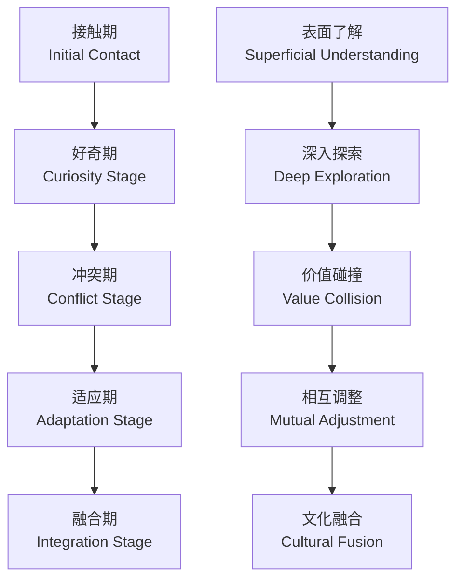
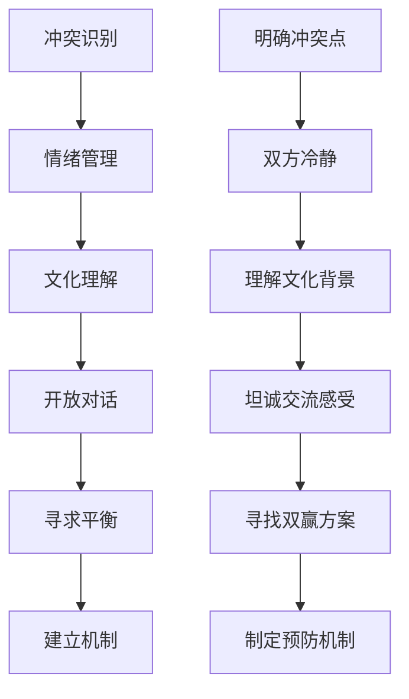

# Cultural Diversity & Special Circumstances in Dating (约会中的文化差异与特殊情况)

> 📘 **文档导航**: 本指南探讨跨文化约会的挑战与机遇，以及各种特殊情况的处理策略。相关文档：
> - [约会心理学概览](Dating_Psychology_Overview.md) - 理论基础
> - [吸引力法则与择偶](Dating_Attraction_Selection.md) - 匹配策略
> - [数字时代约会](Dating_Digital_Era.md) - 现代约会环境

## 跨文化约会动力学 (Cross-cultural Dating Dynamics)

### 主要文化维度对比

#### 东西方文化差异矩阵
| 文化维度 | 东方文化特征 | 西方文化特征 | 融合挑战 | 适应策略 |
| :--- | :--- | :--- | :--- | :--- |
| **表达方式** | 含蓄委婉、重视面子 | 直接开放、表达自由 | 误解风险、沟通障碍 | 学习对方表达习惯、建立翻译机制 |
| **家庭观念** | 家族中心、长辈权威 | 个人中心、独立自主 | 家庭压力、价值冲突 | 尊重差异、寻求平衡点 |
| **关系节奏** | 循序渐进、长期考虑 | 快速发展、当下享受 | 进度不同步、期望差异 | 明确讨论节奏偏好、相互适应 |
| **性别角色** | 传统分工、男主外女主内 | 性别平等、角色灵活 | 角色期待冲突 | 开放讨论角色期望、共同协商 |
| **冲突处理** | 避免正面冲突、保全面子 | 直接面对、解决问题 | 处理方式差异、情绪管理 | 学习多元冲突处理方式 |

#### 文化适应阶段模型

### 跨文化沟通桥梁建设

#### 语言文化障碍应对
| 障碍类型 | 具体表现 | 根本原因 | 解决策略 | 预防措施 |
| :--- | :--- | :--- | :--- | :--- |
| **语言表达** | 词汇匮乏、语法错误 | 语言能力限制 | 语言学习、使用翻译工具 | 持续语言练习、准备常用表达 |
| **文化内涵** | 误解隐含意义、文化典故 | 文化背景差异 | 学习文化知识、询问确认 | 主动了解对方文化、建立解释机制 |
| **非语言沟通** | 肢体语言误解、空间距离差异 | 文化习惯不同 | 观察学习、明确沟通 | 注意非语言信号、及时澄清 |
| **价值观念** | 行为标准差异、道德判断不同 | 深层文化价值观 | 开放讨论、寻求共同点 | 提前了解核心价值观、建立理解框架 |

#### 文化敏感性培养
| 培养维度 | 具体方法 | 实践要点 | 效果评估 | 持续发展 |
| :--- | :--- | :--- | :--- | :--- |
| **文化知识** | 学习历史文化、社会制度 | 系统性学习、关注细节 | 文化理解深度测试 | 持续学习更新 |
| **共情能力** | 理解对方文化背景下的感受 | 换位思考、情感共鸣 | 跨文化共情能力评估 | 实践中锻炼提升 |
| **适应能力** | 在不同文化环境中调整行为 | 灵活应变、保持开放 | 文化适应性评价 | 多元文化实践 |
| **包容心态** | 接纳和欣赏文化差异 | 尊重差异、寻找价值 | 文化包容度测量 | 反思总结成长 |

## 特殊情况处理策略 (Special Situation Handling Strategies)

### 年龄差异关系管理

#### 年龄差距影响分析
| 差距范围 | 主要挑战 | 优势资源 | 管理策略 | 成功要素 |
| :--- | :--- | :--- | :--- | :--- |
| **5-10岁** | 生活阶段差异、社交圈不同 | 经验互补、成熟稳定 | 相互学习、协调节奏 | 开放沟通、共同成长 |
| **10-15岁** | 人生目标分化、价值观差异 | 智慧传承、资源互补 | 深度对话、寻找共同点 | 价值观整合、目标协调 |
| **15岁以上** | 代际鸿沟、生活方式差异 | 丰富阅历、人生智慧 | 相互尊重、创新融合 | 文化融合、创造新范式 |

#### 代际沟通技巧
| 沟通要点 | 具体方法 | 注意事项 | 效果预期 | 练习建议 |
| :--- | :--- | :--- | :--- | :--- |
| **话题选择** | 寻找跨代共同兴趣 | 避免敏感代际话题 | 增进理解、减少隔阂 | 共同活动体验 |
| **表达方式** | 适应对方沟通习惯 | 尊重不同表达风格 | 提高沟通效率 | 观察学习对方方式 |
| **价值讨论** | 开诚布公讨论差异 | 避免价值判断 | 增进相互理解 | 定期深度对话 |
| **未来规划** | 协调不同人生阶段需求 | 平衡双方发展目标 | 建立共同愿景 | 制定阶段性计划 |

### 异地恋挑战应对

#### 异地关系维护系统
| 维护维度 | 核心策略 | 实施要点 | 风险防控 | 成功指标 |
| :--- | :--- | :--- | :--- | :--- |
| **情感连接** | 定期深度交流、情感表达 | 真诚分享、共情理解 | 防止情感疏离 | 情感满意度保持高水平 |
| **信任建立** | 透明沟通、一致行为 | 言行一致、主动分享 | 预防猜疑产生 | 信任水平持续提升 |
| **共同体验** | 创造同步活动、虚拟约会 | 创新互动方式、保持新鲜感 | 避免例行公事 | 共同话题和体验丰富 |
| **未来规划** | 明确团聚时间表、共同目标 | 具体计划、定期检视 | 防止方向迷失 | 对未来有清晰期待 |

#### 异地沟通优化
| 沟通类型 | 最佳时机 | 内容重点 | 技术要求 | 效果提升 |
| :--- | :--- | :--- | :--- | :--- |
| **日常问候** | 对方空闲时段 | 关心近况、分享日常 | 简单便捷、及时送达 | 维持日常连接感 |
| **深度交流** | 双方都有充裕时间 | 个人感受、关系思考 | 音视频质量良好 | 增进深层理解 |
| **特殊时刻** | 纪念日、节日 | 情感表达、惊喜安排 | 创意策划、提前准备 | 增强关系仪式感 |
| **问题处理** | 情绪稳定时 | 具体问题、解决方案 | 私密环境、充分时间 | 有效解决分歧 |

### 职业特殊性关系管理

#### 高压职业挑战
| 职业类型 | 主要挑战 | 应对策略 | 支持系统 | 成功要素 |
| :--- | :--- | :--- | :--- | :--- |
| **医护人员** | 工作时间不规律、情绪负荷重 | 理解支持、灵活安排 | 同行支持网络、专业心理服务 | 相互理解、专业支持 |
| **创业者** | 工作强度大、时间不固定 | 目标共识、时间管理 | 创业伙伴支持、家庭理解 | 共同愿景、高效沟通 |
| **演艺人员** | 工作时间特殊、公众关注度高 | 隐私保护、情感支持 | 行业同伴、专业团队 | 相互支持、边界清晰 |
| **科研人员** | 思维专注、社交时间少 | 理解专注需求、创造安静时光 | 学术圈支持、家庭配合 | 相互尊重、独立空间 |

#### 工作生活平衡
| 平衡维度 | 管理策略 | 实施要点 | 风险控制 | 效果评估 |
| :--- | :--- | :--- | :--- | :--- |
| **时间分配** | 制定时间规划、优先级排序 | 明确重要性、灵活调整 | 避免工作侵占关系时间 | 时间利用率和满意度 |
| **能量管理** | 合理休息、压力释放 | 规律作息、健康习惯 | 防止职业倦怠影响关系 | 精力水平和关系质量 |
| **边界设定** | 工作关系分离、私人时间保护 | 明确界限、坚决执行 | 避免工作压力转嫁 | 边界清晰度和执行效果 |
| **共同成长** | 支持职业发展、分享成就喜悦 | 相互鼓励、共同学习 | 避免竞争关系 | 支持度和成就感 |

## 多元关系形态适应 (Adapting to Diverse Relationship Forms)

### 非传统关系模式

#### 开放关系管理
| 管理要点 | 核心原则 | 实施方法 | 风险控制 | 成功标准 |
| :--- | :--- | :--- | :--- | :--- |
| **边界清晰** | 明确规则、事先约定 | 详细讨论、书面确认 | 避免模糊地带 | 规则执行一致性高 |
| **情感透明** | 诚实沟通、及时分享 | 定期检视、开放讨论 | 防止隐瞒和误解 | 情感透明度高 |
| **嫉妒管理** | 承认嫉妒、建设性处理 | 情绪疏导、重新定义 | 避免破坏性嫉妒 | 嫉妒处理能力强 |
| **持续协商** | 定期评估、灵活调整 | 阶段性回顾、共同决策 | 适应变化需求 | 关系满意度稳定 |

#### 长期单身者约会
| 适应挑战 | 调整策略 | 实施要点 | 支持资源 | 成功标志 |
| :--- | :--- | :--- | :--- | :--- |
| **节奏适应** | 重新学习约会节奏 | 放慢步伐、享受过程 | 约会经验丰富的朋友 | 逐渐适应双人节奏 |
| **社交技能** | 重建社交连接能力 | 参与社交活动、练习互动 | 社交技能培训 | 社交自信度提升 |
| **独立平衡** | 平衡独立与亲密 | 保持个人空间、适度依赖 | 个人发展规划 | 独立性与亲密感平衡 |
| **期望管理** | 调整关系期待 | 现实评估、渐进发展 | 心理咨询支持 | 期望合理性和满意度 |

### 特殊身份群体约会

#### LGBTQ+群体约会挑战
| 挑战类型 | 具体困难 | 应对策略 | 支持系统 | 发展方向 |
| :--- | :--- | :--- | :--- | :--- |
| **社会接纳** | 歧视压力、隐藏身份 | 寻找包容环境、建立支持网络 | LGBTQ+社群、专业机构 | 社会包容度提升 |
| **家庭关系** | 家庭不理解、传统压力 | 循序渐进、专业帮助 | 家庭治疗师、同伴支持 | 家庭理解和接纳 |
| **身份认同** | 自我接纳、身份整合 | 心理支持、社群归属 | 心理咨询、同伴团体 | 身份认同稳固 |
| **安全考虑** | 人身安全、隐私保护 | 谨慎选择、安全措施 | 法律援助、安全网络 | 安全环境保障 |

#### 残障人士约会支持
| 支持维度 | 具体措施 | 实施要点 | 资源链接 | 成功要素 |
| :--- | :--- | :--- | :--- | :--- |
| **无障碍环境** | 选择无障碍场所、提前沟通需求 | 详细了解环境、主动沟通 | 无障碍设施信息、专业机构 | 环境适应性和舒适度 |
| **能力展示** | 突出个人能力和价值 | 真实展现、避免过度补偿 | 技能展示平台、成功案例 | 自信心和能力认知 |
| **理解支持** | 寻找理解和接纳的伴侣 | 开诚布公、循序渐进 | 支持性社群、专业咨询 | 相互理解和接纳度 |
| **权利维护** | 维护平等权利、反对歧视 | 知法懂法、积极维权 | 法律援助、权益组织 | 权益保障和平等对待 |

## 危机情况处理 (Crisis Situation Management)

### 文化冲突危机干预

#### 冲突升级处理流程

#### 危机应对要点
| 应对要素 | 具体行动 | 注意事项 | 成功关键 | 后续跟进 |
| :--- | :--- | :--- | :--- | :--- |
| **及时处理** | 冲突发生后立即应对 | 避免积累发酵 | 把握处理时机 | 定期回顾反思 |
| **专业支持** | 寻求跨文化咨询帮助 | 选择合适专家 | 专业指导质量 | 持续专业支持 |
| **系统思考** | 分析根本原因和影响 | 全面考虑各方面 | 深入问题本质 | 系统性改善 |
| **预防机制** | 建立预警和处理机制 | 制定具体流程 | 制度化管理 | 完善预防体系 |

### 特殊情况紧急应对

#### 家庭强烈反对
| 应对策略 | 实施步骤 | 沟通要点 | 风险控制 | 长期规划 |
| :--- | :--- | :--- | :--- | :--- |
| **理解根源** | 分析反对的具体原因 | 倾听关切、理解担忧 | 避免对抗情绪 | 建立理解基础 |
| **逐步介绍** | 循序渐进让家人了解 | 展现积极面、强调认真态度 | 避免急于求成 | 稳步推进关系 |
| **寻求支持** | 寻找家庭内部支持者 | 获得理解者帮助、建立联盟 | 避免孤立无援 | 扩大支持网络 |
| **专业介入** | 必要时寻求家庭咨询 | 专业第三方协助、客观评估 | 避免关系恶化 | 系统性解决 |

#### 社会舆论压力
| 压力类型 | 应对方法 | 实施要点 | 资源支持 | 效果评估 |
| :--- | :--- | :--- | :--- | :--- |
| **公众关注** | 保持低调、保护隐私 | 控制信息披露、避免炒作 | 法律咨询、公关支持 | 压力水平可控 |
| **歧视偏见** | 坚定立场、理性回应 | 明确态度、避免激化 | 法律援助、支持组织 | 社会接纳度提升 |
| **传统观念** | 展示关系价值、寻求理解 | 强调积极影响、分享正面案例 | 同类群体支持、媒体平台 | 观念逐步改变 |
| **安全威胁** | 采取保护措施、寻求帮助 | 人身安全保障、法律维权 | 安全部门、法律机构 | 安全环境建立 |

## 包容性发展建议 (Inclusive Development Recommendations)

### 文化胜任力建设

#### 能力发展路径
| 发展阶段 | 核心能力 | 学习重点 | 实践机会 | 评估方式 |
| :--- | :--- | :--- | :--- | :--- |
| **基础阶段** | 文化意识、基本理解 | 学习文化理论、了解差异 | 多元文化交流活动 | 文化敏感性测试 |
| **进阶阶段** | 跨文化沟通、适应能力 | 实践沟通技巧、处理冲突 | 跨文化关系实践 | 沟通效果评估 |
| **精通阶段** | 文化融合、创新引领 | 创造新型关系模式、引领发展 | 多元文化领导实践 | 影响力和社会贡献 |

#### 持续学习资源
| 学习类型 | 推荐资源 | 学习方式 | 实践应用 | 效果监测 |
| :--- | :--- | :--- | :--- | :--- |
| **理论学习** | 跨文化心理学、人类学著作 | 系统阅读、学术研讨 | 理解文化现象 | 理论掌握程度 |
| **技能培训** | 跨文化沟通工作坊、语言课程 | 实践练习、角色扮演 | 实际交流应用 | 技能熟练度 |
| **经验交流** | 多元文化社群、国际交流项目 | 参与活动、分享经验 | 真实情境体验 | 经验丰富度 |
| **专业发展** | 跨文化咨询、国际关系专业 | 深度学习、专业认证 | 专业服务提供 | 专业能力水平 |

### 特殊群体支持体系

#### 支持网络建设
| 网络类型 | 核心功能 | 参与方式 | 资源整合 | 可持续发展 |
| :--- | :--- | :--- | :--- | :--- |
| **同伴支持** | 经验分享、情感支持 | 定期聚会、在线交流 | 建立互助小组 | 成员持续参与 |
| **专业服务** | 专业咨询、技能培训 | 寻求专业帮助、参加培训 | 整合专业资源 | 服务质量保障 |
| **社群平台** | 信息发布、活动组织 | 参与社群活动、志愿服务 | 建立服务平台 | 平台持续运营 |
| **政策倡导** | 权益维护、环境改善 | 参与政策讨论、发声倡议 | 联合行动力量 | 影响力扩大 |

---
*📚 本文档融合跨文化研究、特殊群体支持和危机干预等多领域知识，为多元化约会环境提供全面指导。*
