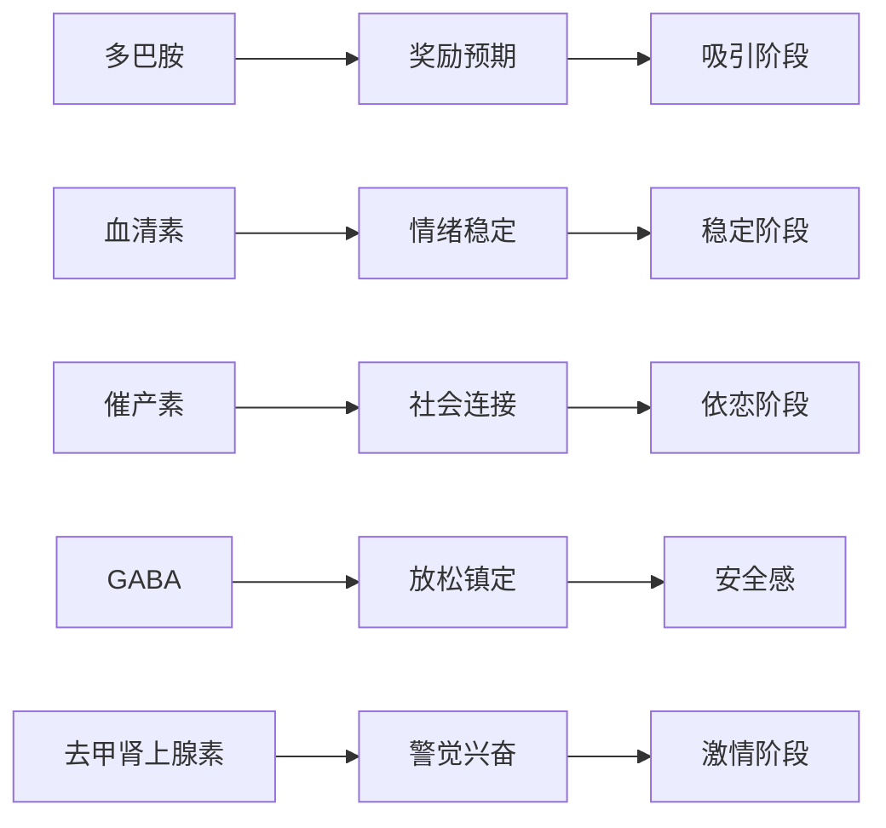
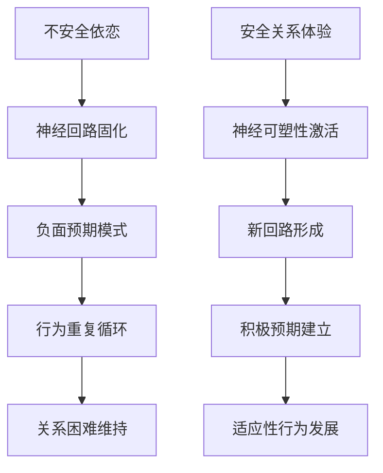
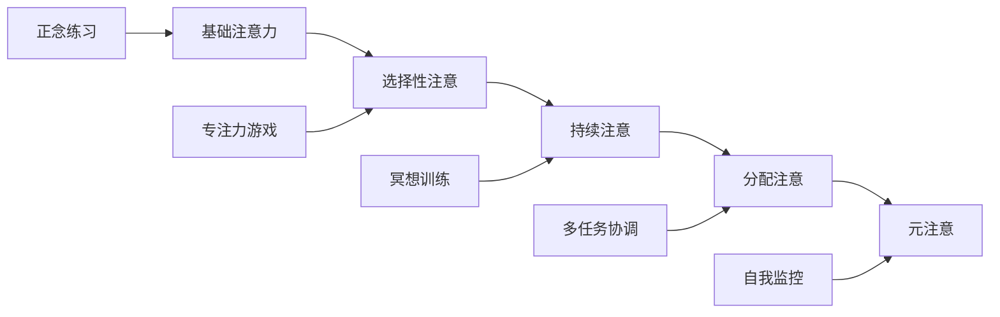

# Dating Neuroscience & Brain-Based Insights (约会神经科学与大脑洞察)

> 📘 **文档导航**: 本指南整合神经科学研究成果，揭示约会过程中大脑机制和生物基础。相关文档：
> - [约会心理学概览](Dating_Psychology_Overview.md) - 理论基础
> - [吸引力法则与择偶策略](Dating_Attraction_Selection.md) - 生物学机制
> - [约会沟通技巧](Dating_Communication_Skills.md) - 神经语言学应用

## 神经科学基础框架 (Neuroscientific Foundation Framework)

### 大脑奖励系统的约会机制

#### 多巴胺驱动的吸引过程
| 阶段 | 神经机制 | 生理表现 | 行为特征 | 调节策略 |
| :--- | :--- | :--- | :--- | :--- |
| **初始吸引** | 腹侧纹状体多巴胺释放 | 心跳加速、瞳孔放大 | 注意力集中、积极评价 | 保持适度神秘感、创造惊喜 |
| **浪漫迷恋** | 多巴胺-去甲肾上腺素系统激活 | 失眠、食欲下降 | 侵入性思维、理想化对方 | 平衡激情与理性、维持现实感 |
| **依恋形成** | 催产素-加压素系统启动 | 平静满足感、安全感 | 寻求亲近、分享私密 | 建立日常仪式、深化情感连接 |

#### 神经递质平衡模型

### 大脑网络在约会中的作用

#### 默认模式网络 (DMN) 与自我呈现
| 网络功能 | 在约会中的表现 | 影响机制 | 优化建议 |
| :--- | :--- | :--- | :--- |
| **自我参照加工** | 展示理想自我形象 | 内侧前额叶皮层激活 | 真实性与吸引力平衡 |
| **心智理论** | 理解对方想法感受 | 颞顶联合区活跃 | 培养共情能力 |
| **情景记忆提取** | 分享个人经历故事 | 海马体参与 | 选择有意义的经历 |
| **未来想象** | 构想关系发展前景 | 前扣带回激活 | 适度表达期待 |

#### 执行控制网络与决策制定
| 控制功能 | 约会决策应用 | 神经基础 | 提升策略 |
| :--- | :--- | :--- | :--- |
| **冲动抑制** | 抵制不合适行为 | 前额叶皮层调控 | 正念练习、预先规划 |
| **风险评估** | 判断关系安全性 | 背外侧前额叶参与 | 理性分析、寻求建议 |
| **情绪调节** | 管理约会焦虑 | 前扣带回调节 | 深呼吸、积极自我对话 |
| **注意力控制** | 专注当下互动 | 顶叶注意网络 | 减少手机干扰、全身心投入 |

## 依恋风格的神经生物学基础

### 依恋类型的脑成像特征

#### 安全型依恋的神经模式
| 大脑区域 | 激活模式 | 功能表现 | 行为优势 |
| :--- | :--- | :--- | :--- |
| **前扣带回** | 适度激活 | 情绪调节能力强 | 能够有效处理关系冲突 |
| **杏仁核** | 适当反应 | 情绪敏感性适中 | 既能感知威胁又能保持开放 |
| **海马体** | 健康体积 | 记忆整合良好 | 能够学习关系经验并适应调整 |
| **镜像神经元系统** | 协调激活 | 共情能力出色 | 善于理解伴侣需求和感受 |

#### 不安全依恋的神经特征
| 依恋类型 | 大脑异常 | 行为表现 | 改善方向 |
| :--- | :--- | :--- | :--- |
| **焦虑型** | 杏仁核过度激活 | 过度担心被抛弃 | 降低警觉性训练、建立安全感 |
| **回避型** | 前扣带回低激活 | 情感麻木、疏离 | 增强情绪觉察、渐进式亲密 |
| **恐惧型** | 多区域失调 | 矛盾混乱行为 | 创伤治疗、稳定安全关系 |

### 依恋调节的神经可塑性

#### 大脑重塑的可能性

#### 实证支持的干预方法
| 干预方式 | 神经机制 | 效果证据 | 实施建议 |
| :--- | :--- | :--- | :--- |
| **正念冥想** | 增强大脑前额叶控制 | 减少杏仁核过度反应 | 每日10-15分钟练习 |
| **情感聚焦治疗** | 重新激活奖励系统 | 改善依恋安全感 | 专业治疗师指导下进行 |
| **安全关系建立** | 促进催产素释放 | 增强社会连接能力 | 选择支持性伴侣关系 |
| **创伤处理** | 整合分离的记忆 | 减少闪回和回避 | EMDR等专业治疗方法 |

## 约会中的情绪神经科学

### 情绪识别的神经基础

#### 面部表情的神经处理
| 情绪类型 | 大脑处理路径 | 识别准确率 | 影响因素 |
| :--- | :--- | :--- | :--- |
| **快乐** | 快速腹侧通路 | 95%以上 | 文化背景影响较小 |
| **愤怒** | 背侧注意网络 | 90-95% | 性别差异显著 |
| **悲伤** | 默认模式网络 | 80-85% | 个人经验影响大 |
| **恐惧** | 杏仁核快速反应 | 85-90% | 进化保守性高 |

#### 声音语调的情绪编码
| 声学特征 | 神经解码区域 | 情绪识别能力 | 约会应用 |
| :--- | :--- | :--- | :--- |
| **音高变化** | 右侧颞上回 | 判断兴奋程度 | 识别对方兴趣水平 |
| **语速节奏** | 左侧颞叶 | 感知情绪强度 | 了解对方情感状态 |
| **共振频率** | 听觉皮层 | 评估真诚度 | 判断是否值得信任 |
| **停顿模式** | 前额叶参与 | 理解言外之意 | 捕捉微妙情感信号 |

### 情绪调节的神经策略

#### 认知重评的神经机制
| 重评策略 | 大脑激活模式 | 调节效果 | 实践方法 |
| :--- | :--- | :--- | :--- |
| **重新框架** | 前额叶激活增强 | 显著降低负面情绪 | 将拒绝视为成长机会 |
| **视角转换** | 颞顶联合区活跃 | 增强理解包容性 | 站在对方角度思考 |
| **意义建构** | 默认模式网络参与 | 提升情绪韧性 | 寻找挫折中的积极意义 |
| **时间距离** | 海马体时间加工 | 减轻当下降焦虑 | 想象未来的自己如何看待 |

## 约会决策的神经经济学

### 大脑中的成本效益计算

#### 关系投资的神经评估
| 评估维度 | 神经基础 | 决策偏差 | 优化策略 |
| :--- | :--- | :--- | :--- |
| **情感回报预期** | 腹侧纹状体激活 | 乐观偏差 | 客观评估现实可能性 |
| **机会成本考量** | 背外侧前额叶参与 | 沉没成本谬误 | 定期重新评估关系价值 |
| **风险规避倾向** | 岛叶风险感知 | 损失厌恶 | 平衡风险与收益 |
| **社会比较影响** | 颞上沟参与 | 参照群体偏差 | 关注个人真实需求 |

#### 承诺决策的神经标记
| 决策阶段 | 大脑活动模式 | 行为表现 | 关键指标 |
| :--- | :--- | :--- | :--- |
| **初步考虑** | 奖赏系统激活 | 兴奋期待 | 多巴胺水平升高 |
| **深入评估** | 执行网络参与 | 谨慎权衡 | 前额叶活跃度增加 |
| **最终决定** | 前扣带回整合 | 内心平静 | 神经活动趋于稳定 |
| **承诺表达** | 催产素系统激活 | 情感连接 | 社会 bonding 增强 |

## 实践应用与神经训练

### 基于神经科学的约会技能提升

#### 注意力训练方案

#### 情绪智力神经训练
| 训练项目 | 神经目标 | 训练方法 | 预期效果 |
| :--- | :--- | :--- | :--- |
| **情绪觉察** | 增强岛叶激活 | 身体扫描冥想 | 提高情绪敏感性 |
| **情绪表达** | 激活运动皮层 | 面部表情练习 | 改善情感传达 |
| **情绪理解** | 强化镜像系统 | 共情训练 | 增强关系亲密度 |
| **情绪调节** | 加强前额叶控制 | 认知重评练习 | 提升关系稳定性 |

### 神经反馈在约会中的应用

#### 生理指标监测
| 指标类型 | 测量方法 | 约会意义 | 调整建议 |
| :--- | :--- | :--- | :--- |
| **心率变异性** | 可穿戴设备 | 压力水平指示 | 深呼吸放松技巧 |
| **皮肤电导** | 生理传感器 | 兴奋程度反映 | 情绪调节策略 |
| **面部微表情** | 摄像头分析 | 真实情感暴露 | 诚实沟通训练 |
| **语音声学特征** | 音频分析 | 情感状态识别 | 表达技巧改善 |

## 总结与展望

约会神经科学为我们提供了理解人类关系的全新视角。通过整合大脑机制的研究发现，我们可以：

✅ **更深刻地理解** 吸引、依恋和承诺的生物学基础  
✅ **更精准地识别** 关系中的神经信号和预警指标  
✅ **更有效地提升** 约会技能和关系质量  
✅ **更有针对性地** 进行个人成长和治疗干预  

随着神经科学技术的不断发展，未来我们将能够为每个人提供更加个性化和精准的约会指导方案。

---
*📚 本文档基于最新神经科学研究成果，为现代约会提供科学指导。*