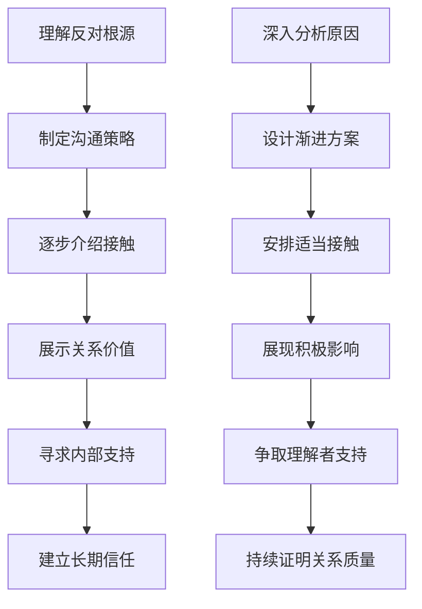
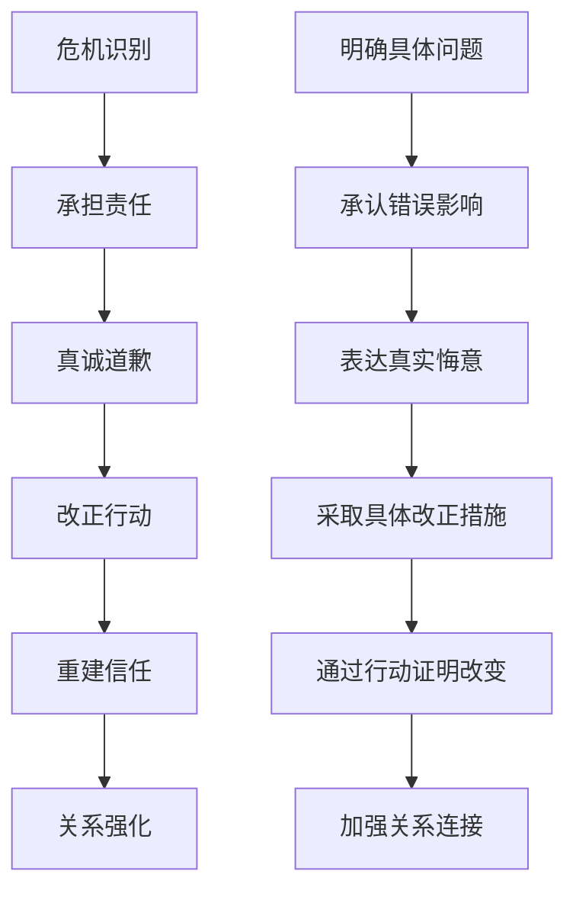

# Special Circumstances & Challenging Situations (特殊情况与挑战性情境)

> 📘 **文档导航**: 本指南针对约会中的各种特殊情况和挑战性情境提供专业应对策略。相关文档：
> - [约会心理学概览](Dating_Psychology_Overview.md) - 理论基础
> - [冲突管理与边界设定](Dating_Conflict_Boundary.md) - 基础技能
> - [文化差异与多元视角](Dating_Cultural_Diversity.md) - 多元适应

## 首次约会特殊情况处理 (First Date Special Situations)

### 约会前突发状况应对

#### 时间变更处理
| 突发情况 | 应对策略 | 沟通要点 | 风险控制 | 成功标准 |
| :--- | :--- | :--- | :--- | :--- |
| **迟到延误** | 提前通知、诚恳道歉 | "很抱歉临时有事耽搁，能否稍等15分钟？" | 避免过度解释、承担责任 | 对方表示理解接受 |
| **取消约会** | 及时沟通、重新安排 | "实在抱歉今天去不了，我们改约周三如何？" | 诚实说明原因、表达诚意 | 成功重新约定时间 |
| **地点变更** | 灵活调整、提供备选 | "原定餐厅临时停业，附近有家不错的咖啡厅..." | 提前了解备选方案、征求同意 | 双方都满意新安排 |
| **身体不适** | 如实告知、关怀询问 | "我有点感冒不太舒服，要不我们改期？" | 关心对方健康、避免勉强 | 相互理解和关怀 |

#### 心理准备调节
| 准备维度 | 调节方法 | 实施要点 | 注意事项 | 效果预期 |
| :--- | :--- | :--- | :--- | :--- |
| **焦虑管理** | 深呼吸、积极暗示 | 提前练习放松技巧 | 避免过度准备、保持自然 | 降低紧张感、提升自信 |
| **期望调整** | 现实定位、降低压力 | 明确只是了解而非决定 | 避免过高期待、保持开放 | 减少心理负担、增加乐趣 |
| **形象准备** | 适度打扮、展现真实 | 选择舒适得体的着装 | 避免过度装扮、保持自然 | 增强自信、给人好感 |
| **话题准备** | 准备开放性话题 | 关注对方兴趣、避免争议 | 避免背诵台词、保持灵活 | 促进自然交流 |

### 约会中意外情况处理

#### 技术故障应对
| 故障类型 | 应急处理 | 沟通策略 | 氛围维护 | 后续补救 |
| :--- | :--- | :--- | :--- | :--- |
| **手机没电** | 使用餐厅电话、借用他人设备 | "不好意思手机没电了，我们换个地方继续聊？" | 保持幽默感、不因此影响心情 | 约定后续联系 |
| **支付问题** | 现金备用、AA制协商 | "刷卡机好像有问题，我们各付各的怎么样？" | 避免尴尬、保持轻松态度 | 灵活处理财务问题 |
| **交通延误** | 提前出发、预留缓冲 | "路上有点堵车，让你久等了" | 及时沟通、表达歉意 | 建立守时意识 |

#### 社交尴尬化解
| 尴尬情境 | 化解技巧 | 实施要点 | 注意事项 | 效果评估 |
| :--- | :--- | :--- | :--- | :--- |
| **话题枯竭** | 转移注意力、观察环境 | "你看那边的装饰很有意思..." | 自然过渡、避免强行延续 | 重新激发交流兴趣 |
| **食物问题** | 幽默化解、坦诚沟通 | "这道菜对我来说有点辣，不过我很喜欢这里的氛围" | 诚实表达、避免抱怨 | 维持积极氛围 |
| **意外事件** | 保持镇定、共同面对 | 意外洒水："看来今天的雨要下到我们身上了" | 幽默应对、相互支持 | 增进情感连接 |

## 关系发展关键节点 (Relationship Development Critical Nodes)

### 第二次约会策略

#### 约会升级要素
| 升级维度 | 策略要点 | 实施方法 | 风险管控 | 成功指标 |
| :--- | :--- | :--- | :--- | :--- |
| **时间延长** | 从快餐到正餐、从半天到全天 | 选择需要更多时间的活动 | 避免过于紧凑、保持舒适节奏 | 双方都享受延长的相处时间 |
| **地点深入** | 从公共场所到私人空间边缘 | 邀请参观工作室、家中简短拜访 | 尊重边界、循序渐进 | 对方感到被信任和舒适 |
| **话题深化** | 从表面兴趣到深层价值观 | 分享个人成长经历、讨论重要议题 | 观察对方接受度、适时深入 | 建立更深层的理解和连接 |
| **身体接触** | 从握手到拥抱等适度接触 | 自然发生的身体接触、观察对方反应 | 尊重边界、避免强迫 | 双方都感到舒适和亲密 |

#### 进展信号识别
| 积极信号 | 具体表现 | 解读要点 | 应对策略 | 注意事项 |
| :--- | :--- | :--- | :--- | :--- |
| **主动联系** | 频繁发消息、主动约见 | 表现出持续兴趣和投入 | 积极回应、适度主动 | 避免过度解读或过于被动 |
| **时间投入** | 愿意花长时间相处、调整日程 | 重视这段关系的表现 | 珍惜相处时光、表达感激 | 不要把对方的付出视为理所当然 |
| **未来提及** | 谈论共同计划、暗示长期可能 | 对关系有认真考虑 | 积极回应、坦诚交流 | 避免给对方过大压力 |
| **朋友介绍** | 主动介绍给朋友认识 | 愿意让关系公开化 | 积极融入、表示感谢 | 尊重对方的节奏和边界 |

### 关系定义关键时刻

#### "我们是什么关系"对话
| 对话要素 | 准备要点 | 表达方式 | 时机选择 | 风险管理 |
| :--- | :--- | :--- | :--- | :--- |
| **现状确认** | 明确当前感受和期待 | "我觉得我们现在的关系很特别..." | 关系稳定、双方舒适时 | 避免在冲突后或压力大时 |
| **未来展望** | 分享个人关系愿景 | "我希望我们能..." | 轻松愉快的私密环境 | 给对方思考和回应时间 |
| **兼容性评估** | 讨论重大议题匹配度 | "关于...你怎么看" | 逐步深入重要话题 | 避免一次性抛出所有问题 |
| **承诺讨论** | 探讨排他性和长期意向 | "你愿意...吗？" | 双方都有明确感觉时 | 尊重对方节奏，不施加压力 |

#### 进度不同步处理
| 不同步类型 | 表现特征 | 根本原因 | 协调策略 | 预防措施 |
| :--- | :--- | :--- | :--- | :--- |
| **前进速度差异** | 一方急于推进另一方犹豫 | 依恋风格、准备度不同 | 开诚布公讨论、寻找平衡点 | 提前讨论关系节奏偏好 |
| **期望层级差异** | 对关系定义的理解不同 | 价值观、人生阶段差异 | 明确各自期望、寻求共同点 | 早期深度沟通重要议题 |
| **表达方式差异** | 爱的语言和表达习惯不同 | 成长背景、个性特点 | 学习对方的爱语、适应表达方式 | 了解彼此的表达偏好 |

## 高风险情境管理 (High-risk Situation Management)

### 家庭强烈反对应对

#### 反对原因分析
| 反对类型 | 具体表现 | 深层原因 | 应对策略 | 长期规划 |
| :--- | :--- | :--- | :--- | :--- |
| **文化差异反对** | 基于文化背景的不同 | 传统观念与现代选择的冲突 | 循序渐进介绍、展示积极面 | 促进文化理解融合 |
| **经济条件担忧** | 对经济稳定性的担心 | 对未来生活保障的忧虑 | 展示规划能力、证明稳定性 | 建立经济基础和规划 |
| **性格匹配质疑** | 对两人兼容性的怀疑 | 对长期幸福的担忧 | 展现关系和谐、分享成功经历 | 持续证明关系质量 |
| **社会地位考虑** | 对社会形象的顾虑 | 面子和社交圈影响 | 理解长辈关切、寻求平衡 | 建立新的社会认同 |

#### 系统性应对方案

### 社会舆论压力处理

#### 压力来源分类
| 压力类型 | 具体表现 | 影响机制 | 应对方法 | 支持资源 |
| :--- | :--- | :--- | :--- | :--- |
| **公众关注压力** | 媒体报道、网络讨论 | 注意力经济驱动 | 保持低调、控制信息披露 | 公关顾问、法律支持 |
| **歧视偏见压力** | 基于身份的不公平对待 | 刻板印象和社会偏见 | 坚定立场、理性回应 | 权益组织、法律援助 |
| **传统观念压力** | 不符合主流价值观的质疑 | 社会规范约束 | 展示关系价值、寻求理解 | 同类群体支持、专业咨询 |
| **安全威胁压力** | 人身安全受到威胁 | 极端行为风险 | 采取保护措施、寻求帮助 | 安全部门、法律机构 |

#### 心理防护机制
| 防护维度 | 具体措施 | 实施要点 | 效果评估 | 持续维护 |
| :--- | :--- | :--- | :--- | :--- |
| **心理建设** | 建立内在力量、增强抗压能力 | 培养自信、明确价值观 | 心理韧性提升 | 持续自我成长 |
| **支持网络** | 建立理解支持的人际网络 | 寻找同盟、建立互助 | 社会支持增强 | 网络持续扩展 |
| **边界设定** | 明确个人边界、拒绝不合理要求 | 坚持原则、适度妥协 | 边界清晰度提高 | 持续边界维护 |
| **专业支持** | 寻求心理咨询、法律援助 | 专业指导、权益保护 | 专业资源有效利用 | 持续专业支持 |

## 危机干预与修复 (Crisis Intervention & Repair)

### 信任危机处理

#### 危机类型识别
| 危机类型 | 典型表现 | 根本原因 | 修复难度 | 干预时机 |
| :--- | :--- | :--- | :--- | :--- |
| **轻微失信** | 小谎言、隐瞒小事 | 保护对方感受、避免冲突 | 较易修复 | 发现后立即处理 |
| **中度失信** | 重要信息隐瞒、行为不当 | 自私自利、逃避责任 | 中等难度 | 尽快坦诚沟通 |
| **严重失信** | 情感背叛、重大欺骗 | 根本价值观冲突、恶意伤害 | 修复困难 | 立即专业介入 |
| **系统性失信** | 持续欺骗、结构性问题 | 深层人格问题、关系模式病态 | 极难修复 | 需要系统性治疗 |

#### 修复流程标准化

### 情感创伤修复

#### 创伤类型与应对
| 创伤类型 | 表现特征 | 影响机制 | 修复策略 | 专业支持 |
| :--- | :--- | :--- | :--- | :--- |
| **拒绝创伤** | 被拒绝后的自我怀疑 | 自尊受损、安全感缺失 | 重建自信、重新定义价值 | 心理咨询、同伴支持 |
| **背叛创伤** | 被信任的人伤害 | 信任系统崩塌、世界观颠覆 | 创伤知情护理、逐步重建 | 创伤治疗专家 |
| **抛弃创伤** | 被重要他人遗弃 | 依恋模式受损、恐惧被抛弃 | 依恋修复、安全基地重建 | 依恋治疗师 |
| **复合创伤** | 多次类似创伤经历 | 创伤累积、防御机制固化 | 系统性创伤治疗、人格重建 | 专业创伤治疗 |

#### 修复技术要点
| 修复要素 | 核心内容 | 实施要点 | 成功标准 | 持续跟进 |
| :--- | :--- | :--- | :--- | :--- |
| **安全环境** | 创造心理安全感 | 稳定支持、边界清晰 | 情绪稳定、不再恐惧 | 持续环境维护 |
| **创伤处理** | 面对和整合创伤经历 | 专业治疗、逐步暴露 | 创伤症状减轻、整合完成 | 定期评估进展 |
| **认知重构** | 重新建立积极认知 | 挑战负面信念、建立新视角 | 自我价值感恢复、世界观重建 | 持续认知练习 |
| **关系重建** | 建立健康的新关系模式 | 学习新技能、实践应用 | 健康关系建立、创伤后成长 | 长期关系维护 |

## 特殊群体约会支持 (Special Groups Dating Support)

### 残障人士约会指导

#### 障碍类型差异化支持
| 障碍类型 | 特殊需求 | 支持策略 | 资源链接 | 成功要素 |
| :--- | :--- | :--- | :--- | :--- |
| **身体残障** | 无障碍环境、特殊照顾需求 | 选择无障碍场所、提前沟通需求 | 无障碍设施信息、专业服务机构 | 环境适应性和相互理解 |
| **感官障碍** | 沟通方式调整、辅助工具 | 学习手语、使用辅助设备 | 相关培训机构、辅助器具供应商 | 沟通有效性和包容心态 |
| **智力障碍** | 简单明了的交流、耐心支持 | 使用清晰语言、给予充分时间 | 特殊教育机构、支持性就业服务 | 耐心支持和理解包容 |
| **精神障碍** | 情绪支持、稳定环境 | 提供情感支持、创造稳定环境 | 心理健康机构、同伴支持组织 | 情感支持和环境稳定 |

#### 能力建设方案
| 建设维度 | 具体内容 | 实施方法 | 支持资源 | 效果评估 |
| :--- | :--- | :--- | :--- | :--- |
| **社交技能培训** | 基础交往能力、情感表达 | 专业培训、实践练习 | 社工服务、培训机构 | 社交能力提升 |
| **自我倡导能力** | 表达需求、维护权益 | 能力训练、经验分享 | 倡导组织、法律援助 | 自主能力增强 |
| **关系管理技能** | 处理关系问题、维护边界 | 专业指导、案例学习 | 心理咨询、同伴互助 | 关系质量改善 |
| **生活独立能力** | 日常生活自理、经济独立 | 技能训练、资源链接 | 康复中心、就业服务机构 | 生活质量提升 |

### LGBTQ+群体约会支持

#### 独特挑战应对
| 挑战类型 | 具体困难 | 应对策略 | 支持系统 | 发展方向 |
| :--- | :--- | :--- | :--- | :--- |
| **社会接纳** | 歧视压力、隐藏身份 | 寻找包容环境、建立支持网络 | LGBTQ+社群、专业机构 | 社会包容度提升 |
| **家庭关系** | 家庭不理解、传统压力 | 循序渐进、专业帮助 | 家庭治疗师、同伴支持 | 家庭理解和接纳 |
| **身份认同** | 自我接纳、身份整合 | 心理支持、社群归属 | 心理咨询、同伴团体 | 身份认同稳固 |
| **安全考虑** | 人身安全、隐私保护 | 谨慎选择、安全措施 | 法律援助、安全网络 | 安全环境保障 |

#### 资源整合平台
| 资源类型 | 核心功能 | 获取方式 | 使用指导 | 效果监测 |
| :--- | :--- | :--- | :--- | :--- |
| **社群支持** | 同伴交流、经验分享 | 线下聚会、在线平台 | 参与活动、建立连接 | 社群融入度 |
| **专业服务** | 心理咨询、法律援助 | 专业机构、热线服务 | 寻求帮助、定期跟进 | 服务质量评估 |
| **教育资源** | 知识学习、技能提升 | 培训课程、工作坊 | 参与学习、实践应用 | 能力发展水平 |
| **权益维护** | 政策倡导、权益保护 | 倡导组织、法律机构 | 参与行动、发声倡议 | 权益改善程度 |

## 应急处理预案 (Emergency Response Protocol)

### 紧急情况分类处理

#### 人身安全紧急情况
| 情况类型 | 立即行动 | 联系资源 | 后续处理 | 预防措施 |
| :--- | :--- | :--- | :--- | :--- |
| **约会暴力** | 立即离开、报警求助 | 110报警、紧急联系人 | 医疗检查、心理支持 | 提前告知行程、保持通讯 |
| **突发疾病** | 紧急救护、送医治疗 | 120急救、陪同人员 | 医院陪护、后续关怀 | 了解对方病史、准备应急药品 |
| **意外事故** | 现场救助、寻求帮助 | 相关救援部门、保险机构 | 医疗理赔、心理康复 | 购买保险、学习急救知识 |
| **失踪失联** | 报警寻找、联系亲友 | 公安部门、社交媒体 | 持续寻找、心理支持 | 建立联系机制、定期报平安 |

#### 心理危机紧急干预
| 危机类型 | 干预要点 | 专业资源 | 支持措施 | 长期跟进 |
| :--- | :--- | :--- | :--- | :--- |
| **自杀倾向** | 立即阻止、寻求专业帮助 | 心理危机干预热线、精神科医生 | 24小时陪护、住院治疗 | 长期心理治疗、定期评估 |
| **严重焦虑** | 安抚情绪、创造安全环境 | 心理医生、抗焦虑药物 | 陪伴支持、药物治疗 | 持续心理支持、生活调理 |
| **急性应激** | 现场稳定、专业评估 | 创伤治疗师、急诊科 | 危机干预、后续治疗 | 系统性创伤治疗 |
| **精神病发作** | 确保安全、立即就医 | 精神科急诊、家属联系 | 住院治疗、药物控制 | 长期药物管理、定期复查 |

### 预防性准备系统

#### 风险评估工具
| 评估维度 | 评估要点 | 风险等级 | 预防措施 | 监测频率 |
| :--- | :--- | :--- | :--- | :--- |
| **个人历史** | 精神健康史、暴力倾向 | 高中低三级 | 专业评估、制定预案 | 初次接触时评估 |
| **行为模式** | 控制行为、极端言论 | 动态评估 | 建立预警机制 | 定期重新评估 |
| **环境因素** | 压力源、支持系统 | 综合评估 | 改善环境、增强支持 | 根据情况调整 |
| **关系动态** | 权力不平衡、沟通模式 | 持续监测 | 平衡关系、改善沟通 | 定期关系检视 |

#### 应急准备清单
| 准备项目 | 具体内容 | 获取方式 | 更新频率 | 重要性等级 |
| :--- | :--- | :--- | :--- | :--- |
| **紧急联系人** | 家人朋友联系方式 | 提前收集整理 | 每半年更新 | 高 |
| **医疗信息** | 血型过敏史等 | 随身携带卡片 | 信息变更时更新 | 高 |
| **安全资源** | 当地求助机构信息 | 网络收集保存 | 每年核实更新 | 中 |
| **保险保障** | 意外医疗保险 | 购买相应产品 | 年度review | 中 |

---
*📚 本文档整合危机干预、特殊群体支持和应急管理等专业知识，为各类特殊情况提供系统性应对指导。*
