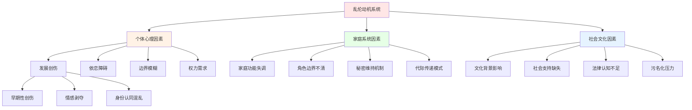

# 乱伦研究框架与专业分析 (Incest Research Framework & Professional Analysis)

> 📘 **文档导航**: 本文件提供乱伦现象的综合性学术研究框架，涵盖心理学、社会学、临床医学和法律伦理等多个维度。如需了解具体应用，请参考相关专题文档。

## 核心概念与定义体系

### 学术定义标准

乱伦(Incest)指具有血缘关系或拟制血缘关系的家庭成员之间发生的性行为，通常涉及权力不对等和伦理禁忌的违背。

### 乱伦类型学分类

| 分类维度 | 类型 | 核心特征 | 心理机制 | 社会影响 | 干预复杂度 |
|---------|------|---------|---------|---------|-----------|
| **血缘关系** | 直系血亲乱伦 | 父母-子女、祖孙间性行为 | 权力滥用、创伤性依恋 | 极度严重的社会禁忌 | 极高 |
| **血缘关系** | 旁系血亲乱伦 | 兄弟姐妹、叔侄间性行为 | 情感边界模糊、探索性行为 | 严重社会谴责 | 高 |
| **拟制关系** | 养父母-养子女 | 法律认定的亲子关系 | 信任背叛、角色混淆 | 法律后果严重 | 高 |
| **拟制关系** | 继父母-继子女 | 婚姻形成的亲子关系 | 情感操控、情境压力 | 社会关注度高 | 中高 |

### 乱伦行为的动机分析框架

## 心理学理论与机制分析

### 创伤发展理论模型

#### 创伤循环机制

乱伦创伤遵循特定的发展轨迹，涉及多个心理层面的复杂互动：

**创伤形成阶段：**
1. **初始侵犯期** - 权力不对等下的强制或操控性接触
2. **适应期** - 受害者发展出复杂的适应策略
3. **内化期** - 创伤体验被整合到自我概念中
4. **长期影响期** - 持续的心理社会功能损害

#### 依恋关系扭曲分析

| 依恋维度 | 正常发展 | 乱伦创伤影响 | 长期后果 |
|---------|---------|-------------|---------|
| **安全感建立** | 稳定的照顾者关系 | 照顾者成为威胁源 | 持续的不安全感 |
| **边界认知** | 清晰的身体和情感边界 | 边界被系统性侵犯 | 边界模糊或过度防御 |
| **信任模式** | 基于经验的安全感 | 信任被根本性破坏 | 人际信任困难 |
| **自我价值** | 通过积极互动建立 | 自我被贬低和物化 | 自我价值感低下 |

### 认知加工障碍

#### 创伤性认知图式

受害者往往发展出适应性的但功能不良的认知模式：

**核心负性信念：**
- "我是不值得被正常对待的"
- "我的身体不属于我自己"
- "亲密关系必然伴随痛苦"
- "我永远无法逃脱这种命运"

**补偿性认知策略：**
- 过度警觉和监控环境
- 情感麻木作为保护机制
- 通过取悦他人获得安全
- 隐藏真实感受和需求

## 临床表现与诊断评估

### 心理症状谱系

#### 急性期症状表现

**创伤应激反应：**
1. **侵入性症状**
   - 反复出现的创伤记忆闪回
   - 恶梦和睡眠障碍
   - 强烈的情绪和生理反应

2. **回避症状**
   - 避免与创伤相关的想法和感受
   - 情感麻木和疏离
   - 对日常活动失去兴趣

3. **警觉性增高**
   - 过度警惕和易激惹
   - 注意力集中困难
   - 夸大的惊跳反应

#### 长期心理后遗症

| 障碍类型 | 核心特征 | 发生率 | 影响机制 | 治疗重点 |
|---------|---------|--------|---------|---------|
| **复杂性PTSD** | 多维度创伤反应 | 60-80% | 持续性创伤暴露 | 情绪调节训练 |
| **抑郁症** | 持续的悲伤和绝望 | 40-60% | 自我价值感丧失 | 认知行为重构 |
| **焦虑障碍** | 广泛性焦虑和恐慌 | 35-50% | 不安全感泛化 | 暴露治疗技术 |
| **人格障碍** | 人际关系模式紊乱 | 25-40% | 早期依恋创伤 | 长期心理治疗 |
| **物质滥用** | 自我药疗行为 | 30-45% | 情绪痛苦缓解 | 综合戒治方案 |

### 身体健康影响

#### 生理应激反应

**内分泌系统紊乱：**
- 下丘脑-垂体-肾上腺轴持续激活
- 皮质醇水平异常升高
- 生长激素分泌受抑制
- 性激素水平紊乱

**免疫功能损害：**
- 炎症因子水平升高
- 细胞免疫功能下降
- 自身免疫疾病风险增加
- 慢性疲劳综合征

## 社会学与文化视角

### 文化差异分析

#### 不同文化背景下的认知差异

| 文化维度 | 西方文化 | 东方文化 | 其他文化 | 跨文化启示 |
|---------|---------|---------|---------|-----------|
| **禁忌强度** | 绝对禁忌，零容忍 | 相对禁忌，重视和谐 | 多样化标准 | 需要考虑文化敏感性 |
| **报告倾向** | 个人权利导向，鼓励举报 | 家庭面子导向，倾向于隐瞒 | 社区导向，集体决策 | 建立文化适宜的支持系统 |
| **治疗模式** | 个体化心理治疗为主 | 家庭系统治疗为重 | 社区支持网络重要 | 整合多种文化治疗元素 |
| **法律框架** | 明确的法律条文和程序 | 法律执行的社会文化制约 | 传统规范与现代法律并存 | 发展本土化的干预模式 |

### 社会结构因素

#### 家庭系统动力学

**功能失调的家庭特征：**
1. **边界系统缺陷**
   - 角色边界模糊不清
   - 世代间界限不明确
   - 个体自主性被压制

2. **沟通模式异常**
   - 秘密维持机制盛行
   - 情感表达受到抑制
   - 冲突处理方式破坏性

3. **权力结构失衡**
   - 权威被滥用进行控制
   - 弱势成员缺乏保护
   - 责任分配不合理

## 预防与干预策略

### 一级预防体系

#### 社区教育项目

**预防性教育内容框架：**
1. **身体自主权教育**
   - 身体边界概念的早期建立
   - 说"不"的权利和技能培养
   - 安全触摸和危险触摸的区别

2. **家庭功能促进**
   - 健康的家庭沟通技能培训
   - 角色边界和责任分工教育
   - 情感表达和支持技巧

3. **社会支持网络建设**
   - 社区资源和服务信息普及
   - 同伴支持小组的建立
   - 专业求助渠道宣传

### 二级干预措施

#### 早期识别和响应系统

**预警信号识别：**
- 家庭成员间的异常亲密行为
- 儿童的情绪和行为变化
- 家庭沟通模式的异常改变
- 身体伤害或不适的迹象

**应急响应程序：**
1. **立即安全保障**
   - 分离潜在的危险环境
   - 提供紧急医疗和心理支持
   - 启动儿童保护服务程序

2. **初步评估**
   - 全面的心理社会评估
   - 安全风险评估
   - 家庭功能评估

3. **干预规划**
   - 制定个性化的治疗计划
   - 协调多学科专业团队
   - 建立长期跟踪机制

### 三级治疗干预

#### 综合性治疗模型

**多层级治疗框架：**

1. **个体创伤治疗**
   - 创伤聚焦认知行为治疗(TF-CBT)
   - 眼动脱敏再加工治疗(EMDR)
   - 身体导向创伤治疗

2. **家庭系统治疗**
   - 结构性家庭治疗
   - 系统性家庭治疗
   - 多系统治疗(MST)

3. **社会支持整合**
   - 同伴支持小组
   - 社区资源整合
   - 法律和政策倡导

## 伦理与法律考量

### 专业伦理原则

#### 治疗师的角色边界

**核心伦理要求：**
1. **保密与信息披露的平衡**
   - 严格遵守保密原则
   - 明确强制报告的法律义务
   - 向当事人充分解释保密限制

2. **多重关系避免**
   - 避免与当事人建立治疗以外的关系
   - 谨慎处理家庭成员间的治疗关系
   - 确保专业判断不受个人情感影响

3. **文化敏感性**
   - 尊重当事人的文化背景和价值观
   - 避免文化偏见和刻板印象
   - 采用文化适宜的干预方法

### 法律框架分析

#### 不同司法管辖区的法律规定

| 法律维度 | 美国 | 欧洲 | 亚洲 | 国际标准 |
|---------|------|------|------|---------|
| **法定年龄** | 16-18岁不等 | 14-16岁为主 | 13-16岁差异大 | 联合国建议16岁以上 |
| **亲属关系定义** | 直系和三代以内旁系 | 直系和二代以内旁系 | 直系血亲和近姻亲 | WHO建议三代以内 |
| **举证责任** | 控方承担举证责任 | 控方举证，但考虑受害者处境 | 多数要求控方举证 | 国际趋势保护受害者 |
| **处罚标准** | 重罪，监禁刑罚 | 重罪，监禁加治疗要求 | 刑事处罚为主 | 强调康复和预防 |

## 研究前沿与发展趋势

### 新兴研究领域

#### 神经科学视角

**大脑机制研究：**
- 创伤对大脑结构和功能的影响
- 神经可塑性在康复过程中的作用
- 药物治疗与心理治疗的神经机制

#### 跨代传递机制

**代际创伤研究：**
- 表观遗传学机制
- 依恋模式的代际传递
- 家庭系统治疗的跨代效果

### 技术创新应用

#### 数字化干预工具

**远程治疗平台：**
- 安全的视频咨询系统
- 移动应用程序支持
- 在线支持社区建设

**人工智能辅助诊断：**
- 风险评估算法
- 治疗效果预测模型
- 个性化干预推荐

---
---
*本框架整合了发展心理学、创伤学、家庭治疗和社会工作的最新研究成果，为乱伦问题的预防、识别和治疗提供了科学的理论基础和实践指导。*

**相关文档链接：**
- [换妻研究专业分析](../swinging/Swinging_Research_Framework.md) - 换妻行为的学术研究框架
- [性学研究概览](../sexuality/Sexuality_Overview.md) - 性学研究的基础理论和方法
- [出轨心理学与关系干预](../relationships/infidelity/Infidelity_Psychology.md) - 相关关系背叛行为的分析
- [乱伦术语词典](Incest_Terminology_Dictionary.md) - 专业术语标准化定义
- [乱伦临床工具箱](Incest_Clinical_Toolkit.md) - 实用临床工具和量表