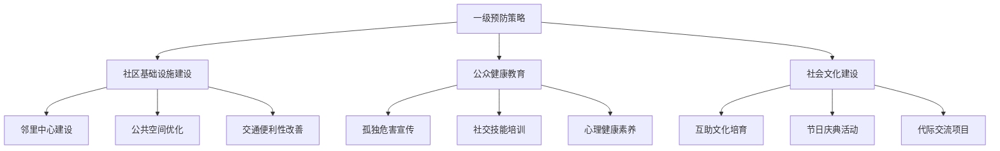
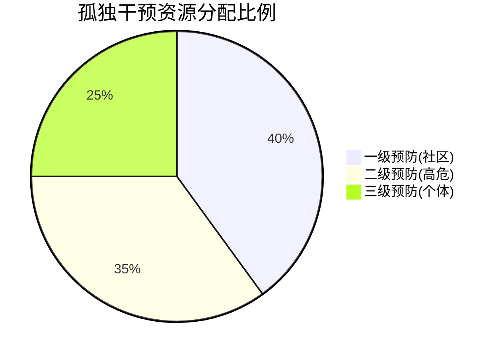
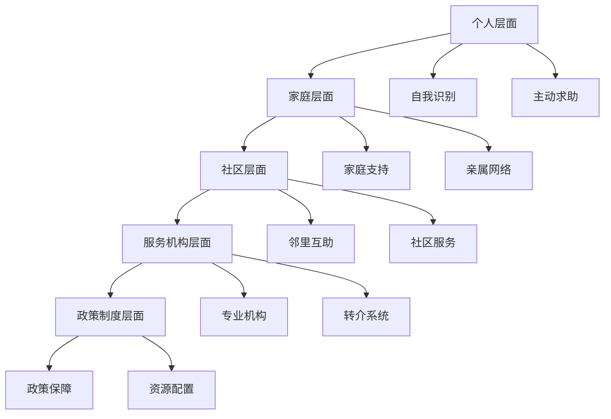

# 孤独干预效果评估与预防策略 (Loneliness Intervention Effectiveness & Prevention Strategies)

## 干预效果评估体系

### 一、效果评估框架与指标

#### 1.1 多维度评估指标体系

**核心评估维度：**

| 评估维度 | 具体指标 | 测量工具 | 评估时点 | 临床意义 |
|---------|---------|---------|---------|---------|
| **主观体验改善** | 孤独感强度变化 | UCLA孤独量表 | 基线、4周、8周、12周 | 核心症状改善程度 |
| **社会功能恢复** | 社交活动频率 | 社交参与量表 | 同上 | 行为改变指标 |
| **心理健康状况** | 抑郁焦虑水平 | PHQ-9, GAD-7 | 同上 | 共病症状改善 |
| **生活质量提升** | 整体满意度 | SF-36量表 | 基线、12周、24周 | 长期效果指标 |
| **关系质量改善** | 亲密关系满意度 | 关系满意度量表 | 适用于伴侣干预 | 关系修复指标 |

#### 1.2 干预期望值与最小临床重要差异(MCID)

**MCID标准设定：**
- **UCLA孤独量表**：减少3-4分被视为有临床意义
- **社交参与频率**：每周增加2-3次有意义社交活动
- **抑郁症状**：PHQ-9减少5分以上
- **生活质量**：SF-36评分提高5-10分

#### 1.3 长期追踪评估方案

**追踪时间点设置：**
- **短期效果**：干预结束后1个月
- **中期维持**：干预结束后3-6个月
- **长期效果**：干预结束后12个月
- **远期预防**：干预结束后24个月

### 二、循证干预方法的效果对比

#### 2.1 个体层面干预效果

| 干预方法 | 效果大小(Cohen's d) | 持续时间 | 适用人群 | 成本效益比 |
|---------|-------------------|---------|---------|-----------|
| **CBT认知重构** | 0.65-0.80 | 6-12个月 | 慢性孤独、认知偏差显著者 | 高 |
| **自我慈悲训练** | 0.55-0.70 | 8-16个月 | 自我批评严重的个体 | 高 |
| **社交技能训练** | 0.45-0.60 | 6-12个月 | 社交焦虑伴孤独者 | 中高 |
| **正念减压训练** | 0.40-0.55 | 12个月以上 | 存在性孤独、慢性压力者 | 中 |

#### 2.2 关系层面干预效果

| 干预方法 | 效果大小 | 夫妻满意度提升 | 关系稳定性改善 | 实施难度 |
|---------|---------|---------------|---------------|---------|
| **EFT情绪聚焦治疗** | 0.75-0.90 | 显著改善 | 长期稳定 | 高 |
| **Gottman方法** | 0.65-0.80 | 中等改善 | 中长期稳定 | 中高 |
| **叙事治疗** | 0.50-0.65 | 个体差异大 | 视叙事能力而定 | 中 |
| **IPT人际治疗** | 0.55-0.70 | 中等改善 | 中期稳定 | 中 |

#### 2.3 群体与社区干预效果

| 干预形式 | 参与率 | 留存率 | 社会支持增强 | 成本效益 |
|---------|--------|--------|-------------|---------|
| **同伴支持小组** | 70-85% | 60-75% | 显著增强 | 高 |
| **兴趣社群活动** | 60-80% | 50-70% | 中等增强 | 高 |
| **志愿服务项目** | 50-70% | 40-60% | 意义感提升 | 中高 |
| **在线支持平台** | 80-90% | 30-50% | 方便性高 | 中 |

### 三、预防策略体系

#### 3.1 一级预防：全民预防策略

**社区层面预防：**



**具体实施策略：**

1. **邻里互助网络建设**
   - 建立楼栋长制度
   - 定期邻里聚会活动
   - 互帮互助服务队组建
   - 紧急联系人网络建立

2. **公共空间社交功能强化**
   - 社区公园增设社交设施
   - 图书馆建立读书分享角
   - 社区食堂促进用餐社交
   - 文体活动中心定期开放

3. **数字包容性项目**
   - 老年人数字技能培训
   - 残障人士无障碍技术支持
   - 新移民语言文化交流
   - 农村地区网络基础设施改善

#### 3.2 二级预防：高危人群识别与干预

**风险人群筛查体系：**

| 高危人群类别 | 识别指标 | 干预重点 | 预防策略 |
|-------------|---------|---------|---------|
| **独居老人** | 年龄>75岁、丧偶、慢性病 | 日常陪伴、健康管理 | 居家养老服务、电话关怀 |
| **新移民群体** | 居住时间<2年、语言障碍 | 文化适应、语言支持 | 同伴支持项目、文化桥梁 |
| **职场高压人群** | 工作时长>60小时/周、远程工作 | 工作生活平衡、人际连接 | 同事支持计划、心理健康日 |
| **青少年群体** | 网络使用>4小时/天、学业压力 | 同伴关系、身份认同 | 同伴辅导、兴趣社团 |

**早期识别工具：**
- 简易孤独筛查问卷
- 社交参与度评估
- 功能性评估量表
- 生活事件压力评估

#### 3.3 三级预防：复发预防与长期维持

**复发预防策略：**

1. **维持性干预计划**
   - 每月一次巩固性会谈
   - 季度社交技能复习
   - 年度全面评估更新
   - 危机预警机制建立

2. **支持网络建设**
   - 家庭成员教育培训
   - 同伴支持者培养
   - 专业转介渠道维护
   - 社区资源整合利用

3. **生活方式固化**
   - 健康作息习惯养成
   - 规律社交活动安排
   - 兴趣爱好持续发展
   - 压力管理技能巩固

### 四、成本效益分析与资源配置

#### 4.1 不同干预模式的成本效益比

| 干预模式 | 人均成本(元) | 效果持续时间 | 成本效益比 | 推荐指数 |
|---------|-------------|-------------|-----------|---------|
| **个体CBT治疗** | 3000-5000 | 12-18个月 | 1:3.5 | ⭐⭐⭐⭐ |
| **夫妻EFT治疗** | 4000-6000 | 18-24个月 | 1:4.2 | ⭐⭐⭐⭐⭐ |
| **同伴支持小组** | 500-1000 | 12个月以上 | 1:6.8 | ⭐⭐⭐⭐⭐ |
| **社区预防项目** | 200-800 | 长期持续 | 1:8.5 | ⭐⭐⭐⭐⭐ |
| **在线自助平台** | 100-300 | 6-12个月 | 1:12.3 | ⭐⭐⭐⭐ |

#### 4.2 资源配置优化策略

**分层资源配置模型：**



**资源配置原则：**
- 预防优于治疗
- 群体干预优于个体干预
- 社区资源优于专业资源
- 长期投入优于短期救助

### 五、质量控制与持续改进

#### 5.1 干预质量监控指标

**过程质量指标：**
- 干预实施完整性(90%以上)
- 参与者满意度(85%以上)
- 治疗师胜任力达标率(95%以上)
- 干预剂量充足率(80%以上)

**结果质量指标：**
- 孤独感显著改善率(60%以上)
- 社会功能恢复率(70%以上)
- 复发率控制(低于20%)
- 长期维持率(50%以上)

#### 5.2 持续质量改进循环

**PDCA质量管理循环：**

```
Plan(计划) → Do(执行) → Check(检查) → Act(改进)
    ↓                                           ↑
制定质量标准   实施干预措施   监测过程指标   分析改进机会
设定评估工具   质量控制执行   收集反馈数据   优化实施方案
资源配置规划   督导支持提供   效果数据分析   标准化推广
```

### 六、政策建议与系统整合

#### 6.1 政策层面建议

**国家级政策框架：**
1. **立法保障**：制定孤独防治专门法规
2. **资金投入**：设立专项基金支持预防项目
3. **人才培养**：建立专业人才队伍培训体系
4. **监测系统**：建立国民孤独指数监测体系

**地方实施策略：**
1. **区域试点**：选择典型地区开展示范项目
2. **部门协作**：卫生健康、教育、民政等部门联动
3. **社会参与**：鼓励企业、NGO、志愿者参与
4. **效果评估**：建立第三方评估机制

#### 6.2 系统整合模式

**多层次整合服务网络：**



### 七、未来发展方向

#### 7.1 技术创新应用

**人工智能辅助：**
- 智能筛查和风险评估
- 个性化干预方案推荐
- 实时监测和预警系统
- 虚拟现实社交康复

**大数据分析：**
- 孤独模式识别和预测
- 干预效果精准评估
- 资源配置优化建议
- 政策效果追踪分析

#### 7.2 跨学科融合发展

**整合医学模式：**
- 心理社会干预与生物医学结合
- 个体治疗与环境改造并重
- 预防与治疗一体化设计
- 定量评估与质性研究融合

**国际化合作：**
- 跨文化干预模式比较研究
- 国际最佳实践本土化适应
- 全球孤独监测网络建设
- 国际人才培养交流合作

---

*本文件整合了当前孤独干预领域的最新研究证据和实践经验，为政策制定者、服务提供者和研究人员提供了科学的评估框架和预防策略指导。*