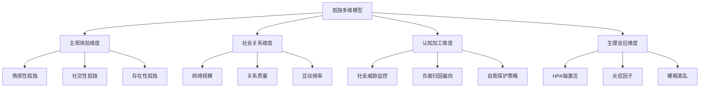
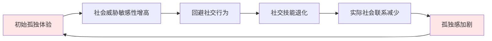

# 孤独研究框架与学术综述 (Loneliness Research Framework & Academic Review)

## 📚 目录导航 (Navigation Menu)

- [核心研究框架](#核心研究框架-core-research-framework)
- [测量工具与评估体系](#测量工具与评估体系-measurement-tools--assessment-system)
- [神经生物学机制](#神经生物学机制-neurobiological-mechanisms)
- [心理社会机制](#心理社会机制-psychosocial-mechanisms)
- [流行病学特征](#流行病学特征-epidemiological-characteristics)
- [健康后果与疾病关联](#健康后果与疾病关联-health-consequences--disease-associations)
- [循证干预策略](#循证干预策略-evidence-based-intervention-strategies)
- [新兴研究前沿](#新兴研究前沿-emerging-research-frontiers)
- [未来研究方向](#未来研究方向-future-research-directions)
- [临床实践指南](#临床实践指南-clinical-practice-guidelines)

---

## 核心研究框架 (Core Research Framework)

### 一、孤独的概念化与理论模型 (Conceptualization & Theoretical Models)

#### 1.1 经典理论模型

| 理论模型 | 提出者/时期 | 核心观点 | 测量维度 | 应用价值 |
|---------|------------|----------|----------|----------|
| **社会纽带理论** | Weiss (1973) | 区分情感性孤独(缺乏亲密关系)与社交性孤独(缺乏群体归属) | 情感孤独、社交孤独 | 临床评估、干预定向 |
| **社会认知理论** | Cacioppo & Patrick (2008) | 孤独是进化适应性机制，涉及社会疼痛神经系统 | 认知偏差、神经激活模式 | 神经机制研究、生物标志物 |
| **动机理论** | Deci & Ryan (2000) | 孤独源于基本心理需求(关联、胜任、自主)未满足 | 需求满足程度、动机类型 | 积极心理学干预 |
| **存在主义模型** | Yalom (1980) | 孤独是人类存在的根本条件之一，包括人际孤独与终极孤独 | 存在焦虑水平、意义感 | 深层心理治疗、灵性整合 |

#### 1.2 现代理论整合

### 二、测量工具与评估体系 (Measurement Tools & Assessment System)

> 🔗 **相关文档链接**：
> - [孤独测量工具详解](Loneliness_Measurement_Tools.md) - 详细的测量工具使用指南
> - [孤独标准术语表](Loneliness_Terminology_Standards.md) - 统一的专业术语定义
> - [孤独临床诊疗手册](Loneliness_Clinical_Manual.md) - 临床评估与诊断流程

#### 2.1 标准化量表

| 量表名称 | 开发者 | 条目数 | 信效度 | 适用人群 | 核心维度 |
|---------|--------|--------|--------|----------|----------|
| **UCLA孤独量表** | Russell et al. (1980) | 20项 | α=0.89-0.94 | 成人通用 | 总体孤独感强度 |
| **De Jong Gierveld孤独量表** | De Jong Gierveld & Van Tilburg (2006) | 6项 | α=0.80-0.85 | 老年人、一般人群 | 情感孤独、社交孤独 |
| **孤独体验量表** | Perlman & Peplau (1981) | 35项 | α=0.85-0.90 | 成人、大学生 | 孤独频率、强度、持续时间 |
| **儿童孤独量表** | Asher et al. (1984) | 16项 | α=0.80-0.88 | 8-12岁儿童 | 同伴关系孤独感 |

#### 2.2 临床评估访谈指南

**核心问诊要素：**

1. **主观体验评估**
   - "最近什么时候感到最孤独？当时发生了什么？"
   - "这种孤独感持续多久了？频率如何？"
   - "孤独时你的身体有什么感觉？"

2. **社会关系映射**
   - 绘制社会网络图：亲密关系、朋友、同事、家庭成员
   - 评估各关系的情感支持质量
   - 识别关系中的"空缺位置"

3. **功能影响评估**
   - 工作/学习效率变化
   - 日常活动参与度
   - 睡眠质量和作息规律
   - 物质使用模式改变

### 三、神经生物学机制 (Neurobiological Mechanisms)

#### 3.1 神经回路与脑区激活

| 脑区/系统 | 孤独状态下表现 | 功能意义 | 相关研究证据 |
|-----------|----------------|----------|--------------|
| **背侧前扣带回皮层(dACC)** | 高度激活 | 社会疼痛加工 | Eisenberger et al. (2003) |
| **前岛叶皮层(AI)** | 激活增强 | 负面情绪体验 | Cacioppo et al. (2009) |
| **杏仁核** | 对社会威胁敏感性增高 | 防御性监控 | Cacioppo et al. (2015) |
| **纹状体奖励系统** | 激活降低 | 社交奖赏预期减少 | Tomova et al. (2020) |
| **默认模式网络(DMN)** | 连接模式改变 | 自我参照加工增强 | Bzdok et al. (2016) |

#### 3.2 神经递质与激素系统

| 系统 | 孤独状态下的变化 | 生理后果 | 调节机制 |
|------|------------------|----------|----------|
| **催产素系统** | 功能受损 | 社会信任降低 | 鼻喷催产素实验治疗 |
| **多巴胺系统** | 奖赏预期降低 | 社交动机减退 | 多巴胺激动剂研究 |
| **血清素系统** | 功能异常 | 情绪调节障碍 | SSRIs临床应用 |
| **皮质醇HPA轴** | 慢性激活 | 炎症反应增强 | 压力管理干预 |

#### 3.3 炎症与免疫反应

**孤独相关的生物标志物：**

- **促炎因子升高**：IL-6, TNF-α, CRP
- **抗炎因子降低**：IL-10, TGF-β
- **免疫细胞改变**：NK细胞活性降低，单核细胞促炎表型
- **基因表达变化**：NF-κB通路激活，干扰素刺激基因下调

### 四、心理社会机制 (Psychosocial Mechanisms)

#### 4.1 认知加工偏差

| 认知偏差类型 | 孤独个体的表现 | 维持机制 | 干预靶点 |
|-------------|----------------|----------|----------|
| **注意偏向** | 过度监控社会威胁线索 | 警戒性增强 | 注意训练程序 |
| **解释偏向** | 将中性社交信号解读为拒绝 | 负面归因模式 | 认知重构技术 |
| **记忆偏向** | 更容易回忆孤独相关经历 | 消极记忆网络 | 积极记忆提取 |
| **预期偏向** | 预测社交结果消极 | 自我实现预言 | 行为实验验证 |

#### 4.2 行为维持循环

### 五、流行病学特征 (Epidemiological Characteristics)

#### 5.1 人口统计学分布

| 人群类别 | 孤独患病率 | 主要风险因素 | 保护因素 |
|---------|------------|--------------|----------|
| **老年人(65+)** | 25-40% | 丧偶、退休、健康衰退 | 社区参与、代际联系 |
| **青年人(18-29)** | 30-45% | 数字媒体使用、就业压力 | 稳定友谊、兴趣社群 |
| **中年人(30-64)** | 20-30% | 工作家庭平衡、照顾负担 | 伴侣支持、职场友谊 |
| **青少年(12-17)** | 25-35% | 身份探索、同伴压力 | 家庭温暖、学校归属 |

#### 5.2 社会变迁影响

**现代化进程中的孤独模式转变：**

1. **城市化进程**：邻里关系疏离、匿名性增加
2. **数字化革命**：连接便利性vs情感深度的矛盾
3. **家庭结构变化**：核心家庭普及、代际分离
4. **工作模式演变**：远程办公、零工经济的影响

### 六、健康后果与疾病关联 (Health Consequences & Disease Associations)

#### 6.1 身体健康影响

| 健康领域 | 孤独相关风险 | 效应量 | 机制路径 |
|----------|-------------|--------|----------|
| **心血管疾病** | 风险增加29% | HR=1.29 | 炎症、血压升高、凝血异常 |
| **认知衰退** | 风险增加40% | HR=1.40 | 神经炎症、海马萎缩 |
| **全因死亡率** | 风险增加26% | HR=1.26 | 多系统累积效应 |
| **睡眠障碍** | 患病率增加50% | OR=1.50 | 昼夜节律紊乱、觉醒增加 |

#### 6.2 心理健康共病

| 精神障碍 | 孤独相关性 | 相互影响机制 |
|----------|------------|--------------|
| **抑郁症** | OR=2.5-4.0 | 共同的神经生物学基础 |
| **焦虑障碍** | OR=2.0-3.0 | 社会威胁敏感性共享 |
| **物质使用障碍** | OR=1.8-2.5 | 自我药理学机制 |
| **自杀风险** | HR=2.0-3.5 | 绝望感和无归属感 |

### 七、循证干预策略 (Evidence-Based Intervention Strategies)

> 🔗 **相关文档链接**：
> - [孤独干预效果评估](Loneliness_Prevention_Evaluation.md) - 干预效果的系统评估
> - [孤独临床诊疗手册](Loneliness_Clinical_Manual.md) - 详细的临床治疗方案
> - [孤独社会心理学](Loneliness_Social_Psychology.md) - 社区和社会层面的干预策略

#### 7.1 个体层面干预

**认知行为疗法(CBT)核心组件：**

1. **认知重构模块**
   - 识别孤独相关自动思维
   - 挑战负面归因偏向
   - 发展平衡性信念
   
2. **行为激活技术**
   - 社交行为实验设计
   - 逐步暴露练习
   - 积极活动安排

3. **自我慈悲训练**
   - 自我友善培养
   - 共同人性觉察
   - 正念接纳练习

#### 7.2 关系层面干预

| 干预方法 | 理论基础 | 核心技术 | 循证支持 |
|----------|----------|----------|----------|
| **人际关系治疗(IPT)** | 依恋理论、社会支持理论 | 角色转换处理、人际技能训练 | 中等强度证据 |
| **依恋取向治疗** | Bowlby依恋理论 | 安全基地重建、依恋叙事工作 | 强有力证据 |
| **社交技能训练** | 社会学习理论 | 沟通技巧、非言语交流、冲突解决 | 中等强度证据 |

#### 7.3 系统层面干预

**家庭系统治疗要点：**

1. **系统评估**
   - 家庭沟通模式分析
   - 情感表达习惯评估
   - 家庭生命周期阶段识别

2. **结构化干预**
   - 家庭会议制度建立
   - 情感表达练习
   - 共同活动规划

3. **仪式化建设**
   - 定期家庭聚餐
   - 节日庆祝传统
   - 里程碑事件纪念

#### 7.4 社区层面策略

| 社区干预形式 | 实施要点 | 预期效果 | 循证等级 |
|--------------|----------|----------|----------|
| **同伴支持小组** | 同质性匹配、结构化流程 | 社会支持增强、应对技能提升 | 强有力证据 |
| **兴趣社群建设** | 共同爱好为基础、定期聚会 | 归属感获得、自然社交机会 | 中等强度证据 |
| **志愿服务参与** | 结构化项目、技能培训 | 意义感增强、社会价值实现 | 强有力证据 |
| **邻里互助网络** | 地域邻近性、互惠原则 | 日常支持获得、紧急援助渠道 | 中等强度证据 |

### 八、新兴研究前沿 (Emerging Research Frontiers)

#### 8.1 技术辅助干预

**数字健康解决方案：**

1. **AI聊天机器人**
   - 情感支持对话
   - 认知行为引导
   - 危机识别与转介

2. **虚拟现实社交**
   - 安全社交环境模拟
   - 社交技能训练
   - 存在感增强体验

3. **移动健康应用**
   - 孤独监测与预警
   - 个性化干预推送
   - 社交活动推荐

#### 8.2 生物标志物研究

**精准医学发展方向：**

- **遗传易感性标记**：OXTR、AVPR1A等基因多态性
- **神经影像特征**：大脑网络连接模式识别
- **生物节律指标**：昼夜节律基因表达谱
- **微生物组关联**：肠道菌群与社会行为联系

#### 8.3 跨文化比较研究

**文化背景对孤独体验的影响：**

- **集体主义vs个人主义文化**中的孤独表达差异
- **年龄相关期望**对孤独感知的影响
- **性别角色规范**与孤独求助行为
- **宗教信仰**对孤独意义建构的作用

### 九、未来研究方向 (Future Research Directions)

#### 9.1 方法学创新

1. **纵向追踪研究设计**
   - 多时间点测量孤独轨迹
   - 因果关系推断加强
   - 个体差异机制揭示

2. **多模态数据整合**
   - 行为观察、生理测量、自我报告结合
   - 机器学习算法应用
   - 个性化预测模型构建

3. **生态瞬时评估(EMA)**
   - 自然环境中的实时数据采集
   - 日常生活情境下孤独体验捕捉
   - 微观过程机制解析

#### 9.2 理论发展需求

1. **动态系统理论整合**
   - 孤独状态的非线性变化特征
   - 系统内各要素相互作用机制
   - 临界点和转折条件识别

2. **文化敏感性理论建构**
   - 跨文化孤独概念的操作化
   - 文化特异性干预策略开发
   - 全球化背景下的本土化适应

3. **发展生命周期视角**
   - 不同发展阶段孤独特征差异
   - 早期经历对成年期孤独的影响
   - 老年期孤独的独特机制

### 十、临床实践指南 (Clinical Practice Guidelines)

#### 10.1 评估流程标准化

**三级筛查体系：**

1. **初步筛查**：使用简短量表(UCLA-3或单条目筛查)
2. **详细评估**：全面量表+临床访谈
3. **深入诊断**：多维度功能评估+危险因素分析

#### 10.2 干预强度分级

| 孤独严重程度 | 推荐干预强度 | 核心策略组合 | 预期疗程 |
|-------------|-------------|-------------|----------|
| **轻度** | 低强度自助 | 心理教育、技能训练 | 4-8周 |
| **中度** | 中等强度治疗 | CBT+小组支持 | 8-16周 |
| **重度** | 高强度综合 | 个体治疗+家庭工作+药物辅助 | 16-24周 |

#### 10.3 转介指征

**需要专业医疗介入的情况：**

- 共病重度抑郁或焦虑障碍
- 自杀风险或自伤行为
- 物质滥用问题
- 严重功能损害
- 对心理治疗反应不佳

---

*本文档基于当前最新的孤独研究文献综述，整合了心理学、神经科学、公共卫生等多个学科的研究成果，旨在为临床实践、科研工作和政策制定提供科学依据。*