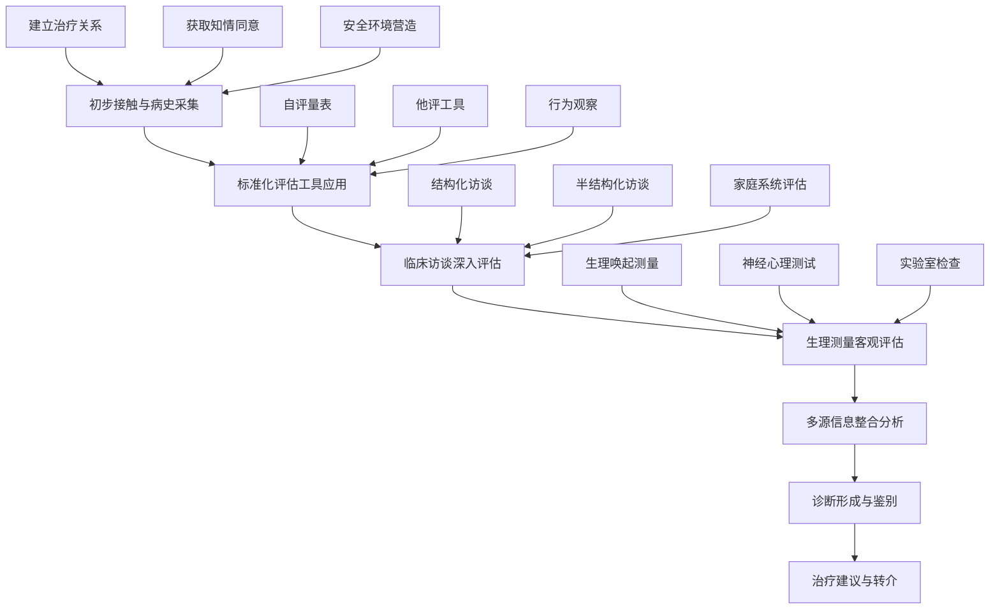
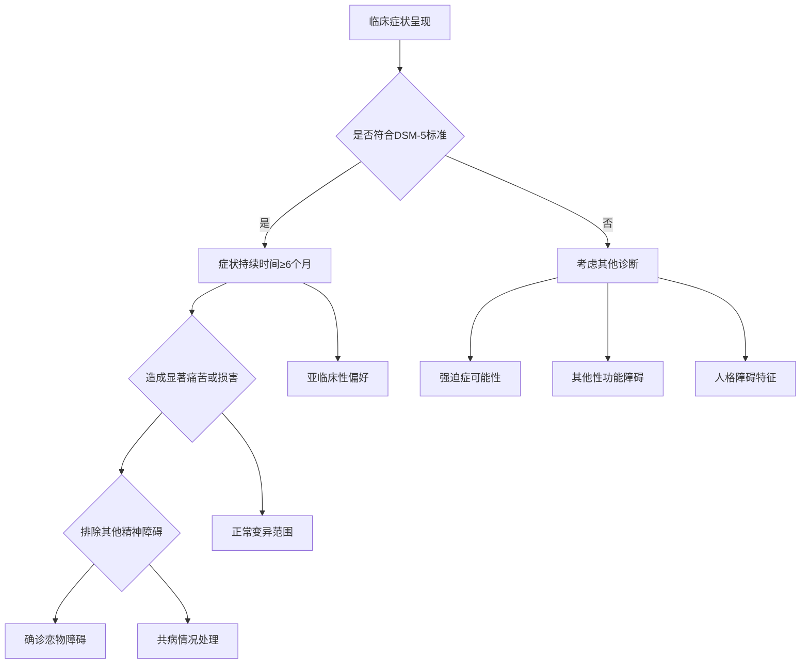

# Paraphilic Disorders: Clinical Assessment & Diagnosis (恋物癖临床评估与诊断)

> 📘 **文档导航**: 本专题文档提供恋物癖临床评估的专业指导。相关主题请参考：
> - [恋物癖概览](Paraphilia_Overview.md) - 基础概念和整体框架
> - [具体恋物类型](specific-types/) - 各类恋物癖的详细特征
> - [恋物癖治疗实践](Paraphilia_Treatment_Interventions.md) - 临床干预方法
> - [恋物癖神经科学](Paraphilia_Neuroscience_Biology.md) - 生物学机制基础
> - [恋物癖心理学](Paraphilia_Psychological_Theory.md) - 理论基础支撑
> - [质量报告](Paraphilia_Quality_Report.md) - 体系质量评估详情

## 临床评估原则 (Clinical Assessment Principles)

### 核心评估理念

| 评估原则 | 具体内涵 | 实施要点 | 质量保证 |
| :--- | :--- | :--- | :--- |
| **生物-心理-社会整合** | 全人视角的综合评估 | 多维度信息收集 | 确保评估的全面性 |
| **功能导向** | 重点关注功能损害程度 | 实际生活影响评估 | 强调临床实用性 |
| **循证基础** | 基于最佳研究证据 | 标准化工具使用 | 保证评估的科学性 |
| **文化敏感** | 考虑文化背景差异 | 文化适应性调整 | 确保评估的适宜性 |
| **伦理合规** | 严格遵守伦理规范 | 知情同意和隐私保护 | 维护专业标准 |

### 评估流程框架



## 标准化评估工具 (Standardized Assessment Tools)

### 核心诊断量表

#### 恋物障碍诊断问卷 (Paraphilic Disorder Diagnostic Questionnaire, PDDQ)

```
量表结构：

第一部分：核心症状评估 (12个项目)
- 性唤起模式的异常性
- 唤起对象的非典型性
- 症状持续时间评估
- 痛苦和损害程度

第二部分：功能损害评估 (10个项目)
- 社会功能影响
- 职业功能损害
- 人际关系困扰
- 日常生活受限

第三部分：共病情况筛查 (8个项目)
- 抑郁症状评估
- 焦虑症状筛查
- 物质使用情况
- 人格障碍特征

第四部分：风险评估 (6个项目)
- 自伤风险
- 伤人风险
- 法律风险
- 社会风险

评分标准：
总分范围：36-180分
临床分界值：≥108分提示临床显著的恋物障碍
各维度临界值：症状≥36分，损害≥30分，共病≥24分
```

#### 性唤起模式评估量表 (Sexual Arousal Pattern Assessment Scale, SAPAS)

| 评估维度 | 测量内容 | 评估方法 | 临床意义 |
| :--- | :--- | :--- | :--- |
| **唤起对象** | 性唤起的具体对象类型 | 多选题+排序题 | 确定恋物类型和严重程度 |
| **唤起强度** | 对不同刺激的唤起水平 | 7点李克特量表 | 量化症状严重程度 |
| **唤起频率** | 恋物相关唤起的发生频率 | 频率选项选择 | 评估症状稳定性 |
| **控制能力** | 对恋物唤起的控制程度 | 行为控制量表 | 判断治疗可行性 |
| **功能影响** | 对日常生活功能的影响 | 功能损害评估 | 确定临床显著性 |

### 专业访谈指南

#### 结构化临床访谈 (Structured Clinical Interview for Paraphilias, SCIP)

##### 访谈模块设计

```
Module 1: 基础信息采集 (15-20分钟)
- 人口统计学信息
- 教育和职业背景
- 婚姻和关系状况
- 家庭成长环境

Module 2: 性发展史评估 (20-25分钟)
- 早期性经验回顾
- 性取向发展过程
- 关键转折点识别
- 重要影响因素分析

Module 3: 恋物症状详述 (25-30分钟)
- 首次恋物体验
- 症状发展轨迹
- 当前表现形式
- 相关行为模式

Module 4: 功能损害评估 (20-25分钟)
- 工作/学业影响
- 人际关系变化
- 社会功能状况
- 日常生活困扰

Module 5: 痛苦体验探查 (15-20分钟)
- 主观痛苦程度
- 痛苦主要来源
- 应对策略效果
- 求助动机强度

Module 6: 风险因素筛查 (15-20分钟)
- 自伤风险评估
- 伤人风险排查
- 法律风险识别
- 社会风险分析
```

#### 半结构化访谈技巧

##### 关键访谈技能

| 技能类型 | 具体技术 | 应用场景 | 注意事项 |
| :--- | :--- | :--- | :--- |
| **建立关系** | 积极倾听、共情理解、真诚接纳 | 访谈初始阶段 | 避免评判性态度 |
| **信息采集** | 开放式提问、具体化技术、澄清确认 | 症状描述阶段 | 确保信息准确性 |
| **深度探索** | 面质技术、诠释引导、联想启发 | 核心问题探讨 | 保持专业边界 |
| **风险评估** | 直接询问、情景模拟、历史回顾 | 风险筛查环节 | 重视安全考虑 |

## 生理客观评估 (Physiological Objective Assessment)

### 性唤起生理测量

#### 生理测量技术矩阵

| 测量方法 | 技术原理 | 适用性别 | 临床应用 | 标准化程度 |
| :--- | :--- | :--- | :--- | :--- |
| **阴茎体积描记器** | 测量阴茎血容量变化 | 男性专用 | 直接性唤起反应 | 高度标准化 |
| **阴道光电容积描记** | 测量阴道血流变化 | 女性专用 | 女性性唤起评估 | 中等标准化 |
| **皮肤电反应** | 测量交感神经激活 | 男女通用 | 情绪唤醒水平 | 良好标准化 |
| **心率变异性** | 测量自主神经平衡 | 男女通用 | 情绪调节状态 | 新兴测量技术 |
| **瞳孔测量** | 测量瞳孔直径变化 | 男女通用 | 注意投入程度 | 研究应用较多 |

#### 测量protocol标准

```
标准化测量流程：

准备阶段：
- 环境设置：安静、私密、舒适的测量环境
- 设备校准：严格按照操作手册进行设备校准
- 受试者准备：充分的休息和放松指导
- 知情同意：详细解释测量过程和目的

基线测量：
- 5分钟安静状态下的生理指标记录
- 建立个体化的基线参考值
- 确认设备工作状态正常
- 受试者适应测量环境

刺激呈现：
- 标准化的刺激材料展示
- 控制刺激呈现的时间和顺序
- 实时监测生理反应变化
- 记录受试者的主观体验

数据分析：
- 原始数据的标准化处理
- 生理指标的定量分析
- 与主观报告的对比验证
- 个体化结果解释
```

### 神经心理学评估

#### 认知功能测试

| 测试领域 | 评估工具 | 核心功能 | 临床意义 |
| :--- | :--- | :--- | :--- |
| **执行功能** | 威斯康星卡片分类测验 | 认知灵活性、抽象推理 | 冲动控制能力评估 |
| **注意力** | 持续操作测试 | 注意集中、持续注意 | 注意偏向模式识别 |
| **记忆功能** | 加州词语学习测验 | 学习记忆、信息保持 | 创伤记忆影响评估 |
| **抑制控制** | Stroop色词测验 | 冲动抑制、认知控制 | 自我调节能力测量 |

#### 神经影像学检查

##### fMRI研究应用

```
神经影像研究protocol：

实验设计：
- Block design或event-related design
- 控制条件与实验条件对比
- 多次重复测量确保可靠性
- 严格的头动控制和校正

数据采集：
- 3T或更高场强MRI扫描仪
- T2*加权BOLD信号测量
- 高分辨率结构性像获取
- 实时生理信号同步记录

数据分析：
- SPM或FSL软件包处理
- 空间标准化到标准模板
- 统计参数图(SPM)生成
- ROI感兴趣区域分析

结果解释：
- 激活脑区的功能定位
- 与症状严重程度的相关性
- 网络连接模式分析
- 个体差异的神经基础
```

## 鉴别诊断体系 (Differential Diagnosis System)

### 主要鉴别诊断

#### 与正常性偏好的区分

| 鉴别维度 | 正常性偏好 | 病理性恋物 | 判别标准 |
| :--- | :--- | :--- | :--- |
| **痛苦体验** | 无显著心理痛苦 | 明显的主观痛苦 | 痛苦量表评分≥中度 |
| **功能损害** | 不影响正常功能 | 显著功能损害 | 功能损害量表≥临床阈值 |
| **控制能力** | 具有良好的自控力 | 控制困难明显 | 冲动控制评估异常 |
| **社会适应** | 良好的社会适应 | 社会功能受损 | 社会适应量表异常 |

#### 与其他精神障碍的鉴别

| 疾病类型 | 鉴别要点 | 关键差异 | 评估工具 |
| :--- | :--- | :--- | :--- |
| **强迫症** | 强迫思维vs性唤起 | 内容性质不同 | Y-BOCS量表 |
| **抑郁症** | 性欲低下vs异常唤起 | 唤起模式相反 | 抑郁量表评估 |
| **焦虑障碍** | 泛化焦虑vs特定唤起 | 焦虑对象差异 | 焦虑量表筛查 |
| **人格障碍** | 人格特质vs症状表现 | 稳定性vs情境性 | 人格评估工具 |

### 诊断决策树



## 功能损害评估 (Functional Impairment Assessment)

### 多维度损害评估

#### 社会功能评估

| 功能领域 | 评估指标 | 评定标准 | 临床意义 |
| :--- | :--- | :--- | :--- |
| **职业功能** | 工作效率、出勤率、晋升机会 | 与同龄人比较 | 评估经济独立性影响 |
| **学业表现** | 学习成绩、专注力、完成度 | 与既往水平比较 | 评估发展潜力影响 |
| **人际交往** | 社交频率、关系质量、支持系统 | 社会网络分析 | 评估社会支持影响 |
| **家庭关系** | 亲密程度、沟通质量、角色功能 | 家庭功能评估 | 评估核心关系影响 |

#### 心理功能评估

##### 情绪状态测量

```
情绪评估工具组合：

1. 抑郁症状评估
   - 贝克抑郁量表(BDI-II)
   - 汉密尔顿抑郁量表(HAMD)
   - 抑郁自评量表(SDS)

2. 焦虑症状筛查
   - 状态-特质焦虑量表(STAI)
   - 广泛性焦虑障碍量表(GAD-7)
   - 恐慌症状严重程度量表

3. 压力水平测量
   - 压力量表(PSS)
   - 生活事件量表
   - 应对方式问卷

4. 自尊水平评估
   - 罗森伯格自尊量表
   - 自我概念量表
   - 身体形象问卷
```

#### 行为功能评估

##### 冲动控制测量

| 测量工具 | 评估维度 | 信效度指标 | 临床应用 |
| :--- | :--- | :--- | :--- |
| **Barratt冲动量表** | 运动冲动、非计划冲动、注意力冲动 | α=0.85，良好重测信度 | 冲动性人格特征评估 |
| **UPPS-P冲动行为量表** | 负性紧迫感、缺乏前瞻性、感觉寻求 | 良好因子结构效度 | 多维度冲动性测量 |
| **停止信号任务** | 行为抑制能力 | 认知神经科学标准 | 实验室客观测量 |
| **延迟折扣任务** | 时间偏好和自控能力 | 行为经济学范式 | 决策风格评估 |

## 风险评估体系 (Risk Assessment System)

### 自伤风险评估

#### 风险因子识别

| 风险等级 | 核心因子 | 评估指标 | 干预策略 |
| :--- | :--- | :--- | :--- |
| **低风险** | 轻微痛苦、良好支持 | 痛苦评分<4，支持系统健全 | 心理教育、监测观察 |
| **中风险** | 中度痛苦、部分支持 | 痛苦评分4-7，支持系统一般 | 个体治疗、技能训练 |
| **高风险** | 严重痛苦、缺乏支持 | 痛苦评分≥8，支持系统薄弱 | 密集治疗、危机干预 |

#### 危机评估工具

```
自杀风险评估protocol：

Immediate Risk Indicators:
- 自杀意念的明确表达
- 具体的自杀计划制定
- 自杀行为的近期尝试史
- 获取致命手段的准备行为

Contributing Factors:
- 严重的抑郁情绪状态
- 显著的功能损害程度
- 缺乏社会支持系统
- 物质滥用或依赖问题

Protective Factors:
- 强烈的生存意愿表达
- 重要的社会关系纽带
- 有效的应对策略储备
- 积极的治疗合作态度
```

### 伤人风险评估

#### 危险性评估

| 评估维度 | 风险指标 | 评估工具 | 管理策略 |
| :--- | :--- | :--- | :--- |
| **行为历史** | 攻击行为史、违法行为记录 | 暴力风险评估量表 | 法律监管、强制治疗 |
| **冲动控制** | 冲动性人格、情绪不稳定 | Barratt冲动量表 | 行为管理、环境控制 |
| **现实检验** | 精神病性症状、认知扭曲 | 精神病评定量表 | 药物治疗、住院观察 |
| **社会支持** | 孤立状态、敌对关系 | 社会网络评估 | 支持系统建设、监督 |

## 诊断报告撰写 (Diagnostic Report Writing)

### 标准化报告格式

#### 临床诊断报告模板

```
患者基本信息：
姓名：[匿名处理]
性别：[性别]
年龄：[年龄]
就诊日期：[日期]

主诉问题：
[患者主要抱怨和求诊原因]

现病史：
[症状起始、发展过程、当前状况]

既往史：
[相关医疗史、精神科史、治疗史]

家族史：
[家族精神病史、相关疾病史]

评估过程：
1. 临床访谈发现
2. 标准化工具结果
3. 生理测量数据
4. 多源信息整合

诊断结论：
[根据DSM-5/ICD-11标准的诊断]

功能损害评估：
[各领域功能损害程度]

风险评估：
[自伤/伤人风险等级]

治疗建议：
[具体治疗方案推荐]

预后判断：
[短期和长期预后评估]
```

#### 评估结果解释

##### 个体化反馈原则

| 反馈要素 | 具体做法 | 注意事项 | 专业要求 |
| :--- | :--- | :--- | :--- |
| **结果呈现** | 客观准确地传达评估结果 | 避免标签化和污名化 | 保持专业和同理心 |
| **意义解释** | 帮助理解诊断的意义和影响 | 使用通俗易懂的语言 | 确保理解的准确性 |
| **治疗选择** | 详细介绍可行的治疗选项 | 尊重患者的自主选择权 | 提供充分的信息支持 |
| **后续计划** | 制定具体的follow-up安排 | 建立持续的支持系统 | 确保治疗的连续性 |

## 质量控制体系 (Quality Control System)

### 评估质量标准

#### 信效度保障

| 质量指标 | 标准要求 | 监测方法 | 改进措施 |
| :--- | :--- | :--- | :--- |
| **评估一致性** | 重测信度≥0.80 | 定期盲法重测 | 标准化培训加强 |
| **诊断准确性** | 与gold standard一致性≥85% | 同行评议验证 | 持续教育提升 |
| **测量敏感性** | 能够detect临床显著变化 | 效应量分析 | 工具选择优化 |
| **文化适宜性** | 不同文化群体适用性良好 | 文化适应性检验 | 本土化修订完善 |

#### 专业能力要求

##### 评估者资质标准

| 资质要求 | 具体标准 | 能力评估 | 持续发展 |
| :--- | :--- | :--- | :--- |
| **专业培训** | 相关专业学位+专门培训 | 能力考核认证 | 定期进修更新 |
| **实践经验** | 最低案例数量要求 | 同行督导评估 | 案例讨论学习 |
| **伦理素养** | 严格遵守职业伦理 | 伦理委员会监督 | 持续伦理教育 |
| **文化能力** | 跨文化敏感性技能 | 文化能力测评 | 多元文化培训 |

### 持续质量改进

#### 质量监测机制

```
质量管理体系：

定期审核制度：
- 每月案例质量回顾
- 每季度同行评议会议
- 每年全面质量评估
- 不定期外部audit检查

反馈改进循环：
- 患者满意度调查
- 同行专业反馈收集
- 临床效果追踪评估
- 持续改进措施实施

最佳实践分享：
- 成功案例经验总结
- 创新方法推广应用
- 跨机构合作交流
- 专业发展共同体建设
```

---

*本文档遵循国际专业标准制定，建议结合具体临床情况灵活应用。*