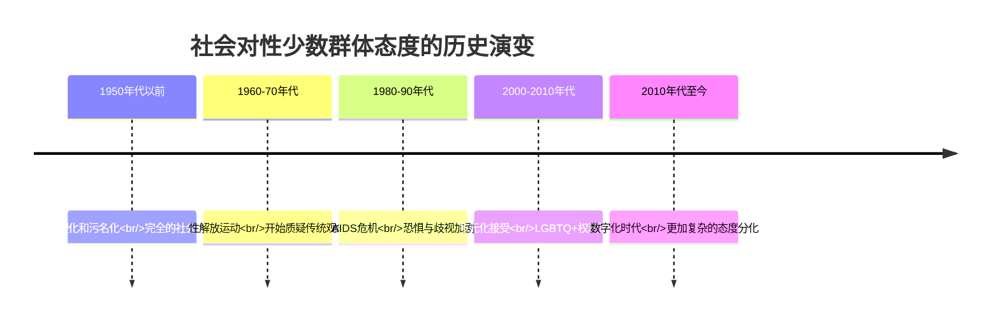

# Paraphilic Disorders: Ethics, Law & Sociocultural Considerations (恋物癖伦理法律与社会文化考量)

> ⚠️ **重要声明**: 本文档严格遵守法律法规，任何涉及未成年人的实际行为都是严重违法的，必须坚决反对和杜绝。
> 
> 📘 **文档导航**: 本专题文档探讨恋物癖相关的伦理法律问题。相关主题请参考：
> - [恋物癖概览](Paraphilia_Overview.md) - 基础概念和整体框架
> - [恋物癖治疗实践](Paraphilia_Treatment_Interventions.md) - 临床干预方法
> - [恋物癖研究方法](Paraphilia_Research_Methods.md) - 研究伦理规范
> - [质量报告](Paraphilia_Quality_Report.md) - 体系质量评估详情

## 伦理原则框架 (Ethical Principles Framework)

### 核心伦理原则

| 伦理原则 | 核心内涵 | 实践要求 | 冲突处理机制 | 监督保障 |
| :--- | :--- | :--- | :--- | :--- |
| **尊重自主权** | 承认个体的决策能力和自由意志 | 充分知情同意、自愿参与、随时退出权 | 当自主权与其他权益冲突时寻求平衡 | 独立伦理委员会审查 |
| **不伤害原则** | 避免造成身体、心理或社会伤害 | 风险-收益评估、最小风险设计、伤害预防措施 | 可接受风险的界定和论证 | 持续风险监测和报告 |
| **有益原则** | 促进个体和社会的整体福祉 | 科学价值最大化、社会效益优化、知识贡献 | 个人利益与公共利益的权衡 | 研究价值评估和跟踪 |
| **公正原则** | 公平选择参与者，合理分配负担和收益 | 包容性招募、避免剥削、利益分享机制 | 弱势群体保护与代表性平衡 | 多元化审查和监督 |
| **诚信原则** | 研究过程的真实性和可靠性 | 数据完整性、方法透明度、结果客观性 | 利益冲突披露和管理 | 同行评议和学术监督 |

### 专业伦理边界

#### 治疗师伦理责任

```
专业边界维护：

双重关系避免：
- 避免与来访者建立治疗以外的关系
- 明确专业角色和边界
- 处理潜在的利益冲突
- 建立清晰的沟通准则

保密原则执行：
- 严格保护来访者隐私
- 信息披露的法律例外情况
- 信息安全的技术保障
- 边界情况的伦理决策

胜任力维护：
- 持续专业发展和培训
- 超出能力范围时的转介
- 督导和同行咨询
- 质量保证机制建立
```

#### 研究伦理规范

##### 知情同意要求

```
知情同意要素：

信息充分披露：
- 研究目的和程序详细说明
- 潜在风险和收益客观陈述
- 参与者权利的明确告知
- 退出机制的清楚解释

理解能力确认：
- 确保参与者充分理解信息
- 使用通俗易懂的语言表达
- 提供书面材料和口头解释
- 回答疑问和澄清误解

自愿参与保障：
- 无任何形式的强迫或诱导
- 充分的时间考虑和决定
- 可以随时撤回同意
- 不因拒绝参与而受不利影响
```

## 法律法规体系 (Legal Regulatory Framework)

### 刑事法律规定

#### 涉及未成年人的法律红线

| 法律条款 | 核心内容 | 适用范围 | 处罚标准 | 执行机关 |
| :--- | :--- | :--- | :--- | :--- |
| **刑法第236条** | 强奸罪相关规定 | 与不满14周岁幼女发生性关系 | 10年以上有期徒刑、无期徒刑或死刑 | 公安机关、检察院 |
| **刑法第237条** | 猥亵儿童罪 | 猥亵不满14周岁儿童 | 5年以下有期徒刑或拘役 | 公安机关、法院 |
| **刑法第301条** | 聚众淫乱罪 | 三人以上进行淫乱活动 | 5年以下有期徒刑、拘役或管制 | 公安机关、法院 |
| **网络安全法** | 网络信息安全 | 传播淫秽物品、侵犯他人隐私 | 行政处罚至刑事责任 | 网信办、公安部门 |

⚠️ **绝对禁止**: 任何形式涉及真实未成年人的性行为都是严重刑事犯罪，本文档绝不涉及此类内容。

### 民事法律保护

#### 隐私权保护

##### 个人信息保护法

```
个人信息保护要求：

收集使用规范：
- 明确、合理的目的限定
- 最小必要原则遵循
- 个人同意的充分获得
- 安全保护措施实施

处理限制：
- 不得过度收集个人信息
- 禁止未经授权的披露
- 确保数据准确性维护
- 及时删除过期信息

权利保障：
- 个人信息查询权
- 数据更正和删除权
- 处理活动知情权
- 权利救济渠道
```

#### 名誉权保护

| 保护内容 | 法律依据 | 侵权认定 | 救济途径 |
| :--- | :--- | :--- | :--- |
| **人格尊严** | 民法典人格权编 | 侮辱、诽谤行为 | 停止侵害、赔偿损失 |
| **社会评价** | 名誉权保护条款 | 虚假事实传播 | 消除影响、恢复名誉 |
| **商业信誉** | 反不正当竞争法 | 商业诋毁行为 | 经济赔偿、行政处罚 |

### 行政监管规定

#### 网络内容管理

##### 互联网信息服务管理办法

```
网络平台责任：

内容审核义务：
- 建立健全内容审核制度
- 配备专业技术审核人员
- 实施分级分类管理制度
- 建立投诉举报处理机制

违法信息处置：
- 发现违法内容立即删除
- 保存相关记录和证据
- 配合执法部门调查
- 承担相应法律责任

用户管理责任：
- 实名制注册管理
- 用户行为规范制定
- 违规用户处理措施
- 未成年人保护机制
```

## 社会文化考量 (Sociocultural Considerations)

### 文化相对主义视角

#### 不同文化背景下的理解

##### 东西方文化差异

```
文化观念对比：

西方individualistic文化：
- 强调个人权利和自由
- 重视个人选择和表达
- 倾向于medical model理解
- 注重symptom relief导向

东方collectivistic文化：
- 重视集体和谐与面子
- 强调社会角色和责任
- 倾向于moral framework理解
- 注重relationship harmony导向
```

#### 宗教文化影响

| 宗教传统 | 核心观念 | 对恋物的态度 | 文化适应策略 |
| :--- | :--- | :--- | :--- |
| **基督教文化** | 罪与救赎的概念 | 严格的道德判断 | 恩典和宽恕的强调 |
| **伊斯兰教文化** | 清洁与纯洁的要求 | 严格的禁忌规范 | 精神净化和悔改 |
| **佛教文化** | 欲望与解脱的辩证 | 中道和慈悲的理解 | 智慧和慈悲的培养 |
| **儒家文化** | 礼与中庸的平衡 | 和谐与适度的原则 | 修身齐家的实践 |

### 社会接纳度分析

#### 公众态度变迁

##### 历史发展轨迹



#### 媒体呈现影响

##### 大众传媒的角色

| 媒体类型 | 呈现方式 | 社会影响 | 批判性思考 |
| :--- | :--- | :--- | :--- |
| **主流媒体** | 医学化、病理化报道 | 强化stigma和偏见 | 媒体素养教育重要性 |
| **社交媒体** | 多元化、去中心化表达 | 促进理解但也带来confusion | 理性discourse培养 |
| **学术媒体** | 科学研究和专业讨论 | 提供evidence-based理解 | 知识普及和传播 |
| **娱乐媒体** | 戏剧化、娱乐化处理 | 可能误导公众认知 | critical thinking培养 |

## 专业实践中的伦理挑战 (Ethical Challenges in Professional Practice)

### 边界管理难题

#### 治疗关系边界

##### 双重关系风险

```
潜在冲突情况：

社交边界模糊：
- 社交媒体friend request
- 私人聚会邀请
- 非正式沟通渠道
- gift giving situations

专业角色混淆：
- personal advice giving
- business partnership
- romantic interest development
- family member treatment

利益冲突识别：
- financial benefits
- career advancement opportunities
- personal relationship impacts
- professional reputation considerations
```

#### 价值中立挑战

##### 治疗师个人价值观

| 价值观维度 | 潜在冲突 | 管理策略 | 专业要求 |
| :--- | :--- | :--- | :--- |
| **道德价值观** | 与来访者行为的价值冲突 | 保持专业中立态度 | 尊重个体选择权利 |
| **宗教信仰** | 与治疗理念的不一致 | 转介给合适的专业人士 | 避免imposing个人信念 |
| **文化背景** | 不同文化norms的理解 | 文化敏感性训练 | 发展cultural competence |
| **性别观念** | 对性别role的不同看法 | 持续自我反思 | 促进inclusive practice |

### 特殊人群考虑

#### 未成年人保护

##### 青少年群体的特殊性

```
青少年发展特点：

认知发展：
- 抽象思维能力发展
- decision-making skills完善
- risk assessment能力有限
- peer influence敏感性高

情感发展：
- identity formation关键期
- emotional regulation挑战
- intimacy和autonomy平衡
- attachment模式形成

社会性发展：
- peer group importance增加
- social media影响显著
- independence seeking增强
- authority figure关系变化
```

#### 文化少数群体

##### 多元文化敏感性

| 群体类型 | 特殊需求 | 文化适应 | 专业策略 |
| :--- | :--- | :--- | :--- |
| **性少数群体** | identity acceptance需求 | LGBTQ+ affirmative approach | inclusive language使用 |
| **移民群体** | acculturation stress | bicultural identity整合 | interpreter services提供 |
| **残障群体** | accessibility考虑 | disability-affirming practice | reasonable accommodations |
| **宗教少数** | spiritual care需求 | spiritually integrated therapy | religious sensitivity尊重 |

## 研究伦理special considerations

### 敏感话题研究

#### 数据保护要求

##### 研究数据安全管理

```
数据保护措施：

技术安全保障：
- encryption技术应用
- secure storage系统
- access control机制
- regular security audits

程序性保护：
- data minimization原则
- purpose limitation遵守
- retention period设定
- secure destruction程序

participant rights：
- data access权利
- correction权利
- erasure权利
- objection权利
```

#### 脆弱群体保护

##### 特殊保护措施

| 脆弱群体 | 风险因素 | 保护措施 | 伦理审查要求 |
| :--- | :--- | :--- | :--- |
| **精神疾病患者** | decision-making capacity限制 | enhanced consent procedures | psychiatric consultation |
| **囚犯** | coercion和exploitation风险 | independent advocate appointment | prison ethics committee |
| **未成年人** | developmental immaturity | parental consent + assent | pediatric ethics review |
| **经济弱势** | undue influence可能性 | fair compensation标准 | socioeconomic assessment |

### 国际研究伦理

#### 跨文化研究挑战

##### 文化适应性考虑

```
跨文化研究要素：

文化适宜性：
- 研究设计的文化适应
- 测量工具的本地化
- intervention的cultural fit
- interpretation的文化context

伦理审查协调：
- multiple IRB approval
- cultural consultant involvement
- community engagement策略
- local ethical standards遵守

participant protection：
- cultural sensitivity training
- translator和cultural broker使用
- community-based participatory approach
- ongoing cultural consultation
```

## 政策发展与改革 (Policy Development & Reform)

### 现行政策分析

#### 法律政策现状

##### 性健康相关政策

```
政策框架分析：

保护性政策：
- 未成年人保护法律完善
- 性工作者权益保障
- 性教育推广政策
- 反歧视法律建设

监管性政策：
- 网络内容管理规范
- 医疗服务质量标准
- 专业practice guidelines
- 从业资格认证制度

支持性政策：
- 心理健康服务覆盖
- 社区support network建设
- 专业培训和教育
- research funding支持
```

#### 政策gap识别

| 政策领域 | 现状问题 | 改革需求 | 发展方向 |
| :--- | :--- | :--- | :--- |
| **法律定义** | 概念界定不够清晰 | 精准的legal definitions | evidence-based立法 |
| **治疗规范** | practice standards缺乏 | 统一的treatment guidelines | professional consensus |
| **预防教育** | sex education不足 | comprehensive programs | age-appropriate curriculum |
| **社会支持** | stigma reduction不够 | public awareness campaigns | anti-discrimination efforts |

### 未来政策建议

#### 改革方向proposal

##### 循证政策制定

```
政策发展建议：

科学基础加强：
- 加强epidemiological research
- 完善treatment outcome studies
- 开展cost-effectiveness分析
- 建立evidence synthesis机制

利益相关者参与：
- patient advocacy groups involvement
- professional organizations collaboration
- community stakeholder engagement
- interdisciplinary expert consultation

implementation strategy：
- pilot program先行试验
- phased rollout计划
- continuous monitoring机制
- adaptive management approach
```

## 社会责任与公众教育 (Social Responsibility & Public Education)

### 反stigma运动

#### 公众意识提升

##### 教育campaign设计

```
反污名化策略：

科学知识普及：
- evidence-based information传播
- myth busting活动开展
- expert testimony提供
- media literacy教育

personal story sharing：
- survivor testimonies收集
- lived experience narratives
- humanizing storytelling
- empathy building exercises

community engagement：
- stakeholder dialogue forums
- cultural competency training
- allyship development programs
- social norm change initiatives
```

#### 媒体合作策略

| 合作形式 | 目标受众 | 传播渠道 | 效果评估 |
| :--- | :--- | :--- | :--- |
| **专家访谈** | 一般公众 | 电视广播节目 | audience reach测量 |
| **科普文章** | 网络用户 | 社交媒体平台 | engagement metrics |
| **纪录片制作** | 青少年群体 | 教育平台 | learning outcomes |
| **公益广告** | 政策制定者 | 专业期刊 | policy impact评估 |

### 专业教育发展

#### 从业者培训

##### 能力建设program

```
专业培训内容：

基础理论教育：
- sexual health comprehensive understanding
- mental health integration approach
- cultural competency development
- ethical practice standards

技能实践训练：
- assessment and diagnosis techniques
- evidence-based intervention methods
- risk management protocols
- crisis intervention skills

ongoing development：
- continuing education requirements
- peer consultation opportunities
- supervision and mentoring programs
- professional networking platforms
```

#### 公众教育项目

##### 社区教育initiatives

| 教育项目 | 目标群体 | 核心内容 | delivery方式 |
| :--- | :--- | :--- | :--- |
| **性教育课程** | 青少年学生 | healthy sexuality concepts | school-based programs |
| **家长workshops** | 家长群体 | communication skills development | community center sessions |
| **职场培训** | HR professionals | workplace policies guidance | corporate training programs |
| **老年人教育** | senior citizens | age-appropriate information | senior center presentations |

## 国际比较与借鉴 (International Comparison & Learning)

### 不同国家经验

#### 欧洲模式

##### 荷兰approach

```
荷兰性健康政策特点：

开放包容态度：
- pragmatic harm reduction philosophy
- comprehensive sex education system
- destigmatization efforts
- evidence-based policy making

service delivery：
- integrated healthcare approach
- community-based services
- multidisciplinary teams
- quality assurance mechanisms
```

#### 北欧模式

##### 瑞典framework

| 特征维度 | 具体表现 | 政策重点 | 效果评估 |
| :--- | :--- | :--- | :--- |
| **性别平等** | strong feminist perspective | gender equality promotion | reduced gender-based violence |
| **社会福利** | comprehensive welfare state | universal access保障 | improved health outcomes |
| **预防导向** | primary prevention emphasis | early intervention focus | lower incidence rates |
| **rights-based** | human rights foundation | dignity and respect保障 | enhanced social cohesion |

### 亚洲经验借鉴

#### 日本approach

##### 文化适应性策略

```
日本性健康特点：

文化敏感性：
- indirect communication styles
- collective harmony prioritization
- shame and honor considerations
- gradual social change approach

system integration：
- medical-social service coordination
- community-based care networks
- family-centered interventions
- traditional-modern balance
```

#### 新加坡model

##### 多元文化管理

| 管理特色 | 实施方式 | 平衡策略 | 成效表现 |
| :--- | :--- | :--- | :--- |
| **多元宗教** | interfaith dialogue促进 | religious harmony维护 | social stability保障 |
| **种族多样** | multicultural policies | cultural sensitivity尊重 | inclusive society建设 |
| **法治传统** | rule of law坚持 | legal framework完善 | orderly development |
| **经济发展** | pragmatic balance | progressive reform推进 | sustainable progress |

## 未来发展趋势 (Future Development Trends)

### 社会观念演进

#### 性别平等推进

##### 平等权利运动影响

```
gender equality发展趋势：

legal recognition expansion：
- same-sex marriage legalization
- anti-discrimination law strengthening
- reproductive rights protection
- workplace equality measures

social norm evolution：
- traditional gender role questioning
- diverse family form acceptance
- body positivity movement
- consent culture promotion
```

#### 数字化转型影响

##### 技术变革挑战

| 技术发展 | 社会影响 | 伦理挑战 | 应对策略 |
| :--- | :--- | :--- | :--- |
| **人工智能** | personalized services | algorithmic bias | fairness auditing |
| **虚拟现实** | immersive experiences | reality blurring | boundary setting |
| **大数据分析** | pattern recognition | privacy concerns | data governance |
| **区块链技术** | secure transactions | regulatory adaptation | compliance frameworks |

### 政策发展方向

#### 循证政策推进

##### 科学决策机制

```
policy development evolution：

evidence integration：
- systematic review utilization
- real-world data incorporation
- stakeholder input synthesis
- iterative policy refinement

adaptive governance：
- flexible regulatory frameworks
- continuous monitoring systems
- rapid response capabilities
- learning organization development
```

#### 国际合作加强

##### 全球治理趋势

| 合作领域 | 发展趋势 | 机制建设 | 挑战应对 |
| :--- | :--- | :--- | :--- |
| **标准协调** | international harmonization | multilateral agreements | sovereignty concerns |
| **信息共享** | best practice exchange | knowledge platforms | intellectual property |
| **能力建设** | technical assistance | capacity development | resource allocation |
| **危机应对** | coordinated response | emergency protocols | political cooperation |

---

*本文档严格遵循法律法规和伦理准则，旨在提供专业的伦理法律指导和文化敏感性理解。*