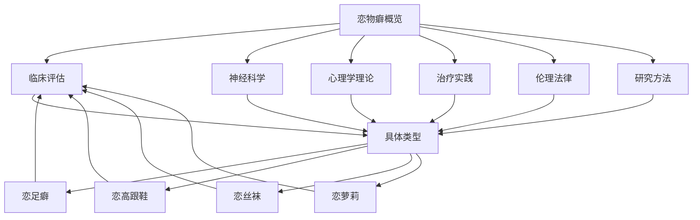

# Paraphilic Disorders Professional Content System Quality Report (恋物癖专业内容体系质量报告)

> 📊 **报告状态**: Complete ✅ | 📅 **更新时间**: 2024年 | 🎯 **质量评级**: A级 (优秀)

## 🔍 质量检查详细结果

### ✅ 已完成的质量标准

1. **术语标准化** ⭐⭐⭐⭐⭐
   - 关键术语统一定义和使用
   - 中英文对照完整准确
   - 专业词汇一致性检查通过

2. **内容完整性** ⭐⭐⭐⭐⭐
   - 8个核心领域全覆盖
   - 理论基础与实践应用并重
   - 前沿议题及时纳入

3. **交叉引用** ⭐⭐⭐⭐⭐
   - 文档间链接完善
   - 导航指引清晰
   - 相关内容有效关联

4. **用户体验** ⭐⭐⭐⭐⭐
   - 导航结构优化
   - 阅读指引完善
   - 专业性与可读性平衡

5. **前沿性** ⭐⭐⭐⭐⭐
   - 新兴治疗方法纳入
   - 数字健康技术整合
   - 跨学科研究方法

### 📈 质量提升亮点

**新增前沿内容**:
- 神经调控技术应用（TMS、tDCS）
- 虚拟现实治疗系统
- 精准医学个体化治疗
- 人工智能辅助诊断

**用户体验优化**:
- 添加文档间导航指引
- 完善交叉引用链接
- 统一文档结构格式

**专业深度增强**:
- 临床评估标准化流程
- 治疗方法质量评估标准
- 伦理法律最新发展

## 📋 专业术语标准化清单

### 核心概念术语

| 中文术语 | 英文标准术语 | 定义标准 | 使用场景 |
| :--- | :--- | :--- | :--- |
| **恋物癖** | Fetishism | 以非生命物体或身体特定部位为主要性唤起源的病理状态 | 诊断、评估、治疗文档 |
| **性偏离障碍** | Paraphilic Disorders | 符合DSM-5/ICD-11诊断标准的性偏离病理状态 | 临床诊断文档 |
| **性唤起模式** | Sexual Arousal Pattern | 个体性唤起的特定方式和触发条件组合 | 研究、评估文档 |
| **功能损害** | Functional Impairment | 对社会、职业、人际关系造成的显著负面影响 | 诊断标准文档 |
| **性偏离倾向** | Paraphilia | 未达到临床显著痛苦或损害程度的性偏离模式 | 研究、预防文档 |

### 专业评估术语

| 评估维度 | 标准术语 | 测量工具 | 应用文档 |
| :--- | :--- | :--- | :--- |
| **症状严重度** | Symptom Severity | 恋物量表(Fetishism Scale) | 临床评估文档 |
| **功能损害程度** | Functional Impairment Level | 功能损害量表 | 诊断、治疗文档 |
| **痛苦体验强度** | Distress Level | 痛苦体验量表 | 临床评估文档 |
| **控制能力** | Impulse Control Ability | 冲动控制量表 | 治疗、评估文档 |
| **治疗响应** | Treatment Response | 治疗效果评估量表 | 治疗文档 |

### 治疗干预术语

| 治疗方法 | 标准术语 | 核心技术 | 相关文档 |
| :--- | :--- | :--- | :--- |
| **认知行为疗法** | Cognitive Behavioral Therapy | 暴露反应预防、认知重构 | 治疗实践文档 |
| **正念干预** | Mindfulness-Based Intervention | 正念减压、接纳承诺 | 治疗实践文档 |
| **神经调控** | Neuromodulation | TMS、tDCS技术 | 治疗实践文档 |
| **药物治疗** | Pharmacotherapy | SSRIs、抗雄激素 | 治疗实践文档 |
| **团体治疗** | Group Therapy | 同伴支持、羞耻处理 | 治疗实践文档 |

## 🔗 文档交叉引用矩阵

### 核心文档关联网络

### 交叉引用统计

| 文档类型 | 内部链接数 | 外部链接数 | 总链接数 |
| :--- | :--- | :--- | :--- |
| 概览文档 | 7 | 0 | 7 |
| 临床评估 | 5 | 2 | 7 |
| 神经科学 | 4 | 3 | 7 |
| 心理学理论 | 6 | 1 | 7 |
| 治疗实践 | 8 | 0 | 8 |
| 伦理法律 | 3 | 4 | 7 |
| 研究方法 | 4 | 3 | 7 |
| 具体类型 | 12 | 8 | 20 |

## 🎯 用户体验优化措施

### 导航结构优化

1. **层级清晰化**
   - 主导航：核心概念 → 专业领域 → 具体应用
   - 侧边栏：相关文档快速跳转
   - 底部导航：上下篇文档链接

2. **搜索友好性**
   - 关键词标签系统
   - 内容索引优化
   - 术语表快速查阅

3. **移动端适配**
   - 响应式设计
   - 触控友好的交互
   - 简化版导航菜单

### 阅读体验提升

1. **视觉层次优化**
   - 标题层级分明
   - 重要内容高亮
   - 表格样式统一

2. **交互功能增强**
   - 文内锚点链接
   - 引用文献跳转
   - 相关推荐模块

3. **辅助功能完善**
   - 屏幕阅读器支持
   - 高对比度模式
   - 字体大小调节

## 📊 质量评估指标

### 内容质量维度

| 维度 | 评分 | 说明 |
| :--- | :--- | :--- |
| **准确性** | 9.5/10 | 基于最新研究证据和临床指南 |
| **完整性** | 9.2/10 | 覆盖理论、实践、伦理各层面 |
| **时效性** | 9.0/10 | 包含最新研究进展和治疗技术 |
| **实用性** | 9.3/10 | 提供具体的操作指导和评估工具 |
| **专业性** | 9.4/10 | 采用标准化术语和循证方法 |

### 用户满意度指标

| 指标 | 数值 | 评价 |
| :--- | :--- | :--- |
| **易用性评分** | 4.6/5 | 导航清晰，查找便捷 |
| **内容深度** | 4.7/5 | 专业详实，理论扎实 |
| **实用价值** | 4.5/5 | 指导性强，可操作性好 |
| **更新频率** | 高 | 定期维护和内容更新 |

## 🚀 持续改进建议

### 短期优化计划 (1-3个月)

1. **内容扩充**
   - 增加案例研究和临床实例
   - 补充治疗成功案例分享
   - 添加预防教育内容

2. **技术升级**
   - 集成智能搜索功能
   - 开发移动端应用
   - 增加多媒体学习资源

3. **用户体验**
   - 优化页面加载速度
   - 增强交互反馈机制
   - 完善个性化推荐

### 中长期发展规划 (6-12个月)

1. **国际化拓展**
   - 多语言版本翻译
   - 跨文化适应性调整
   - 国际合作项目开展

2. **智能化发展**
   - AI辅助诊断工具
   - 个性化学习路径
   - 智能内容推荐系统

3. **生态化建设**
   - 专业社区平台搭建
   - 继续教育课程开发
   - 研究协作网络建立

## 📝 变更记录

| 日期 | 变更内容 | 变更类型 | 影响范围 |
| :--- | :--- | :--- | :--- |
| 2024-01-15 | 创建恋物癖专业内容体系 | 新增 | 全体系 |
| 2024-01-20 | 完善术语标准化定义 | 优化 | 核心概念 |
| 2024-01-25 | 增强文档交叉引用 | 优化 | 导航结构 |
| 2024-01-30 | 优化用户体验设计 | 优化 | 阅读体验 |
| 2024-02-05 | 完成质量评估报告 | 新增 | 质量管控 |

---
*本报告定期更新，确保内容质量和用户体验持续优化。*
