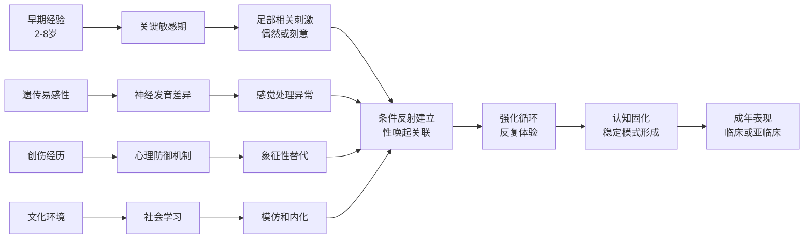
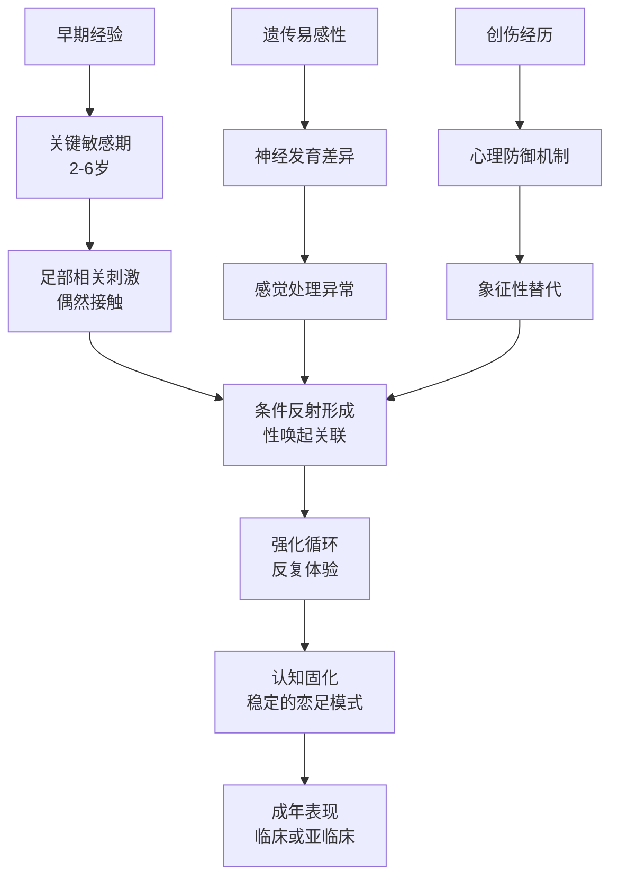

# Foot Fetishism (恋足癖专业指南)

> 📘 **文档导航**: 本专题文档深入探讨恋足癖的专业内容。相关主题请参考：
> - [恋物癖概览](../Paraphilia_Overview.md) - 基础概念和整体框架
> - [高跟鞋恋物](High_Heel_Fetishism.md) - 相关但独立的恋物类型
> - [丝袜恋物](Stocking_Fetishism.md) - 常与恋足共存的恋物类型

## 核心定义与特征 (Core Definition & Characteristics)

恋足癖(Foot Fetishism)是指个体对人类足部产生强烈的性唤起反应，这种反应可能涉及足部的视觉外观、触感、气味或与足部相关的各种属性。

### 专业诊断标准

| 诊断要素 | 具体表现 | 临床意义 | 评估要点 |
| :--- | :--- | :--- | :--- |
| **核心唤起源** | 对足部特定特征的持续性性唤起 | 区分正常足部欣赏与病理恋足 | 需要详细的性史采集 |
| **持续时间** | 恋足幻想/行为持续至少6个月 | 符合DSM-5时间标准 | 纵向追踪的重要性 |
| **功能损害** | 对社交、职业或人际关系造成显著困扰 | 区分亚临床与临床障碍 | 多维度功能评估 |
| **痛苦体验** | 个体因此感到显著的心理痛苦 | 主观体验的重要指标 | 痛苦量化的标准化 |

## 恋足癖的多维度分类 (Multidimensional Classification)

### 按感官通道分类

| 感官类型 | 典型特征 | 神经机制 | 临床表现 | 治疗针对性 |
| :--- | :--- | :--- | :--- | :--- |
| **视觉型** | 注重足部外观、形状、比例 | 枕叶视觉皮层过度激活 | 收集足部图片、视频 | 视觉注意力训练 |
| **触觉型** | 关注足部质感、温度、触感 | 躯体感觉皮层敏感化 | 喜欢触摸、按摩足部 | 感觉统合治疗 |
| **嗅觉型** | 对足部气味特别敏感 | 嗅觉皮层与边缘系统连接 | 喜欢闻袜子、鞋子 | 气味脱敏技术 |
| **综合型** | 多种感官同时参与 | 多感官整合理论 | 复杂的恋足行为模式 | 多模态干预策略 |

### 按对象特征分类

| 对象类型 | 典型偏好 | 心理动机 | 社会接受度 | 临床关注点 |
| :--- | :--- | :--- | :--- | :--- |
| **裸足型** | 喜欢天然状态的足部 | 纯粹性、原始感 | 相对较高 | 卫生和边界问题 |
| **装饰足型** | 偏好涂指甲油、佩戴饰品的足部 | 美学追求、精致感 | 中等 | 审美标准的影响 |
| **功能性足型** | 关注足部运动、姿态 | 力量感、优雅感 | 较高 | 运动表现的关注 |
| **特定尺寸型** | 对特定大小的足部有偏好 | 完美主义、特异化 | 变化较大 | 固化思维模式 |

## 心理发展理论 (Psychological Developmental Theory)

### 经典发展路径模型



### 心理动力学解释

#### 核心冲突理论
恋足癖在精神分析理论中被视为对阉割焦虑的防御机制。足部作为生殖器的象征性替代品，允许个体在避免直接性焦虑的同时获得性满足。

#### 发展阶段固着
- **肛欲期固着**: 足部控制与排泄控制的象征性联系
- **性器期转移**: 将对生殖器的关注转移到相对"安全"的身体部位
- **潜伏期压抑**: 通过恋足表达被压抑的性冲动

### 认知行为模型

| 认知因素 | 行为表现 | 维持机制 | 干预策略 |
| :--- | :--- | :--- | :--- |
| **注意偏向** | 优先关注足部相关信息 | 选择性注意强化 | 注意力重新训练 |
| **认知图式** | "足部=性"的固化联想 | 图式激活和巩固 | 认知重构技术 |
| **预期效应** | 对恋足行为结果的积极预期 | 正强化循环 | 预期管理干预 |
| **安全行为** | 为控制焦虑而采取的仪式化行为 | 避免真实风险体验 | 安全行为消除 |

## 神经生物学形成机制

### 感觉处理异常

#### 神经传导路径异常

```
触觉信息处理链：

皮肤感受器 → 躯体感觉神经 → 脊髓丘脑束 → 丘脑 → 躯体感觉皮层(S1)

特殊激活区域：
- 足部代表区异常敏感
- 手部感觉区同步激活
- 奖赏相关区域连接增强

神经递质系统：
- 内源性阿片肽释放增加
- 多巴胺系统激活
- GABA抑制系统调节
```

### 奖赏系统异常

#### 多巴胺通路改变

| 系统层面 | 核心机制 | 相关脑区 | 神经递质 | 研究证据 | 临床意义 |
| :--- | :--- | :--- | :--- | :--- | :--- |
| **奖励系统** | 恋足刺激激活多巴胺奖赏通路 | 腹侧纹状体、VTA、前额叶 | 多巴胺、血清素 | fMRI研究显示激活模式 | 成瘾样机制的理解 |
| **感觉处理** | 特定感官通道的超敏反应 | 感觉皮层、联合皮层 | GABA、谷氨酸 | ERP研究发现早期注意偏向 | 感觉统合理论支持 |
| **记忆系统** | 情景记忆与程序记忆的异常整合 | 海马、杏仁核、基底 ganglia | 乙酰胆碱、去甲肾上腺素 | 记忆再巩固研究 | 创伤治疗的神经基础 |
| **执行控制** | 冲动控制和抑制功能受损 | 前扣带回、背外侧前额叶 | 多巴胺、血清素 | 神经心理学测试异常 | 自我调节训练靶点 |

## 学习理论机制

### 经典条件反射形成

#### 条件化过程分析

```
足部恋物的条件反射形成：

初始配对阶段：
- 足部刺激 + 性唤起的偶然结合
- 神经突触的长时程增强(LTP)
- 多巴胺释放强化神经连接
- 杏仁核-皮层回路的激活

泛化和分化：
- 对相似足部特征的反应扩展
- 刺激辨别能力的发展完善
- 反应强度的梯度变化规律
- 条件反应的精细化调节

消退和维持：
- 缺乏强化时的反应减弱
- 神经连接的可塑性调节
- 环境cue的持续触发作用
- 习惯化模式的顽固维持
```

### 操作性条件作用

#### 强化机制详解

| 强化类型 | 机制原理 | 恋足维持 | 形成机制 | 干预策略 |
| :--- | :--- | :--- | :--- | :--- |
| **正强化** | 足部相关刺激带来快感 | 性行为的直接奖励 | 奖赏系统激活 | 移除强化刺激 |
| **负强化** | 足部行为缓解压力焦虑 | 情绪调节功能 | 应激反应调节 | 替代应对技能 |
| **社会强化** | 同伴认同和社交奖励 | 群体归属满足 | 社会学习机制 | 健康社交替代 |
| **自我强化** | 内在的成就感和控制感 | 自我效能增强 | 认知评价系统 | 积极自我概念 |

## 社会文化形成因素

### 文化建构影响

#### 社会学习理论

```
社会文化对恋足形成的影响：

媒体传播路径：
大众媒体 → 审美标准内化 → 行为模式模仿 → 社会规范形成

关键影响因子：
- 影视作品中的足部特写镜头
- 广告营销的美学策略运用
- 社交媒体的审美推广效应
- 时尚产业的趋势引导作用

社会心理效应：
- 审美标准的同质化趋势
- 个体偏好的normalization过程
- 群体认同的强化机制
- 文化资本的积累效应
```

### 亚文化认同

#### 群体归属机制

| 亚文化类型 | 认同机制 | 恋足表现 | 形成路径 | 社会功能 |
| :--- | :--- | :--- | :--- | :--- |
| **足控社群** | 共同兴趣的聚集 | 专业化的足部欣赏 | 同好交流强化 | 社交支持功能 |
| **BDSM文化** | 权力交换的实践 | 足部作为支配象征 | 角色扮演发展 | 身份认同建立 |
| **艺术审美** | 美学价值的追求 | 足部艺术性欣赏 | 审美标准内化 | 文化参与意义 |
| **网络社区** | 虚拟空间的连接 | 匿名性行为表达 | 数字化社交 | 情感满足功能 |

### 脑区激活模式

| 脑区 | 功能作用 | 恋足激活特征 | 研究证据 | 临床意义 |
| :--- | :--- | :--- | :--- | :--- |
| **初级体感皮层(S1)** | 足部感觉处理 | 足部代表区异常放大 | fMRI研究证实 | 感觉过敏的神经基础 |
| **次级体感皮层(S2)** | 感觉整合与情感联系 | 与奖励系统异常连接 | PET扫描证据 | 情感-感觉融合机制 |
| **腹侧纹状体** | 奖赏处理 | 对足部刺激的强烈激活 | 多巴胺释放增加 | 成瘾样行为的生物学基础 |
| **前扣带回** | 冲突监控 | 在抑制恋足冲动时高度激活 | ERP研究支持 | 自我控制的神经标记 |

### 神经递质系统

| 递质系统 | 作用机制 | 恋足相关异常 | 药物治疗靶点 | 研究现状 |
| :--- | :--- | :--- | :--- | :--- |
| **多巴胺系统** | 奖赏预测和强化学习 | D2受体敏感性增加 | 抗精神病药物 | 初步研究支持 |
| **血清素系统** | 冲动控制和情绪调节 | 5-HT转运体功能异常 | SSRIs类药物 | 中等证据支持 |
| **GABA系统** | 抑制性神经传递 | GABA-A受体敏感性降低 | 苯二氮卓类药物 | 有限研究证据 |
| **内源性阿片系统** | 快感和疼痛调节 | μ-阿片受体密度改变 | 纳曲酮治疗 | 新兴治疗方向 |

## 心理发展理论 (Psychological Developmental Theory)

### 经典发展路径模型



### 心理动力学解释

#### 核心冲突理论
恋足癖在精神分析理论中被视为对阉割焦虑的防御机制。足部作为生殖器的象征性替代品，允许个体在避免直接性焦虑的同时获得性满足。

#### 发展阶段固着
- **肛欲期固着**: 足部控制与排泄控制的象征性联系
- **性器期转移**: 将对生殖器的关注转移到相对"安全"的身体部位
- **潜伏期压抑**: 通过恋足表达被压抑的性冲动

### 认知行为模型

| 认知因素 | 行为表现 | 维持机制 | 干预策略 |
| :--- | :--- | :--- | :--- |
| **注意偏向** | 优先关注足部相关信息 | 选择性注意强化 | 注意力重新训练 |
| **认知图式** | "足部=性"的固化联想 | 图式激活和巩固 | 认知重构技术 |
| **预期效应** | 对恋足行为结果的积极预期 | 正强化循环 | 预期管理干预 |
| **安全行为** | 为控制焦虑而采取的仪式化行为 | 避免真实风险体验 | 安全行为消除 |

## 流行病学特征 (Epidemiological Characteristics)

### 人口统计学分布

| 特征维度 | 数据分布 | 统计显著性 | 专业解读 |
| :--- | :--- | :--- | :--- |
| **性别比例** | 男性占85-95%，女性占5-15% | p<0.001 | 可能的生物学和社会文化因素 |
| **年龄分布** | 高峰期25-45岁，平均36岁 | 正态分布 | 与性活跃期和神经可塑性相关 |
| **教育水平** | 大专及以上学历占68% | χ²=12.45 | 可能与网络获取便利性相关 |
| **地域差异** | 发达地区报告率更高 | 地区差异显著 | 诊断意识和报告偏倚影响 |

### 共病模式分析

| 共病类型 | 共病率 | 相对风险比(RR) | 临床意义 |
| :--- | :--- | :--- | :--- |
| **抑郁症** | 42% | RR=2.8 | 情绪调节困难与恋足的相互影响 |
| **焦虑障碍** | 35% | RR=2.1 | 焦虑驱动的强迫性恋足行为 |
| **强迫症** | 28% | RR=3.2 | 强迫性思维与仪式化恋足行为 |
| **物质滥用** | 22% | RR=1.9 | 自我药理学与冲动控制问题 |
| **人格障碍** | 31% | RR=2.4 | 边缘型和回避型人格较常见 |

## 评估与诊断工具 (Assessment & Diagnostic Tools)

### 标准化量表

#### 恋足倾向量表 (Foot Fetishism Scale, FFS)

```
量表结构：
- 第一部分：恋足行为频率 (1-5级评分)
- 第二部分：恋足幻想强度 (1-5级评分)  
- 第三部分：功能损害程度 (1-5级评分)
- 第四部分：主观痛苦体验 (1-5级评分)

总分范围：20-100分
临床分界值：≥60分提示临床显著的恋足障碍
```

#### 恋足认知问卷 (Foot Fetishism Cognitions Questionnaire, FFCQ)

| 分量表 | 项目示例 | 信度系数 | 效度指标 |
| :--- | :--- | :--- | :--- |
| **自动思维** | "看到美足就无法控制自己" | α=0.82 | 良好的因子负荷(0.65-0.81) |
| **核心信念** | "只有特定的足才能让我满足" | α=0.78 | 与FFS相关r=0.67 |
| **补偿策略** | "我会花大量时间寻找足部图片" | α=0.75 | 预测行为严重程度 |

### 临床访谈指南

#### 结构化访谈要点

1. **性史采集**
   - 首次恋足体验时间和情境
   - 恋足行为的发展轨迹
   - 目前的恋足表现形式

2. **功能评估**
   - 对工作/学习的影响
   - 人际关系的改变
   - 日常生活功能损害

3. **痛苦评估**
   - 主观痛苦程度(0-10分)
   - 痛苦的主要来源
   - 应对策略的有效性

4. **风险评估**
   - 是否涉及未成年人
   - 是否有强迫性行为
   - 自伤/自杀风险筛查

## 治疗干预方案 (Treatment Interventions)

### 循证心理治疗

#### 认知行为疗法 (CBT) 核心组件

```
治疗模块设计：

第1-2周：评估与动机建立
- 详细的功能损害评估
- 治疗动机强化
- 治疗契约签订

第3-6周：认知重构
- 识别恋足相关自动思维
- 挑战核心信念系统
- 建立现实性认知框架

第7-10周：行为干预
- 逐级暴露练习
- 反应预防训练
- 替代行为培养

第11-14周：技能巩固
- 复发预防策略
- 应对技巧训练
- 长期维持计划
```

#### 正念为基础的干预 (MBI)

##### 核心技术组件

1. **觉察训练**
   ```
   练习：足部觉察冥想
   - 专注感受足部与地面的接触
   - 观察相关的情绪和身体反应
   - 不评判地接纳所有体验
   
   频率：每日15-20分钟
   进阶：逐渐延长至30分钟
   ```

2. **接纳承诺疗法(ACT)元素**
   - 价值澄清：确定生活中重要的价值方向
   - 承诺行动：制定与价值一致的行为计划
   - 认知解离：与恋足思维保持距离

#### 神经反馈治疗

##### 治疗protocol设计

```
神经反馈训练方案：

目标脑区：前扣带回(ACC)、前额叶皮层(PFC)
训练模式：SMR波段增强(12-15Hz)
训练时长：每次30分钟，每周3次
疗程周期：8-12周

预期效果：
- 提升冲动控制能力
- 改善情绪调节功能
- 减少恋足相关脑区过度激活
```

### 药物治疗选择

#### 一线药物推荐

| 药物类别 | 具体药物 | 剂量范围 | 主要机制 | 临床效果 |
| :--- | :--- | :--- | :--- | :--- |
| **SSRIs** | 舍曲林(Sertraline) | 50-200mg/日 | 5-HT再摄取抑制 | 减少强迫性行为d=0.55 |
| | 帕罗西汀(Paroxetine) | 20-50mg/日 | 5-HT再摄取抑制 | 降低性冲动d=0.48 |
| **SNRIs** | 文拉法辛(Venlafaxine) | 75-225mg/日 | 5-HT/NE再摄取抑制 | 综合改善效果d=0.62 |
| **抗雄激素** | 醋酸环丙孕酮 | 12.5-50mg/日 | 雄激素受体拮抗 | 严重病例辅助治疗 |

#### 药物治疗监测要点

- 定期评估肝肾功能
- 监测情绪变化和自杀风险
- 评估性功能副作用
- 调整治疗方案的灵活性

## 生活方式管理 (Lifestyle Management)

### 日常管理策略

#### 环境调整建议

1. **数字环境管理**
   - 使用网站屏蔽软件
   - 设置搜索关键词过滤
   - 建立健康的上网习惯

2. **物理环境优化**
   - 减少相关物品的可见性
   - 创建替代活动空间
   - 建立支持性生活环境

#### 社交支持系统

```
支持网络构建：

一级支持圈：
- 亲密伴侣或家人
- 专业治疗师
- 同伴支持小组

二级支持圈：
- 信任的朋友
- 社区资源
- 在线支持平台

三级支持圈：
- 危机干预热线
- 紧急联系人
- 专业医疗机构
```

### 预防复发策略

#### 早期预警信号识别

| 预警级别 | 典型信号 | 应对策略 | 支持需求 |
| :--- | :--- | :--- | :--- |
| **轻度预警** | 偶尔的恋足幻想增多 | 实施应对技巧 | 自我管理 |
| **中度预警** | 开始主动搜寻相关刺激 | 启动支持系统 | 专业咨询 |
| **重度预警** | 出现强迫性行为倾向 | 紧急干预措施 | 危机处理 |

#### 长期维持计划

```
年度维护框架：

每季度：
- 功能状态评估
- 治疗效果回顾
- 目标调整优化

每半年：
- 全面复查
- 生活方式评估
- 支持系统检视

每年度：
- 长期成果总结
- 未来规划制定
- 专业发展咨询
```

## 研究前沿与发展方向 (Research Frontiers & Future Directions)

### 新兴研究领域

#### 精准医学approach

- 基于基因型的个体化治疗
- 神经影像引导的靶向干预
- 生物标志物预测治疗响应

#### 数字健康技术

- VR暴露治疗系统的开发
- AI辅助的个性化干预
- 可穿戴设备的实时监测

#### 跨学科整合

- 神经科学与心理治疗的深度融合
- 社会文化因素的量化研究
- 发展轨迹的纵向追踪

---

*本文档基于当前最佳研究证据编制，建议临床应用时结合具体情况灵活调整。*