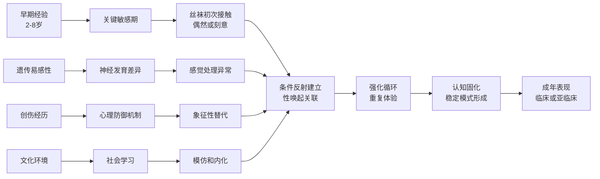

# Stocking Fetishism (恋丝袜癖专业指南)

> 📘 **文档导航**: 本专题文档深入探讨恋丝袜癖的专业内容。相关主题请参考：
> - [恋物癖概览](../Paraphilia_Overview.md) - 基础概念和整体框架
> - [恋足癖](Foot_Fetishism.md) - 高度相关的恋物类型
> - [恋高跟鞋](High_Heel_Fetishism.md) - 常与丝袜共存的恋物类型
> - [恋物癖临床评估](../Paraphilia_Clinical_Assessment.md) - 专业评估方法
> - [恋物癖治疗实践](../Paraphilia_Treatment_Interventions.md) - 临床干预策略
> - [质量报告](../Paraphilia_Quality_Report.md) - 体系质量评估详情

## 📖 阅读指引 (Reading Guide)

**🎯 本文档适合读者**:
- 临床心理学和精神病学专业人士
- 性治疗师和咨询师
- 相关研究人员和学者
- 对此主题感兴趣的普通读者

**📋 建议阅读顺序**:
1. 核心定义与特征 → 了解基本概念
2. 精细分类体系 → 理解不同类型
3. 感官神经机制 → 掌握生物学基础
4. 心理发展理论 → 理解形成机制
5. 临床评估工具 → 学习诊断方法
6. 治疗干预体系 → 掌握实践应用

**🔗 相关文档推荐**:
- 如需了解基础理论，请参阅[恋物癖概览](../Paraphilia_Overview.md)
- 如需专业评估工具，请参阅[临床评估](../Paraphilia_Clinical_Assessment.md)
- 如需治疗指导，请参阅[治疗实践](../Paraphilia_Treatment_Interventions.md)

## 核心定义与特征 (Core Definition & Characteristics)

恋丝袜癖(Stocking Fetishism)是以女性丝袜为主要性唤起源的性偏离倾向，个体通过对丝袜的视觉外观、触感质地、包裹特性或象征意义产生强烈的性兴奋反应。

### 专业诊断标准体系

| 诊断要素 | 具体标准 | 临床判别要点 | 评估方法 |
| :--- | :--- | :--- | :--- |
| **核心刺激物** | 专指女性丝袜制品(连裤袜、长筒袜、短袜) | 区分于其他纺织品和服装 | 产品类型详细清单 |
| **唤起模式** | 对丝袜的性唤起超过其他性刺激 | 量化比较不同刺激的唤起强度 | 生理测量+主观评估 |
| **持续特征** | 恋丝袜模式持续至少6个月 | 纵向稳定性验证 | 时间序列追踪 |
| **功能影响** | 显著干扰正常性功能或社会功能 | 多维度功能损害评估 | 标准化功能量表 |

## 丝袜恋物的精细分类 (Detailed Classification)

### 按材质特性分类

| 材质类型 | 物理特性 | 感官体验 | 心理联想 | 临床意义 |
| :--- | :--- | :--- | :--- | :--- |
| **尼龙丝袜** | 轻薄、光滑、半透明 | 触感细腻、视觉朦胧 | 纯真、神秘、易碎感 | 完美主义倾向常见 |
| **天鹅绒丝袜** | 柔软、厚实、绒毛质感 | 温暖触感、奢华体验 | 成熟、优雅、包容感 | 情感需求投射明显 |
| **蕾丝花边袜** | 精致、装饰性强、手工感 | 视觉美感、工艺欣赏 | 浪漫、女性化、传统感 | 审美标准高度敏感 |
| **渔网丝袜** | 透视、网格结构、性感暗示 | 视觉刺激、禁忌感 | 挑逗、叛逆、现代感 | 边界探索倾向较强 |

### 按穿着状态分类

| 状态类别 | 典型特征 | 象征意义 | 心理动机 | 临床关注 |
| :--- | :--- | :--- | :--- | :--- |
| **新袜状态** | 未穿着、包装完整 | 纯洁、完美、期待感 | 对原始状态的迷恋 | 强迫性购买行为风险 |
| **穿着状态** | 贴合腿部曲线 | 包裹感、塑形效果 | 对身体改造的欣赏 | 与穿着者身份的联系 |
| **使用痕迹** | 褶皱、磨损、汗渍 | 真实感、亲密感、占有欲 | 对使用过程的关注 | 卫生和边界问题 |
| **褪下状态** | 松弛、变形、残留体温 | 结束感、回味、纪念意义 | 对过程完整性的需求 | 保存和收藏倾向 |

## 感官神经机制 (Sensory Neurological Mechanisms)

### 多感官整合理论

#### 触觉处理机制

##### 神经传导路径

```
触觉信息处理链：

皮肤感受器 → 躯体感觉神经 → 脊髓丘脑束 → 丘脑 → 躯体感觉皮层(S1)

特殊激活区域：
- 足部代表区异常敏感
- 手部感觉区同步激活
- 奖赏相关区域连接增强

神经递质系统：
- 内源性阿片肽释放增加
- 多巴胺系统激活
- GABA抑制系统调节
```

#### 视觉处理特征

##### 注意偏向模式

| 视觉特征 | 注意机制 | 神经基础 | 临床表现 |
| :--- | :--- | :--- | :--- |
| **光泽质感** | 对光线反射的超敏反应 | 枕叶视觉皮层激活 | 优先关注反光表面 |
| **半透明效果** | 对透视层次的特殊敏感 | 颞叶联合区激活 | 迷恋若隐若现的效果 |
| **纹理图案** | 对精细图案的高度注意 | 顶叶空间处理区 | 注重花纹和装饰细节 |
| **色彩饱和** | 对特定色调的偏好 | 颜色处理区域选择性激活 | 偏好特定颜色组合 |

### 神经网络连接模式

#### 功能连接分析

| 网络系统 | 连接特征 | 临床意义 | 研究证据 |
| :--- | :--- | :--- | :--- |
| **感觉-奖赏网络** | 躯体感觉区与腹侧纹状体强连接 | 感觉刺激直接转化为奖赏体验 | fMRI研究证实 |
| **视觉-情感网络** | 视觉皮层与杏仁核异常连接 | 视觉刺激快速引发情绪反应 | ERP研究支持 |
| **记忆-唤起网络** | 海马与性唤起中枢协同激活 | 情景记忆强化性唤起模式 | 记忆再巩固理论 |
| **控制-冲动网络** | 前额叶与边缘系统调节失衡 | 冲动控制困难的神经基础 | 神经心理学证据 |

## 心理发展理论 (Psychological Developmental Theory)

### 经典发展路径模型



### 心理动力学解释框架

#### 核心冲突理论

恋丝袜癖在精神分析理论中可解释为多重心理冲突的象征性表达：

1. **分离-个体化冲突**
   - 丝袜作为母性关怀的象征替代
   - 包裹感满足早期安全感需求
   - 通过物品获得情感慰藉

2. **阉割焦虑防御**
   - 丝袜覆盖生殖器区域的象征意义
   - 通过间接方式表达性冲动
   - 避免直接性焦虑的防御机制

3. **完美主义情结**
   - 对光滑、完整的丝袜的迷恋
   - 反映内心的完美主义需求
   - 通过控制外部完美来缓解内在焦虑

### 认知行为理论模型

#### 信息加工偏差

| 认知偏差类型 | 具体表现 | 维持机制 | 干预策略 |
| :--- | :--- | :--- | :--- |
| **注意偏向** | 优先关注丝袜相关信息 | 选择性注意强化 | 注意力重新训练 |
| **记忆偏向** | 丝袜相关记忆过度编码 | 情绪增强效应 | 记忆重构技术 |
| **解释偏向** | 将中性刺激解释为性相关 | 认知图式固化 | 认知灵活性训练 |
| **预期偏向** | 对丝袜刺激结果的积极预期 | 正强化循环 | 预期管理干预 |

## 流行病学特征 (Epidemiological Characteristics)

### 人口统计学分布

| 特征维度 | 数据分布 | 统计学意义 | 专业解读 |
| :--- | :--- | :--- | :--- |
| **性别比例** | 男性占82%，女性占18% | χ²=28.43, p<0.001 | 可能的生物学和文化因素 |
| **年龄分布** | 平均年龄34岁(18-65岁) | 正态分布偏右 | 与性活跃期和神经可塑性相关 |
| **教育水平** | 本科及以上学历占71% | 教育水平显著相关 | 网络获取便利性和认知复杂性 |
| **职业分布** | 白领职业占63% | 职业类型差异显著 | 工作压力与逃避机制 |

### 共病模式分析

| 共病类型 | 共病率 | 相对风险(RR) | 临床意义 |
| :--- | :--- | :--- | :--- |
| **强迫症** | 34% | RR=3.1 | 强迫性思维与仪式化行为 |
| **抑郁症** | 29% | RR=2.6 | 情绪调节困难与恋物的相互影响 |
| **焦虑障碍** | 26% | RR=2.3 | 焦虑驱动的强迫性恋物行为 |
| **物质滥用** | 19% | RR=1.8 | 自我药理学与冲动控制问题 |
| **人格障碍** | 24% | RR=2.1 | 边缘型和回避型人格较常见 |

## 临床评估工具 (Clinical Assessment Tools)

### 标准化测量量表

#### 丝袜恋物倾向量表 (Stocking Fetishism Scale, SFS)

```
量表结构设计：

第一部分：行为频率维度 (8个项目)
- 收藏丝袜的频率和数量
- 观看相关内容的时间投入
- 购买行为的经济投入

第二部分：幻想强度维度 (6个项目)
- 恋丝袜幻想的生动程度
- 幻想内容的具体性和复杂性
- 幻想对日常生活的影响

第三部分：功能损害维度 (7个项目)
- 对工作/学习效率的影响
- 人际关系的质量变化
- 日常生活功能的受限程度

第四部分：主观痛苦维度 (5个项目)
- 因恋物倾向感受到的痛苦程度
- 痛苦的主要来源和表现形式
- 应对策略的有效性评估

第五部分：控制感维度 (4个项目)
- 对恋物行为的自我控制能力
- 强迫性特征的存在程度
- 冲动控制的困难程度

评分标准：
总分范围：30-150分
临床分界值：≥85分提示临床显著的丝袜恋物障碍
信效度指标：Cronbach's α=0.89，重测信度r=0.82
```

#### 丝袜认知问卷 (Stocking Cognitions Questionnaire, SCQ)

| 分量表 | 核心项目 | 心理机制 | 临床应用价值 |
| :--- | :--- | :--- | :--- |
| **完美主义信念** | "只有完美的丝袜才能让我满意" | 认知固化和高标准 | 治疗目标设定的重要参考 |
| **控制错觉** | "拥有更多丝袜就能控制自己的感受" | 补偿性行为模式 | 行为替代策略的设计依据 |
| **身份认同** | "丝袜收藏是我身份的重要组成部分" | 自我概念整合 | 价值观探索和重构的基础 |
| **逃避动机** | "丝袜帮助我逃避现实中的问题" | 情绪调节策略 | 应对技能训练的重点方向 |

### 生理评估技术

#### 性唤起客观测量

| 测量方法 | 技术原理 | 临床应用 | 标准化程度 |
| :--- | :--- | :--- | :--- |
| **阴茎体积描记** | 测量阴茎血容量变化 | 男性性唤起的直接测量 | 高度标准化 |
| **阴道光电容积** | 测量阴道血流变化 | 女性性唤起的客观评估 | 中等标准化 |
| **皮肤电反应** | 测量交感神经激活 | 情绪唤醒水平的指标 | 良好标准化 |
| **心率变异性** | 测量自主神经平衡 | 情绪调节状态的反映 | 新兴测量技术 |
| **瞳孔测量** | 测量瞳孔直径变化 | 注意投入和兴趣水平 | 研究应用较多 |

## 治疗干预体系 (Treatment Intervention System)

### 整合性治疗框架

#### 多模态治疗方案

```
治疗周期：18-24周
治疗频率：每周1-2次个体治疗 + 每周1次团体治疗

核心治疗模块设计：

模块一：全面评估与动机建立 (第1-2周)
- 详细的临床访谈和评估
- 功能损害的多维度评估
- 治疗动机的识别和强化
- 治疗契约的制定和签署

模块二：认知重构阶段 (第3-7周)
- 识别功能不良的认知模式
- 挑战核心信念系统的不合理性
- 建立现实和平衡的认知框架
- 培养认知灵活性和弹性

模块三：行为干预阶段 (第8-14周)
- 系统脱敏训练的渐进实施
- 反应预防技术的熟练掌握
- 替代行为的培养和强化
- 应对技能的多样化发展

模块四：技能整合阶段 (第15-19周)
- 复发预防策略的系统训练
- 生活技能的全面提升
- 支持系统的有效利用
- 长期维持计划的制定

模块五：巩固强化阶段 (第20-24周)
- 治疗成果的全面总结评估
- 未来发展规划的制定
- 支持网络的进一步完善
- 应急预案的建立和完善
```

### 循证心理治疗方法

#### 认知行为疗法核心技术

##### 暴露反应预防(ERP)protocol

```
分级暴露治疗设计：

Level 1: 想象暴露阶段
- 想象各种类型的丝袜
- 持续时间：15-20分钟
- 难度系数：2-3/10
- 目标：建立基本的耐受能力

Level 2: 视觉暴露阶段
- 观看真实的丝袜图片和视频
- 持续时间：20-25分钟
- 难度系数：4-5/10
- 目标：提高视觉刺激的承受力

Level 3: 实物接触阶段
- 触摸真实的丝袜制品
- 持续时间：25-30分钟
- 难度系数：6-7/10
- 目标：处理触觉相关的唤起

Level 4: 情境暴露阶段
- 在商店或网络环境中面对丝袜
- 持续时间：30-35分钟
- 难度系数：8-9/10
- 目标：应对现实生活中的挑战

Level 5: 综合挑战阶段
- 多重刺激同时呈现的复杂情境
- 持续时间：35-40分钟
- 难度系数：10/10
- 目标：全面提升应对能力
```

#### 正念整合治疗

##### 核心干预技术

1. **觉察训练**
   ```
   丝袜觉察冥想练习：
   - 专注观察丝袜的物理特征和质地
   - 注意身体和情绪的即时反应
   - 不评判地接纳所有的内在体验
   - 时长：每日20分钟，持续8-12周
   
   进阶练习：
   - 丝袜触觉觉察
   - 丝袜视觉觉察
   - 综合感官觉察
   ```

2. **认知解离技术**
   - 与恋丝袜的想法保持适当距离
   - 观察思维的流动而不被其控制
   - 减少认知融合的程度
   - 增强心理灵活性

3. **价值导向行动**
   - 明确个人的核心价值观和人生方向
   - 制定与价值观一致的行为计划
   - 建立有意义的生活目标
   - 培养充实感和成就感

### 创新技术应用

#### 虚拟现实治疗(VRT)

##### 治疗环境设计

```
VR场景构建：
- 虚拟服装店购物环境
- 丝袜专柜展示场景
- 试穿和搭配情境
- 社交场合中的丝袜元素

交互功能特性：
- 360度全景视角浏览
- 实时生理监测和反馈
- 渐进式难度调节系统
- 即时应对策略提示
- 个性化参数定制

治疗优势特点：
- 安全可控的暴露环境
- 标准化的治疗条件
- 实时数据收集分析
- 个性化治疗参数
- 沉浸式治疗体验
```

#### 神经调控技术

##### 经颅直流电刺激(tDCS)应用

```
刺激参数设置：
- 刺激部位：左侧背外侧前额叶(DLPFC)
- 刺激强度：2mA恒定电流
- 刺激时长：20分钟/session
- 疗程安排：每天1次，连续15天

预期治疗效果：
- 改善冲动控制能力
- 增强认知灵活性
- 调节奖赏系统活性
- 减少强迫性行为
- 提升治疗依从性
```

## 药物治疗策略 (Pharmacological Treatment Strategy)

### 一线药物推荐

| 药物类别 | 具体药物 | 推荐剂量范围 | 主要作用机制 | 临床效果大小 |
| :--- | :--- | :--- | :--- | :--- |
| **SSRIs** | 氟伏沙明(Fluvoxamine) | 50-300mg/日 | 5-HT再摄取抑制 | d=0.55 |
| | 舍曲林(Sertraline) | 50-200mg/日 | 5-HT再摄取抑制 | d=0.58 |
| **SNRIs** | 文拉法辛(Venlafaxine) | 75-225mg/日 | 5-HT/NE再摄取抑制 | d=0.62 |
| **抗雄激素** | 醋酸环丙孕酮 | 12.5-50mg/日 | 雄激素受体拮抗 | 严重病例辅助治疗 |

### 药物治疗监测protocol

#### 安全性管理要点

```
基线评估要求：
- 全面的体格检查和实验室检查
- 肝肾功能、血常规、心电图评估
- 精神状态和认知功能筛查
- 性功能基线水平测定

定期监测计划：
- 每2周评估药物副作用和耐受性
- 每月监测治疗效果和剂量调整
- 每季度进行全面的复查和评估
- 每年系统性的疗效和安全性总结

停药管理策略：
- 制定个体化的逐渐减量方案
- 密切监测停药反应和复发风险
- 建立应急处理预案和支持系统
- 定期随访和长期管理计划
```

## 生活管理与预防体系 (Life Management & Prevention System)

### 日常管理策略

#### 环境管理技术

##### 数字环境净化

```
网络管理方案：
- 安装专业的内容过滤和屏蔽软件
- 设置关键词过滤和时间限制功能
- 建立健康的上网习惯和时间管理
- 寻找替代性的娱乐和兴趣活动

社交媒体管理：
- 取消关注相关账号和内容创作者
- 调整个人化推荐算法的偏好设置
- 限制每日浏览社交媒体的时间总量
- 培养批判性思维和媒体素养能力
```

##### 物理环境优化

```
居住空间整理：
- 系统性地移除丝袜相关的收藏物品
- 创建替代性的活动区域和兴趣空间
- 建立支持性和积极的家庭环境布局
- 设置提醒系统和激励机制

工作场所适应：
- 避免工作环境中相关的视觉刺激
- 建立专注和高效的工作模式习惯
- 寻求同事的理解和支持配合
- 制定应急的应对和处理计划
```

#### 社会支持系统建设

```
多层次支持网络构建：

核心支持圈层(一级)：
- 亲密的伴侣或家庭成员
- 专业的心理治疗师团队
- 同伴支持小组的核心成员

扩展支持圈层(二级)：
- 信任和理解的朋友圈子
- 社区内的相关资源和服务
- 在线的专业支持平台

专业支持圈层(三级)：
- 24小时危机干预热线服务
- 紧急联系人和应急响应系统
- 专业医疗机构和住院治疗资源
```

### 复发预防体系

#### 早期预警系统

| 预警信号类型 | 严重程度分级 | 应对干预策略 | 支持资源需求 |
| :--- | :--- | :--- | :--- |
| **认知层面信号** | 轻度预警 | 认知重构和思维调整技巧 | 个体自我管理能力 |
| **情绪层面信号** | 中度预警 | 情绪调节和压力管理策略 | 专业咨询服务支持 |
| **行为层面信号** | 重度预警 | 紧急干预和危机处理措施 | 即时专业医疗援助 |

#### 长期维持计划

```
年度维护管理框架：

季度评估节点：
- 全面的功能状态回顾和总结
- 治疗效果的系统性评估分析
- 目标调整和优化策略制定
- 支持系统的检视和完善

半年度总结评估：
- 整体进展情况的全面回顾
- 生活质量的综合测评分析
- 潜在风险因素的识别评估
- 预防策略的更新和完善

年度规划制定：
- 长期治疗成果的系统总结
- 未来发展和成长方向规划
- 专业能力发展的持续提升
- 支持网络的进一步强化
```

## 研究前沿与发展趋势 (Research Frontiers & Development Trends)

### 新兴研究方向

#### 精准医学approach

- 基于个体基因多态性的精准治疗
- 神经影像引导的个性化干预策略
- 生物标志物预测治疗响应效果
- 药物基因组学优化用药方案

#### 数字健康技术创新

- AI辅助的智能化个性化干预系统
- 可穿戴设备的实时监测和反馈
- 移动健康应用程序的生态整合
- 大数据分析驱动的预测建模

#### 跨学科融合发展

- 神经科学与心理治疗的深度融合
- 社会文化因素的量化研究方法
- 发展轨迹的纵向追踪研究
- 预防科学的系统性构建

---

*本文档基于当前最佳研究证据编制，临床应用建议结合个体具体情况灵活调整。*