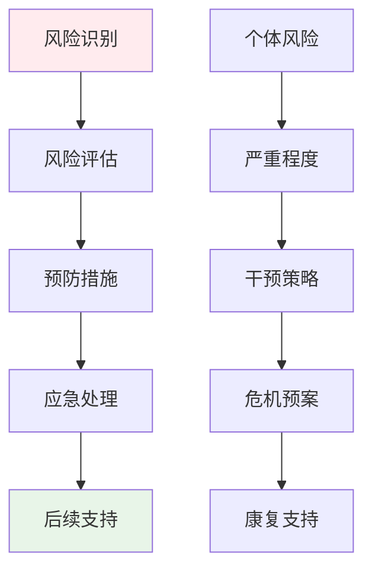
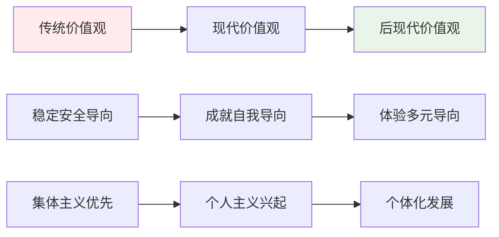
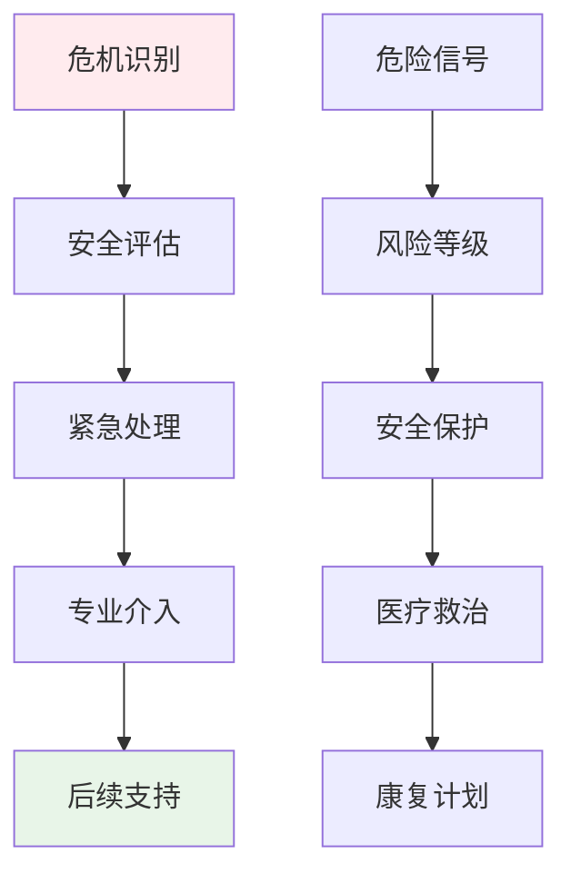

# Professional Attraction Ethics, Law & Sociocultural Considerations (职业吸引伦理法律与社会文化考量)

> ⚠️ **重要声明**: 本文档严格遵守法律法规和社会伦理规范，旨在提供专业的学术研究和临床实践指导。任何违法行为都将受到法律严惩。

> 📘 **文档导航**: 本专题探讨职业吸引现象的伦理法律问题和社会文化影响。相关文档：
> - [职业吸引概览](Professional_Attraction_Overview.md) - 理论基础
> - [职业吸引临床评估](Professional_Attraction_Clinical_Assessment.md) - 专业评估
> - [各职业专门文档](aviation/Aviation_Professional_Attraction.md) - 具体职业分析

## 伦理原则框架 (Ethical Principles Framework)

### 核心伦理原则

#### 1. 尊重自主原则 (Respect for Autonomy)

**基本要求**:
- 尊重个体的职业选择自由和表达权利
- 保障被评估者的知情同意权
- 维护个人隐私和尊严不受侵犯

**实践应用**:
| 应用场景 | 具体要求 | 实施要点 | 保护措施 |
| :--- | :--- | :--- | :--- |
| **临床评估** | 充分告知评估目的、过程和风险 | 书面知情同意书、充分解释说明 | 撤回权保障 |
| **研究调查** | 明确研究目的和数据使用方式 | 参与自愿、随时退出权利 | 匿名化处理 |
| **咨询服务** | 尊重求助者的价值观念和选择 | 非指导性咨询原则 | 价值中立立场 |

#### 2. 无害原则 (Non-maleficence)

**基本要求**:
- 避免对个体造成心理、生理或社会伤害
- 预防和减少职业吸引相关的负面后果
- 及时识别和处理潜在风险

**风险防控体系**:

#### 3. 有益原则 (Beneficence)

**基本要求**:
- 促进个体的心理健康和社会适应
- 支持有益的职业发展和人生规划
- 提供专业的帮助和支持服务

**积极促进措施**:
| 促进领域 | 具体措施 | 实施主体 | 预期效果 |
| :--- | :--- | :--- | :--- |
| **个人发展** | 职业规划指导、能力培养 | 教育机构、咨询机构 | 健康发展 |
| **社会适应** | 社交技能训练、环境适应 | 社区组织、培训机构 | 良好适应 |
| **心理健康** | 心理支持服务、压力管理 | 医疗机构、心理咨询 | 心理健康 |

#### 4. 公正原则 (Justice)

**基本要求**:
- 平等对待所有寻求帮助的个体
- 合理分配专业资源和服务机会
- 避免任何形式的歧视和偏见

**公平实施保障**:
- 标准化服务流程和收费标准
- 多元文化敏感性培训
- 特殊群体关爱服务

### 专业伦理规范

#### 心理咨询师伦理规范

**职业边界维护**:
- 严格区分专业关系和个人关系
- 避免双重关系可能带来的利益冲突
- 维护专业的客观性和中立性

**保密义务履行**:
- 严格保护来访者隐私信息
- 明确保密例外情况和处理程序
- 建立完善的保密管理制度

#### 研究者伦理规范

**研究诚信要求**:
- 确保研究数据的真实性和完整性
- 遵循科学研究的客观性和严谨性
- 正确引用和标注他人研究成果

**参与者权益保护**:
- 充分告知研究风险和预期收益
- 保障参与者的自主选择权
- 提供必要的心理支持服务

## 法律法规框架 (Legal Regulatory Framework)

### 相关法律法规

#### 1. 心理健康相关法律

**《精神卫生法》相关规定**:
- 心理咨询和治疗活动的法律规范
- 心理健康服务从业者的资质要求
- 心理健康服务的质量监管标准

**《医师法》执业规范**:
- 医疗机构开展心理健康服务的规定
- 医务人员提供心理咨询的资格要求
- 医疗纠纷的处理程序和法律责任

#### 2. 教育相关法律

**《教育法》职业指导规定**:
- 学校开展职业指导服务的法律依据
- 教育工作者提供职业咨询的规范要求
- 学生职业发展权益保护条款

**《未成年人保护法》特殊保护**:
- 未成年学生心理健康服务的特殊要求
- 青少年职业兴趣发展的保护措施
- 家校合作的职业指导机制

#### 3. 劳动就业相关法律

**《劳动法》职业发展条款**:
- 劳动者职业选择权的法律保障
- 用人单位职业培训义务规定
- 就业歧视的禁止和处罚措施

**《就业促进法》公平就业**:
- 平等就业权利的法律保护
- 就业服务和职业指导的法律规定
- 特殊群体就业扶持政策

### 合规操作指南

#### 专业服务合规要求

**资质认证标准**:
| 服务类型 | 资质要求 | 认证机构 | 有效期 |
| :--- | :--- | :--- | :--- |
| **心理咨询** | 心理咨询师资格证书 | 人社部门 | 3年 |
| **心理治疗** | 临床心理师资格 | 卫健部门 | 5年 |
| **职业指导** | 职业指导师证书 | 人社部门 | 3年 |
| **教育培训** | 教师资格证书 | 教育部门 | 长期 |

**服务流程规范**:
1. 资质查验和公示
2. 知情同意程序
3. 服务合同签订
4. 过程记录保存
5. 质量评估反馈

#### 数据保护合规要求

**个人信息保护**:
- 严格遵守《个人信息保护法》相关规定
- 建立完善的数据安全管理制度
- 实施必要的技术和管理防护措施

**数据使用限制**:
- 仅限于合法的服务目的使用
- 严禁非法出售或提供给第三方
- 及时删除过期或无效数据

## 社会文化影响分析 (Sociocultural Impact Analysis)

### 文化差异与适应

#### 东西方文化差异

**集体主义vs个人主义**:
| 文化维度 | 东方文化特征 | 西方文化特征 | 对职业吸引的影响 |
| :--- | :--- | :--- | :--- |
| **价值取向** | 集体利益优先、家庭期望重要 | 个人选择优先、自我实现重要 | 吸引动机差异 |
| **社会规范** | 职业选择受社会期待影响较大 | 职业选择更注重个人兴趣 | 社会压力程度 |
| **成功标准** | 稳定性、社会地位、家庭认可 | 个人成就、创新能力、自我表达 | 职业偏好差异 |

**权威观念差异**:
| 文化背景 | 权威认知 | 职业认知 | 吸引特征 |
| :--- | :--- | :--- | :--- |
| **传统文化** | 尊重权威、等级秩序明确 | 职业地位差异明显 | 权威崇拜倾向 |
| **现代文化** | 平等观念、质疑精神增强 | 职业平等化趋势 | 能力导向倾向 |

#### 代际文化变迁

**价值观演变趋势**:

**职业选择观念变化**:
| 时代特征 | 职业观念 | 吸引特点 | 发展趋势 |
| :--- | :--- | :--- | :--- |
| **工业化时代** | 稳定性、保障性优先 | 传统职业吸引力强 | 趋于保守 |
| **信息化时代** | 创新性、发展性重视 | 新兴职业吸引力增 | 更加开放 |
| **智能化时代** | 个性化、体验性追求 | 多元职业吸引力现 | 日趋多样 |

### 社会影响与责任

#### 媒体传播影响

**正面影响**:
- 提高公众对各类职业的认知和理解
- 展示职业的积极形象和社会价值
- 促进职业文化的传播和交流

**负面影响**:
- 可能夸大或美化某些职业的吸引力
- 造成职业认知的刻板印象和偏见
- 误导年轻人的职业选择和期望

#### 教育引导责任

**学校教育作用**:
- 提供客观全面的职业信息和指导
- 培养学生理性分析和判断能力
- 促进学生全面发展和个性成长

**家庭教育影响**:
- 家长的职业观念和期望传导
- 家庭经济条件和社会资源影响
- 家庭支持系统的重要作用

#### 社会支持体系

**政府政策支持**:
- 职业教育和培训政策完善
- 就业服务和指导体系健全
- 特殊群体职业发展扶持

**社会组织参与**:
- 行业协会的专业指导服务
- 非营利组织的职业发展项目
- 社区层面的职业支持网络

## 风险管理与危机干预 (Risk Management and Crisis Intervention)

### 风险识别与评估

#### 潜在风险类型

**心理健康风险**:
| 风险类型 | 表现特征 | 识别指标 | 干预要点 |
| :--- | :--- | :--- | :--- |
| **焦虑抑郁** | 情绪低落、兴趣减退、睡眠障碍 | PHQ-9≥10分、GAD-7≥8分 | 心理治疗介入 |
| **强迫症状** | 反复思考、行为重复、痛苦体验 | Y-BOCS≥16分 | 认知行为治疗 |
| **人际关系问题** | 社交退缩、沟通困难、孤立感 | SCL-90人际关系因子 | 社交技能训练 |

**社会功能风险**:
| 风险类型 | 表现特征 | 识别指标 | 干预要点 |
| :--- | :--- | :--- | :--- |
| **学业/工作影响** | 注意力分散、效率下降、缺勤增多 | GPA下降、绩效评估 | 环境调整支持 |
| **家庭关系紧张** | 沟通减少、冲突增加、理解困难 | 家庭功能评估 | 家庭治疗介入 |
| **社会适应困难** | 角色混乱、价值冲突、归属感缺失 | 社会适应量表 | 社会技能训练 |

#### 风险评估工具

**标准化评估量表**:
- 职业吸引风险评估量表(PARA)
- 心理健康筛查量表(GHQ-12)
- 社会功能评估量表(SFA)

**风险等级判定**:
| 风险等级 | 评估标准 | 干预策略 | 随访频率 |
| :--- | :--- | :--- | :--- |
| **低风险** | 无明显功能损害 | 观察随访、健康教育 | 每季度一次 |
| **中风险** | 轻度功能影响 | 心理支持、技能训练 | 每月一次 |
| **高风险** | 明显功能损害 | 专业治疗、环境调整 | 每周一次 |
| **极高风险** | 严重功能损害或自伤风险 | 紧急干预、住院治疗 | 每日监测 |

### 危机干预体系

#### 危机识别与预警

**危机信号识别**:
- 直接或间接表达自伤自杀想法
- 明显的情绪崩溃或行为失控
- 严重的社会功能退化
- 重要的支持系统丧失

**预警机制建立**:
- 定期心理健康筛查制度
- 风险因素动态监测系统
- 危机报告和响应流程
- 多部门协调联动机制

#### 干预措施体系

**紧急干预措施**:

**长期支持策略**:
- 个体化治疗方案制定
- 社会支持网络建设
- 生活技能和应对策略训练
- 定期随访和效果评估

### 法律责任与纠纷处理

#### 法律责任界定

**专业责任范围**:
- 按照专业标准提供服务的义务
- 及时识别和处理风险的责任
- 保护当事人合法权益的职责

**免责情形认定**:
- 当事人故意隐瞒重要信息
- 不可抗力因素导致的损害
- 当事人拒绝配合治疗建议

#### 纠纷处理机制

**预防措施**:
- 完善的服务协议和知情同意书
- 规范的服务流程和质量控制
- 充分的风险告知和沟通记录

**处理程序**:
1. 投诉受理和初步调查
2. 专业评估和责任认定
3. 协商调解或法律途径
4. 整改措施和经验总结

## 专业发展与社会责任 (Professional Development and Social Responsibility)

### 从业人员要求

#### 专业能力标准

**基础资质要求**:
- 相关专业学历背景(心理学、教育学、社会学等)
- 专业资格认证和持续教育要求
- 实习实践经验和督导培训经历

**核心能力要求**:
| 能力维度 | 具体要求 | 评估标准 | 发展途径 |
| :--- | :--- | :--- | :--- |
| **专业理论** | 掌握相关理论知识体系 | 理论考试、案例分析 | 学历教育、专业培训 |
| **实践技能** | 具备评估和干预实操能力 | 技能考核、督导评价 | 实习实践、经验积累 |
| **伦理素养** | 熟悉并遵守职业伦理规范 | 伦理考试、行为观察 | 伦理培训、自我反思 |
| **文化敏感** | 具备多元文化理解和适应能力 | 文化胜任力评估 | 跨文化培训、实践体验 |

#### 持续发展机制

**专业成长路径**:
- 初级从业者：基础技能培训和督导
- 中级从业者：专业深化和专长发展
- 高级从业者：理论创新和行业引领

**学习发展平台**:
- 学术会议和专业论坛参与
- 继续教育课程和工作坊
- 同行交流和案例研讨
- 研究项目和实践创新

### 社会责任履行

#### 公众教育责任

**科普宣传义务**:
- 传播科学的职业发展观念
- 澄清职业吸引现象的常见误解
- 提供客观的职业信息和指导

**预防教育重点**:
- 青少年职业兴趣健康发展引导
- 家庭职业观念的科学化普及
- 社会对各类职业的理性认知

#### 行业发展贡献

**标准制定参与**:
- 专业评估工具的研发和完善
- 服务规范和质量标准的制定
- 行业自律和伦理规范建设

**政策建议提供**:
- 基于研究证据的政策建议
- 实践经验总结和推广
- 社会需求调研和反馈

---
*📚 本文档整合伦理学、法学和社会学理论，为职业吸引现象的研究和实践提供全面的伦理法律指导和社会文化分析。*