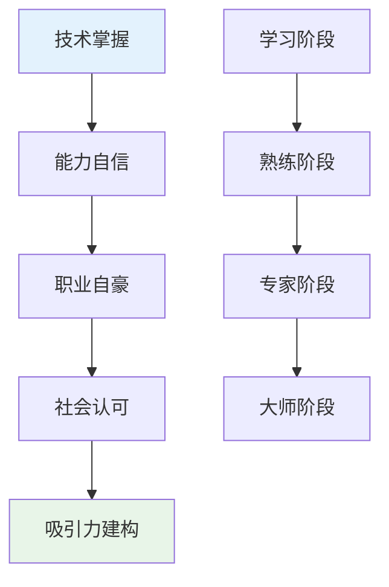
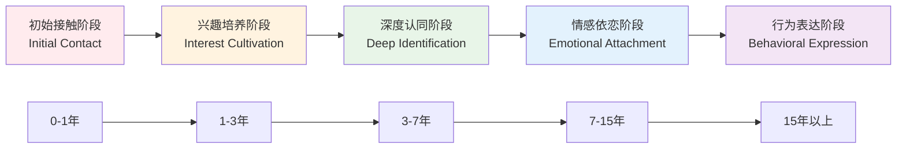
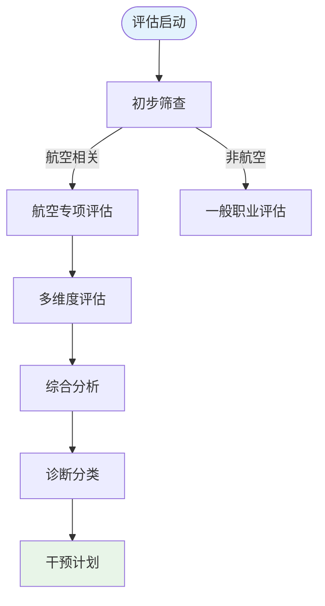

# Aviation Professional Attraction Psychology (航空职业吸引心理学)

> 📘 **文档导航**: 本专题深入探讨航空职业吸引的心理机制、发展规律和临床意义。相关文档：
> - [职业吸引概览](../Professional_Attraction_Overview.md) - 理论基础
> - [航空职业临床评估](Aviation_Attraction_Clinical_Assessment.md) - 专业评估方法
> - [职业吸引伦理法律](../Professional_Attraction_Ethics_Legal.md) - 社会文化考量
> - [职业吸引术语标准](../Professional_Attraction_Terminology_Standards.md) - 概念框架

## 航空职业吸引现象全景分析 (Aviation Professional Attraction Phenomenon Analysis)

### 核心吸引特征与心理机制

航空职业吸引(Aviation Professional Attraction)是指个体对飞行员、空乘人员等航空从业者产生的特殊心理和情感吸引，这种吸引融合了技术崇拜、权威认同、国际化向往等多重心理成分。

#### 空乘人员吸引特征矩阵

| 吸引维度 | 具体表现 | 心理机制 | 社会认知 | 发展阶段 |
| :--- | :--- | :--- | :--- | :--- |
| **形象美学** | 优雅仪态、精致妆容、标准制服 | 视觉美学理论、uniform fetishism | 服务业标杆、国际形象代表 | 初级视觉吸引 |
| **国际化特质** | 多语言能力、跨文化交流、全球视野 | 开放性人格理论、文化资本理论 | 世界公民象征、高端服务代表 | 中级认知吸引 |
| **专业技能** | 安全知识、应急处理、客户服务 | 专家权威理论、能力崇拜 | 专业素养象征、可靠安全代表 | 深度认同吸引 |
| **流动性魅力** | 全球旅行、多元体验、自由职业 | 自由向往理论、冒险精神 | 生活方式象征、梦想职业代表 | 情感依恋阶段 |

#### 飞行员吸引特征矩阵

| 吸引维度 | 具体表现 | 心理机制 | 社会认知 | 发展阶段 |
| :--- | :--- | :--- | :--- | :--- |
| **技术权威** | 复杂操控、精密计算、系统管理 | 专家权威理论、技术崇拜 | 技术精英象征、高科技代表 | 认知崇拜阶段 |
| **冷静决策** | 高压判断、危机处理、责任担当 | 领导力理论、英雄主义 | 可靠性象征、拯救者代表 | 情感依赖阶段 |
| **冒险精神** | 挑战极限、突破边界、征服天空 | 刺激寻求理论、成就动机 | 英雄主义象征、勇敢者代表 | 理想化阶段 |
| **社会地位** | 高收入、受尊重、国际化 | 社会比较理论、阶层认同 | 成功象征、精英代表 | 价值认同阶段 |

### 航空职业心理学特征深度分析

#### 空乘人员职业心理学

##### 1. 专业形象管理心理学

**形象建构机制**:
- **外在形象标准化**: 严格的仪容仪表要求形成专业认知基础
- **行为举止规范化**: 标准化服务流程塑造职业权威感
- **语言表达专业化**: 多语言能力和专业术语使用增强专家印象

**心理影响过程**:
```
外部形象要求 → 内在自我调整 → 职业身份认同 → 吸引力建构
     ↓              ↓              ↓              ↓
  行为约束      自我监控      群体归属      心理吸引
```

##### 2. 国际化工作环境心理学

**跨文化适应特征**:
- **文化敏感性**: 对不同文化的理解和包容能力
- **语言多元化**: 多语言沟通技能的掌握和运用
- **全球视野**: 国际化工作经历带来的开阔眼界

**心理发展优势**:
| 发展维度 | 具体表现 | 心理机制 | 成长价值 |
| :--- | :--- | :--- | :--- |
| **认知拓展** | 文化多样性理解 | 认知灵活性理论 | 思维模式丰富 |
| **情感觉知** | 跨文化共情能力 | 情感智力理论 | 人际敏感性提升 |
| **行为适应** | 环境应变能力 | 压力适应理论 | 心理韧性增强 |

#### 飞行员职业心理学

##### 1. 技术专精心理学

**专业能力结构**:
- **操作技能**: 飞行器操控的精细化技能体系
- **理论知识**: 航空工程、气象学等复合知识结构
- **应急能力**: 紧急情况下的快速判断和处理能力

**心理成就感来源**:


##### 2. 高压决策心理学

**决策环境特征**:
- **时间紧迫性**: 紧急情况下需要快速做出关键决策
- **后果严重性**: 决策错误可能导致重大安全事故
- **信息复杂性**: 需要同时处理多项技术和环境信息

**心理应对机制**:
| 应对策略 | 具体表现 | 心理机制 | 效果评估 |
| :--- | :--- | :--- | :--- |
| **程序化思维** | 按照标准操作程序执行 | 认知负荷理论 | 降低决策压力 |
| **团队协作** | 机组成员间有效配合 | 群体决策理论 | 提高决策质量 |
| **经验迁移** | 运用既往经验处理新情况 | 专家直觉理论 | 加快反应速度 |

### 航空职业吸引发展模型

#### 五阶段发展轨迹



#### 各阶段心理特征

| 发展阶段 | 心理特征 | 行为表现 | 影响因素 | 关键转折点 |
| :--- | :--- | :--- | :--- | :--- |
| **初始接触** | 好奇驱动、理想化倾向 | 关注航空影视、新闻报道 | 媒体影响、家庭教育 | 首次机场体验 |
| **兴趣培养** | 主动了解、技能向往 | 学习航空知识、模拟飞行 | 教育引导、个人努力 | 航空夏令营参与 |
| **深度认同** | 价值认同、身份融合 | 追求相关教育、职业准备 | 教育背景、社会支持 | 专业院校录取 |
| **情感依恋** | 情感投入、理想升华 | 持续关注、情感寄托 | 工作体验、成就获得 | 首次执飞成功 |
| **行为表达** | 实际追求、生活体现 | 职业发展、生活方式 | 个人成就、社会认可 | 职业身份确立 |

### 航空职业吸引测量评估体系

#### 专业化评估工具

##### 航空职业吸引力量表(Aviation PAS)

**量表结构**:
- **A分量表**: 空乘人员吸引维度(10题)
- **B分量表**: 飞行员吸引维度(10题)  
- **C分量表**: 技术权威吸引维度(8题)
- **D分量表**: 国际化特质吸引维度(7题)

**评分标准**:
- 5点李克特量表(1=完全不符合, 5=完全符合)
- 总分范围: 35-175分
- 临界值: ≥105分为显著吸引

##### 航空职业认同问卷(Aviation PIQ)

**测量维度**:
1. **认知认同**: 对航空职业价值和意义的认同程度
2. **情感认同**: 对航空职业的积极情感体验
3. **行为认同**: 愿意从事或支持航空职业的行为倾向
4. **社会认同**: 认为自己属于航空职业群体的程度

**信效度指标**:
- Cronbach's α = 0.92
- 验证性因子分析CFI = 0.94
- 重测信度ICC = 0.88

#### 评估实施流程



### 航空职业吸引临床意义

#### 适应性发展的积极作用

1. **职业导向功能**: 为个体提供明确的职业发展目标
2. **学习激励作用**: 激发相关知识技能的学习动机
3. **品格塑造价值**: 培养责任心、纪律性等优秀品质
4. **国际视野拓展**: 促进跨文化理解和全球意识

#### 病理性发展的风险警示

1. **现实脱离风险**: 过度理想化导致对职业现实的误判
2. **发展局限风险**: 过分专注单一职业影响全面发展
3. **社交障碍风险**: 职业幻想影响正常人际关系建立
4. **心理健康风险**: 强烈渴望无法实现时产生心理困扰

#### 干预指导原则

##### 预防性干预策略

| 干预层次 | 具体措施 | 实施主体 | 时机选择 | 预期效果 |
| :--- | :--- | :--- | :--- | :--- |
| **教育引导** | 职业教育、现实介绍 | 学校、家庭 | 发展初期 | 理性认知建立 |
| **兴趣拓展** | 多元体验、全面发展 | 教育机构 | 兴趣形成期 | 避免过度专注 |
| **价值澄清** | 意义探讨、目标设定 | 心理咨询师 | 认同深化期 | 健康价值观 |

##### 治疗性干预策略

| 干预方法 | 理论基础 | 适用情况 | 核心技术 | 预期目标 |
| :--- | :--- | :--- | :--- | :--- |
| **认知行为疗法** | 认知行为理论 | 认知偏差明显 | 认知重构、行为实验 | 纠正不合理认知 |
| **现实疗法** | 现实治疗理论 | 理想化倾向 | 现实检验、目标设定 | 增强现实感 |
| **职业咨询** | 职业发展理论 | 职业困惑 | 职业测评、规划指导 | 明确发展方向 |

### 航空职业吸引研究前沿

#### 新兴研究方向

1. **数字化影响研究**: 虚拟现实技术对航空职业认知的影响
2. **跨文化比较研究**: 不同文化背景下航空职业吸引的差异
3. **代际发展研究**: 数字原住民对航空职业的新认知模式
4. **性别平等研究**: 航空职业性别刻板印象的变化趋势

#### 实践应用前景

- **航空人才培养**: 基于吸引理论的招生和培训策略优化
- **员工心理健康**: 航空从业者的心理支持和压力管理
- **公众科普教育**: 提高社会对航空职业的正确理解
- **职业规划指导**: 为青少年提供科学的职业发展建议

---
*📚 本文档整合航空心理学、职业心理学和认知科学理论，为空乘人员和飞行员职业吸引现象提供专业的理论分析和实践指导。*