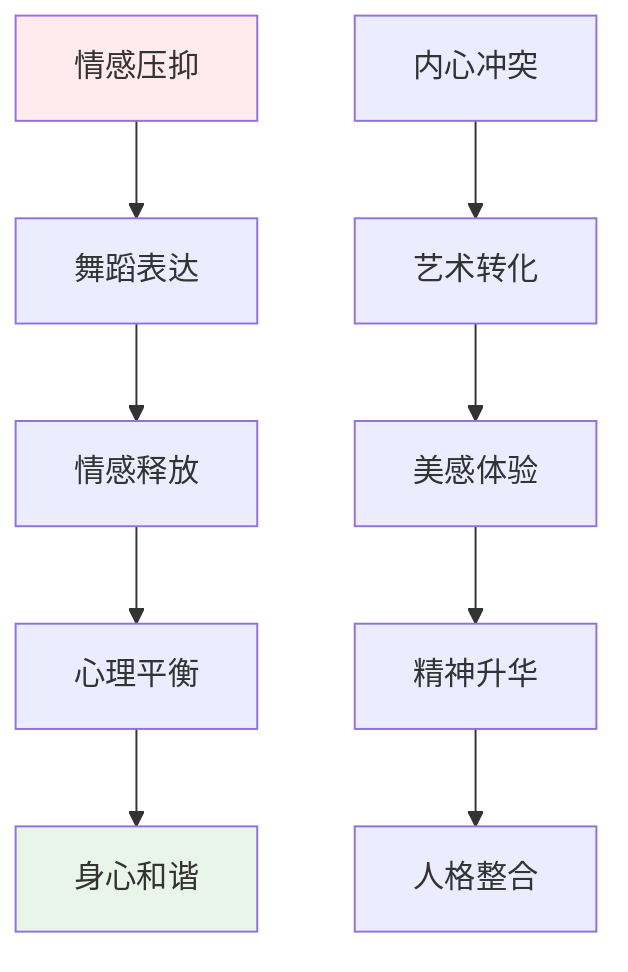
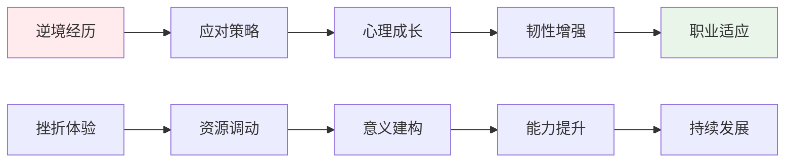
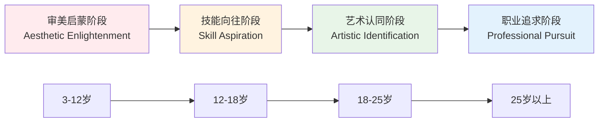

# Ballet Professional Attraction Psychology (芭蕾舞职业吸引心理学)

> 📘 **文档导航**: 本专题深入探讨芭蕾舞职业吸引的心理机制、艺术特质和临床意义。相关文档：
> - [职业吸引概览](../Professional_Attraction_Overview.md) - 理论基础
> - [芭蕾舞职业临床评估](Ballet_Attraction_Clinical_Assessment.md) - 专业评估方法
> - [职业吸引伦理法律](../Professional_Attraction_Ethics_Legal.md) - 社会文化考量
> - [职业吸引术语标准](../Professional_Attraction_Terminology_Standards.md) - 概念框架

## 芭蕾舞职业吸引现象深度解析 (Ballet Professional Attraction Phenomenon Deep Analysis)

### 核心吸引特征与艺术心理学机制

芭蕾舞职业吸引(Ballet Professional Attraction)是个体对芭蕾舞演员、舞蹈艺术家产生的综合性心理吸引，这种吸引融合了身体美学崇拜、艺术表达向往、青春永恒追求等独特心理成分。

#### 芭蕾舞者吸引特征多维度分析

| 吸引维度 | 具体表现 | 心理机制 | 艺术价值 | 发展层次 |
| :--- | :--- | :--- | :--- | :--- |
| **身体美学** | 优美线条、协调比例、优雅姿态 | 身体意象理论、美学心理学 | 视觉艺术价值 | 感官吸引层 |
| **技艺精湛** | 技术难度、动作精准、表现力强 | 专业技能崇拜、专家权威 | 技艺艺术价值 | 认知吸引层 |
| **艺术表达** | 情感传递、故事叙述、意境创造 | 表达性艺术治疗、美学体验 | 精神艺术价值 | 情感吸引层 |
| **青春特质** | 年龄敏感性、巅峰期短暂、永恒之美 | 青春崇拜理论、时间美学 | 生命艺术价值 | 理想化层 |

### 芭蕾舞职业心理学特征深度剖析

#### 舞蹈艺术家职业心理学

##### 1. 身体美学心理学

**身体意象建构机制**:
- **技术塑造**: 长期专业训练形成的理想身体形态
- **审美标准**: 芭蕾艺术特有的美学评判体系
- **社会期待**: 观众和社会对舞者身体的理想化要求

**心理发展过程**:
```
身体训练 → 形态改变 → 审美内化 → 身份认同 → 吸引力建构
    ↓         ↓          ↓          ↓          ↓
 技能获得   外在变化   价值接受   群体归属   心理吸引
```

**身体美学的心理效应**:
| 效应类型 | 具体表现 | 心理机制 | 社会影响 |
| :--- | :--- | :--- | :--- |
| **视觉震撼** | 优美线条、流畅动作 | 格式塔美学理论 | 第一印象形成 |
| **技艺惊叹** | 高难度技巧、精准控制 | 专业崇拜理论 | 能力认同建立 |
| **情感共鸣** | 艺术表达、情感传递 | 共情理论 | 深层心理连接 |

##### 2. 艺术表达心理学

**创造性表达特征**:
- **情感载体**: 通过身体语言传达复杂情感体验
- **叙事功能**: 用舞蹈动作讲述故事情节
- **象征意义**: 肢体动作承载深层文化内涵

**心理治愈价值**:


##### 3. 青春永恒心理学

**年龄敏感性特征**:
- **职业寿命**: 芭蕾舞者职业生涯相对短暂
- **巅峰时期**: 技术和艺术表现的最佳年龄段
- **转型挑战**: 退役后的职业和身份转换

**青春崇拜心理机制**:
| 崇拜维度 | 心理基础 | 表现形式 | 文化意义 |
| :--- | :--- | :--- | :--- |
| **生理青春** | 生物学年轻优势 | 身体机能巅峰 | 生命力象征 |
| **心理青春** | 热情活力状态 | 创造力旺盛 | 活力源泉 |
| **艺术青春** | 技艺精进时期 | 表现力最强 | 艺术价值最高 |

#### 芭蕾舞职业压力与韧性心理学

##### 1. 职业压力源分析

**身体压力**:
- **训练强度**: 高强度、长时间的专业训练要求
- **伤病风险**: 反复性劳损和急性损伤威胁
- **体型控制**: 严格的体重和身材管理压力

**心理压力**:
- **完美主义**: 对技术精度和艺术表现的极致追求
- **竞争激烈**: 有限的舞台机会和激烈的行业竞争
- **年龄焦虑**: 职业生涯的时效性带来的紧迫感

##### 2. 心理韧性发展机制

**韧性构建要素**:


**韧性发展策略**:
| 策略类型 | 具体方法 | 心理机制 | 实施效果 |
| :--- | :--- | :--- | :--- |
| **认知重构** | 积极意义寻找、成长思维培养 | 认知弹性理论 | 压力转化动力 |
| **社会支持** | 同伴互助、导师指导、家庭支持 | 社会支持理论 | 情感缓冲作用 |
| **技能提升** | 技术精进、表演经验积累 | 能力增强理论 | 自信基础建立 |

### 芭蕾舞职业吸引发展模型

#### 四阶段发展轨迹



#### 各阶段心理发展特征

| 发展阶段 | 心理特征 | 行为表现 | 影响因素 | 关键转折点 |
| :--- | :--- | :--- | :--- | :--- |
| **审美启蒙** | 美的感受、好奇驱动 | 观看芭蕾演出、学习基础动作 | 家庭熏陶、媒体影响 | 首次观看芭蕾 |
| **技能向往** | 技能崇拜、成就动机 | 专业训练、技能提升 | 教师引导、同伴影响 | 首次舞台表演 |
| **艺术认同** | 价值认同、身份融合 | 艺术追求、个性表达 | 教育深化、自我探索 | 专业院校录取 |
| **职业追求** | 职业规划、生涯发展 | 职业准备、持续精进 | 社会支持、个人努力 | 职业身份确立 |

### 芭蕾舞职业吸引测量评估体系

#### 专业化评估工具

##### 芭蕾舞职业吸引力量表(Ballet PAS)

**量表维度结构**:
- **A分量表**: 身体美学吸引维度(9题)
- **B分量表**: 技艺崇拜吸引维度(8题)
- **C分量表**: 艺术表达吸引维度(7题)
- **D分量表**: 青春特质吸引维度(6题)

**评分体系**:
- 5点李克特量表(1=完全不符合, 5=完全符合)
- 总分范围: 30-150分
- 临床临界值: ≥90分为显著吸引

##### 芭蕾舞职业认同问卷(Ballet PIQ)

**核心测量维度**:
1. **艺术认同**: 对芭蕾艺术价值和意义的深度认同
2. **身份认同**: 将自己视为芭蕾艺术传承者的身份认知
3. **行为认同**: 愿意投身芭蕾事业的行为倾向
4. **情感认同**: 对芭蕾艺术的深厚情感连接

**心理测量指标**:
- 内部一致性系数α = 0.89
- 验证性因子分析CFI = 0.91
- 重测信度ICC = 0.85

#### 艺术心理评估特色

##### 身体意象评估

**评估内容**:
- 身体满意度
- 舞蹈身体概念
- 身体与艺术的关系认知
- 体型焦虑水平

**评估工具**:
- 舞蹈身体意象量表(DBIS)
- 身体关注问卷(BSQ)
- 艺术表达自我概念量表(AESC)

##### 创造性人格评估

**评估维度**:
- 创造性思维灵活性
- 艺术敏感性
- 情感表达能力
- 审美判断力

**专业工具**:
- 托兰斯创造性思维测验
- 艺术人格问卷(APQ)
- 舞蹈创造力评估量表(DCA)

### 芭蕾舞职业吸引临床意义

#### 积极发展价值

1. **艺术修养提升**: 培养审美能力和艺术鉴赏力
2. **身心协调发展**: 促进身体素质和心理素质同步发展
3. **情感表达能力**: 提高情绪管理和表达性沟通技能
4. **文化传承意识**: 增强对传统文化艺术的理解和传承责任感

#### 潜在风险警示

1. **身体形象困扰**: 过分关注体型可能引发饮食障碍风险
2. **完美主义倾向**: 极致追求可能导致心理压力过大
3. **职业发展局限**: 过度专注可能影响其他能力发展
4. **现实期望落差**: 理想化认知与职业现实的差距

#### 专业干预策略

##### 预防性心理支持

| 支持层次 | 具体措施 | 实施时机 | 目标群体 | 预期效果 |
| :--- | :--- | :--- | :--- | :--- |
| **教育引导** | 艺术教育、现实介绍 | 兴趣萌芽期 | 青少年群体 | 理性认知建立 |
| **心理培育** | 自信心建设、抗压训练 | 技能提升期 | 学员群体 | 健康心理发展 |
| **价值澄清** | 艺术价值探讨、生涯规划 | 职业选择期 | 准从业者 | 明确发展方向 |

##### 治疗性心理干预

| 干预方法 | 理论基础 | 适用症状 | 核心技术 | 治疗目标 |
| :--- | :--- | :--- | :--- | :--- |
| **表达性艺术治疗** | 艺术治疗理论 | 情绪困扰、表达障碍 | 舞蹈治疗、创意表达 | 情感疏导释放 |
| **认知行为干预** | 认知行为理论 | 完美主义、体型焦虑 | 认知重构、行为实验 | 纠正不合理认知 |
| **正念减压疗法** | 正念理论 | 压力管理、焦虑缓解 | 正念练习、身体扫描 | 提高心理韧性 |

### 芭蕾舞职业吸引研究前沿

#### 新兴研究领域

1. **神经美学研究**: 芭蕾艺术欣赏的神经机制和脑区激活模式
2. **跨文化比较**: 不同文化背景下芭蕾职业吸引的差异性研究
3. **数字化影响**: 虚拟现实技术对芭蕾艺术体验和吸引力建构的影响
4. **代际发展**: 数字时代青少年对传统芭蕾艺术的新认知模式

#### 实践应用前景

- **艺术教育优化**: 基于心理学原理的芭蕾教学方法改进
- **心理健康促进**: 舞蹈艺术在心理治疗和康复中的应用拓展
- **文化传播创新**: 现代科技手段在芭蕾艺术普及中的运用
- **职业发展支持**: 为芭蕾从业者提供专业的心理支持和服务

---
*📚 本文档整合舞蹈心理学、艺术治疗学和积极心理学理论，为芭蕾舞职业吸引现象提供专业的理论分析和实践指导。*