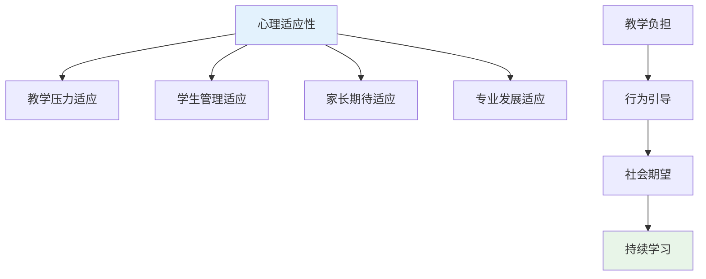
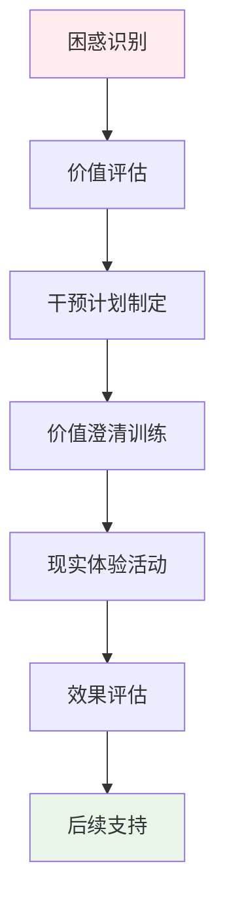
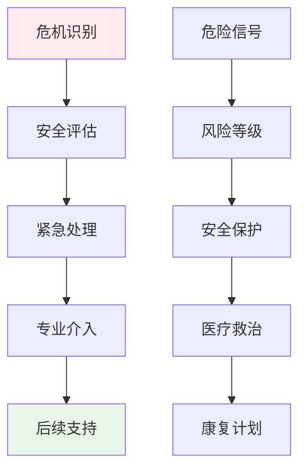
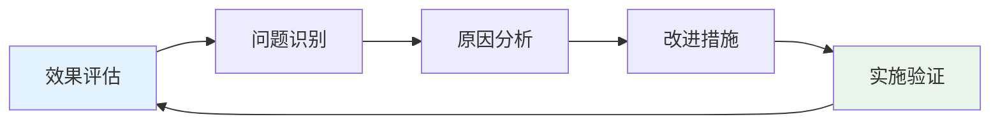

# Education Professional Attraction Clinical Assessment (教育职业吸引临床评估)

> 📘 **文档导航**: 本指南提供教育职业吸引现象的专业临床评估方法和实践指导。相关文档：
> - [教育职业吸引心理学](Education_Professional_Attraction.md) - 理论基础和职业特征
> - [职业吸引临床评估](../Professional_Attraction_Clinical_Assessment.md) - 通用评估框架
> - [职业吸引伦理法律](../Professional_Attraction_Ethics_Legal.md) - 专业伦理规范

## 教育职业吸引评估专项框架

### 教育领域特殊评估考虑

#### 1. 教育特征适应性评估

**教育职业独特性分析**:
- **知识权威特质**: 渊博的学科知识、智慧的传承者、学习的引导者
- **育人能力要求**: 启发思考能力、人格塑造技巧、因材施教智慧
- **耐心品质需求**: 循循善诱的耐性、包容理解的胸怀、持续陪伴的毅力
- **社会贡献价值**: 人才培养使命、文明传承责任、启迪民智意义

**评估重点调整**:
| 评估维度 | 通用标准 | 教育专项调整 | 调整理由 |
| :--- | :--- | :--- | :--- |
| **知识结构** | 一般知识储备 | 学科专业知识、教育理论素养 | 教师专业要求 |
| **沟通能力** | 一般人际交往 | 教学沟通技巧、师生互动能力 | 教育工作核心 |
| **耐心品质** | 一般忍耐能力 | 教育耐心、等待艺术 | 教书育人特质 |
| **价值认同** | 一般价值观念 | 教育价值认知、育人使命感 | 职业精神核心 |

#### 2. 教育职业吸引特有量表

##### 教育职业吸引专项量表(Education Specific PAS)

**量表结构**:
- **A分量表**: 知识权威吸引维度(8题)
- **B分量表**: 育人能力吸引维度(8题)
- **C分量表**: 耐心品质吸引维度(7题)
- **D分量表**: 社会贡献吸引维度(6题)
- **E分量表**: 师者风范吸引维度(6题)

**题目示例**:
1. "当我看到教师在讲台上侃侃而谈时，会产生深深的敬佩之情"
2. "我对能够启发学生思维、塑造人格的教育能力特别向往"
3. "我希望能像优秀的教师一样，用耐心和智慧陪伴学生成长"
4. "我愿意通过教育工作为社会培养有用的人才"
5. "我梦想着能够成为学生们心目中的良师益友"

**评分标准**:
- 5点李克特量表(1=完全不符合, 5=完全符合)
- 总分范围: 35-175分
- 临床临界值: ≥105分为显著教育职业吸引

#### 3. 教育职业技能匹配评估

##### 专业能力评估维度

**教学核心技能**:
| 技能类型 | 评估内容 | 评估方法 | 教育意义 |
| :--- | :--- | :--- | :--- |
| **学科知识** | 专业知识深度、知识更新能力 | 学科测试、教学演示 | 教学基础保障 |
| **教学方法** | 教学设计能力、课堂组织技巧 | 教案分析、课堂观察 | 教学效果核心 |
| **学生理解** | 学生心理把握、个体差异认知 | 学生访谈、案例分析 | 因材施教关键 |
| **评价反馈** | 学习评估能力、反馈指导技巧 | 评价方案、反馈记录 | 教学改进依据 |

**教育智慧评估**:
| 智慧维度 | 评估指标 | 评估工具 | 培养价值 |
| :--- | :--- | :--- | :--- |
| **启发智慧** | 引导思考、激发兴趣的能力 | 启发式教学观察 | 创新思维培养 |
| **包容智慧** | 理解差异、接纳不同的胸怀 | 多元化教学评估 | 和谐关系建设 |
| **成长智慧** | 促进发展、陪伴成长的艺术 | 长期发展跟踪 | 人格完善促进 |
| **反思智慧** | 自我审视、持续改进的意识 | 教学反思记录 | 专业发展动力 |

### 教育职业吸引发展评估

#### 发展阶段专项评估

##### 青少年期教育兴趣评估

**评估重点**:
- 教育兴趣的萌芽和发展过程
- 家庭教育环境对兴趣的影响
- 优秀教师榜样作用体验
- 学习经历中的师生互动感受

**评估工具**:
- 教育兴趣发展史访谈
- 家庭教育环境评估问卷
- 教师榜样影响量表
- 师生关系体验记录

##### 专业准备期评估

**评估内容**:
- 教育专业学习动机和投入程度
- 教学理论知识掌握水平
- 教学实践技能发展情况
- 教育理念和价值观念形成

**专项评估**:
- 专业课程成绩分析
- 教学技能考核结果
- 实习教学表现评估
- 教育哲学信念量表

#### 教育职业适应性评估

##### 心理适应性评估

**适应性维度**:

**评估指标**:
| 适应维度 | 具体指标 | 评估方法 | 判定标准 |
| :--- | :--- | :--- | :--- |
| **教学压力** | 面对教学任务和考核的压力适应 | 压力适应量表、教学日记分析 | 良好适应水平 |
| **学生管理** | 处理学生问题和行为引导的能力 | 班级管理情景测试、案例分析 | 有效管理能力 |
| **家长期待** | 应对家长和社会期望的心理承受力 | 期望管理量表、沟通技能评估 | 健康应对态度 |
| **专业发展** | 持续学习和专业成长的适应性 | 专业发展意愿量表、学习行为观察 | 积极发展态度 |

##### 职业认同评估

**认同发展维度**:
| 认同层面 | 具体内容 | 评估工具 | 发展意义 |
| :--- | :--- | :--- | :--- |
| **角色认同** | 教师身份的认知和接受程度 | 教师角色认同量表 | 职业稳定性基础 |
| **价值认同** | 教育工作价值和意义的认同 | 教育价值认同量表 | 工作动力源泉 |
| **能力认同** | 教学能力和专业水平的自信 | 教师效能感量表 | 教学质量保障 |
| **群体认同** | 对教师职业群体的归属感 | 职业群体认同量表 | 专业发展支持 |

### 教育职业吸引干预策略

#### 预防性干预措施

##### 教育引导策略

**分级教育模式**:
| 教育阶段 | 目标群体 | 教育内容 | 实施方式 | 预期效果 |
| :--- | :--- | :--- | :--- | :--- |
| **启蒙阶段** | 中小学阶段 | 教师职业认知、教育价值 | 职业体验、榜样学习 | 兴趣启蒙 |
| **了解阶段** | 高中阶段 | 专业介绍、能力要求 | 专业讲座、校园参观 | 理性认知 |
| **准备阶段** | 大学预科 | 专业选择指导、备考建议 | 升学指导、技能培养 | 科学规划 |
| **专业阶段** | 师范院校 | 专业深化、实践训练 | 教学实习、职业规划 | 能力提升 |

##### 专业素养培养

**核心素养发展**:
- 教育理论素养提升
- 教学实践能力培养
- 学生心理理解深化
- 教育技术创新应用

**品格品质塑造**:
- 耐心品质的系统培养
- 责任意识的持续强化
- 人文关怀的深度发展
- 终身学习理念的确立

#### 治疗性干预方法

##### 职业困惑干预

**核心干预技术**:
1. **价值澄清**: 帮助明确教育工作的真正价值和意义
2. **现实检验**: 通过实地体验了解教师工作的真实面貌
3. **期望管理**: 调整对教育工作的过高或不当期望
4. **优势发现**: 识别和发挥个人在教育领域的独特优势

**干预流程**:

##### 完美主义矫正

**治疗方法**:
- 认知行为疗法应用
- 接纳与承诺疗法技术
- 正念减压训练方法
- 积极心理学干预策略

**矫正目标**:
- 建立合理的教育期望
- 接纳教学中的不完美
- 发展成长型思维模式
- 培养自我宽恕能力

### 教育职业吸引风险管理

#### 风险识别与评估

##### 潜在风险类型

**职业发展风险**:
| 风险类型 | 表现特征 | 识别指标 | 干预要点 |
| :--- | :--- | :--- | :--- |
| **完美主义** | 过度追求教学完美、害怕犯错 | MPS量表高分、焦虑水平升高 | 认知行为治疗 |
| **职业倦怠** | 情感耗竭、去人格化、成就感降低 | MBI量表异常 | 压力管理训练 |
| **价值冲突** | 理想与现实的矛盾、意义感缺失 | 职业满意度低、离职倾向 | 意义治疗介入 |
| **发展瓶颈** | 专业成长停滞、晋升困难 | 职业发展评估落后 | 能力提升计划 |

**心理健康风险**:
| 风险类型 | 表现特征 | 识别指标 | 干预要点 |
| :--- | :--- | :--- | :--- |
| **焦虑抑郁** | 情绪低落、过度担心教学效果 | PHQ-9、GAD-7量表异常 | 心理治疗支持 |
| **人际关系困扰** | 师生关系、同事关系处理困难 | 人际关系量表异常 | 社交技能训练 |
| **自我效能感低** | 对教学能力缺乏信心、怀疑自己 | 教师效能感量表低分 | 自信建设训练 |

#### 危机干预体系

##### 紧急干预程序

**危机识别信号**:
- 明显的职业倦怠症状加重
- 严重的焦虑抑郁情绪表现
- 自伤或自杀倾向的表达
- 重大的职业挫折或生活变故

**应急处理流程**:

**资源配置**:
- 学校心理健康服务中心
- 专业心理咨询和治疗资源
- 同事和家人支持网络
- 教育部门专业支持体系

### 教育职业吸引跟踪随访

#### 长期跟踪机制

##### 随访时间安排

**阶段性随访计划**:
| 随访阶段 | 时间节点 | 随访重点 | 评估工具 | 频率要求 |
| :--- | :--- | :--- | :--- | :--- |
| **初期跟踪** | 干预后1-3个月 | 症状改善情况 | 症状自评量表 | 每月一次 |
| **中期评估** | 干预后6个月 | 功能恢复程度 | 功能评估量表 | 每季度一次 |
| **长期随访** | 干预后1-2年 | 发展适应情况 | 综合发展评估 | 每半年一次 |
| **远期追踪** | 干预后3-5年 | 长远发展效果 | 长期追踪调查 | 每年一次 |

##### 随访内容体系

**多维度跟踪评估**:
- 心理健康状况监测
- 教学能力发展水平
- 职业适应和发展情况
- 工作满意度和生活质量
- 专业成长和价值实现

**数据收集方法**:
- 定期心理健康评估
- 教学效果和学生反馈
- 同行评价和专业发展记录
- 深度访谈和问卷调查

#### 效果评估与持续改进

##### 干预效果评估

**评估指标体系**:
| 评估维度 | 具体指标 | 评估方法 | 判定标准 |
| :--- | :--- | :--- | :--- |
| **症状改善** | 吸引强度降低程度 | 量表前后对比 | 降低≥30%为有效 |
| **功能恢复** | 教学功能改善水平 | 教学能力评估 | 恢复至正常水平 |
| **职业发展** | 专业能力和工作适应 | 职业发展评估 | 良好发展态势 |
| **生活质量** | 整体生活满意度 | 生活质量问卷 | 显著提升 |

##### 持续改进机制

**质量改进循环**:

**改进重点领域**:
- 评估工具的教育专业适配
- 干预方法的学校环境整合
- 服务流程的教育系统对接
- 专业团队的教育协同合作

---
*📚 本文档为教育职业吸引现象提供专业的临床评估体系和干预指导，特别关注教师专业发展和教育环境下的心理健康维护。*