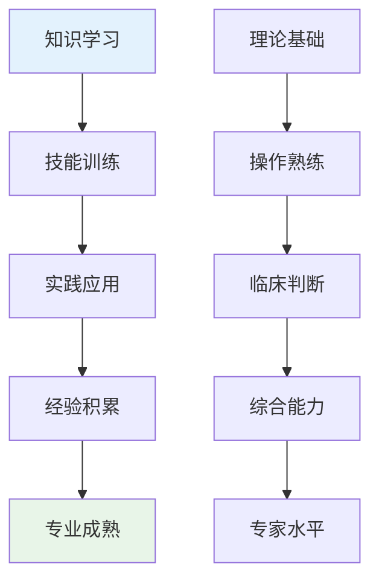
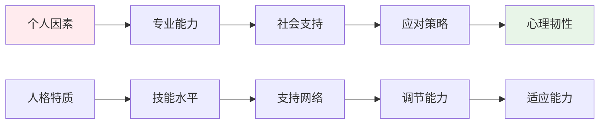
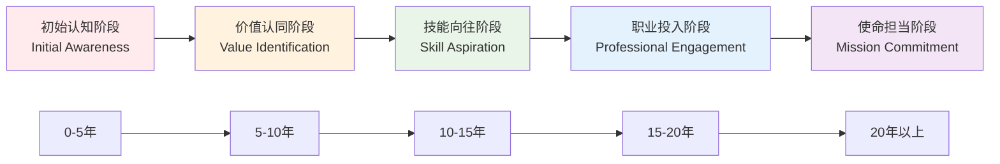

# Nursing Professional Attraction Psychology (护理职业吸引心理学)

> 📘 **文档导航**: 本专题深入探讨护理职业吸引的心理机制、人文关怀特质和临床意义。相关文档：
> - [职业吸引概览](../Professional_Attraction_Overview.md) - 理论基础
> - [护理职业临床评估](Nursing_Attraction_Clinical_Assessment.md) - 专业评估方法
> - [职业吸引伦理法律](../Professional_Attraction_Ethics_Legal.md) - 社会文化考量
> - [职业吸引术语标准](../Professional_Attraction_Terminology_Standards.md) - 概念框架

## 护理职业吸引现象全面解析 (Nursing Professional Attraction Phenomenon Comprehensive Analysis)

### 核心吸引特征与人文心理学机制

护理职业吸引(Nursing Professional Attraction)是指个体对护士、医护工作者产生的特殊心理和情感吸引，这种吸引融合了关怀温暖、专业技能、奉献精神、稳定性保障等多重人文心理成分。

#### 护理人员吸引特征多维度矩阵

| 吸引维度 | 具体表现 | 心理机制 | 社会认知 | 发展层次 |
| :--- | :--- | :--- | :--- | :--- |
| **关怀特质** | 温暖态度、细致照顾、情感支持 | 关怀伦理学、共情理论 | 天使化身、生命守护者 | 情感吸引层 |
| **专业技能** | 医疗知识、急救能力、护理技术 | 专家权威理论、能力崇拜 | 专业素养象征、可靠保障 | 认知吸引层 |
| **奉献精神** | 无私付出、救死扶伤、职业使命感 | 利他主义理论、价值观认同 | 圣洁象征、人道主义代表 | 价值吸引层 |
| **稳定性特质** | 工作规律、社会需求、职业保障 | 安全需求理论、稳定偏好 | 可靠性象征、安全感来源 | 实用吸引层 |

### 护理职业心理学特征深度剖析

#### 医护工作者职业心理学

##### 1. 关怀心理学机制

**关怀能力构成**:
- **情感关怀**: 对患者情感需求的敏感识别和温暖回应
- **技术关怀**: 通过专业技能提供有效的医疗护理服务
- **人文关怀**: 尊重患者尊严、文化和精神需求的整体关怀

**心理发展过程**:
```
共情能力 → 关怀动机 → 护理行为 → 职业满足 → 吸引力建构
    ↓         ↓          ↓          ↓          ↓
 情感理解   助人意愿   专业实践   成就体验   心理吸引
```

**关怀心理学效应**:
| 效应类型 | 具体表现 | 心理机制 | 社会影响 |
| :--- | :--- | :--- | :--- |
| **情感温暖** | 细致入微的照顾态度 | 依恋理论、温暖需求 | 安全感建立 |
| **专业信赖** | 精湛的护理技术 | 专家权威理论 | 信任感形成 |
| **精神慰藉** | 心理支持和陪伴 | 存在主义心理学 | 心灵治愈体验 |

##### 2. 专业技能心理学

**护理专业能力结构**:
- **基础护理技能**: 日常护理操作的技术熟练度
- **专科护理知识**: 特定疾病护理的专业知识储备
- **应急处理能力**: 紧急情况下的快速反应和处置能力
- **沟通协调技能**: 与患者、家属、医疗团队的有效沟通

**技能发展心理机制**:


##### 3. 奉献精神心理学

**职业价值观体系**:
- **人道主义理念**: 以救助生命、减轻痛苦为核心价值
- **责任使命感**: 对患者生命健康承担神圣职责
- **职业道德操守**: 遵循护理伦理规范和职业准则
- **持续学习精神**: 不断更新知识技能的专业追求

**奉献心理动力源**:
| 动力类型 | 心理基础 | 表现形式 | 社会价值 |
| :--- | :--- | :--- | :--- |
| **内在动机** | 自我实现需求、价值认同 | 主动学习、精益求精 | 个人成长价值 |
| **外在激励** | 社会认可、职业荣誉 | 专业发展、地位提升 | 社会贡献价值 |
| **道德驱动** | 职业伦理、人文关怀 | 无私奉献、患者至上 | 精神品格价值 |

#### 护理职业压力与韧性心理学

##### 1. 职业压力源分析

**工作环境压力**:
- **高强度工作**: 长时间、高负荷的护理工作要求
- **生死场景**: 频繁面对疾病、死亡等沉重现实
- **人际关系复杂**: 与患者、家属、同事的多重关系处理

**情感负担压力**:
- **共情疲劳**: 长期情感投入导致的心理疲惫
- **道德困扰**: 医疗决策中的伦理两难困境
- **创伤暴露**: 接触患者痛苦经历产生的二次创伤

##### 2. 心理韧性发展机制

**韧性保护因子**:


**韧性培养策略**:
| 策略类别 | 具体方法 | 心理机制 | 实施效果 |
| :--- | :--- | :--- | :--- |
| **认知重构** | 积极意义寻找、成长思维 | 认知弹性理论 | 压力转化动力 |
| **情感调节** | 正念练习、情绪管理训练 | 情绪调节理论 | 心理平衡维持 |
| **社会支持** | 同事互助、专业督导、家庭支持 | 社会支持理论 | 情感缓冲作用 |

### 护理职业吸引发展模型

#### 五阶段发展轨迹



#### 各阶段心理发展特征

| 发展阶段 | 心理特征 | 行为表现 | 影响因素 | 关键转折点 |
| :--- | :--- | :--- | :--- | :--- |
| **初始认知** | 职业印象形成、好奇驱动 | 关注护理工作、了解职业特点 | 家庭影响、媒体报道 | 首次医院实习 |
| **价值认同** | 人文价值认同、使命感萌芽 | 志愿服务、专业学习投入 | 教育引导、榜样影响 | 专业课程学习 |
| **技能向往** | 专业技能崇拜、能力追求 | 技能训练、证书考取 | 教师指导、同伴竞争 | 首次独立值班 |
| **职业投入** | 职业身份融合、情感投入 | 全身心投入、持续学习 | 工作体验、成就获得 | 专科护士认证 |
| **使命担当** | 职业使命感强化、价值实现 | 传承带教、专业发展 | 经验积累、社会认可 | 专家护士地位 |

### 护理职业吸引测量评估体系

#### 专业化评估工具

##### 护理职业吸引力量表(Nursing PAS)

**量表维度结构**:
- **A分量表**: 关怀特质吸引维度(10题)
- **B分量表**: 专业技能吸引维度(9题)
- **C分量表**: 奉献精神吸引维度(8题)
- **D分量表**: 稳定性特质吸引维度(7题)

**评分标准体系**:
- 5点李克特量表(1=完全不符合, 5=完全符合)
- 总分范围: 34-170分
- 临床临界值: ≥102分为显著吸引

##### 护理职业认同问卷(Nursing PIQ)

**核心测量维度**:
1. **人文认同**: 对护理人文关怀价值的深度认同
2. **专业认同**: 对护理专业技能和知识体系的认同
3. **价值认同**: 对护理职业社会价值和个人意义的认同
4. **行为认同**: 愿意投身护理事业的行为倾向

**心理测量指标**:
- 内部一致性系数α = 0.91
- 验证性因子分析CFI = 0.93
- 重测信度ICC = 0.87

#### 专业心理评估特色

##### 共情能力评估

**评估内容维度**:
- 认知共情: 理解他人情感状态的能力
- 情感共情: 感受他人情感体验的能力
- 共情关怀: 基于共情的助人行为倾向

**专业评估工具**:
- 杰弗逊共情量表(Healthcare版本)
- 护理共情问卷(NEP)
- 共情疲劳量表(CFS)

##### 职业倦怠评估

**评估维度**:
- 情感耗竭: 工作中的情感资源枯竭感
- 去人格化: 对工作对象的冷漠疏离态度
- 个人成就感: 工作效能感和成就感水平

**标准化工具**:
- 马斯拉奇职业倦怠量表(MBI-HSS)
- 护士职业倦怠问卷(NBI)
- 工作满意度量表(JSS)

### 护理职业吸引临床意义

#### 积极发展价值

1. **人文素养提升**: 培养关爱他人、服务社会的高尚品格
2. **专业技能发展**: 促进医疗护理知识和技能的系统掌握
3. **社会责任意识**: 增强对公共健康事业的责任感和使命感
4. **情感智慧发展**: 提高人际沟通和情感管理能力

#### 潜在风险警示

1. **情感负担过重**: 长期情感投入可能导致心理疲惫
2. **职业倦怠风险**: 高强度工作环境下的身心耗竭风险
3. **完美主义倾向**: 对护理质量的极致追求可能带来压力
4. **边界模糊风险**: 过度投入可能影响工作生活平衡

#### 专业干预策略

##### 预防性心理支持

| 支持层次 | 具体措施 | 实施时机 | 目标群体 | 预期效果 |
| :--- | :--- | :--- | :--- | :--- |
| **教育培训** | 人文教育、现实介绍 | 入学前教育 | 准护理学生 | 理性认知建立 |
| **心理培育** | 压力管理、情感调节训练 | 学习期间 | 在校学生 | 健康心理发展 |
| **职业指导** | 生涯规划、价值澄清 | 职业选择期 | 准从业者 | 明确发展方向 |

##### 治疗性心理干预

| 干预方法 | 理论基础 | 适用症状 | 核心技术 | 治疗目标 |
| :--- | :--- | :--- | :--- | :--- |
| **关怀聚焦疗法** | 关怀心理学、人本主义 | 情感耗竭、价值困惑 | 关怀体验、意义重构 | 重建职业意义 |
| **认知行为干预** | 认知行为理论 | 完美主义、焦虑抑郁 | 认知重构、行为激活 | 纠正不合理认知 |
| **正念减压疗法** | 正念理论 | 压力管理、倦怠预防 | 正念练习、身体扫描 | 提高心理韧性 |

### 护理职业吸引研究前沿

#### 新兴研究领域

1. **数字健康影响**: 人工智能和远程医疗对护理职业认知的影响
2. **跨文化护理**: 全球化背景下护理职业吸引的文化差异研究
3. **男性护理发展**: 男护士职业吸引的特殊心理机制研究
4. **老年护理新兴**: 老年护理专业吸引力的影响因素分析

#### 实践应用前景

- **护理教育优化**: 基于心理学原理的护理人才培养模式创新
- **心理健康促进**: 为护理人员提供系统的心理支持和减压服务
- **人才队伍建设**: 通过职业吸引力研究优化护理人力资源配置
- **社会认知提升**: 改善社会对护理职业的理解和尊重

---
*📚 本文档整合护理心理学、健康心理学和积极心理学理论，为护理职业吸引现象提供专业的理论分析和实践指导。*